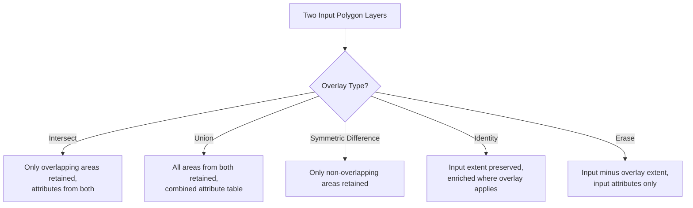

## Buffer, Clip, and Overlay Operations

### Overview

Buffer, clip, and overlay are the three foundational vector geoprocessing operations that underlie the majority of applied spatial analysis workflows — proximity analysis, site suitability modeling, environmental impact assessment, and land-use planning. Each operates on the geometric relationships between features (distance, containment, intersection) rather than on attribute values alone, and each is implemented consistently across virtually every GIS platform (QGIS, ArcGIS, PostGIS, GDAL/OGR) because they derive from a shared foundation in computational geometry rather than any vendor-specific algorithm.

### Buffer Operations

A buffer creates a polygon representing all locations within a specified distance of an input feature (point, line, or polygon). Geometrically, it is the Minkowski sum of the input geometry with a disc of the specified radius, though GIS practitioners rarely need to reason about it at that level of abstraction — the practical mental model is simply "draw a zone of a given distance around this feature."

#### Buffer Parameters and Variants

**Key Points**

- **Distance**: fixed (a single value for all features) or variable (driven by an attribute field, e.g., buffering pipelines by their diameter-derived safety distance).
- **Dissolve option**: overlapping buffers from multiple input features can be dissolved into a single merged polygon (common when the analytical question is "what area is within X meters of *any* feature" rather than per-feature zones).
- **Buffer side (for lines)**: full (both sides), left-only, or right-only — relevant for directional features like one-way traffic corridors or riverbanks with different regulatory setbacks per side.
- **End cap style (for lines)**: round, flat, or square — affects the geometry at line endpoints, generally inconsequential for area calculations at typical buffer distances but visually apparent at large distances or short line segments.
- **Multiple ring buffers**: generating several concentric buffer distances at once (e.g., 100m, 500m, 1000m impact zones) for tiered proximity analysis.

```python
# PyQGIS example: buffering a layer with a fixed distance and dissolving overlaps
from qgis import processing

result = processing.run("native:buffer", {
    'INPUT': input_layer,
    'DISTANCE': 500,
    'SEGMENTS': 8,          # controls curve smoothness (higher = smoother, larger output)
    'END_CAP_STYLE': 0,     # 0 = round
    'JOIN_STYLE': 0,        # 0 = round
    'DISSOLVE': True,
    'OUTPUT': 'memory:'
})
```

```sql
-- PostGIS equivalent, buffering points by an attribute-driven distance
SELECT id,
       ST_Buffer(geom, safety_radius_m) AS buffer_geom
FROM pipeline_points;

-- Buffer with explicit quarter-segment count controlling circle approximation smoothness
SELECT id, ST_Buffer(geom, 500, 'quad_segs=8') AS buffer_geom
FROM facilities;
```

**[Behavior may vary]** The `SEGMENTS`/`quad_segs` parameter controls how many line segments approximate the curved buffer boundary; lower values produce visibly polygonal (faceted) buffer edges and smaller output file sizes, while higher values produce smoother curves at the cost of larger vertex counts — the appropriate tradeoff depends on the map scale and downstream use of the output.

#### Geodesic vs. Planar Buffering

A frequently overlooked distinction: buffering in a projected (planar) coordinate system computes distance using simple Euclidean geometry in that projection's units, while **geodesic buffering** accounts for the curvature of the Earth's surface, computing true distance along the ellipsoid. For small buffer distances relative to the size of the area of interest, the difference is often negligible; for large-area or high-latitude analyses, planar buffering in an inappropriate projection can introduce meaningful distortion. Most desktop GIS tools default to planar buffering in the layer's current projection unless a geodesic option is explicitly selected.

### Clip Operations

Clip extracts the portion of an input layer's features that falls within the boundary of a clip (extent) layer, discarding everything outside it — conceptually equivalent to cutting out a shape with a cookie cutter. Unlike overlay operations, clip does **not** transfer attributes from the clip layer onto the output; the clip layer functions purely as a geometric boundary/mask.

```python
# PyQGIS: clipping a roads layer to a study area boundary
result = processing.run("native:clip", {
    'INPUT': roads_layer,
    'OVERLAY': study_area_boundary,
    'OUTPUT': 'memory:'
})
```

```sql
-- PostGIS: clip roads to a study area polygon
SELECT r.road_id, r.road_name,
       ST_Intersection(r.geom, s.geom) AS clipped_geom
FROM roads r, study_area s
WHERE ST_Intersects(r.geom, s.geom);
```

**Key Points**

- Clip is a subset operation: the output feature count is less than or equal to the input feature count (features entirely outside the clip boundary are dropped; features straddling the boundary are geometrically truncated).
- Clip only retains attributes from the *input* layer, not the clip/overlay boundary layer — this is the key distinction from an Intersect overlay, which is functionally similar geometrically but explicitly merges attribute tables from both layers.
- Clip is computationally cheaper than a full overlay because it does not need to build a combined attribute schema or evaluate every possible input/overlay attribute combination.
- Common uses: extracting a study area subset from a national/regional dataset before running further analysis, reducing dataset size and processing time for subsequent steps.

### Overlay Operations

Overlay operations combine the geometry *and* attributes of two or more input layers according to a specified spatial/logical rule. This is the most conceptually rich of the three operations because there are multiple distinct overlay types, each answering a different analytical question.

#### Overlay Types

| Overlay Type | Output Geometry | Output Attributes | Typical Question Answered |
| --- | --- | --- | --- |
| Intersect | Only areas common to both inputs | Attributes from both inputs | Where do these two conditions both hold? |
| Union | All areas from both inputs combined | Attributes from both, nulls where one input didn't cover that area | What is the combined picture, with all attribute combinations preserved? |
| Symmetric Difference | Areas in either input but NOT in both | Attributes from whichever input covers that area | Where do the two datasets NOT agree/overlap? |
| Identity | All areas from the input layer, updated with overlay attributes where they overlap | Input attributes everywhere; overlay attributes only where overlapping | Enrich my input dataset with overlay attributes, without losing any of my input's extent |
| Erase (Difference) | Input areas minus overlay areas | Input attributes only | What remains after removing this exclusion zone? |



#### Practical Examples per Overlay Type

**Example**

- **Intersect**: finding parcels that fall within both a flood hazard zone AND a historic district overlay — the output retains only the geometric intersection, with attributes from both the parcel layer and both overlay layers.
- **Union**: combining a soil-type layer and a land-cover layer into a single dataset capturing every unique soil/land-cover combination across the full study area, useful as an input to a suitability model that needs both attributes simultaneously everywhere.
- **Symmetric Difference**: comparing two vintages of a land parcel dataset (e.g., 2015 vs. 2025 parcel boundaries) to isolate exactly where subdivisions or boundary changes occurred, since areas unchanged between the two datasets are, by definition, excluded from the output.
- **Identity**: enriching a road network layer with municipal boundary attributes (which city/county each segment falls in) without truncating the road network at the boundary edges the way a clip would.
- **Erase**: removing protected wetland areas from a buildable-land layer to produce a "developable land" dataset that respects environmental exclusion zones.

```python
# PyQGIS: Union of two polygon layers
result = processing.run("native:union", {
    'INPUT': soils_layer,
    'OVERLAY': landcover_layer,
    'OUTPUT': 'memory:'
})

# PyQGIS: Erase (difference) - removing wetlands from buildable land
result = processing.run("native:difference", {
    'INPUT': buildable_land_layer,
    'OVERLAY': wetlands_layer,
    'OUTPUT': 'memory:'
})
```

```sql
-- PostGIS: Symmetric difference between two parcel vintages
SELECT ST_SymDifference(a.geom, b.geom) AS changed_area
FROM parcels_2015 a, parcels_2025 b
WHERE ST_Intersects(a.geom, b.geom)
UNION ALL
SELECT a.geom FROM parcels_2015 a
WHERE NOT EXISTS (SELECT 1 FROM parcels_2025 b WHERE ST_Intersects(a.geom, b.geom));
```

**[Inference]** The SQL symmetric-difference pattern above requires explicit handling of geometries with no counterpart in the other table (a plain `ST_SymDifference` on a joined pair only captures the non-overlapping portions of features that DO intersect); this kind of manual completeness handling is one reason many practitioners prefer a dedicated GIS processing tool's Symmetric Difference algorithm over hand-writing the equivalent SQL, since the dedicated tool handles the full input extent bookkeeping internally.

### Diagram: Buffer, Clip, and Overlay Geometric Relationships (svg_diagram)

<svg xmlns="http://www.w3.org/2000/svg" viewBox="0 0 760 300">
<text x="380" y="24" text-anchor="middle" font-size="16" font-weight="bold" fill="#1a1a1a">Buffer, Clip, and Overlay - Geometric Comparison (svg_diagram)</text>

<text x="130" y="55" text-anchor="middle" font-size="13" font-weight="bold" fill="`#1a1a1a`">Buffer</text>

<circle cx="130" cy="60" r="4" fill="`#2b6cb0`" />

<circle cx="130" cy="60" r="45" fill="`#dbe9f7`" stroke="`#2b6cb0`" stroke-width="1.5" fill-opacity="0.6" transform="translate(0,60)" />

<text x="130" y="185" text-anchor="middle" font-size="11" fill="#333">Zone within distance</text>

<text x="130" y="200" text-anchor="middle" font-size="11" fill="#333">of a point/line/polygon</text>

<text x="380" y="55" text-anchor="middle" font-size="13" font-weight="bold" fill="`#1a1a1a`">Clip</text>

<rect x="330" y="90" width="100" height="70" fill="none" stroke="`#c05621`" stroke-width="2" stroke-dasharray="4,3" />

<rect x="345" y="70" width="70" height="110" fill="`#e6f4ea`" stroke="`#2f855a`" stroke-width="1.5" />

<rect x="330" y="90" width="100" height="70" fill="`#fdf1e0`" fill-opacity="0.4" stroke="`#c05621`" stroke-width="2" stroke-dasharray="4,3" />

<text x="380" y="200" text-anchor="middle" font-size="11" fill="#333">Input truncated to</text>

<text x="380" y="215" text-anchor="middle" font-size="11" fill="#333">boundary extent only</text>

<text x="630" y="55" text-anchor="middle" font-size="13" font-weight="bold" fill="`#1a1a1a`">Overlay (Union)</text>

<ellipse cx="600" cy="120" rx="55" ry="40" fill="`#dbe9f7`" fill-opacity="0.6" stroke="`#2b6cb0`" stroke-width="1.5" />

<ellipse cx="655" cy="120" rx="55" ry="40" fill="`#fdf1e0`" fill-opacity="0.6" stroke="`#c05621`" stroke-width="1.5" />

<text x="630" y="200" text-anchor="middle" font-size="11" fill="#333">Combined geometry</text>

<text x="630" y="215" text-anchor="middle" font-size="11" fill="#333">and merged attributes</text>

</svg>

### Performance Considerations at Scale

**Key Points**

- **Spatial indexing is mandatory, not optional**, for overlay and clip operations against large datasets; without a spatial index (R-tree in most implementations), the underlying candidate-pair search degrades toward a full cross-product comparison between every feature pair.
- **Pre-clipping before overlay**: when only a subset of a large dataset is relevant, clipping to the study area first — before running a more expensive Union or Intersect — substantially reduces the feature count the overlay algorithm must process.
- **Geometry validity**: overlay operations are especially sensitive to invalid geometries (self-intersecting polygons, unclosed rings); most platforms provide a "Fix Geometries"/`ST_MakeValid()` repair step that is commonly run as a preprocessing stage before overlay to avoid silent errors or dropped features.
- **Precision and sliver polygons**: overlay of two independently digitized datasets frequently produces extremely small "sliver" polygons along shared boundaries due to minor coordinate mismatches; a small-area elimination or boundary-snapping preprocessing step is standard practice to avoid polluting the output with analytically meaningless slivers.

```sql
-- Common PostGIS preprocessing pattern before a large overlay operation
UPDATE parcels SET geom = ST_MakeValid(geom) WHERE NOT ST_IsValid(geom);
CREATE INDEX idx_parcels_geom ON parcels USING GIST(geom);
```

### Related Topics

- Coordinate reference systems and projection selection for accurate distance/area operations
- Geometry validation and repair (ST_MakeValid, topology rules, sliver polygon elimination)
- Spatial indexing internals (R-tree/GiST) and query optimization
- Raster overlay equivalents: map algebra and weighted overlay for suitability analysis
- Dissolve and aggregate operations as buffer/overlay companions
- Multi-ring buffer analysis for tiered proximity/impact zones
- Topology rules and geometric network validation
- Vector geoprocessing performance tuning for large-scale enterprise datasets