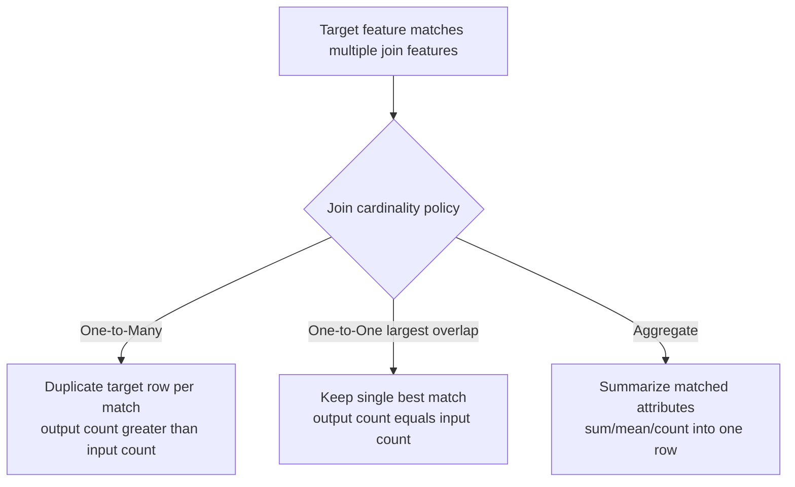

## Spatial Join and Proximity Analysis

### Overview

Spatial join and proximity analysis together answer the class of questions overlay operations cannot: not "what is the geometric intersection of these features" but "which features relate to which, and how far apart are they." A spatial join transfers attributes between layers based on a spatial relationship (containment, intersection, proximity) rather than a shared key field, making it the spatial analog of a relational database join. Proximity analysis extends this into distance-based questions — nearest neighbor identification, distance matrices, service area delineation — that underpin logistics, emergency response planning, retail site selection, and accessibility analysis.

### Spatial Join Fundamentals

A spatial join matches features from a target layer to features from a join layer using a specified spatial predicate, then transfers attributes from the join layer onto the target layer's output.

#### Spatial Join Predicates

**Key Points**

- **Intersects**: the most permissive predicate — any shared point, including boundary-only contact, counts as a match.
- **Contains / Within**: a strict containment relationship — the target must be entirely inside (or entirely contain) the join feature; commonly used for "point-in-polygon" joins (e.g., assigning each customer point to the census tract polygon it falls within).
- **Touches**: features share a boundary but no interior points overlap — relevant for adjacency analysis (e.g., identifying parcels sharing a property line).
- **Crosses**: for line/polygon or line/line pairs where geometries cross without one containing the other (e.g., a road crossing a river).
- **Nearest / Closest**: rather than requiring any geometric overlap, matches each target feature to the nearest join feature regardless of distance, optionally within a maximum search radius — this predicate blurs into proximity analysis territory and many platforms implement it as a distinct "join by nearest" tool rather than a join predicate flag.

```python
# PyQGIS: point-in-polygon spatial join (assigning census tract data to customer points)
result = processing.run("native:joinattributesbylocation", {
    'INPUT': customer_points,
    'JOIN': census_tracts,
    'PREDICATE': [0],   # 0 = intersects; 5 = within; 1 = contains, etc.
    'JOIN_FIELDS': ['tract_id', 'median_income'],
    'METHOD': 0,        # 0 = one-to-many (all matching join features), 1 = one match only (largest overlap), 2 = one match only (largest overlap, keep unjoined)
    'DISCARD_NONMATCHING': False,
    'OUTPUT': 'memory:'
})
```

```sql
-- PostGIS: point-in-polygon spatial join
SELECT c.customer_id, c.geom, t.tract_id, t.median_income
FROM customers c
JOIN census_tracts t ON ST_Within(c.geom, t.geom);

-- Nearest-neighbor spatial join using the KNN <-> operator (index-accelerated)
SELECT h.hospital_id,
       (SELECT s.station_id FROM fire_stations s
        ORDER BY s.geom <-> h.geom LIMIT 1) AS nearest_station_id
FROM hospitals h;
```

**[Behavior may vary]** The `<->` KNN distance operator in PostGIS relies on an existing GiST spatial index to achieve its index-accelerated nearest-neighbor performance; without a spatial index on the relevant geometry column, the query planner falls back to a full scan with per-row distance calculation, which can be dramatically slower on large tables.

#### One-to-One vs. One-to-Many Join Semantics

A critical, frequently mishandled design decision: when a target feature spatially matches *multiple* join features (e.g., a customer point falling exactly on a shared boundary between two tracts, or a parcel overlapping two flood zone polygons), the join must decide whether to:

- **Duplicate the target feature** once per match (one-to-many), preserving every relationship but inflating the output feature count beyond the original target count.
- **Keep only one match** per target feature, typically the one with the largest overlap area or the first encountered, discarding the others — appropriate when downstream analysis assumes exactly one attribute value per target feature.
- **Aggregate join attributes** (e.g., sum, average, count) across all matches into a single row per target feature, appropriate when the analytical question is about the *combined* effect of all overlapping join features rather than a discrete "which one."



### Proximity Analysis

Proximity analysis quantifies spatial nearness rather than binary spatial relationships, supporting a distinct family of tools.

#### Near / Distance Matrix Tools

Computes the distance (and optionally the nearest feature ID) from each feature in one layer to the closest feature in another layer.

```python
# PyQGIS: distance to nearest hub
result = processing.run("native:joinbynearest", {
    'INPUT': delivery_points,
    'INPUT_2': distribution_hubs,
    'FIELDS_TO_COPY': ['hub_id', 'hub_name'],
    'NEIGHBORS': 1,
    'MAX_DISTANCE': None,
    'OUTPUT': 'memory:'
})
```

```sql
-- PostGIS: full distance matrix between two point sets, capped at 5000m
SELECT d.delivery_id, h.hub_id,
       ST_Distance(d.geom::geography, h.geom::geography) AS distance_m
FROM delivery_points d
CROSS JOIN LATERAL (
    SELECT hub_id, geom FROM distribution_hubs
    ORDER BY d.geom <-> geom LIMIT 1
) h;
```

**[Inference]** Casting geometries to `geography` type in the `ST_Distance` call above produces true geodesic (great-circle) distance in meters, whereas leaving the geometry in its native projected `geometry` type produces planar distance in the projection's linear unit; the `geography`-cast pattern is standard practice specifically when the analysis spans a large enough area that projection distortion would otherwise skew distance calculations.

#### Multi-Ring/Tiered Buffer Proximity

Building on the buffer operation covered separately, generating multiple concentric distance bands (e.g., 0–1km, 1–3km, 3–5km) around a feature set supports tiered accessibility or impact analysis — commonly used in retail catchment analysis or environmental impact zoning where effect intensity is expected to fall off with distance in discrete bands rather than continuously.

#### Network-Based (Service Area) Proximity

Straight-line (Euclidean) proximity analysis ignores real-world travel constraints; **network analysis** computes proximity along an actual road/path/utility network, respecting one-way restrictions, speed limits, and turn restrictions. This produces fundamentally different results from a simple buffer, particularly in areas with barriers (rivers, highways without crossings) that straight-line distance cannot account for.

- **Service area (isochrone)**: the area reachable from a facility within a given travel time or distance along the network — e.g., "which neighborhoods are within a 10-minute drive of this fire station."
- **Closest facility**: for each demand point, identify the nearest facility along the network and the travel cost to reach it — the network-aware equivalent of the near/distance-matrix tool above.
- **OD (Origin-Destination) Cost Matrix**: computes travel cost between every origin/destination pair, the network-based analog of a full distance matrix, commonly the input to further logistics optimization (vehicle routing, facility location).

```python
# PyQGIS network analysis example (using the native "Service area (from layer)" algorithm)
result = processing.run("native:serviceareafromlayer", {
    'INPUT': road_network_layer,
    'START_POINTS': fire_stations,
    'STRATEGY': 0,          # 0 = shortest distance, 1 = fastest travel time
    'TRAVEL_COST2': 5000,   # 5000 meters
    'OUTPUT': 'memory:'
})
```

### Diagram: Straight-Line vs. Network-Based Proximity (svg_diagram)

<svg xmlns="http://www.w3.org/2000/svg" viewBox="0 0 760 320">
<text x="380" y="24" text-anchor="middle" font-size="16" font-weight="bold" fill="#1a1a1a">Euclidean vs. Network-Based Proximity (svg_diagram)</text>

<text x="190" y="55" text-anchor="middle" font-size="13" font-weight="bold" fill="`#1a1a1a`">Straight-Line Buffer</text>

<circle cx="190" cy="160" r="8" fill="`#2b6cb0`" />

<circle cx="190" cy="160" r="90" fill="`#dbe9f7`" fill-opacity="0.5" stroke="`#2b6cb0`" stroke-width="1.5" />

<rect x="220" y="90" width="20" height="140" fill="`#e2e2e2`" stroke="#888" />

<text x="230" y="245" text-anchor="middle" font-size="10" fill="#666">(river/barrier ignored)</text>

<text x="190" y="280" text-anchor="middle" font-size="11" fill="#333">Assumes uniform</text>

<text x="190" y="295" text-anchor="middle" font-size="11" fill="#333">travel in all directions</text>

<text x="570" y="55" text-anchor="middle" font-size="13" font-weight="bold" fill="`#1a1a1a`">Network Service Area</text>

<circle cx="570" cy="160" r="8" fill="`#2f855a`" />

<path d="M570,160 L510,110 L470,90" stroke="`#2f855a`" stroke-width="3" fill="none" />

<path d="M570,160 L630,120 L680,100" stroke="`#2f855a`" stroke-width="3" fill="none" />

<path d="M570,160 L560,220 L520,260" stroke="`#2f855a`" stroke-width="3" fill="none" />

<path d="M570,160 L610,210 L640,250" stroke="`#2f855a`" stroke-width="3" fill="none" />

<rect x="595" y="90" width="15" height="140" fill="`#e2e2e2`" stroke="#888" />

<text x="570" y="280" text-anchor="middle" font-size="11" fill="#333">Bounded by actual road</text>

<text x="570" y="295" text-anchor="middle" font-size="11" fill="#333">network and barriers</text>

</svg>

### Comparative Summary Table

| Technique | Answers | Distance Basis | Attribute Behavior |
| --- | --- | --- | --- |
| Spatial Join (intersects/within) | Which features relate spatially? | N/A (topological) | Transfers join layer attributes |
| Spatial Join (nearest) | Which is my closest match? | Euclidean or geodesic | Transfers join layer attributes + distance |
| Near/Distance Matrix | How far apart are these features? | Euclidean or geodesic | Adds distance value, optionally nearest ID |
| Multi-Ring Buffer | What falls within tiered distance bands? | Euclidean (typically) | New zone/band attribute |
| Service Area / Isochrone | What's reachable within X travel time/distance? | Network-based | New reachability polygon |
| OD Cost Matrix | What's the travel cost between every pair? | Network-based | Full pairwise cost table |

### Performance and Data Quality Considerations

**Key Points**

- Spatial joins against large datasets benefit enormously from spatial indexes on both the target and join layers; a nearest-neighbor join without an index degrades toward an O(n×m) comparison.
- Network-based proximity analysis requires a topologically clean network dataset (properly connected road segments, correctly coded one-way/turn restrictions); disconnected or malformed network topology silently produces incorrect or impossibly large service areas.
- Coordinate reference system consistency between the target and join layers is required for correct results; most desktop GIS tools reproject on the fly, but performance and precision can both suffer if the working CRS is poorly suited to the analysis extent.
- For large-scale distance-matrix computations, precomputing and caching a k-nearest-neighbors index (rather than a brute-force full matrix) is standard practice once dataset sizes move into the tens of thousands of features or beyond.

### Related Topics

- Network dataset construction and topology rules for routing analysis
- K-nearest-neighbor spatial indexing structures (R-tree, k-d tree) underlying join performance
- Coordinate reference systems and geodesic vs. planar distance calculation
- Location-allocation and facility siting optimization
- Hot spot analysis and spatial autocorrelation (Moran's I, Getis-Ord Gi*)
- Accessibility and equity analysis using isochrone-based service areas
- Vehicle routing problem (VRP) and OD cost matrix as logistics optimization inputs
- Raster-based proximity tools (Euclidean distance surfaces, cost-distance analysis)