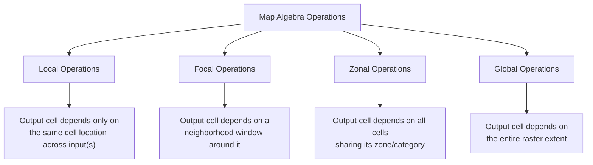
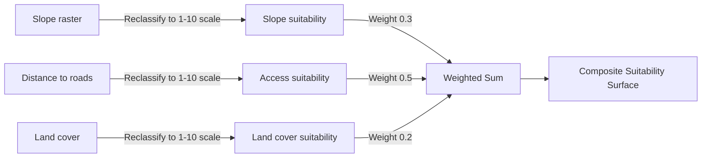

## Map Algebra and Raster Analysis


### Overview

Map algebra is the formal framework for performing mathematical and logical operations on raster (grid-based) spatial data, treating each raster layer as a matrix of cells that can be combined, transformed, and analyzed using algebraic expressions applied uniformly across the grid. Introduced conceptually by Dana Tomlin in the 1980s as "cartographic modeling," map algebra underlies the majority of continuous-surface analysis in GIS — terrain analysis, environmental modeling, suitability surfaces, and remote sensing derivatives — in contrast to the discrete-feature operations (buffer, overlay, spatial join) covered elsewhere in this chapter, which operate on vector geometries rather than continuous grids.

### Raster Data Model Fundamentals

**Key Points**

- A raster is a regular grid of cells (pixels), each holding a single value — continuous (elevation, temperature, NDVI) or categorical (land cover class, soil type).
- **Cell size (resolution)** determines the spatial granularity of analysis; finer resolution captures more detail but increases file size and processing time roughly with the square of the resolution improvement (halving cell size quadruples cell count).
- **NoData values** represent cells with no valid data (outside a study area, sensor gaps, masked regions) and must be explicitly handled in map algebra expressions, since most operations propagate NoData rather than silently treating it as zero.
- Raster analysis requires **spatial alignment** between input layers — matching cell size, extent, and coordinate reference system — or the underlying engine must resample on the fly, which can introduce interpolation artifacts if not done deliberately.

### Map Algebra Operation Classes

Tomlin's classic taxonomy divides map algebra operations into four categories based on which cells contribute to each output value:



#### Local Operations

Cell-by-cell computation using only the value(s) at that exact location across one or more input rasters — arithmetic, logical, and reclassification operations.

```python
# GDAL/rasterio example: NDVI calculation (a canonical local operation)
import rasterio
import numpy as np

with rasterio.open('nir_band.tif') as nir_src, rasterio.open('red_band.tif') as red_src:
    nir = nir_src.read(1).astype('float32')
    red = red_src.read(1).astype('float32')
    ndvi = np.where((nir + red) == 0, -9999, (nir - red) / (nir + red))
    profile = nir_src.profile
    profile.update(dtype='float32', nodata=-9999)
    with rasterio.open('ndvi_output.tif', 'w', **profile) as dst:
        dst.write(ndvi, 1)
```

```python
# PyQGIS raster calculator equivalent expression
expression = '("nir@1" - "red@1") / ("nir@1" + "red@1")'
```

#### Focal (Neighborhood) Operations

Compute an output value based on a moving window (typically 3×3, but configurable) of surrounding cells — smoothing filters, slope/aspect derivation, and terrain analysis are all focal operations.

```python
# GDAL/rasterio: simple 3x3 mean filter (focal smoothing) via scipy
from scipy.ndimage import uniform_filter
import rasterio

with rasterio.open('elevation.tif') as src:
    dem = src.read(1).astype('float32')
    smoothed = uniform_filter(dem, size=3)
    profile = src.profile
    with rasterio.open('smoothed_dem.tif', 'w', **profile) as dst:
        dst.write(smoothed, 1)
```

```bash
# GDAL command-line: slope and aspect derivation from a DEM (built-in focal operations)
gdaldem slope elevation.tif slope_output.tif -p
gdaldem aspect elevation.tif aspect_output.tif
gdaldem hillshade elevation.tif hillshade_output.tif -z 1.5
```

#### Zonal Operations

Summarize values from one raster (or vector zone layer) grouped by zones defined in another dataset — e.g., mean elevation per watershed, or total population per land-use category.

```python
# PyQGIS: zonal statistics (mean, sum, count per zone)
result = processing.run("native:zonalstatisticsfb", {
    'INPUT': watershed_boundaries,   # vector zones
    'INPUT_RASTER': precipitation_raster,
    'STATISTICS': [2, 5, 6],   # 2=mean, 5=sum, 6=count (indices vary by QGIS version)
    'OUTPUT': 'memory:'
})
```

```sql
-- PostGIS raster: zonal statistics using ST_SummaryStats
SELECT z.zone_id,
       (ST_SummaryStats(ST_Clip(r.rast, z.geom))).mean AS mean_precip
FROM precipitation_raster r, watershed_zones z
WHERE ST_Intersects(r.rast, z.geom);
```

#### Global Operations

Every output cell's value is potentially influenced by every input cell — distance surfaces (Euclidean distance from a set of source cells) and cost-distance/least-cost-path analysis are the canonical examples, since the value at any given cell depends on the configuration of the *entire* input raster, not a fixed local neighborhood.

```python
# PyQGIS: Euclidean distance raster from a set of source points
result = processing.run("gdal:proximity", {
    'INPUT': source_points_raster,
    'BAND': 1,
    'VALUES': '',
    'UNITS': 1,   # 1 = georeferenced coordinates
    'OUTPUT': 'memory:'
})
```

### Weighted Overlay and Suitability Analysis

The single most common applied use of map algebra is **weighted overlay** — combining multiple standardized raster criteria (each rescaled to a common suitability scale, e.g., 1–10) using weighted summation to produce a composite suitability surface, a technique central to site selection, land-use planning, and environmental risk mapping.



```python
# PyQGIS raster calculator: weighted overlay expression combining three reclassified inputs
expression = (
    '("slope_suitability@1" * 0.3) + '
    '("access_suitability@1" * 0.5) + '
    '("landcover_suitability@1" * 0.2)'
)
result = processing.run("qgis:rastercalculator", {
    'EXPRESSION': expression,
    'LAYERS': [slope_suit, access_suit, landcover_suit],
    'OUTPUT': 'memory:'
})
```

**[Inference]** Weighted overlay results are highly sensitive to the reclassification scheme and weight values chosen for each criterion; because these choices are inherently value judgments about relative importance (e.g., how much should slope matter relative to road access), suitability models are generally understood as decision-support tools reflecting stated assumptions rather than objective, assumption-free outputs, and sensitivity analysis varying the weights is standard practice before relying on a suitability surface for a consequential decision.

### Terrain Analysis as Applied Map Algebra

Terrain analysis derivatives are among the most widely used focal/local map algebra products in environmental and geospatial science:

| Derivative | Operation Class | Typical Use |
| --- | --- | --- |
| Slope | Focal | Erosion risk, construction suitability, trail difficulty |
| Aspect | Focal | Solar exposure modeling, vegetation pattern analysis |
| Hillshade | Focal | Cartographic visualization, terrain interpretation |
| Curvature | Focal | Water flow convergence/divergence, landform classification |
| Flow direction/accumulation | Focal/Global (hydrologically conditioned) | Watershed delineation, stream network extraction |
| Viewshed | Global | Line-of-sight analysis, visual impact assessment, tower siting |

```bash
# GDAL: terrain ruggedness index and roughness, additional common terrain derivatives
gdaldem TRI elevation.tif tri_output.tif
gdaldem roughness elevation.tif roughness_output.tif
```

### Raster Processing Tools and Ecosystem

**Key Points**

- **GDAL/OGR** is the foundational open-source library underlying raster I/O and processing across nearly the entire open-source and much of the commercial GIS ecosystem (QGIS, PostGIS raster, and many Python geospatial libraries call into GDAL under the hood).
- **rasterio** provides a more Pythonic, NumPy-friendly interface over GDAL for scripted raster analysis, commonly preferred over direct GDAL Python bindings for readability.
- **xarray/rioxarray** extend raster analysis into multidimensional (time-series, multi-band, multi-elevation) datasets, increasingly standard for climate and remote sensing time-series analysis where a simple 2D raster model is insufficient.
- **WhiteboxTools** is an increasingly popular open-source geospatial analysis library specifically strong in hydrological and terrain analysis, exposed as both a standalone CLI and a QGIS plugin front-end.
- **Google Earth Engine** represents a cloud-native map algebra paradigm shift — expressing the same local/focal/zonal/global operations server-side against petabyte-scale satellite imagery archives, without downloading source rasters locally.

```python
# Google Earth Engine (JavaScript API) example: NDVI computation entirely server-side
var image = ee.Image('LANDSAT/LC08/C02/T1_L2/LC08_044034_20230615');
var ndvi = image.normalizedDifference(['SR_B5', 'SR_B4']).rename('NDVI');
Map.addLayer(ndvi, {min: -1, max: 1, palette: ['blue', 'white', 'green']}, 'NDVI');
```

### Diagram: Local vs. Focal vs. Zonal Operation Windows (svg_diagram)

<svg xmlns="http://www.w3.org/2000/svg" viewBox="0 0 760 300">
<text x="380" y="24" text-anchor="middle" font-size="16" font-weight="bold" fill="#1a1a1a">Map Algebra Operation Windows (svg_diagram)</text>

<text x="130" y="55" text-anchor="middle" font-size="13" font-weight="bold" fill="`#1a1a1a`">Local</text>

<g transform="translate(70,70)">

<rect x="0" y="0" width="120" height="120" fill="none" stroke="#999" stroke-width="1" />

<line x1="40" y1="0" x2="40" y2="120" stroke="#999" />

<line x1="80" y1="0" x2="80" y2="120" stroke="#999" />

<line x1="0" y1="40" x2="120" y2="40" stroke="#999" />

<line x1="0" y1="80" x2="120" y2="80" stroke="#999" />

<rect x="40" y="40" width="40" height="40" fill="`#2b6cb0`" />

</g>

<text x="130" y="210" text-anchor="middle" font-size="11" fill="#333">Single cell, same</text>

<text x="130" y="225" text-anchor="middle" font-size="11" fill="#333">location across inputs</text>

<text x="380" y="55" text-anchor="middle" font-size="13" font-weight="bold" fill="`#1a1a1a`">Focal</text>

<g transform="translate(320,70)">

<rect x="0" y="0" width="120" height="120" fill="none" stroke="#999" stroke-width="1" />

<line x1="40" y1="0" x2="40" y2="120" stroke="#999" />

<line x1="80" y1="0" x2="80" y2="120" stroke="#999" />

<line x1="0" y1="40" x2="120" y2="40" stroke="#999" />

<line x1="0" y1="80" x2="120" y2="80" stroke="#999" />

<rect x="0" y="0" width="120" height="120" fill="`#2f855a`" fill-opacity="0.35" stroke="`#2f855a`" stroke-width="2" />

</g>

<text x="380" y="210" text-anchor="middle" font-size="11" fill="#333">3x3 (or larger)</text>

<text x="380" y="225" text-anchor="middle" font-size="11" fill="#333">neighborhood window</text>

<text x="630" y="55" text-anchor="middle" font-size="13" font-weight="bold" fill="`#1a1a1a`">Zonal</text>

<g transform="translate(570,70)">

<rect x="0" y="0" width="120" height="120" fill="none" stroke="#999" stroke-width="1" />

<path d="M0,0 L70,0 L70,50 L120,50 L120,120 L0,120 Z" fill="`#c05621`" fill-opacity="0.35" stroke="`#c05621`" stroke-width="2" />

</g>

<text x="630" y="210" text-anchor="middle" font-size="11" fill="#333">All cells sharing</text>

<text x="630" y="225" text-anchor="middle" font-size="11" fill="#333">an irregular zone</text>

</svg>

### Related Topics

- Digital Elevation Model (DEM) sources, resolution, and hydrological conditioning
- Watershed delineation and stream network extraction workflows
- Remote sensing spectral indices beyond NDVI (NDWI, EVI, SAVI, NBR)
- Cost-distance and least-cost-path analysis for corridor planning
- Multi-criteria decision analysis (MCDA) frameworks underlying weighted overlay
- Raster-vector conversion and its implications for analysis precision
- Cloud-native raster processing (Google Earth Engine, Microsoft Planetary Computer)
- Time-series raster analysis with xarray/rioxarray for climate and remote sensing data