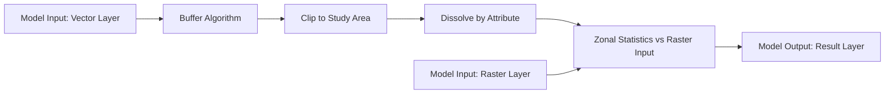
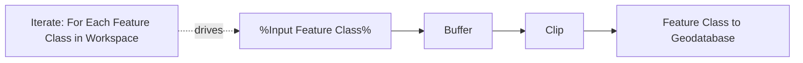
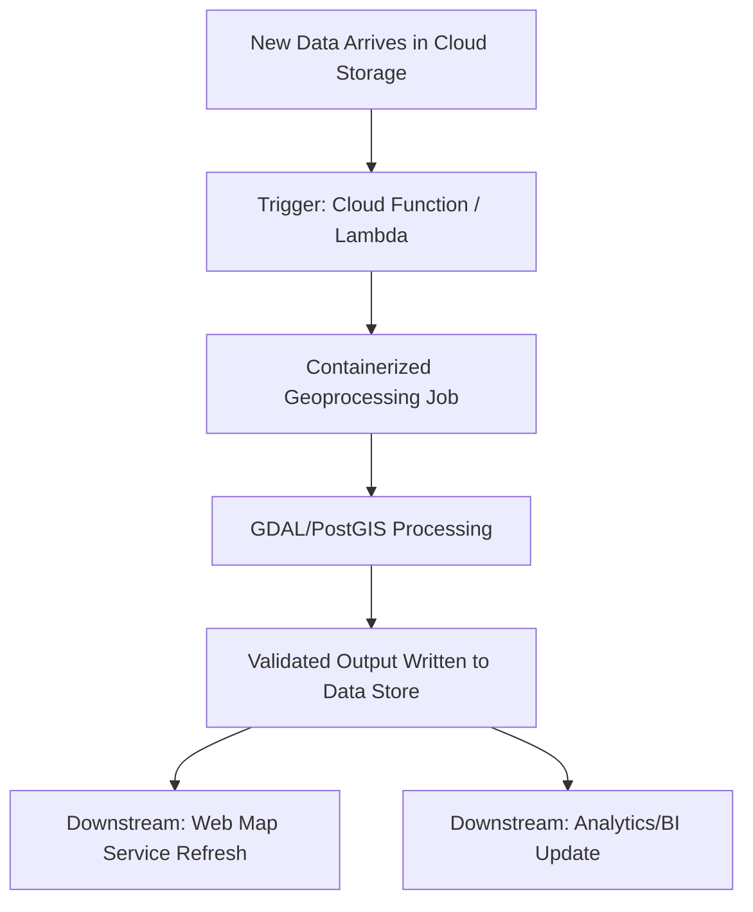

## Model Building and Workflow Automation

### Overview

Model building and workflow automation address the problem of reproducibility and scale in geoprocessing: any analysis performed manually once through a GUI — buffer this, clip that, join the result, run zonal statistics — needs to be repeatable against updated data, shareable with colleagues, and scriptable for batch execution across many study areas or time periods. GIS platforms address this need through two complementary paradigms: **visual/graphical model builders** (drag-and-drop chains of geoprocessing tools) and **scripted automation** (Python-based pipelines using each platform's scripting API). Both ultimately produce the same outcome — a reusable, parameterized geoprocessing pipeline — but trade off accessibility against flexibility differently.

### Visual Model Builders

#### QGIS Graphical Modeler

QGIS's built-in visual workflow editor chains Processing algorithms together into a single reusable model, exposing selected parameters as top-level inputs so the model behaves like any other Processing Toolbox algorithm once built.



Key characteristics of the QGIS Graphical Modeler:

- Models are saved as `.model3` files (XML-based) and can themselves be exported to Python code — a valuable bridge for users who prototype visually then need finer control than the visual editor allows.
- Models appear directly in the Processing Toolbox alongside native algorithms once saved, making them indistinguishable from built-in tools to end users, which is deliberate: it lets an organization build a library of custom, domain-specific tools that feel native to the software.
- Supports conditional branching only in limited form (via pre/post-execution scripts); complex conditional logic generally pushes users toward the full Python scripting API instead.

```python
# Auto-generated Python code exported from a QGIS Graphical Modeler model
from qgis.core import QgsProcessing
from qgis.core import QgsProcessingAlgorithm
from qgis.core import QgsProcessingParameterVectorLayer
from qgis.core import QgsProcessingParameterNumber
import processing

class SiteSuitabilityModel(QgsProcessingAlgorithm):
    def initAlgorithm(self, config=None):
        self.addParameter(QgsProcessingParameterVectorLayer('InputLayer', 'Input Layer'))
        self.addParameter(QgsProcessingParameterNumber('BufferDistance', 'Buffer Distance', defaultValue=500))

    def processAlgorithm(self, parameters, context, model_feedback):
        results = {}
        outputs = {}

        outputs['BufferResult'] = processing.run('native:buffer', {
            'INPUT': parameters['InputLayer'],
            'DISTANCE': parameters['BufferDistance'],
            'OUTPUT': QgsProcessing.TEMPORARY_OUTPUT
        }, context=context, feedback=model_feedback)

        return results
```

#### ArcGIS ModelBuilder

Esri's equivalent visual workflow tool within ArcGIS Pro, conceptually similar in purpose but with somewhat richer built-in support for iteration (looping over a set of input feature classes, a folder of rasters, or field values) and in-line variable substitution.



Key characteristics of ArcGIS ModelBuilder:

- **In-line variables** (shown as ellipses in the model diagram) allow parameter values to flow between tools and be exposed as model-level parameters when the model is shared or converted to a script tool.
- **Iterators** (For Each Feature Class, For Each Raster, For Each Value) are a first-class ModelBuilder construct, enabling batch processing across an entire workspace without hand-written looping logic.
- Models can be exported directly to Python (`Export > To Python Script`), producing an ArcPy script that replicates the same tool chain — the same prototype-then-harden pattern seen in QGIS.
- Models can be packaged as custom **script tools** with a defined parameter dialog, making them distributable and appear as native tools within an organization's custom toolbox.

### Scripted Automation

#### PyQGIS Standalone Scripts

For workflows too complex or too performance-sensitive for the Graphical Modeler, PyQGIS supports fully standalone scripts run outside the QGIS GUI entirely (headless), critical for server-side batch processing or scheduled jobs.

```python
# Standalone PyQGIS script (headless execution outside the QGIS application)
import sys
from qgis.core import QgsApplication, QgsVectorLayer, QgsProject

QgsApplication.setPrefixPath('/usr', True)
qgs = QgsApplication([], False)
qgs.initQgis()

sys.path.append('/usr/share/qgis/python/plugins')
import processing
from processing.core.Processing import Processing
Processing.initialize()

layer = QgsVectorLayer('/data/parcels.shp', 'parcels', 'ogr')
if not layer.isValid():
    raise RuntimeError('Layer failed to load')

result = processing.run('native:buffer', {
    'INPUT': layer,
    'DISTANCE': 100,
    'OUTPUT': '/data/parcels_buffered.shp'
})

qgs.exitQgis()
```

#### ArcPy Scripting

ArcPy provides the equivalent capability within the Esri ecosystem, commonly used for scheduled batch jobs (via Windows Task Scheduler or a dedicated automation server) and integration into larger enterprise data pipelines.

```python
import arcpy

arcpy.env.workspace = r"C:\GIS\Data.gdb"
arcpy.env.overwriteOutput = True

for fc in arcpy.ListFeatureClasses():
    buffered_name = f"{fc}_buffered"
    arcpy.analysis.Buffer(fc, buffered_name, "500 Meters", dissolve_option="ALL")
    print(f"Processed {fc} -> {buffered_name}")
```

#### GDAL/OGR Command-Line Automation

For lighter-weight, cross-platform automation not tied to a specific desktop GIS application, GDAL/OGR command-line utilities are frequently chained in shell scripts or invoked from any scripting language via subprocess calls.

```bash
#!/bin/bash
# Batch reprojection and clipping across a directory of shapefiles
for f in /data/raw/*.shp; do
  base=$(basename "$f" .shp)
  ogr2ogr -t_srs EPSG:32633 -clipsrc study_area.shp \
    "/data/processed/${base}_clipped.shp" "$f"
done
```

### Workflow Orchestration Beyond a Single GIS Platform

**Key Points**

- **Task scheduling**: `cron` (Linux) or Task Scheduler (Windows) for time-based recurring geoprocessing jobs — nightly data refreshes, weekly report generation.
- **Data pipeline orchestrators**: general-purpose tools like Apache Airflow or Dagster increasingly incorporate geoprocessing steps as tasks/assets within a larger data pipeline DAG, particularly when spatial processing is one stage among several (ingest → validate → geoprocess → load to warehouse → publish to web map).
- **Containerization**: packaging a GDAL/PostGIS/Python geoprocessing environment into a Docker container ensures the exact library versions (GDAL is notoriously version-sensitive) are consistent across development, CI, and production execution environments.
- **Serverless/cloud batch execution**: AWS Lambda (with size-constrained GDAL layers) or cloud batch compute services for triggering geoprocessing on data arrival (e.g., a new satellite scene landing in cloud storage) without maintaining a persistently running server.



### Model Validation and Error Handling

**Key Points**

- **Parameter validation**: robust models validate inputs (correct geometry type, expected CRS, non-empty layers) before executing expensive downstream steps, rather than failing deep into a multi-step chain with an unclear error.
- **Intermediate output inspection**: complex models benefit from optionally persisting intermediate outputs (rather than only in-memory temporary layers) during development/debugging, then switching to memory-only outputs for production runs to avoid disk clutter.
- **Logging and feedback**: both PyQGIS (`QgsProcessingFeedback`) and ArcPy (`arcpy.AddMessage`/`arcpy.AddWarning`/`arcpy.AddError`) provide structured progress/logging hooks that integrate with their respective execution environments' progress dialogs and log files.
- **Idempotency**: well-designed automated geoprocessing workflows are typically built to be safely re-runnable (e.g., using `overwriteOutput = True` in ArcPy, or `DROP TABLE IF EXISTS` patterns in SQL-based pipelines) so a failed or retried run does not require manual cleanup.

```python
# ArcPy example: structured feedback and defensive validation
import arcpy

def run_workflow(input_fc, buffer_distance):
    if not arcpy.Exists(input_fc):
        arcpy.AddError(f"Input feature class does not exist: {input_fc}")
        raise ValueError("Missing input")

    desc = arcpy.Describe(input_fc)
    if desc.shapeType not in ("Polygon", "Polyline", "Point"):
        arcpy.AddWarning(f"Unexpected geometry type: {desc.shapeType}")

    arcpy.AddMessage(f"Buffering {input_fc} by {buffer_distance}")
    arcpy.analysis.Buffer(input_fc, "in_memory/buffered", buffer_distance)
    arcpy.AddMessage("Workflow completed successfully")
```

### Comparative Summary Table

| Approach | Best Suited For | Version Control Friendliness | Learning Curve |
| --- | --- | --- | --- |
| QGIS Graphical Modeler | Sharing reusable tools within a GIS-literate team | Moderate (XML-based `.model3`, diffable but verbose) | Low |
| ArcGIS ModelBuilder | Batch/iterative workflows within Esri ecosystem | Moderate (proprietary model format) | Low–Moderate |
| PyQGIS / ArcPy scripting | Complex logic, integration with non-GIS systems, headless execution | High (plain Python, diffable) | Moderate–High |
| GDAL/OGR CLI + shell scripting | Cross-platform, lightweight, CI/CD-friendly batch jobs | High (plain scripts) | Moderate |
| Orchestrated pipelines (Airflow/Dagster + containers) | Enterprise-scale, multi-stage pipelines with monitoring/retry | High (code-based DAG definitions) | High |

### Practical Example: Automated Monthly Environmental Report

**Example**

A representative end-to-end automated workflow combining several of the techniques above:

1. A scheduled Airflow DAG triggers on the first of each month.
2. A containerized task downloads the latest satellite-derived NDVI raster for the study region via an API call.
3. A PyQGIS headless script clips the raster to each of several watershed boundaries and computes zonal mean NDVI per watershed (map algebra + zonal statistics, as covered separately).
4. Results are written to a PostGIS table, with `DROP TABLE IF EXISTS` / re-create logic ensuring idempotent reruns if the job fails partway.
5. A second task queries the updated PostGIS table and regenerates a PDF summary report (via a templated `docx`/reporting tool) and refreshes a published web map's underlying hosted feature layer.
6. Failure at any stage triggers an Airflow alert rather than silently producing a partial or stale report.

**Output**

A fully automated, monthly-recurring environmental monitoring report requiring no manual GIS operator intervention under normal conditions, with failure states surfaced explicitly rather than failing silently.

### Related Topics

- QGIS Processing framework architecture and writing custom `QgsProcessingAlgorithm` classes
- ArcPy geoprocessing environment settings and cursor-based attribute editing
- Containerized geospatial environments (Docker images for GDAL/PostGIS/QGIS server)
- Data pipeline orchestration tools (Apache Airflow, Dagster) applied to geospatial ETL
- Version control strategies for geospatial models and scripts (Git-based workflows for `.model3`/ArcPy)
- Continuous integration testing for geoprocessing scripts (headless QGIS testing, GDAL version pinning)
- Serverless geoprocessing architectures (AWS Lambda with GDAL layers, cloud batch compute)
- Error handling and logging patterns for production geoprocessing pipelines