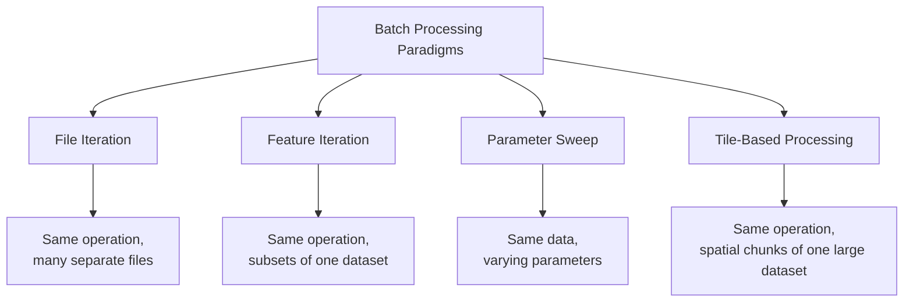
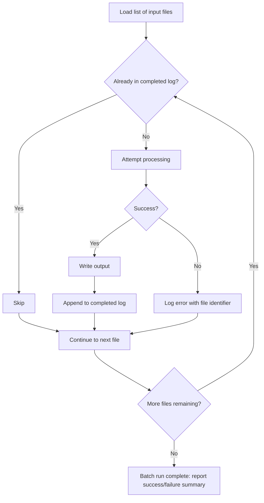

## Batch Processing and Script-Based Geoprocessing

### Overview

Batch processing and script-based geoprocessing address the operational reality that geospatial workflows must frequently run against many inputs — hundreds of tiles, dozens of study areas, an entire directory of shapefiles — rather than a single dataset processed interactively once. Where the previous topic (model building and workflow automation) covered *how* to construct reusable pipelines, batch processing focuses specifically on the mechanics of applying a fixed geoprocessing operation repeatedly and efficiently across a large input set, including the performance, parallelization, and error-isolation concerns that only emerge at scale.

### Batch Processing Paradigms

**Key Points**

- **Iteration over files**: applying the same operation to every file matching a pattern in a directory (all shapefiles, all GeoTIFFs) — the most common batch pattern for data preparation and format conversion tasks.
- **Iteration over features**: applying an operation once per feature or per attribute value within a single dataset (e.g., generating a separate clipped extract per county from a national dataset) — distinct from file iteration because the "unit of work" is a subset of a single input rather than a whole separate file.
- **Parameter sweeps**: running the same operation repeatedly with varying parameter values (e.g., testing multiple buffer distances or multiple weighting schemes in a suitability model) to compare results, common in sensitivity analysis.
- **Tile-based processing**: splitting a very large raster or vector dataset into manageable spatial tiles, processing each independently (often in parallel), then merging results — necessary when a dataset is too large to process as a single unit in available memory.



### Built-In Batch Processing Tools

#### QGIS Processing Batch Mode

Nearly every algorithm in the QGIS Processing Toolbox exposes a "Run as Batch Process" option directly in its tool dialog, which converts any single-run algorithm into a table-driven batch interface without writing any code — each row represents one execution with its own parameter values, and QGIS can auto-fill rows from files in a selected directory.

```python
# PyQGIS equivalent of GUI batch mode: iterating an algorithm across a directory
import os
from qgis import processing

input_dir = '/data/counties'
output_dir = '/data/counties_buffered'

for filename in os.listdir(input_dir):
    if filename.endswith('.shp'):
        input_path = os.path.join(input_dir, filename)
        output_path = os.path.join(output_dir, filename.replace('.shp', '_buffered.shp'))
        processing.run('native:buffer', {
            'INPUT': input_path,
            'DISTANCE': 500,
            'OUTPUT': output_path
        })
```

#### ArcGIS Batch Geoprocessing

Every ArcGIS geoprocessing tool has an implicit batch capability accessible via its right-click "Batch..." context menu in the Geoprocessing pane, generating a table where each row is one tool execution; this is functionally equivalent in intent to QGIS's batch mode but implemented as a per-tool dialog feature rather than a Processing-framework-wide toggle. For programmatic batch execution, ArcPy's `ListFeatureClasses`/`ListRasters`/`ListFiles` functions combined with a loop are the standard idiom (shown in the previous topic's example).

### Parallelization Strategies

**Key Points**

- **Embarrassingly parallel batch jobs** — where each unit of work (file, tile, feature subset) is fully independent of every other — are the easiest and most common target for parallelization in geoprocessing, since there is no need for inter-process coordination during execution.
- **Multiprocessing within a single machine**: Python's `multiprocessing` or `concurrent.futures` modules distribute independent geoprocessing tasks across CPU cores, appropriate when the workload is CPU-bound (e.g., computationally intensive raster analysis) rather than I/O-bound.
- **Distributed/cluster processing**: for datasets or job counts too large for a single machine, frameworks like Dask (with `dask-geopandas`) or Apache Spark (with sedona/GeoSpark for spatial extensions) distribute geoprocessing across a compute cluster.
- **GPU acceleration**: increasingly relevant for raster-heavy workloads (large-scale map algebra, deep-learning-based remote sensing classification) via libraries like RAPIDS cuSpatial, though this remains a specialized rather than default tooling choice in most GIS batch pipelines.

```python
# Python multiprocessing example: parallel buffering across many input files
from multiprocessing import Pool
import geopandas as gpd

def buffer_file(filepath):
    gdf = gpd.read_file(filepath)
    gdf['geometry'] = gdf.geometry.buffer(500)
    output_path = filepath.replace('.shp', '_buffered.shp')
    gdf.to_file(output_path)
    return output_path

if __name__ == '__main__':
    import glob
    files = glob.glob('/data/counties/*.shp')
    with Pool(processes=4) as pool:
        results = pool.map(buffer_file, files)
    print(f"Processed {len(results)} files")
```

```python
# dask-geopandas example: distributed spatial buffer operation
import dask_geopandas

ddf = dask_geopandas.read_file('/data/large_dataset.gpkg', npartitions=8)
ddf['geometry'] = ddf.geometry.buffer(500)
ddf.compute().to_file('/data/large_dataset_buffered.gpkg')
```

**[Behavior may vary]** The actual speedup achieved from multiprocessing or distributed processing depends heavily on whether the workload is genuinely CPU-bound versus I/O-bound (disk read/write, network transfer); I/O-bound geoprocessing tasks may see limited benefit from additional parallel workers if they are all contending for the same disk or network bandwidth.

### Tile-Based Raster Processing at Scale

For very large raster datasets (national-scale elevation models, satellite imagery mosaics), processing the entire dataset as a single in-memory array is often infeasible; tile-based (windowed) processing reads, processes, and writes data in manageable chunks.

```python
# rasterio windowed reading/writing for memory-efficient large-raster processing
import rasterio
from rasterio.windows import Window

with rasterio.open('large_dem.tif') as src:
    profile = src.profile
    tile_size = 512
    with rasterio.open('large_slope_output.tif', 'w', **profile) as dst:
        for row_off in range(0, src.height, tile_size):
            for col_off in range(0, src.width, tile_size):
                window = Window(col_off, row_off,
                                 min(tile_size, src.width - col_off),
                                 min(tile_size, src.height - row_off))
                data = src.read(1, window=window)
                # slope/derivative calculation would be applied to `data` here
                dst.write(data, 1, window=window)
```

```bash
# GDAL: building a virtual raster (VRT) mosaic as a lightweight alternative
# to physically merging many tiles, deferring actual reads until needed
gdalbuildvrt mosaic.vrt /data/tiles/*.tif
gdal_translate -of GTiff mosaic.vrt merged_output.tif
```

### Error Isolation and Resilience in Batch Jobs

**Key Points**

- A single malformed input (corrupt geometry, unreadable file, unexpected schema) should not abort an entire batch run silently; robust batch scripts wrap each unit of work in error handling that logs the failure and continues to the next item.
- **Retry logic** with exponential backoff is standard for batch jobs involving network-dependent steps (downloading source data, calling an external API), where transient failures are expected rather than exceptional.
- **Progress tracking and resumability**: long-running batch jobs benefit from persisting a manifest of completed items, so an interrupted job can resume from where it left off rather than reprocessing already-completed work.

```python
import logging
import geopandas as gpd

logging.basicConfig(filename='batch_errors.log', level=logging.ERROR)

def process_file_safely(filepath, completed_log):
    if filepath in completed_log:
        return  # already processed, skip for resumability

    try:
        gdf = gpd.read_file(filepath)
        gdf['geometry'] = gdf.geometry.buffer(500)
        gdf.to_file(filepath.replace('.shp', '_buffered.shp'))
        completed_log.add(filepath)
        with open('completed.txt', 'a') as f:
            f.write(filepath + '\n')
    except Exception as e:
        logging.error(f"Failed processing {filepath}: {e}")
        # continue to next file rather than raising
```

### Diagram: Resilient Batch Processing Flow



### Command-Line and Shell-Level Batch Automation

For cross-platform, dependency-light batch geoprocessing, shell scripting combined with GDAL/OGR utilities remains extremely common, particularly in Linux-based server and CI/CD environments.

```bash
#!/bin/bash
set -euo pipefail

INPUT_DIR="/data/raw_rasters"
OUTPUT_DIR="/data/processed_rasters"
LOG_FILE="/data/batch_log.txt"

mkdir -p "$OUTPUT_DIR"

for raster in "$INPUT_DIR"/*.tif; do
    base=$(basename "$raster" .tif)
    output="$OUTPUT_DIR/${base}_reprojected.tif"

    if gdalwarp -t_srs EPSG:4326 -overwrite "$raster" "$output" 2>> "$LOG_FILE"; then
        echo "SUCCESS: $base" >> "$LOG_FILE"
    else
        echo "FAILURE: $base" >> "$LOG_FILE"
        continue
    fi
done
```

`set -euo pipefail` at the top of the script causes the shell to exit on unset variables and propagate pipeline failures correctly, but the explicit `if`/`continue` pattern inside the loop is what actually provides per-file error isolation — without it, `set -e` would halt the entire batch on the first failed reprojection rather than continuing to remaining files.

### Comparative Summary Table

| Technique | Scale Target | Parallelization | Typical Tooling |
| --- | --- | --- | --- |
| GUI batch mode (QGIS/ArcGIS) | Tens to low hundreds of files | Single-threaded (generally) | Built-in Processing/Geoprocessing pane |
| Python loop + multiprocessing | Hundreds to low thousands of files | Multi-core, single machine | `multiprocessing`, `concurrent.futures` |
| Dask/Spark distributed processing | Very large datasets, cluster-scale | Multi-node distributed | `dask-geopandas`, Apache Sedona |
| Tile/windowed raster processing | Rasters too large for memory | Optional (tiles are independent) | `rasterio` windows, GDAL VRT |
| Shell scripting + GDAL/OGR CLI | Lightweight, CI/CD-integrated batch jobs | Manual (via `&`/`xargs -P`) | Bash, GDAL/OGR utilities |

### Related Topics

- Cloud-native raster formats (Cloud Optimized GeoTIFF) designed for efficient partial/windowed reads
- Distributed spatial computing frameworks (Apache Sedona, dask-geopandas) in depth
- CI/CD pipeline design for automated geospatial data processing
- Memory profiling and optimization techniques for large-scale raster/vector processing
- Idempotent pipeline design patterns for production geoprocessing systems
- GDAL Virtual Format (VRT) as a lightweight mosaicking and preprocessing tool
- Job scheduling and dependency management (Airflow, Dagster, cron) for recurring batch geoprocessing
- GPU-accelerated geospatial computing (RAPIDS cuSpatial) for large-scale analysis