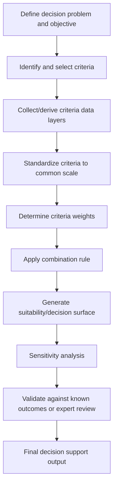

## Multi-Criteria Spatial Decision Analysis


### Overview

Multi-Criteria Spatial Decision Analysis (MCSDA, often referred to as MCDA when the spatial dimension is implicit) is the formal discipline of combining multiple, often conflicting, spatial criteria into a single decision-support output — site suitability, land-use allocation, risk zoning, or facility siting. Where the earlier map algebra topic introduced weighted overlay as a *technique*, MCSDA is the broader analytical framework governing *how* criteria are selected, standardized, weighted, and combined, along with the decision theory underpinning those choices. MCSDA sits at the intersection of GIS, operations research, and decision theory, and is one of the most consequential applied uses of GIS because its outputs frequently inform real infrastructure, conservation, and land-use decisions with significant social and financial stakes.

### The MCSDA Workflow



#### Step 1: Criteria Identification and Selection

**Key Points**

- Criteria fall into two categories: **factors** (continuous variables that increase or decrease suitability by degree, e.g., slope, distance to roads) and **constraints** (binary exclusion rules, e.g., "not in a protected wetland," "not within 500m of a school" for a hazardous facility).
- Criteria should be measurable, non-redundant (avoiding double-counting closely correlated variables, e.g., using both "distance to urban center" and "population density" without acknowledging their correlation), and operationally relevant to the stated decision objective.
- Stakeholder consultation is standard practice at this stage in applied planning contexts, since which criteria matter — and how much — is inherently a value-laden question rather than a purely technical one.

#### Step 2: Standardization (Criteria Scaling)

Because raw criteria arrive in incompatible units (meters for distance, degrees for slope, categorical classes for land cover), they must be rescaled to a common suitability scale (commonly 0–1 or 1–10) before combination.

**Standardization function types**:

- **Linear/maximum score**: value rescaled proportionally between the observed minimum and maximum.
- **Fuzzy membership functions**: sigmoidal, linear, or J-shaped curves representing graded, non-linear suitability transitions (e.g., suitability doesn't drop sharply at exactly 1000m from a road, but declines gradually).
- **Categorical reclassification**: direct expert-assigned suitability scores per category (e.g., assigning land-cover classes suitability scores based on planning judgment rather than a mathematical function).

```python
# Fuzzy membership standardization example using scikit-fuzzy-style sigmoid logic
import numpy as np

def fuzzy_linear_decrease(value, low_threshold, high_threshold):
    """Suitability decreases linearly from 1 at low_threshold to 0 at high_threshold."""
    return np.clip((high_threshold - value) / (high_threshold - low_threshold), 0, 1)

distance_to_road = np.array([100, 500, 1000, 2000, 5000])
suitability = fuzzy_linear_decrease(distance_to_road, low_threshold=200, high_threshold=3000)
```

```python
# PyQGIS raster calculator: linear standardization of a slope raster to 0-1 suitability
expression = '(1 - ("slope@1" - 0) / (45 - 0))'   # 0deg = fully suitable, 45deg+ = unsuitable
```

#### Step 3: Weight Determination

**Key Points**

- **Direct/ranking assignment**: an expert or stakeholder group directly assigns weights, often normalized to sum to 1.
- **Pairwise comparison (Analytic Hierarchy Process, AHP)**: developed by Thomas Saaty, criteria are compared two at a time on a standardized 1–9 relative-importance scale, and weights are derived mathematically from the resulting comparison matrix's principal eigenvector — widely used specifically because it decomposes a complex multi-criteria weighting judgment into a series of simpler pairwise judgments, and includes a built-in **consistency ratio** check to flag illogical judgment patterns (e.g., A > B, B > C, but C > A).
- **Rank-based weighting methods** (rank sum, rank reciprocal, rank exponent) — computationally simpler alternatives to full pairwise comparison when only a rank ordering of criteria importance is available rather than precise relative-importance judgments.

```python
# Simplified AHP weight derivation from a pairwise comparison matrix
import numpy as np

# Rows/columns: [Slope, Distance to Road, Land Cover]
comparison_matrix = np.array([
    [1,    3,   5],
    [1/3,  1,   3],
    [1/5,  1/3, 1]
])

eigenvalues, eigenvectors = np.linalg.eig(comparison_matrix)
principal_eigenvector = np.real(eigenvectors[:, np.argmax(eigenvalues)])
weights = principal_eigenvector / principal_eigenvector.sum()
print(weights)  # normalized criteria weights
```

**[Inference]** The consistency ratio derived from an AHP comparison matrix is generally interpreted using Saaty's convention that a value below approximately 0.1 indicates acceptably consistent judgments, while a substantially higher ratio suggests the pairwise comparisons contain logical contradictions and should be revisited before the resulting weights are trusted; this is a widely followed convention rather than a strict mathematical requirement.

#### Step 4: Combination Rules

**Weighted Linear Combination (WLC)** — the standard additive approach, computing a suitability score as the weighted sum of standardized criteria:

$$S = \sum_{i=1}^{n} w_i x_i$$

where $S$ is the composite suitability score, $w_i$ is the weight of criterion $i$, and $x_i$ is the standardized value of criterion $i$.

**Ordered Weighted Averaging (OWA)** — a generalization of WLC that introduces a second set of "order weights" controlling the decision-maker's risk posture: whether the combination behaves more like an AND (all criteria must be satisfied — risk-averse) or an OR (any strong criterion can compensate for weak ones — risk-taking) operator, positioned along a continuum between the two rather than forced to pick strictly one.

**Boolean/constraint overlay** — for hard constraints rather than graded factors, a simple binary AND across all constraint layers determines feasibility (a cell is either entirely excluded or entirely eligible), typically applied as a final masking step after WLC/OWA has produced the graded suitability surface for the *factors*.

```python
# Combining WLC suitability with a hard Boolean constraint mask
final_suitability = weighted_suitability_surface * constraint_mask  # constraint_mask is 0 or 1
```

### Diagram: WLC vs. OWA Risk Posture Spectrum (svg_diagram)

<svg xmlns="http://www.w3.org/2000/svg" viewBox="0 0 760 260">
<text x="380" y="26" text-anchor="middle" font-size="16" font-weight="bold" fill="#1a1a1a">OWA Risk Posture Continuum (svg_diagram)</text>
<line x1="80" y1="130" x2="680" y2="130" stroke="#555" stroke-width="2" />
<circle cx="80" cy="130" r="6" fill="#2b6cb0" />
<circle cx="380" cy="130" r="6" fill="#805ad3" />
<circle cx="680" cy="130" r="6" fill="#c05621" />

<text x="80" y="100" text-anchor="middle" font-size="13" font-weight="bold" fill="`#1a1a1a`">AND (risk-averse)</text>

<text x="80" y="160" text-anchor="middle" font-size="11" fill="#333">All criteria must</text>

<text x="80" y="175" text-anchor="middle" font-size="11" fill="#333">be well-satisfied</text>

<text x="380" y="100" text-anchor="middle" font-size="13" font-weight="bold" fill="`#1a1a1a`">WLC (balanced)</text>

<text x="380" y="160" text-anchor="middle" font-size="11" fill="#333">Weighted average,</text>

<text x="380" y="175" text-anchor="middle" font-size="11" fill="#333">full trade-off allowed</text>

<text x="680" y="100" text-anchor="middle" font-size="13" font-weight="bold" fill="`#1a1a1a`">OR (risk-taking)</text>

<text x="680" y="160" text-anchor="middle" font-size="11" fill="#333">One strong criterion</text>

<text x="680" y="175" text-anchor="middle" font-size="11" fill="#333">can compensate for weak ones</text>

</svg>

### Sensitivity Analysis

**Key Points**

- Because weights and standardization functions embed subjective judgment, MCSDA outputs are expected to be tested for **sensitivity** — how much does the final suitability ranking change if a given weight shifts by a small amount?
- **One-at-a-time (OAT) sensitivity analysis**: varying a single criterion's weight while holding others fixed (often proportionally redistributing the remainder) and observing the effect on the output ranking or spatial pattern.
- **Monte Carlo sensitivity analysis**: repeatedly sampling weight combinations from a plausible distribution and examining the resulting distribution of outcomes, providing a more comprehensive picture of output robustness than single-variable OAT testing.
- A suitability surface that changes dramatically in response to small, defensible weight adjustments is a signal that the underlying decision is genuinely close/contested, which is itself decision-relevant information rather than a flaw in the analysis.

```python
# Simplified Monte Carlo sensitivity analysis over criteria weights
import numpy as np

n_simulations = 1000
n_criteria = 3
results = []

for _ in range(n_simulations):
    random_weights = np.random.dirichlet(np.ones(n_criteria))  # sums to 1, varies each run
    simulated_score = (random_weights[0] * slope_suit +
                        random_weights[1] * access_suit +
                        random_weights[2] * landcover_suit)
    results.append(simulated_score)

# Analyzing variance across simulations highlights spatially unstable/robust areas
result_stack = np.stack(results)
variance_surface = np.var(result_stack, axis=0)
```

### Software Implementations

| Platform/Tool | MCSDA Support |
| --- | --- |
| ArcGIS Pro | Weighted Overlay tool (built-in, GUI-driven, integrated reclassification), Suitability Modeler |
| QGIS | Raster Calculator + Fuzzify Raster tool + manual AHP scripting (no fully integrated built-in AHP tool as of recent versions) |
| IDRISI/TerrSet | Historically strong dedicated MCDA/OWA toolset, widely cited in academic MCSDA literature |
| Custom Python (numpy/rasterio) | Full flexibility for AHP, OWA, Monte Carlo sensitivity analysis not natively exposed in GUI tools |
| R (sf, raster/terra packages) | Common in academic/research MCSDA workflows, particularly paired with dedicated MCDA packages |

### Practical Example: Renewable Energy Site Suitability

**Example**

A representative MCSDA workflow for siting a utility-scale solar installation:

1. **Criteria selection**: solar irradiance (factor), slope (factor), distance to existing transmission infrastructure (factor), land cover type (factor), distance from protected areas and residential zones (constraints).
2. **Standardization**: solar irradiance linearly rescaled 0–1 (higher irradiance = higher suitability); slope standardized via a fuzzy decreasing function (flat land strongly preferred, sharply penalizing beyond typical construction-feasible slope); distance to transmission lines standardized via fuzzy decreasing function (closer preferred, to minimize interconnection cost).
3. **Weighting via AHP**: a stakeholder panel of energy planners and environmental reviewers conducts pairwise comparisons; solar irradiance receives the highest derived weight, followed by transmission proximity, then slope, with a consistency ratio confirmed below the conventional acceptability threshold.
4. **Constraint masking**: protected areas, water bodies, and a residential setback buffer excluded entirely via Boolean overlay.
5. **Combination**: WLC applied to the three factor layers within the constraint-masked eligible area.
6. **Sensitivity analysis**: Monte Carlo weight sampling reveals the top-ranked sites are robust across a wide range of plausible weight combinations, while several mid-ranked sites shift substantially — flagged for additional manual review rather than treated as decisively ranked.

**Output**

A composite suitability raster, masked to exclude ineligible areas, ranked from most to least suitable, accompanied by a sensitivity report identifying which ranked sites are robust conclusions versus weight-dependent artifacts of the specific weighting scheme chosen.

### Related Topics

- Analytic Hierarchy Process (AHP) mathematical foundations and consistency ratio derivation in depth
- Fuzzy set theory and fuzzy membership function selection for spatial standardization
- Weighted overlay and raster map algebra (foundational technique underlying WLC)
- Participatory GIS and stakeholder-driven criteria weighting methods
- Land suitability modeling for agriculture, conservation, and urban planning applications
- Ordered Weighted Averaging (OWA) mathematical formulation and risk/trade-off parameterization
- Site selection optimization combining MCSDA outputs with location-allocation modeling
- Uncertainty and error propagation in composite spatial suitability models