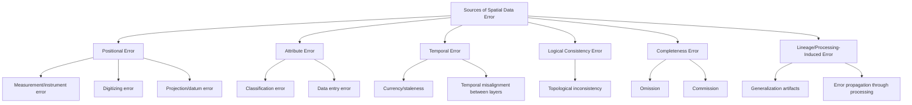
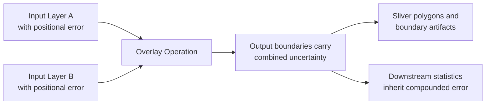

## Sources of Spatial Data Error and Uncertainty


### Overview

Every spatial dataset is an imperfect representation of a continuous, infinitely complex reality, compressed through measurement, generalization, and modeling choices at every stage of its creation. Understanding the sources of spatial data error and uncertainty is foundational to responsible GIS practice, because analytical results — buffers, overlays, suitability models, statistical summaries — inherit and often amplify the uncertainty present in their inputs. This topic surveys where spatial error originates, how it is characterized and measured, and why distinguishing between different error types matters for interpreting analytical output responsibly rather than treating GIS results as exact.

### Taxonomy of Spatial Data Error Sources



### Positional Error

**Key Points**

- **Measurement/instrument error**: the accuracy limits of the original data collection technology — GPS receiver accuracy, total station survey precision, LiDAR point cloud vertical/horizontal accuracy specifications — establish a hard floor beneath which positional accuracy cannot improve regardless of downstream processing.
- **Digitizing error**: manual on-screen digitizing of features from a scanned map or imagery basemap introduces operator-dependent positional imprecision, typically on the order of the display resolution and the digitizer's steadiness/skill, and is a well-documented, largely unavoidable source of error in any dataset built from manual heads-up digitizing.
- **Projection and datum transformation error**: converting between coordinate reference systems, particularly across different geodetic datums (e.g., NAD27 to NAD83, or between regional and global datums), introduces error if an inappropriate or approximate transformation method is used rather than the officially recommended transformation parameters for that datum pair.
- **Generalization-induced positional shift**: cartographic generalization (simplifying a coastline or road network for display at smaller scales) deliberately displaces feature vertices from their true surveyed position to preserve visual clarity, meaning a generalized dataset's stated positional accuracy is scale-dependent, not a fixed absolute value.

```python
# Demonstrating datum transformation discrepancy using pyproj
from pyproj import Transformer

# Naive/approximate transformation vs. a grid-based high-accuracy transformation
transformer_approx = Transformer.from_crs("EPSG:4267", "EPSG:4326", always_xy=True)  # NAD27 to WGS84
transformer_precise = Transformer.from_crs("EPSG:4267", "EPSG:4326", always_xy=True,
                                            authority='EPSG', accuracy=1.0)

lon, lat = -122.4194, 37.7749
result_approx = transformer_approx.transform(lon, lat)
print(result_approx)
```

**[Behavior may vary]** The magnitude of positional discrepancy introduced by an inappropriate datum transformation depends on the specific datum pair and geographic region involved; some datum pairs differ by only a few centimeters in certain regions while others (particularly historical local/regional datums) can differ by tens of meters, so the practical significance of transformation choice is context-dependent rather than a fixed universal quantity.

### Attribute Error

**Key Points**

- **Classification error**: assigning a feature to an incorrect category — a land-cover pixel misclassified as "cropland" instead of "grassland" in a remote-sensing-derived product, or a parcel miscoded with the wrong zoning designation — commonly quantified via a confusion (error) matrix comparing classified results against ground-truth reference data.
- **Data entry/transcription error**: manual attribute entry (address fields, ownership records, survey response coding) introduces error rates comparable to any manually entered database, unrelated to the spatial component of the data.
- **Measurement error in continuous attributes**: sensor calibration drift, interpolation error in continuous surfaces (temperature, elevation, pollutant concentration) derived from sparse sample points.

#### Confusion Matrix and Classification Accuracy Metrics

A confusion matrix cross-tabulates predicted (classified) categories against reference (ground-truth) categories, from which several standard accuracy metrics are derived:

$$\text{Overall Accuracy} = \frac{\sum_{i} n_{ii}}{N}$$

where $n_{ii}$ is the count of correctly classified samples in category $i$ (the diagonal of the confusion matrix) and $N$ is the total sample count.

$$\text{Producer's Accuracy}_i = \frac{n_{ii}}{n_{+i}}, \quad \text{User's Accuracy}_i = \frac{n_{ii}}{n_{i+}}$$

where $n_{+i}$ is the reference (column) total for category $i$ and $n_{i+}$ is the classified (row) total for category $i$. Producer's accuracy reflects how well the map represents ground truth for that class (an error-of-omission measure), while user's accuracy reflects how reliable a mapped label is when encountered (an error-of-commission measure) — these two accuracy figures for the same category are commonly and importantly different from one another.

```python
# Confusion matrix and derived accuracy metrics using scikit-learn
from sklearn.metrics import confusion_matrix, classification_report

y_true = ['cropland', 'grassland', 'cropland', 'forest', 'grassland']
y_pred = ['cropland', 'cropland', 'cropland', 'forest', 'grassland']

cm = confusion_matrix(y_true, y_pred, labels=['cropland', 'grassland', 'forest'])
print(cm)
print(classification_report(y_true, y_pred))
```

### Temporal Error and Data Currency

**Key Points**

- **Data staleness/currency**: a dataset accurate at time of capture degrades in representativeness as the real-world phenomenon changes — road networks, land parcels, and land cover all change over time at different rates, meaning a single "accuracy" figure without a currency date is incomplete.
- **Temporal misalignment between layers**: combining a 2018 zoning layer with 2024 imagery, or a census dataset from one decennial period with an infrastructure dataset updated annually, introduces analytical inconsistency that is easy to overlook because both layers may individually carry accurate metadata, yet be mismatched relative to each other.
- **Snapshot vs. continuous representation**: most vector GIS datasets represent a single point-in-time snapshot rather than continuous change, meaning any analysis implicitly assumes the snapshot remains valid for the duration of its use, an assumption that degrades over time at a rate specific to the phenomenon being mapped.

### Logical Consistency and Completeness Errors

**Key Points**

- **Topological inconsistency**: overlapping polygons that should be mutually exclusive (e.g., two parcels claiming the same land), gaps in what should be a fully tiled coverage (e.g., missing administrative boundary segments), or dangling line segments in a network that should be fully connected — these are detectable and correctable via topology rule validation, distinct from positional or attribute error because the issue is internal structural inconsistency rather than deviation from ground truth per se.
- **Errors of omission**: features that exist in reality but are missing from the dataset (a building constructed after the last data capture cycle, an unmapped rural road).
- **Errors of commission**: features present in the dataset that do not correspond to any real-world feature (a digitizing artifact, a duplicate feature, an outdated feature that has since been demolished/removed but not updated in the dataset).
- Completeness is frequently the hardest error dimension to quantify rigorously, because establishing a true "complete" reference dataset against which to measure omission/commission is itself often infeasible at scale.

### Error Propagation Through Geoprocessing

**Key Points**

- Errors present in input data do not remain static through analysis — they **propagate**, and in some operations, **compound** through successive processing steps (buffering an imprecisely digitized boundary, then overlaying it with another imprecise layer, then computing zonal statistics against the combined result).
- **Positional error propagation in overlay**: when two polygon layers each carrying independent positional error are overlaid, the resulting intersection boundaries carry combined uncertainty from both inputs, frequently manifesting visually as the "sliver polygon" problem discussed in the buffer/clip/overlay topic — a direct, visible symptom of underlying positional error propagation.
- **Classification error propagation in modeling**: a misclassified land-cover input feeding into a suitability model (as covered in the MCSDA topic) propagates that misclassification's effect into the final suitability score for every cell influenced by that criterion.
- Monte Carlo error propagation simulation — repeatedly perturbing input data within its known error bounds and observing the resulting variability in output — is the standard rigorous approach to quantifying how much a specific analytical result's uncertainty derives from input data error, directly analogous to the sensitivity analysis technique covered under MCSDA but applied to data uncertainty rather than weighting-scheme uncertainty.



### Diagram: Error Dimensions and Their Interrelation (svg_diagram)

<svg xmlns="http://www.w3.org/2000/svg" viewBox="0 0 760 320">
<text x="380" y="26" text-anchor="middle" font-size="16" font-weight="bold" fill="#1a1a1a">Spatial Data Error Dimensions (svg_diagram)</text>
<circle cx="250" cy="160" r="90" fill="#dbe9f7" fill-opacity="0.55" stroke="#2b6cb0" stroke-width="1.5" />
<text x="250" y="130" text-anchor="middle" font-size="13" font-weight="bold" fill="#1a1a1a">Positional</text>
<text x="250" y="150" text-anchor="middle" font-size="10" fill="#333">GPS, digitizing,</text>
<text x="250" y="163" text-anchor="middle" font-size="10" fill="#333">datum, generalization</text>
<circle cx="450" cy="160" r="90" fill="#e6f4ea" fill-opacity="0.55" stroke="#2f855a" stroke-width="1.5" />
<text x="450" y="130" text-anchor="middle" font-size="13" font-weight="bold" fill="#1a1a1a">Attribute</text>
<text x="450" y="150" text-anchor="middle" font-size="10" fill="#333">Classification,</text>
<text x="450" y="163" text-anchor="middle" font-size="10" fill="#333">entry, measurement</text>
<circle cx="350" cy="260" r="90" fill="#fdf1e0" fill-opacity="0.55" stroke="#c05621" stroke-width="1.5" />
<text x="350" y="285" text-anchor="middle" font-size="13" font-weight="bold" fill="#1a1a1a">Temporal</text>
<text x="350" y="305" text-anchor="middle" font-size="10" fill="#333">Currency, misalignment</text>

<text x="350" y="60" text-anchor="middle" font-size="12" fill="#555">All dimensions can compound through geoprocessing</text>

</svg>

### Comparative Summary Table

| Error Type | Typical Cause | Detection Method | Common Metric |
| --- | --- | --- | --- |
| Positional | Instrument limits, digitizing, datum mismatch | Comparison against high-accuracy reference/checkpoints | RMSE, CE90/CE95, NSSDA accuracy statement |
| Attribute (categorical) | Classification error | Confusion matrix vs. ground truth | Overall/producer's/user's accuracy, Kappa coefficient |
| Attribute (continuous) | Sensor error, interpolation | Residual analysis against validation samples | RMSE, mean absolute error |
| Temporal | Data staleness, misaligned capture dates | Metadata review, field verification | Currency date, update frequency |
| Logical consistency | Digitizing/processing errors | Topology validation rules | Count of topology rule violations |
| Completeness | Incomplete capture, outdated removal | Comparison against independent complete reference | Omission/commission error rates |

### Practical Example: Assessing Positional Accuracy Against a Reference Standard

**Example**

A standard workflow for reporting positional accuracy following conventions similar to the U.S. National Standard for Spatial Data Accuracy (NSSDA):

1. Select a set of well-defined, independently surveyed checkpoints (features identifiable both in the dataset being assessed and via an independent, higher-accuracy source, such as RTK-GPS field survey).
2. Compute the horizontal (and, if relevant, vertical) discrepancy between the dataset's coordinates and the reference coordinates at each checkpoint.
3. Calculate the Root Mean Square Error (RMSE) across all checkpoints:

$$\text{RMSE} = \sqrt{\frac{1}{n}\sum_{i=1}^{n}(x_{i,\text{data}} - x_{i,\text{ref}})^2 + (y_{i,\text{data}} - y_{i,\text{ref}})^2}$$

4. Convert RMSE to a stated accuracy at a defined confidence level (e.g., "the dataset meets a horizontal accuracy of 2.5 meters at the 95% confidence level") following the applicable national/organizational accuracy reporting standard.
5. Document the result in the dataset's metadata, alongside the checkpoint count and reference source used, so downstream users can judge fitness-for-use for their specific application.

**Output**

A quantified, standards-referenced positional accuracy statement suitable for inclusion in the dataset's metadata record, directly informing whether the dataset is fit for a given downstream use (e.g., adequate for regional planning but insufficient for cadastral boundary determination).

### Related Topics

- Metadata standards for documenting data quality and lineage (covered in the following related chapter topic)
- National/international spatial data accuracy standards (NSSDA, ISO 19157 data quality principles)
- Confusion matrix analysis and the Kappa coefficient for classification accuracy assessment
- Monte Carlo error propagation and uncertainty visualization techniques
- Topology rules and geometric validation for logical consistency checking
- Fitness-for-use assessment frameworks for spatial data selection
- Remote sensing accuracy assessment and ground-truthing methodologies
- Crowdsourced/volunteered geographic information (VGI) quality assessment challenges