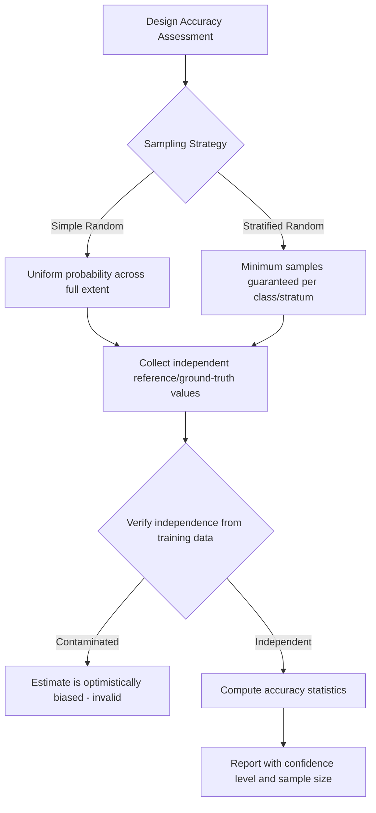

## Positional and Attribute Accuracy Assessment

### Overview

Positional and attribute accuracy assessment is the formal, standards-based practice of quantifying how closely a spatial dataset's coordinates and attribute values correspond to reality, extending the error taxonomy introduced in the previous topic into rigorous, reproducible measurement procedures. Where the prior topic identified *where* error originates, this topic covers *how* accuracy is actually measured, reported, and standardized — the statistical methods, reference-data requirements, and reporting conventions that let a data producer make a defensible, quantified accuracy claim and let a data consumer evaluate a dataset's fitness for a specific use.

### Positional Accuracy Assessment

#### Reference Data Requirements

**Key Points**

- Assessing positional accuracy requires an independent reference source of known, substantially higher accuracy than the dataset under test — commonly RTK-GPS survey, high-accuracy orthoimagery, or an authoritative survey-grade dataset — since a dataset cannot be validated against itself or against data of comparable or lower accuracy.
- Checkpoints (also called check points or control points) should be well-distributed across the dataset's extent and represent feature types that can be unambiguously and precisely identified in both the tested dataset and the reference source (e.g., a road intersection centerline, a building corner) — poorly identifiable checkpoints (a vague vegetation boundary) introduce identification error that confounds the positional accuracy measurement itself.
- A minimum checkpoint count (commonly 20, following NSSDA convention, though requirements vary by standard and jurisdiction) is generally recommended to produce a statistically meaningful accuracy statement rather than an estimate based on too few samples to be representative.

#### Standard Positional Accuracy Statistics

The most widely used statistical framework, reflected in the U.S. National Standard for Spatial Data Accuracy (NSSDA) and broadly consistent with international practice, computes Root Mean Square Error (RMSE) separately for horizontal and vertical accuracy, then converts to a stated accuracy at a defined confidence level.

**Horizontal RMSE**:

$$\text{RMSE}_x = \sqrt{\frac{1}{n}\sum_{i=1}^{n}(x_{i,\text{data}} - x_{i,\text{ref}})^2}$$


$$\text{RMSE}_r = \sqrt{\text{RMSE}_x^2 + \text{RMSE}_y^2}$$

**Vertical RMSE** (for elevation datasets):

$$\text{RMSE}_z = \sqrt{\frac{1}{n}\sum_{i=1}^{n}(z_{i,\text{data}} - z_{i,\text{ref}})^2}$$

Converting RMSE to a stated accuracy at the 95% confidence level, assuming approximately normally distributed, circular error (a common but not universal assumption):

$$\text{Accuracy}_{r,95\%} \approx 1.7308 \times \text{RMSE}_r$$

```python
import numpy as np

# Coordinate pairs: (dataset value, reference value) for horizontal checkpoints
data_x = np.array([501234.5, 501890.2, 502301.8])
ref_x  = np.array([501234.9, 501889.6, 502302.5])
data_y = np.array([4501120.3, 4501890.1, 4502340.7])
ref_y  = np.array([4501119.8, 4501890.9, 4502341.2])

rmse_x = np.sqrt(np.mean((data_x - ref_x) ** 2))
rmse_y = np.sqrt(np.mean((data_y - ref_y) ** 2))
rmse_r = np.sqrt(rmse_x**2 + rmse_y**2)
accuracy_95 = 1.7308 * rmse_r

print(f"RMSEr: {rmse_r:.3f} m, Horizontal Accuracy at 95% confidence: {accuracy_95:.3f} m")
```

**[Behavior may vary]** The 1.7308 conversion factor applies specifically under the NSSDA's assumption of a circular normal error distribution with equal standard deviations in x and y; datasets with substantially different x versus y error characteristics, or non-normal error distributions, require different statistical treatment, so this specific multiplier should not be applied unconditionally to every accuracy assessment context.

#### Common Accuracy Reporting Metrics

| Metric | Definition | Common Use |
| --- | --- | --- |
| RMSE | Root mean square error of checkpoint discrepancies | Foundational statistic underlying most accuracy standards |
| CE90/CE95 | Circular Error at 90%/95% confidence — radius within which that percentage of positions fall | Horizontal accuracy reporting, especially GPS/GNSS specs |
| LE90/LE95 | Linear Error at 90%/95% confidence | Vertical accuracy reporting for elevation data |
| NMAS (legacy) | National Map Accuracy Standard — pre-digital era U.S. standard based on allowable error at map scale | Historical/legacy cartographic products |
| ASPRS Positional Accuracy Standards | Modern standard explicitly tied to RMSE at defined ground sample distances, superseding some NMAS use cases for digital geospatial data | LiDAR, orthoimagery, and digital elevation model accuracy reporting |

### Attribute Accuracy Assessment

#### Categorical (Thematic/Classification) Accuracy

Building on the confusion matrix introduced in the prior topic, a complete accuracy assessment reports several complementary statistics rather than a single overall figure, because overall accuracy alone can mask class-specific performance problems (a classifier can achieve high overall accuracy while performing poorly on a rare but analytically important class).

$$\kappa = \frac{P_o - P_e}{1 - P_e}$$

where $P_o$ is the observed proportional agreement (overall accuracy) and $P_e$ is the proportion of agreement expected by chance alone, given the row and column marginal totals of the confusion matrix. The Kappa coefficient adjusts for chance agreement, which matters because a naive overall accuracy figure can appear misleadingly high on datasets dominated by one or two common classes.

```python
from sklearn.metrics import cohen_kappa_score, confusion_matrix
import numpy as np

y_true = ['forest', 'cropland', 'forest', 'water', 'cropland', 'forest', 'water']
y_pred = ['forest', 'forest', 'forest', 'water', 'cropland', 'cropland', 'water']

kappa = cohen_kappa_score(y_true, y_pred)
cm = confusion_matrix(y_true, y_pred, labels=['forest', 'cropland', 'water'])
print(f"Kappa coefficient: {kappa:.3f}")
print(cm)
```

**[Inference]** While Kappa remains widely reported in remote sensing and land-cover accuracy literature, some methodological critiques argue it has statistical limitations (sensitivity to class prevalence, non-intuitive interpretation) relative to simpler metrics like overall, producer's, and user's accuracy reported directly; consequently, many accuracy assessment protocols now report Kappa alongside — rather than instead of — the underlying confusion matrix statistics.

#### Continuous Attribute Accuracy

For continuous (interval/ratio) attributes — measured pollutant concentration, interpolated temperature, modeled crop yield — accuracy assessment follows standard statistical validation practice against independent reference measurements:

$$\text{MAE} = \frac{1}{n}\sum_{i=1}^{n}|y_{i,\text{predicted}} - y_{i,\text{observed}}|$$


$$\text{RMSE} = \sqrt{\frac{1}{n}\sum_{i=1}^{n}(y_{i,\text{predicted}} - y_{i,\text{observed}})^2}$$

RMSE penalizes large individual errors more heavily than MAE due to the squaring term, making the choice between the two metrics itself a judgment about whether occasional large errors matter disproportionately more than consistent small errors for the given application.

### Sampling Design for Accuracy Assessment

**Key Points**

- **Simple random sampling** of checkpoints/validation points is statistically straightforward but can under-sample rare classes or geographically clustered features of interest.
- **Stratified random sampling** — allocating a minimum number of samples per category/stratum regardless of that stratum's areal proportion — is standard practice in classification accuracy assessment specifically to ensure rare-but-important classes (e.g., a small but ecologically significant wetland class) receive enough validation samples for a statistically meaningful accuracy estimate.
- **Spatial autocorrelation considerations**: checkpoints that are spatially clustered rather than well-distributed can produce an accuracy estimate that is not representative of the dataset's accuracy in under-sampled regions, particularly relevant for datasets with spatially varying accuracy (e.g., LiDAR accuracy that degrades in dense forest canopy relative to open terrain).
- **Independence from training/production data**: for accuracy assessment of a classified or modeled product, validation samples must be independent of any data used to produce the classification/model in the first place, or the resulting accuracy estimate will be optimistically biased (a well-documented methodological error sometimes called "testing on the training set").



### Diagram: Positional Accuracy Assessment Workflow (svg_diagram)

<svg xmlns="http://www.w3.org/2000/svg" viewBox="0 0 760 300">
<text x="380" y="24" text-anchor="middle" font-size="16" font-weight="bold" fill="#1a1a1a">Positional Accuracy Assessment Workflow (svg_diagram)</text>
<rect x="30" y="60" width="150" height="60" fill="#dbe9f7" stroke="#2b6cb0" stroke-width="1.5" rx="6" />
<text x="105" y="85" text-anchor="middle" font-size="12" font-weight="bold" fill="#1a1a1a">Select Checkpoints</text>
<text x="105" y="103" text-anchor="middle" font-size="10" fill="#333">Well-distributed, identifiable</text>
<line x1="180" y1="90" x2="230" y2="90" stroke="#555" stroke-width="1.5" marker-end="url(#pa)" />
<rect x="235" y="60" width="150" height="60" fill="#e6f4ea" stroke="#2f855a" stroke-width="1.5" rx="6" />
<text x="310" y="85" text-anchor="middle" font-size="12" font-weight="bold" fill="#1a1a1a">Measure Reference</text>
<text x="310" y="103" text-anchor="middle" font-size="10" fill="#333">Independent higher-accuracy source</text>
<line x1="385" y1="90" x2="435" y2="90" stroke="#555" stroke-width="1.5" marker-end="url(#pa)" />
<rect x="440" y="60" width="150" height="60" fill="#fdf1e0" stroke="#c05621" stroke-width="1.5" rx="6" />
<text x="515" y="85" text-anchor="middle" font-size="12" font-weight="bold" fill="#1a1a1a">Compute Discrepancies</text>
<text x="515" y="103" text-anchor="middle" font-size="10" fill="#333">Dataset vs. reference coordinates</text>
<line x1="515" y1="120" x2="515" y2="150" stroke="#555" stroke-width="1.5" marker-end="url(#pa)" />
<rect x="360" y="155" width="310" height="60" fill="#f4e6f7" stroke="#805ad3" stroke-width="1.5" rx="6" />
<text x="515" y="180" text-anchor="middle" font-size="12" font-weight="bold" fill="#1a1a1a">Calculate RMSE and Confidence-Level Accuracy</text>
<text x="515" y="198" text-anchor="middle" font-size="10" fill="#333">Apply standard conversion (e.g., NSSDA)</text>
<line x1="515" y1="215" x2="515" y2="245" stroke="#555" stroke-width="1.5" marker-end="url(#pa)" />
<rect x="380" y="250" width="270" height="45" fill="#dbe9f7" stroke="#2b6cb0" stroke-width="1.5" rx="6" />
<text x="515" y="278" text-anchor="middle" font-size="12" font-weight="bold" fill="#1a1a1a">Document Statement in Metadata</text>
</svg>

### Practical Example: LiDAR-Derived DEM Vertical Accuracy Assessment

**Example**

A representative workflow following ASPRS-style vertical accuracy assessment conventions for a LiDAR-derived Digital Elevation Model:

1. Establish an independent set of ground-survey checkpoints (RTK-GPS or total-station-surveyed) in open, non-vegetated terrain — vegetated terrain is typically assessed separately, since LiDAR vertical accuracy is well documented to degrade under dense canopy relative to bare-earth conditions.
2. Extract the DEM's interpolated elevation value at each checkpoint's horizontal coordinate.
3. Compute the vertical discrepancy (DEM elevation minus surveyed elevation) at each checkpoint.
4. Calculate vertical RMSE across all checkpoints, and separately compute a 95th-percentile absolute error, since LiDAR accuracy standards commonly report both a fundamental vertical accuracy (RMSE-based, assuming normally distributed error) and a supplemental/consolidated vertical accuracy (percentile-based, more robust to distributional assumptions).
5. Report both statistics in the dataset's metadata, along with the land-cover/vegetation-density category each checkpoint fell in, so a downstream user working specifically in wooded terrain can identify the appropriate accuracy figure for their use case rather than relying on a bare-earth-only accuracy statement.

**Output**

A metadata-documented, land-cover-stratified vertical accuracy statement (e.g., "RMSEz = 0.08m in open terrain; RMSEz = 0.21m in forested terrain") giving downstream users a realistic, context-specific basis for judging the DEM's fitness for a given application, such as floodplain delineation versus canopy height modeling.

### Related Topics

- Metadata standards for documenting accuracy statements (ISO 19115, FGDC Content Standard)
- ASPRS Positional Accuracy Standards for digital geospatial data in depth
- Remote sensing classification accuracy assessment design and stratified sampling
- LiDAR data quality specifications and vertical accuracy by land-cover class
- Uncertainty propagation from input accuracy through geoprocessing workflows
- Ground control point (GCP) selection and survey methodology for orthoimagery accuracy assessment
- Statistical hypothesis testing approaches to comparing accuracy between competing datasets
- Fitness-for-use documentation and its role in data licensing/distribution agreements