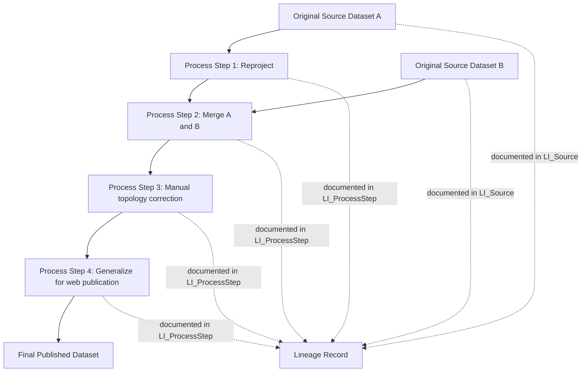

## Data Lineage and Provenance

### Overview

Data lineage and provenance document the full history of a spatial dataset — its original sources, every transformation applied, who performed each step, and when — providing the traceability needed to understand why a dataset looks the way it does and to assess whether it remains fit for a new purpose. Where accuracy assessment (the previous topic) answers "how correct is this data," lineage answers "how did this data come to be this way," and the two are deeply complementary: a dataset's true accuracy is often impossible to interpret correctly without knowing its lineage, since the same numerical accuracy figure means something different depending on whether it derives from direct field survey or from several chained rounds of reprojection, generalization, and merging with other sources.

### What Constitutes Lineage Information

**Key Points**

- **Source data identification**: the original dataset(s) a derived product was built from, including publisher, version/vintage, and acquisition date — essential because the accuracy and currency of a derived product can never exceed that of its least-accurate, least-current input.
- **Process steps**: every transformation applied — reprojection, generalization, edge-matching, merging with other datasets, manual editing, classification, interpolation — recorded in the order performed, since the same set of operations applied in a different order can produce meaningfully different results.
- **Processing parameters**: not just *that* a buffer or reclassification was applied, but the specific parameter values used (buffer distance, reclassification breakpoints, resampling method), since these materially affect the output and are often the detail a downstream user actually needs to evaluate fitness for their purpose.
- **Responsible parties and dates**: who performed each processing step and when, supporting both accountability and the ability to contact the original data steward with questions.
- **Quality control steps taken**: any validation, accuracy assessment, or peer review conducted during production, and its results — lineage and the accuracy-assessment topic covered previously are frequently documented together in the same metadata record.

### Lineage Documentation Standards

#### ISO 19115 Lineage Element

ISO 19115 (Geographic Information — Metadata), the dominant international metadata standard, includes a dedicated `LI_Lineage` class within its data quality reporting structure, itself composed of `LI_ProcessStep` elements (each documenting a single transformation event) and `LI_Source` elements (each documenting a contributing input dataset).

```xml
<!-- Simplified ISO 19115-style lineage fragment -->
<gmd:lineage>
  <gmd:LI_Lineage>
    <gmd:statement>
      <gco:CharacterString>Derived from 2022 county parcel data, reprojected,
      merged with 2023 zoning updates, and manually reviewed for topology errors.</gco:CharacterString>
    </gmd:statement>
    <gmd:processStep>
      <gmd:LI_ProcessStep>
        <gmd:description>
          <gco:CharacterString>Reprojected from EPSG:4326 to EPSG:32633</gco:CharacterString>
        </gmd:description>
        <gmd:dateTime>
          <gco:DateTime>2023-04-12T00:00:00</gco:DateTime>
        </gmd:dateTime>
      </gmd:LI_ProcessStep>
    </gmd:processStep>
    <gmd:source>
      <gmd:LI_Source>
        <gmd:description>
          <gco:CharacterString>County Assessor Parcel Data, 2022 vintage</gco:CharacterString>
        </gmd:description>
      </gmd:LI_Source>
    </gmd:source>
  </gmd:LI_Lineage>
</gmd:lineage>
```

#### FGDC Content Standard for Digital Geospatial Metadata (CSDGM)

The legacy U.S. federal metadata standard (predating widespread ISO 19115 adoption, though still encountered in many existing datasets and some agency workflows) includes an analogous `Lineage` section with `Source_Information` and `Process_Step` elements serving essentially the same documentary function, differing mainly in schema structure and terminology rather than underlying intent.



### Automated Lineage Capture in Practice

**Key Points**

- Manually written lineage narratives are valuable but incomplete on their own, since they depend on a human remembering and accurately describing every processing step after the fact; increasingly, GIS workflows aim to capture lineage automatically as a byproduct of the processing pipeline itself.
- **Model/script-derived lineage**: workflow automation tools (covered in the geoprocessing chapter) inherently produce a natural lineage record, since a saved ModelBuilder model, QGIS Graphical Modeler model, or Python script *is itself* an exact, reproducible statement of every processing step and parameter applied — arguably a more reliable lineage record than a manually written prose description, because it cannot drift out of sync with what was actually done.
- **PROV-based data provenance frameworks**: the W3C PROV data model, though originating outside the geospatial domain specifically, is increasingly adopted or referenced in geospatial data infrastructure projects needing structured, machine-readable provenance graphs (entities, activities, and agents) rather than free-text lineage statements.
- **Version control integration**: storing processing scripts and their parameter files in Git alongside a commit history provides a lineage record with exact reproducibility (the specific script version, at a specific commit, with recorded input file hashes) that free-text metadata narratives cannot easily match.

```python
# Example: programmatically generating a structured lineage record as a byproduct
# of a PyQGIS processing pipeline, rather than writing it manually after the fact
import json
from datetime import datetime

lineage_record = {
    "sources": [
        {"name": "County Parcel Data", "vintage": "2022", "publisher": "County Assessor"},
        {"name": "Zoning Updates", "vintage": "2023", "publisher": "Planning Department"}
    ],
    "process_steps": []
}

def log_step(description, parameters):
    lineage_record["process_steps"].append({
        "description": description,
        "parameters": parameters,
        "timestamp": datetime.utcnow().isoformat()
    })

log_step("Reprojected input layer", {"target_crs": "EPSG:32633"})
log_step("Merged with zoning updates", {"join_field": "parcel_id"})

with open("lineage_record.json", "w") as f:
    json.dump(lineage_record, f, indent=2)
```

### Diagram: Provenance Graph Concept (svg_diagram)

<svg xmlns="http://www.w3.org/2000/svg" viewBox="0 0 760 300">
<text x="380" y="24" text-anchor="middle" font-size="16" font-weight="bold" fill="#1a1a1a">Provenance Graph: Entities, Activities, Agents (svg_diagram)</text>
<rect x="40" y="60" width="140" height="50" fill="#dbe9f7" stroke="#2b6cb0" stroke-width="1.5" rx="6" />
<text x="110" y="90" text-anchor="middle" font-size="12" font-weight="bold" fill="#1a1a1a">Entity: Source Data</text>
<line x1="180" y1="85" x2="230" y2="85" stroke="#555" stroke-width="1.5" marker-end="url(#pv)" />
<rect x="235" y="60" width="140" height="50" fill="#fdf1e0" stroke="#c05621" stroke-width="1.5" rx="6" />
<text x="305" y="90" text-anchor="middle" font-size="12" font-weight="bold" fill="#1a1a1a">Activity: Reproject</text>
<line x1="305" y1="30" x2="305" y2="55" stroke="#555" stroke-width="1.5" marker-end="url(#pv)" />
<rect x="250" y="0" width="110" height="35" fill="#e6f4ea" stroke="#2f855a" stroke-width="1.5" rx="6" />
<text x="305" y="22" text-anchor="middle" font-size="11" font-weight="bold" fill="#1a1a1a">Agent: Analyst</text>
<line x1="375" y1="85" x2="425" y2="85" stroke="#555" stroke-width="1.5" marker-end="url(#pv)" />
<rect x="430" y="60" width="140" height="50" fill="#dbe9f7" stroke="#2b6cb0" stroke-width="1.5" rx="6" />
<text x="500" y="90" text-anchor="middle" font-size="12" font-weight="bold" fill="#1a1a1a">Entity: Reprojected Data</text>
<line x1="500" y1="110" x2="500" y2="145" stroke="#555" stroke-width="1.5" marker-end="url(#pv)" />
<rect x="430" y="150" width="140" height="50" fill="#fdf1e0" stroke="#c05621" stroke-width="1.5" rx="6" />
<text x="500" y="180" text-anchor="middle" font-size="12" font-weight="bold" fill="#1a1a1a">Activity: Merge</text>
<line x1="500" y1="200" x2="500" y2="235" stroke="#555" stroke-width="1.5" marker-end="url(#pv)" />
<rect x="430" y="240" width="140" height="50" fill="#dbe9f7" stroke="#2b6cb0" stroke-width="1.5" rx="6" />
<text x="500" y="270" text-anchor="middle" font-size="12" font-weight="bold" fill="#1a1a1a">Entity: Final Dataset</text>
</svg>

### Why Lineage Matters for Fitness-for-Use Decisions

**Key Points**

- **Compounding uncertainty transparency**: as covered in the error propagation discussion of the prior topic, uncertainty compounds through processing chains; lineage is the mechanism by which a downstream user can actually trace *which* processing steps contributed uncertainty, rather than facing an opaque final accuracy figure with no explanation of its origin.
- **Legal and regulatory accountability**: in domains like cadastral/land records, environmental compliance, or emergency management, lineage documentation can be directly relevant to establishing the basis for a decision or defending a dataset's use in a dispute.
- **Reproducibility for scientific and analytical work**: published spatial analyses increasingly face expectations of reproducibility; a well-documented processing lineage (ideally as executable code rather than prose alone) allows independent verification or extension of prior work.
- **Change impact assessment**: when an upstream source dataset is updated or found to contain an error, lineage documentation allows an organization to identify every downstream derived product that depends on that source and needs re-evaluation or reprocessing.

### Comparative Table: Lineage Documentation Approaches

| Approach | Reproducibility | Machine-Readability | Effort to Maintain |
| --- | --- | --- | --- |
| Free-text metadata narrative | Low (depends on prose completeness) | Low | Moderate (manual writing) |
| ISO 19115 / FGDC structured lineage | Moderate (structured but still often manually authored) | Moderate | Moderate–High |
| Saved geoprocessing model (ModelBuilder/Graphical Modeler) | High (re-runnable) | High (parseable model format) | Low (byproduct of normal workflow) |
| Version-controlled scripts (Git + parameter files) | Very High (exact reproducibility with input hashes) | High | Low–Moderate |
| PROV-based structured provenance graph | High | Very High | Moderate (requires PROV tooling adoption) |

### Practical Example: Tracing a Data Quality Issue Through Lineage

**Example**

A representative scenario demonstrating lineage's practical value:

1. A published parcel dataset is found to have systematically shifted boundaries in one county subregion, discovered during a routine accuracy spot-check.
2. Reviewing the dataset's lineage record reveals the final published product was built by merging three source county extracts, each independently reprojected before merging.
3. The lineage's per-source processing step details show that one of the three source extracts was reprojected using a different (and, on investigation, less accurate) datum transformation method than the other two.
4. Because the lineage documented exactly which source and which processing step introduced the discrepancy, the organization can correct that single source's reprojection and re-run only the affected portion of the merge — rather than needing to reprocess or distrust the entire dataset.
5. The corrected lineage record is updated to reflect the fix, including the date and the specific transformation method correction, preserving a complete audit trail for anyone who later needs to understand why an older archived version of the dataset differs from the current one.

**Output**

A targeted, efficient correction enabled directly by lineage granularity, versus the alternative of having to treat the entire multi-source dataset as suspect and reprocess it from scratch without knowing which specific input or step was responsible.

### Related Topics

- ISO 19115/19115-2 metadata standard structure in full (covered further in dedicated metadata standards topics)
- W3C PROV data model and its application to geospatial data infrastructure
- Version control (Git) practices for geospatial processing scripts and models
- FAIR data principles (Findable, Accessible, Interoperable, Reusable) as applied to geospatial datasets
- Master data management and single-source-of-truth strategies for enterprise GIS (connects to the enterprise architecture topic)
- Reproducible research practices in spatial analysis and remote sensing science
- Data governance frameworks for tracking authoritative source datasets across an organization
- Automated metadata generation tools integrated into geoprocessing pipelines