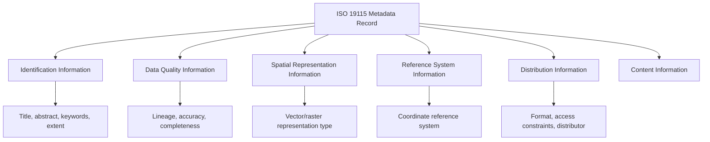

## Metadata Standards and Documentation


### Overview

Metadata standards and documentation provide the structured, machine-readable framework that ties together everything covered in this chapter — accuracy statements, lineage records, and additional descriptive information — into a discoverable, interoperable, and consistently formatted record that accompanies a spatial dataset throughout its lifecycle. Without standardized metadata, even a high-quality, well-documented dataset becomes practically unusable at scale: it cannot be discovered through a catalog search, its quality claims cannot be compared against other datasets using consistent terminology, and it cannot be reliably ingested into automated data infrastructure. This topic surveys the major metadata standards governing geospatial data, their structural components, and the practical tooling used to create and validate metadata records.

### Why Standardized Metadata Matters

**Key Points**

- **Discoverability**: standardized metadata fields (title, abstract, keywords, spatial/temporal extent) are what data catalogs, clearinghouses, and search portals index, making a dataset findable by users who don't already know it exists.
- **Interoperability**: a consistent, agreed-upon schema allows metadata to be exchanged, harvested, and aggregated across organizations and software platforms without custom, one-off translation for every data source.
- **Legal and organizational compliance**: many government agencies and funded research projects are contractually or statutorily required to produce metadata conforming to a specific standard before data can be published or transferred.
- **Institutional memory preservation**: metadata often outlives the specific individuals who created a dataset, making it the primary mechanism by which an organization retains knowledge about its own data holdings over staff turnover and time.

### Major Metadata Standards

#### ISO 19115 / ISO 19115-2 (Geographic Information — Metadata)

The dominant international standard, developed by ISO Technical Committee 211, structuring metadata into a comprehensive object model covering identification information, data quality (including the lineage elements covered in the previous topic), spatial representation, reference system information, distribution information, and more. ISO 19115-2 extends the base standard specifically for imagery and gridded data, adding elements relevant to sensor/platform characteristics.



Encoded in practice as XML following the ISO 19139 encoding schema, producing verbose but fully structured, machine-parseable records:

```xml
<gmd:MD_Metadata xmlns:gmd="http://www.isotc211.org/2005/gmd">
  <gmd:fileIdentifier>
    <gco:CharacterString>urn:uuid:a1b2c3d4-example</gco:CharacterString>
  </gmd:fileIdentifier>
  <gmd:identificationInfo>
    <gmd:MD_DataIdentification>
      <gmd:citation>
        <gmd:CI_Citation>
          <gmd:title>
            <gco:CharacterString>2024 County Land Cover Classification</gco:CharacterString>
          </gmd:title>
        </gmd:CI_Citation>
      </gmd:citation>
      <gmd:abstract>
        <gco:CharacterString>30m resolution land cover classification derived from
        Sentinel-2 imagery, classified into 8 categories.</gco:CharacterString>
      </gmd:abstract>
    </gmd:MD_DataIdentification>
  </gmd:identificationInfo>
</gmd:MD_Metadata>
```

#### FGDC Content Standard for Digital Geospatial Metadata (CSDGM)

The legacy U.S. federal standard, predating ISO 19115's widespread adoption and mandated historically for U.S. federal geospatial data. Though the U.S. government has formally transitioned toward ISO 19115-based metadata for new federal geospatial data, CSDGM-formatted metadata remains extremely common in existing datasets and some state/local agency workflows, and cross-walk/translation tools between CSDGM and ISO 19115 remain practically important because of this legacy prevalence.

#### Dublin Core

A much simpler, general-purpose (non-geospatial-specific) metadata standard with only 15 core elements (title, creator, subject, description, publisher, date, type, format, identifier, source, language, relation, coverage, rights, contributor). Frequently used as a lightweight alternative or as a simplified "discovery-level" metadata layer sitting alongside a fuller ISO 19115 record, particularly in general-purpose institutional repositories that hold geospatial data alongside non-geospatial content.

#### OGC Catalog Service for the Web (CSW) and Related Discovery Standards

While not a metadata content standard itself, CSW defines how metadata records (typically ISO 19115/19139-encoded) are queried and harvested across distributed catalog services, making it the interoperability layer that lets a data portal search across multiple organizations' metadata holdings using a consistent protocol.

### Comparative Table: Major Metadata Standards

| Standard | Scope | Encoding | Status |
| --- | --- | --- | --- |
| ISO 19115/19115-2 | Comprehensive geographic metadata | XML (ISO 19139), increasingly JSON via ISO 19115-3 | Current international standard |
| FGDC CSDGM | U.S. federal geospatial metadata | Formal FGDC text format, later XML | Legacy; still widely present in existing data |
| Dublin Core | General-purpose, non-geospatial-specific | XML, RDF, HTML meta tags | Widely used for lightweight/discovery-level records |
| STAC (SpatioTemporal Asset Catalog) | Cloud-native geospatial asset discovery | JSON | Rapidly growing adoption for satellite/raster catalogs |
| DCAT (Data Catalog Vocabulary) | General open-data portal metadata | RDF/JSON-LD | Common in open government data portals |

### STAC: A Modern, Cloud-Native Metadata Approach

**Key Points**

- The **SpatioTemporal Asset Catalog (STAC)** specification emerged specifically to address the needs of cloud-native, API-driven discovery of large satellite imagery and raster archives, where ISO 19115's XML verbosity and document-oriented model is poorly suited to programmatic, high-volume querying.
- STAC represents each dataset as a lightweight JSON "Item" with a `properties` object (datetime, cloud cover, sensor metadata) and an `assets` object pointing to the actual data files (often Cloud Optimized GeoTIFFs), organized into `Collections` and queryable via the STAC API specification (a RESTful, OpenAPI-described search interface).
- Major public satellite imagery archives (Microsoft Planetary Computer, AWS Open Data, Element84's Earth Search) expose their holdings via STAC, making it a de facto standard specifically for discovering and filtering large remote sensing archives by spatial extent, date range, and quality attributes like cloud cover — a use case ISO 19115 was not originally designed to serve efficiently at this scale.

```json
{
  "type": "Feature",
  "stac_version": "1.0.0",
  "id": "S2A_MSIL2A_20240615T103031",
  "properties": {
    "datetime": "2024-06-15T10:30:31Z",
    "eo:cloud_cover": 12.4
  },
  "geometry": {"type": "Polygon", "coordinates": [[[10.0, 45.0], [11.0, 45.0], [11.0, 46.0], [10.0, 46.0], [10.0, 45.0]]]},
  "assets": {
    "visual": {"href": "https://example.com/S2A_visual.tif", "type": "image/tiff; application=geotiff; profile=cloud-optimized"}
  },
  "collection": "sentinel-2-l2a"
}
```

```python
# Querying a STAC API for imagery matching spatial/temporal/quality criteria
from pystac_client import Client

catalog = Client.open("https://earth-search.aws.element84.com/v1")
search = catalog.search(
    collections=["sentinel-2-l2a"],
    bbox=[10.0, 45.0, 11.0, 46.0],
    datetime="2024-06-01/2024-06-30",
    query={"eo:cloud_cover": {"lt": 20}}
)
items = list(search.items())
print(f"Found {len(items)} matching scenes")
```

**[Inference]** Because STAC is JSON-based and designed around a searchable API rather than a document-exchange model, it is generally better suited than traditional ISO 19115 XML records for high-volume, programmatic discovery workflows (e.g., a script querying millions of satellite scenes), while ISO 19115 remains more established for comprehensive, human-readable, standards-mandated documentation of individual authoritative datasets — the two standards are increasingly seen as complementary for different use cases rather than directly competing.

### Metadata Authoring and Validation Tools

**Key Points**

- **Desktop GIS integration**: both QGIS (built-in Metadata tab in layer properties, exportable to ISO 19115/19139) and ArcGIS Pro (built-in Metadata editor, supporting multiple standard styles including ISO 19115 and the legacy FGDC style) provide GUI-based metadata authoring integrated directly into the data-editing environment.
- **pycsw**: an open-source OGC CSW server implementation commonly used to publish and serve ISO 19139-encoded metadata records for catalog search/harvest.
- **GeoNetwork**: a widely deployed open-source metadata catalog application supporting authoring, editing, and CSW-based publishing of ISO 19115/19139 and other metadata standards, commonly used by government spatial data infrastructure (SDI) initiatives.
- **Schema validation**: XML Schema Definition (XSD) validation against the ISO 19139 schema (or STAC JSON Schema validation for STAC catalogs) is standard practice before publishing a metadata record, catching structural errors that would otherwise cause harvesting or catalog ingestion failures downstream.

```python
# Simplified STAC Item validation using pystac's built-in schema validation
import pystac

item = pystac.Item.from_file("item.json")
try:
    item.validate()
    print("STAC item is valid")
except pystac.errors.STACValidationError as e:
    print(f"Validation failed: {e}")
```

### Diagram: Metadata Standards Landscape by Use Case (svg_diagram)

<svg xmlns="http://www.w3.org/2000/svg" viewBox="0 0 760 320">
<text x="380" y="24" text-anchor="middle" font-size="16" font-weight="bold" fill="#1a1a1a">Metadata Standards by Primary Use Case (svg_diagram)</text>
<rect x="40" y="60" width="200" height="90" fill="#dbe9f7" stroke="#2b6cb0" stroke-width="1.5" rx="6" />
<text x="140" y="85" text-anchor="middle" font-size="13" font-weight="bold" fill="#1a1a1a">ISO 19115 / CSDGM</text>
<text x="140" y="105" text-anchor="middle" font-size="11" fill="#333">Comprehensive, authoritative</text>
<text x="140" y="120" text-anchor="middle" font-size="11" fill="#333">documentation of individual</text>
<text x="140" y="135" text-anchor="middle" font-size="11" fill="#333">government/institutional datasets</text>
<rect x="280" y="60" width="200" height="90" fill="#e6f4ea" stroke="#2f855a" stroke-width="1.5" rx="6" />
<text x="380" y="85" text-anchor="middle" font-size="13" font-weight="bold" fill="#1a1a1a">STAC</text>
<text x="380" y="105" text-anchor="middle" font-size="11" fill="#333">High-volume, programmatic</text>
<text x="380" y="120" text-anchor="middle" font-size="11" fill="#333">discovery of cloud-native</text>
<text x="380" y="135" text-anchor="middle" font-size="11" fill="#333">raster/satellite archives</text>
<rect x="520" y="60" width="200" height="90" fill="#fdf1e0" stroke="#c05621" stroke-width="1.5" rx="6" />
<text x="620" y="85" text-anchor="middle" font-size="13" font-weight="bold" fill="#1a1a1a">Dublin Core / DCAT</text>
<text x="620" y="105" text-anchor="middle" font-size="11" fill="#333">Lightweight discovery-level</text>
<text x="620" y="120" text-anchor="middle" font-size="11" fill="#333">records, open data portals,</text>
<text x="620" y="135" text-anchor="middle" font-size="11" fill="#333">mixed geospatial/non-geospatial</text>
<line x1="240" y1="105" x2="280" y2="105" stroke="#888" stroke-width="1.5" stroke-dasharray="4,3" />
<line x1="480" y1="105" x2="520" y2="105" stroke="#888" stroke-width="1.5" stroke-dasharray="4,3" />
<text x="380" y="200" text-anchor="middle" font-size="11" fill="#555">Complementary rather than strictly competing standards</text>
</svg>

### Practical Example: Publishing a Dataset to a Spatial Data Infrastructure

**Example**

A representative end-to-end metadata workflow for publishing a new dataset to an organizational or national Spatial Data Infrastructure (SDI):

1. Author the dataset's descriptive metadata (title, abstract, keywords, spatial/temporal extent) directly within the desktop GIS tool used to produce it (QGIS or ArcGIS Pro's built-in metadata editor).
2. Populate the lineage section referencing source datasets and processing steps, ideally drawing directly from an automated lineage record generated as a byproduct of the processing pipeline (as covered in the prior topic).
3. Include the accuracy statement derived from a formal assessment (as covered two topics prior), documented with the appropriate confidence-level statistic and reference-checkpoint methodology.
4. Export the completed metadata to ISO 19139 XML format.
5. Validate the exported XML against the ISO 19139 schema to catch structural errors before publication.
6. Upload the dataset and its validated metadata record to a GeoNetwork catalog instance, which exposes it via CSW for harvesting by national or regional data portals.
7. For raster/imagery holdings intended for high-volume programmatic access, additionally generate and publish a corresponding STAC catalog entry, since the two metadata approaches serve complementary discovery use cases rather than substituting for one another.

**Output**

A dataset that is simultaneously: (a) comprehensively documented for human reviewers and standards compliance via ISO 19139, and (b) efficiently discoverable by automated/programmatic workflows via STAC where applicable — maximizing both institutional accountability and practical usability.

### Related Topics

- ISO 19157 (Geographic Information — Data Quality) as a companion standard formalizing quality reporting elements
- Spatial Data Infrastructure (SDI) design and national/regional SDI initiatives (INSPIRE in the EU, U.S. National Spatial Data Infrastructure)
- STAC API specification and the broader cloud-native geospatial ecosystem (COG, GeoParquet, Zarr)
- GeoNetwork and pycsw deployment and configuration for organizational metadata catalogs
- Automated metadata extraction and generation from file headers and processing pipelines
- Open data portal metadata practices (DCAT-US, data.gov schema requirements)
- Metadata quality assessment: completeness scoring and mandatory-field compliance checking
- Linked data and semantic web approaches to geospatial metadata (GeoDCAT-AP, schema.org geospatial vocabulary)