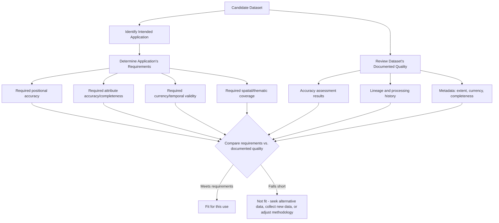

## Fitness-for-Use Evaluation

### Overview

Fitness-for-use evaluation is the culminating practice this chapter has been building toward: given a dataset's documented error characteristics, accuracy assessment results, lineage, and metadata, how does a practitioner actually decide whether that dataset is appropriate for a specific intended application? This is deliberately framed as a relative, application-dependent judgment rather than an absolute quality score — a dataset can be entirely fit for one purpose (regional land-use planning) while being wholly unsuitable for another (cadastral boundary determination), without any change to the dataset itself. Fitness-for-use evaluation is the discipline of making that judgment systematically rather than by assumption or convenience.

### The Core Principle: Fitness Is Purpose-Relative, Not Absolute

**Key Points**

- No dataset has a single, context-free "quality level" — the same dataset can simultaneously be excellent for one use case and inadequate for another, depending entirely on what accuracy, currency, and completeness the intended application actually requires.
- A common and consequential practitioner error is assuming that data available in a convenient format, or from a familiar/trusted source, is automatically fit for the task at hand without an explicit fitness check against that task's specific requirements.
- Fitness-for-use evaluation must be performed for *each new intended use*, not once at the point of dataset creation — a dataset built and validated for one application may later be reused for a different one without anyone re-verifying its fitness for the new context, a well-documented pathway to consequential misuse of otherwise good data.



### Dimensions of Fitness-for-Use Assessment

Building directly on the error taxonomy from earlier in this chapter, fitness-for-use evaluation systematically checks each error dimension against the specific requirements of the intended application:

| Dimension | Key Question for Fitness-for-Use | Example Requirement |
| --- | --- | --- |
| Positional accuracy | Is the reported RMSE/accuracy statement adequate for this application's spatial precision needs? | Cadastral survey: sub-decimeter; regional planning: several meters may be acceptable |
| Attribute accuracy | Is classification/attribute accuracy sufficient, and are error rates acceptable for the specific classes that matter most to this use? | Wetland regulatory delineation may require far higher user's accuracy for the wetland class specifically than overall accuracy alone would suggest |
| Currency | Is the data recent enough to reflect current conditions relevant to the decision? | Emergency response: near-real-time; historical land-use trend analysis: multi-decade archival data is appropriate |
| Completeness | Does the dataset cover the full extent and full feature population the application requires? | A transportation routing application requires a complete road network; missing rural roads could produce badly wrong routes |
| Logical consistency | Are there topology errors or internal inconsistencies that would corrupt the specific analysis being performed? | Watershed delineation requires a hydrologically consistent, properly connected stream network |
| Lineage/processing appropriateness | Were the processing steps applied appropriate for this use, or did they introduce assumptions unsuitable for the new application? | A dataset heavily generalized for small-scale cartographic display is unsuitable for large-scale engineering design work |

### Formalized Fitness-for-Use Frameworks

**Key Points**

- **ISO 19157 (Geographic Information — Data Quality)** provides the formal international standard defining data quality measures (completeness, logical consistency, positional accuracy, thematic accuracy, temporal quality) in a structured way intended specifically to support fitness-for-use evaluation by data consumers, extending the data-quality lineage elements of ISO 19115 into a more detailed, standardized quality reporting model.
- **Usability/fitness reporting sections in metadata**: some metadata practices include an explicit "intended use" or "use constraints" statement authored by the data producer, offering upfront guidance on appropriate (and explicitly inappropriate) applications — reducing the burden on every downstream user to independently reconstruct this judgment from raw accuracy figures alone.
- **Formal decision matrices**: for organizations making recurring, similar data-selection decisions (e.g., a planning department repeatedly deciding which of several available basemap sources to use for different project types), a documented decision matrix mapping data source characteristics against common project requirement tiers standardizes and speeds up fitness judgments across staff and over time.

```python
# Simplified fitness-for-use scoring function comparing dataset characteristics
# against application-specific thresholds
def assess_fitness(dataset_metadata, application_requirements):
    results = {}
    results['positional'] = dataset_metadata['horizontal_accuracy_m'] <= application_requirements['max_horizontal_error_m']
    results['currency'] = dataset_metadata['data_age_years'] <= application_requirements['max_age_years']
    results['completeness'] = dataset_metadata['completeness_pct'] >= application_requirements['min_completeness_pct']
    results['overall_fit'] = all(results.values())
    return results

dataset_metadata = {
    'horizontal_accuracy_m': 2.5,
    'data_age_years': 3,
    'completeness_pct': 97.5
}

application_requirements = {
    'max_horizontal_error_m': 5.0,
    'max_age_years': 5,
    'min_completeness_pct': 95.0
}

fitness_result = assess_fitness(dataset_metadata, application_requirements)
print(fitness_result)
```

### Common Fitness-for-Use Failure Patterns

**Key Points**

- **Scale mismatch**: using a dataset generalized/simplified for small-scale (e.g., national overview) display in a large-scale (e.g., neighborhood-level engineering) application, where the generalization-induced positional shift discussed earlier becomes analytically significant rather than merely a cartographic simplification.
- **Silent temporal drift**: continuing to use a once-fit dataset well past the point where real-world change has outpaced its currency, particularly dangerous when no explicit re-evaluation trigger (a scheduled review date, a change-detection alert) exists to prompt reconsideration.
- **Ignoring class-specific accuracy**: relying on a classification product's overall accuracy figure when the application specifically depends on one rare class (e.g., a specific at-risk habitat type) whose class-specific accuracy may be considerably worse than the headline overall figure, echoing the producer's/user's accuracy distinction covered in the accuracy assessment topic.
- **Provenance-blind reuse**: repurposing a dataset for a new application without reviewing its lineage, missing that an intermediate processing step (e.g., aggressive spatial smoothing) makes it structurally unsuitable for the new, more spatially precise use case regardless of its stated headline accuracy figure.

### Diagram: Fitness-for-Use as Purpose-Relative Assessment (svg_diagram)

<svg xmlns="http://www.w3.org/2000/svg" viewBox="0 0 760 300">
<text x="380" y="24" text-anchor="middle" font-size="16" font-weight="bold" fill="#1a1a1a">Same Dataset, Different Fitness Outcomes (svg_diagram)</text>
<rect x="310" y="50" width="140" height="50" fill="#f4e6f7" stroke="#805ad3" stroke-width="1.5" rx="6" />
<text x="380" y="80" text-anchor="middle" font-size="12" font-weight="bold" fill="#1a1a1a">Dataset (fixed quality)</text>
<line x1="340" y1="100" x2="200" y2="150" stroke="#555" stroke-width="1.5" />
<line x1="420" y1="100" x2="560" y2="150" stroke="#555" stroke-width="1.5" />
<rect x="100" y="155" width="200" height="80" fill="#e6f4ea" stroke="#2f855a" stroke-width="1.5" rx="6" />
<text x="200" y="180" text-anchor="middle" font-size="12" font-weight="bold" fill="#1a1a1a">Application A:</text>
<text x="200" y="198" text-anchor="middle" font-size="11" fill="#333">Regional land-use planning</text>
<text x="200" y="216" text-anchor="middle" font-size="12" font-weight="bold" fill="#2f855a">Fit for use</text>
<rect x="460" y="155" width="200" height="80" fill="#fdf1e0" stroke="#c05621" stroke-width="1.5" rx="6" />
<text x="560" y="180" text-anchor="middle" font-size="12" font-weight="bold" fill="#1a1a1a">Application B:</text>
<text x="560" y="198" text-anchor="middle" font-size="11" fill="#333">Cadastral boundary survey</text>
<text x="560" y="216" text-anchor="middle" font-size="12" font-weight="bold" fill="#c05621">Not fit for use</text>

<text x="380" y="270" text-anchor="middle" font-size="12" fill="#555">Identical dataset, identical accuracy figures - fitness differs by application requirement</text>

</svg>

### Practical Example: Basemap Selection for a Municipal Infrastructure Project

**Example**

A representative fitness-for-use decision process for selecting among available basemap options for a stormwater infrastructure design project:

1. **Define application requirements**: the design project requires horizontal accuracy sufficient to place new stormwater inlet locations relative to existing pavement and property boundaries — established at 0.5m or better based on the design tolerances the engineering team specifies.
2. **Review candidate datasets**: three available basemaps are considered — a nationally available small-scale roads dataset (documented accuracy: ~5m), a county-provided orthoimagery-derived basemap (documented accuracy: ~1m), and a recent project-specific survey-grade LiDAR/RTK-GPS dataset (documented accuracy: ~0.03m).
3. **Apply fitness criteria**: against the 0.5m requirement, the national roads dataset and the county orthoimagery-derived basemap both fail the positional accuracy threshold; only the survey-grade dataset meets the requirement.
4. **Check lineage and currency**: the survey-grade dataset's lineage confirms it was captured within the past six months specifically for this project corridor, satisfying both accuracy and currency requirements simultaneously.
5. **Document the decision**: the fitness evaluation, including the specific accuracy comparison against the stated design tolerance, is recorded as part of the project's data justification file, providing a defensible record of why the more expensive survey-grade data collection was warranted over using freely available existing basemaps.

**Output**

A documented, criterion-based basemap selection decision that can be defended to project reviewers or in the event of a later dispute, rather than an undocumented assumption that "the data we had on hand was good enough."

### Related Topics

- ISO 19157 data quality measures in depth, as the formal standard underlying fitness-for-use reporting
- Cost-benefit analysis of new data collection versus reuse of existing data for a given project
- Data quality decision matrices and organizational data governance policy design
- Scale-dependent generalization and its implications for cross-scale data reuse
- Legal liability and due-diligence considerations in spatial data selection for regulated decisions
- Change detection and triggers for re-evaluating previously fit-for-use datasets
- Class-specific accuracy reporting and its role in application-specific fitness judgments
- Integration of fitness-for-use checks into automated geoprocessing pipelines (pre-processing validation gates)