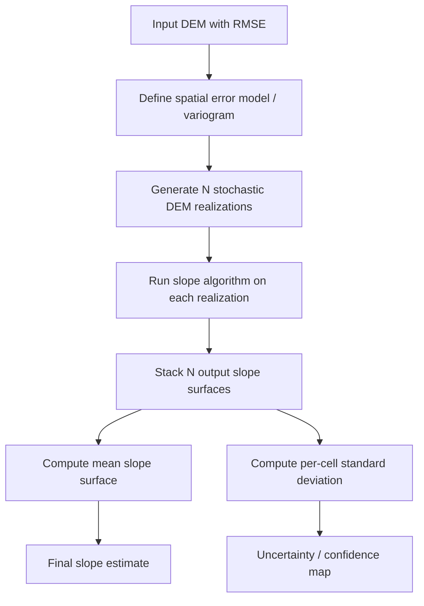

## Uncertainty Propagation in Spatial Analysis

### Overview

Uncertainty propagation refers to the quantification and tracking of how errors and uncertainties in input spatial data, parameters, and processing operations accumulate and transform through a chain of analytical operations to affect the reliability of final outputs. Every spatial dataset contains inherent uncertainty arising from measurement error, sampling limitations, classification ambiguity, temporal mismatch, or model simplification. When such data undergo GIS operations (overlay, buffering, interpolation, reclassification), these uncertainties do not remain static — they compound, cancel, or amplify depending on the mathematical structure of the operation.

### Sources of Spatial Uncertainty

**Positional Uncertainty**

Deviation between a recorded coordinate and the true ground location, arising from GPS error, digitizing imprecision, or map projection distortion. Commonly modeled using the Circular Map Accuracy Standard (CMAS) or bivariate normal error ellipses.

**Attribute Uncertainty**

Error in the non-spatial values attached to features — for example, misclassified land cover categories, imprecise sensor readings, or outdated census attributes.

**Temporal Uncertainty**

Mismatch between the time a phenomenon is represented and the time it is analyzed, relevant in change detection and dynamic modeling.

**Conceptual/Model Uncertainty**

Ambiguity in how a continuous phenomenon (e.g., a soil boundary or ecological zone) is discretized into a spatial data model that inherently forces crisp boundaries onto fuzzy realities.

**Measurement/Instrument Uncertainty**

Sensor noise, calibration drift, and resolution limits in remote sensing or field instruments.

### Conceptual Framework

Spatial uncertainty propagation is typically framed as a mapping problem:

$$Y = f(X_1, X_2, \ldots, X_n)$$

where $Y$ is the analytical output, $f$ is the spatial operation (e.g., slope calculation, buffer, overlay), and $X_i$ are input layers each carrying their own error distributions. The goal is to characterize the probability distribution or confidence interval of $Y$ given the known or estimated distributions of $X_i$.

### Mathematical Approaches

**1. Analytical (First-Order Taylor Series) Error Propagation**

For a function $Y = f(X_1, X_2, \ldots, X_n)$, the propagated variance is approximated using partial derivatives:

$$\sigma_Y^2 \approx \sum_{i=1}^{n} \left(\frac{\partial f}{\partial X_i}\right)^2 \sigma_{X_i}^2 + 2\sum_{i<j} \frac{\partial f}{\partial X_i}\frac{\partial f}{\partial X_j}\text{Cov}(X_i, X_j)$$

This method is computationally efficient and exact for linear operations, but becomes an approximation for nonlinear functions and can break down when input errors are large or highly correlated.

**Example**: For a simple additive overlay $Y = X_1 + X_2$ with independent errors:

$$\sigma_Y^2 = \sigma_{X_1}^2 + \sigma_{X_2}^2$$

For a ratio operation such as NDVI ($Y = (X_{NIR} - X_{Red})/(X_{NIR} + X_{Red})$), the derivatives become nonlinear, and the Taylor expansion only holds locally around the mean values.

**2. Monte Carlo Simulation**

The dominant practical approach for nonlinear, spatially autocorrelated, or non-Gaussian error fields. The general procedure:

1. Characterize the error model for each input (e.g., a spatially correlated random field with known variogram, or a per-pixel classification confusion matrix).
2. Generate $N$ realizations of each input by adding simulated error, respecting known spatial autocorrelation structure (commonly via sequential Gaussian simulation or conditional simulation).
3. Run the full analytical operation on each realization to produce $N$ output surfaces.
4. Aggregate the $N$ outputs statistically (mean, variance, percentiles) to build a probability distribution or confidence map for $Y$.

**[Inference]** Typical practice uses several hundred to a few thousand realizations depending on the stability of the output statistic and computational budget; the exact number needed is problem-dependent and not fixed by any single standard.

**3. Geostatistical / Sequential Gaussian Simulation (SGS)**

For continuous fields (elevation, temperature, pollutant concentration), spatial uncertainty is not independent pixel-to-pixel — nearby errors are correlated. SGS generates multiple equiprobable realizations of a surface conditioned on sample data and a fitted variogram model:

$$\gamma(h) = \frac{1}{2N(h)}\sum_{i=1}^{N(h)}\left[z(x_i) - z(x_i+h)\right]^2$$

where $\gamma(h)$ is semivariance at lag distance $h$. Each realization honors the variogram's spatial correlation structure, so downstream operations (e.g., watershed delineation from simulated DEMs) produce an ensemble of plausible outputs rather than a single deterministic result.

**4. Fuzzy Set and Rough Set Approaches**

For conceptual/classification uncertainty (e.g., soil type boundaries, land cover classes), fuzzy membership functions assign each location a degree of membership (0 to 1) to multiple classes rather than a single crisp label, propagating category ambiguity rather than numeric error.

### Propagation Through Common GIS Operations

**Buffering**

Positional error in the source geometry propagates into buffer boundary uncertainty. A point with positional error $\sigma_p$ produces a buffer with a "fuzzy zone" of width approximately proportional to $\sigma_p$ around the nominal buffer edge.

**Overlay (Union/Intersection)**

Errors from each input layer combine at boundaries, producing "sliver polygons" — spurious small artifacts at boundary mismatches. Error propagates multiplicatively in map overlay: if two layers each have classification accuracy $p_1$ and $p_2$, the combined layer's accuracy is approximately $p_1 \times p_2$ under independence assumptions — a foundational result from the Newcomer-Szajgin error propagation model for categorical map overlay.

**Interpolation (IDW, Kriging)**

Interpolation uncertainty is quantifiable directly via kriging variance:

$$\sigma_{OK}^2(x_0) = \sum_{i=1}^{n}\lambda_i \gamma(x_i, x_0) + \mu$$

where $\lambda_i$ are kriging weights and $\mu$ is the Lagrange multiplier. Kriging is unique among interpolators in natively producing a per-location error surface as part of its output.

**Slope/Derivative Calculations from DEMs**

Because slope involves differencing neighboring elevation values, DEM vertical error propagates nonlinearly into slope and aspect, often amplified in flat terrain (where small elevation errors cause large directional/aspect errors) and in steep terrain (where slope magnitude errors dominate).

**Viewshed and Line-of-Sight Analysis**

Highly sensitive to DEM error — boundary uncertainty in the visible/invisible classification can be large even for modest elevation error, because visibility is a threshold (binary) function of a continuous, error-laden surface.

### Practical Example: Monte Carlo Slope Uncertainty

**Example**

Given a DEM with known root-mean-square error (RMSE) of 2 m:

1. Generate 500 DEM realizations by adding spatially autocorrelated Gaussian noise (correlation length matching known DEM error structure, e.g., 30–100 m).
2. Compute slope for each of the 500 realizations.
3. At each cell, calculate the mean slope and standard deviation across all realizations.
4. Produce an uncertainty map showing where slope estimates are unreliable (typically steep or highly dissected terrain).

### Visualizing Propagated Uncertainty

<svg xmlns="http://www.w3.org/2000/svg" viewBox="0 0 640 300" font-family="sans-serif">
<text x="320" y="20" text-anchor="middle" font-size="14" font-weight="bold">Uncertainty Propagation Pipeline (svg_diagram)</text>
<rect x="10" y="60" width="120" height="60" rx="6" fill="#dbeafe" stroke="#2563eb" />
<text x="70" y="85" text-anchor="middle" font-size="11">Input Layer A</text>
<text x="70" y="100" text-anchor="middle" font-size="10">σA (error)</text>
<rect x="10" y="160" width="120" height="60" rx="6" fill="#dbeafe" stroke="#2563eb" />
<text x="70" y="185" text-anchor="middle" font-size="11">Input Layer B</text>
<text x="70" y="200" text-anchor="middle" font-size="10">σB (error)</text>
<line x1="130" y1="90" x2="230" y2="140" stroke="#374151" stroke-width="1.5" marker-end="url(#arrow)" />
<line x1="130" y1="190" x2="230" y2="140" stroke="#374151" stroke-width="1.5" marker-end="url(#arrow)" />
<rect x="230" y="110" width="140" height="60" rx="6" fill="#fef3c7" stroke="#d97706" />
<text x="300" y="135" text-anchor="middle" font-size="11">GIS Operation f(X)</text>
<text x="300" y="150" text-anchor="middle" font-size="10">Overlay / Interpolation</text>
<line x1="370" y1="140" x2="460" y2="140" stroke="#374151" stroke-width="1.5" marker-end="url(#arrow)" />
<rect x="460" y="90" width="150" height="60" rx="6" fill="#dcfce7" stroke="#16a34a" />
<text x="535" y="112" text-anchor="middle" font-size="11">Output Surface Y</text>
<text x="535" y="128" text-anchor="middle" font-size="10">Propagated σY</text>
<rect x="460" y="170" width="150" height="60" rx="6" fill="#fee2e2" stroke="#dc2626" />
<text x="535" y="192" text-anchor="middle" font-size="11">Confidence Map</text>
<text x="535" y="208" text-anchor="middle" font-size="10">Per-cell CI / stdev</text>
<line x1="535" y1="150" x2="535" y2="170" stroke="#374151" stroke-width="1.5" marker-end="url(#arrow)" />
</svg>

### Software and Tools

**ArcGIS Geostatistical Analyst** — provides kriging variance surfaces and cross-validation diagnostics natively.

**R packages**: `gstat` (variogram modeling and SGS), `raster`/`terra` (Monte Carlo raster operations), `spup` (Spatial Uncertainty Propagation Analysis — purpose-built for MC error propagation in raster GIS workflows).

**Python**: `PyKrige` for kriging variance, custom Monte Carlo loops using `rasterio`/`numpy` combined with `gstools` for spatially correlated random field generation.

**GRASS GIS**: `r.random.surface` and simulation modules for generating correlated error fields.

**[Unverified]** Specific version compatibility and API details for `spup` and `gstools` should be checked against current package documentation, as these libraries update independently and function signatures may change across releases.

### Reporting Standards

Uncertainty outputs should generally accompany any propagated analysis:

- A central estimate (mean or median output surface)
- A dispersion measure (standard deviation, interquartile range, or confidence interval width) at each location
- Metadata documenting the error model assumptions used (distribution type, correlation length, independence assumptions)

This aligns with ISO 19157 (Geographic information — Data quality) guidance on reporting positional accuracy, thematic accuracy, and completeness as explicit quality elements alongside spatial data products.

### Key Points

- Uncertainty propagation quantifies how input errors transform through spatial operations rather than assuming outputs are error-free.
- Analytical (Taylor series) methods are fast but limited to well-behaved, weakly nonlinear functions.
- Monte Carlo and geostatistical simulation (SGS) are the standard for realistic, spatially autocorrelated error propagation.
- Kriging is unique in natively producing an error variance surface as part of interpolation.
- Overlay operations compound classification error multiplicatively across combined layers.
- Reporting uncertainty alongside results (not just the point estimate) is considered best practice under data quality standards like ISO 19157.

**Related Topics**

- Spatial Autocorrelation and Variogram Modeling
- Digital Elevation Model (DEM) Accuracy Assessment
- Fuzzy Classification and Rough Set Theory in GIS
- Sensitivity Analysis in Spatial Models
- Data Quality Standards (ISO 19157, FGDC)
- Error Matrix / Confusion Matrix for Classified Raster Accuracy
- Geostatistical Simulation Methods (Sequential Gaussian Simulation, Conditional Simulation)
- Positional Accuracy Standards (NSSDA, CMAS)