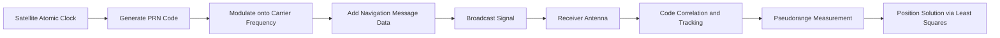
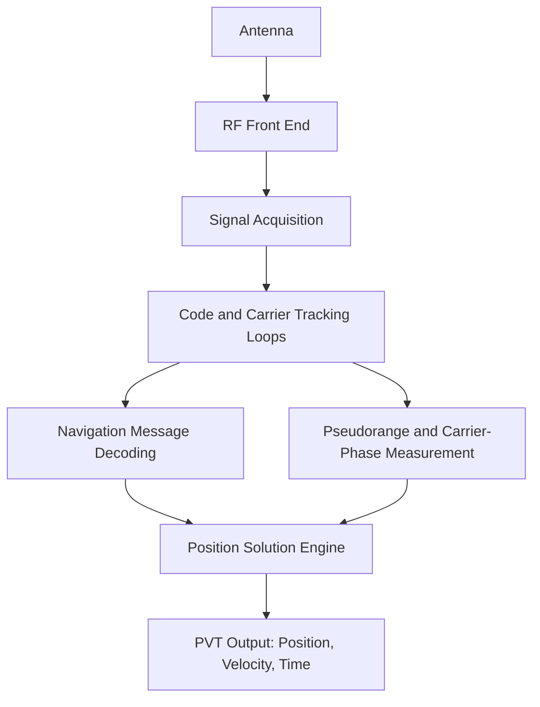

## Principles of GPS and GNSS Systems

### Overview

Global Navigation Satellite Systems (GNSS) are constellations of satellites that broadcast timing and positioning signals, enabling receivers anywhere on or near Earth's surface to compute their position, velocity, and time (PVT). The Global Positioning System (GPS), operated by the United States, is the original and most widely used GNSS constellation. Other independent constellations include GLONASS (Russia), Galileo (European Union), BeiDou (China), and regional augmentation systems like QZSS (Japan) and NavIC (India).

GNSS underpins nearly all modern geospatial workflows: field surveying, remote sensing georeferencing, GIS data collection, precision agriculture, autonomous navigation, and geodetic reference frame maintenance.

### Core Concept: Trilateration and Time-of-Flight Ranging

GNSS positioning is fundamentally a **trilateration** problem based on measuring distances (ranges) from a receiver to multiple satellites of known position.

**Key Points**

- Each satellite continuously broadcasts a signal encoding its precise orbital position (ephemeris) and the exact time of transmission.
- The receiver measures the signal's travel time and multiplies by the speed of light to estimate the range:

$$\rho = c \cdot \Delta t$$

where $\rho$ is the pseudorange, $c$ is the speed of light, and $\Delta t$ is the measured signal travel time.

- With ranges to at least 4 satellites, the receiver solves simultaneously for its 3D position $(x, y, z)$ and clock bias $\delta t_r$, since receiver clocks are not perfectly synchronized to satellite atomic clocks.

The term "pseudorange" (rather than "range") reflects that the raw measurement includes clock errors and is not a true geometric distance until corrected.

### The Pseudorange Equation

For satellite $i$, the pseudorange observation is modeled as:

$$\rho^i = r^i + c(\delta t_r - \delta t^i) + T^i + I^i + \epsilon^i$$

Where:

- $\rho^i$ — measured pseudorange to satellite $i$
- $r^i$ — true geometric range between satellite and receiver
- $\delta t_r$ — receiver clock offset from GNSS system time
- $\delta t^i$ — satellite clock offset (broadcast in navigation message)
- $T^i$ — tropospheric delay
- $I^i$ — ionospheric delay
- $\epsilon^i$ — noise, multipath, and unmodeled errors

Four unknowns ($x, y, z, \delta t_r$) require a minimum of four satellite observations to solve via linearized least squares (typically using a Taylor series expansion around an approximate position).

### GNSS Signal Structure

**Key Points**

- GNSS satellites broadcast on multiple carrier frequencies (e.g., GPS L1 at 1575.42 MHz, L2 at 1227.60 MHz, L5 at 1176.45 MHz).
- Each carrier is modulated with:
  - **Ranging codes** (pseudorandom noise, or PRN codes) — unique per satellite, enabling code-division multiple access (CDMA) so all satellites can share the same frequency.
  - **Navigation message** — low-rate binary data containing ephemeris, clock corrections, almanac, health status, and ionospheric model parameters.
- Two main code types (GPS): the Coarse/Acquisition (C/A) code on L1 (civilian, ~1 MHz chipping rate) and the Precise (P/Y) code on L1/L2 (military/authorized, ~10 MHz chipping rate, encrypted as Y-code).
- Modernized signals (L2C, L5, L1C) improve civilian accuracy, add forward error correction, and support multi-frequency ionospheric correction.

### Error Sources and Budget

| Error Source | Typical Magnitude (Standalone) | Mitigation |
| --- | --- | --- |
| Satellite clock | ~1–2 m | Broadcast clock corrections, precise ephemeris |
| Satellite orbit (ephemeris) | ~1–2 m | Precise ephemeris (IGS products) |
| Ionospheric delay | 1–50 m (varies with solar activity, elevation) | Dual/multi-frequency correction, Klobuchar model |
| Tropospheric delay | ~0.5–2 m | Saastamoinen/Hopfield models |
| Multipath | 0.5–5 m (code), mm–cm (carrier) | Antenna design, signal processing, choke rings |
| Receiver noise | ~0.1–1 m | Signal processing, correlator design |
| Selective Availability | 0 (discontinued 2000) | N/A — historical only |

**Key Points**

- Ionospheric delay is frequency-dependent, which is why dual-frequency receivers can largely eliminate it by combining measurements (ionosphere-free linear combination).
- [Unverified] Exact error magnitudes vary significantly by receiver hardware, atmospheric conditions, satellite geometry, and location; the values above are representative ranges, not guarantees.

### Dilution of Precision (DOP)

Satellite geometry affects how measurement errors propagate into the position solution. **Dilution of Precision (DOP)** quantifies this geometric effect.

$$DOP = \sqrt{\text{trace}\left[(G^TG)^{-1}\right]}$$

where $G$ is the geometry matrix of unit vectors from receiver to each satellite.

Common DOP types:

- **GDOP** — Geometric (position + time)
- **PDOP** — Position (3D)
- **HDOP** — Horizontal
- **VDOP** — Vertical
- **TDOP** — Time

Lower DOP values (generally under 4) indicate stronger geometry and better achievable accuracy. Satellites clustered together in the sky produce poor (high) DOP; a well-spread constellation across the sky produces good (low) DOP.

### Positioning Techniques

**Standard Positioning Service (SPS)**

Single-frequency, code-based pseudoranging using civilian C/A code. Typical autonomous accuracy: 3–5 m (95%) with modern receivers, though this varies by receiver and environment.

**Differential GNSS (DGNSS)**

Uses a base station at a known location to compute pseudorange corrections, broadcast to rover receivers to cancel common-mode errors (satellite clock, orbit, atmospheric). Sub-meter accuracy achievable.

**Real-Time Kinematic (RTK)**

Uses carrier-phase measurements (not just code) between a base and rover, resolving integer ambiguities to achieve centimeter-level accuracy in real time. Requires a communication link (radio or NTRIP over internet) and baselines typically under ~20–30 km for single-base RTK.

**Network RTK (NRTK)**

Uses a network of reference stations (Continuously Operating Reference Stations, CORS) to model spatially correlated errors and generate virtual reference station (VRS) corrections, extending reliable centimeter accuracy over larger areas.

**Precise Point Positioning (PPP)**

Uses precise satellite orbit and clock products (from services like IGS) with a single receiver, without needing a local base station. Achieves decimeter-to-centimeter accuracy but typically requires longer convergence times (minutes) compared to RTK, though PPP-RTK/PPP-AR hybrids are narrowing this gap.

**Example**

| Method | Typical Accuracy | Latency | Infrastructure Needed |
| --- | --- | --- | --- |
| Standalone SPS | 3–5 m | Real-time | None |
| DGNSS | 0.5–2 m | Real-time | Base station/SBAS |
| RTK | 1–2 cm | Real-time | Base + comm link |
| Network RTK | 1–2 cm | Real-time | CORS network |
| PPP | 2–10 cm | Real-time to near-real-time | Precise orbit/clock products |
| Post-processed static | mm–cm | Post-processing | Dual receivers, long occupation |

### Carrier-Phase Measurements

Code-based pseudoranging has meter-level resolution due to the chipping rate of ranging codes. Carrier-phase measurements exploit the much shorter wavelength of the carrier signal (~19 cm for L1) to achieve millimeter-level ranging precision — but with an inherent **integer ambiguity**: the number of whole carrier cycles between satellite and receiver at the start of tracking is unknown.

$$\phi^i = r^i + c(\delta t_r - \delta t^i) - I^i + T^i + \lambda N^i + \epsilon_\phi$$

Where $\lambda$ is the carrier wavelength and $N^i$ is the integer ambiguity (cycles). Resolving $N^i$ correctly (integer ambiguity resolution) is the central challenge in high-precision GNSS techniques like RTK and static surveying.

### GNSS Constellations Compared

| System | Operator | Orbital Altitude | Frequencies (примary) | Satellites (nominal) |
| --- | --- | --- | --- | --- |
| GPS | USA (Space Force) | ~20,200 km MEO | L1, L2, L5 | 24+ |
| GLONASS | Russia | ~19,100 km MEO | G1, G2, G3 | 24 |
| Galileo | EU (EUSPA) | ~23,222 km MEO | E1, E5, E6 | 24+ |
| BeiDou | China | MEO/IGSO/GEO mix | B1, B2, B3 | 35+ |
| QZSS | Japan | QZO/GEO | L1, L2, L5, L6 | 4–7 (regional) |
| NavIC | India | GEO/GSO | L5, S-band | 7 (regional) |

**Key Points**

- Using multiple constellations (multi-GNSS) increases visible satellite count, improves DOP, and enhances availability in obstructed environments (urban canyons, forest canopy).
- Most modern survey-grade and mapping-grade receivers track GPS + GLONASS + Galileo + BeiDou simultaneously.

### Coordinate Reference Frames and Datums

GNSS positions are computed in an Earth-Centered, Earth-Fixed (ECEF) Cartesian frame tied to a specific reference frame:

- GPS uses **WGS84** (World Geodetic System 1984), periodically realigned to International Terrestrial Reference Frame (ITRF) realizations.
- Positions are typically converted from ECEF $(X, Y, Z)$ to geodetic coordinates (latitude $\phi$, longitude $\lambda$, ellipsoidal height $h$) using closed-form or iterative transformation formulas.
- Ellipsoidal height (from GNSS) differs from orthometric height (elevation above mean sea level) by the geoid undulation $N$:

$$h = H + N$$

where $H$ is orthometric height and $N$ is geoid height, obtained from a geoid model (e.g., EGM2008, GEOID18).

**Key Points**

- Datum mismatches (e.g., mixing WGS84 GNSS data with a local datum like NAD83 without proper transformation) are a common source of positional error in GIS workflows.
- Tectonic plate motion causes reference frames to drift over time, requiring epoch-specific realizations (e.g., ITRF2014 at epoch 2020.0).

### Augmentation Systems

**Satellite-Based Augmentation Systems (SBAS)**

Geostationary satellites broadcast correction and integrity data over wide areas:

- WAAS (USA), EGNOS (Europe), MSAS (Japan), GAGAN (India), SDCM (Russia)
- Typically improve accuracy to 1–2 m and add integrity monitoring for aviation-grade applications.

**Ground-Based Augmentation Systems (GBAS)**

Local reference stations (e.g., at airports) providing high-integrity corrections for precision approach and landing.

### Receiver Architecture

**Key Points**

- **Acquisition** searches for and locks onto satellite signals across code phase and Doppler frequency.
- **Tracking loops** (Delay Lock Loop for code, Phase Lock Loop for carrier) maintain lock and refine measurements.
- Receiver classes range from low-cost single-frequency chipsets (smartphones, ~meter-level) to survey-grade multi-frequency, multi-constellation geodetic receivers (mm–cm level with RTK/PPP).

### Practical Field Workflow (Survey-Grade GNSS)

**Example**

1. Establish or connect to a known control point (base station or CORS/NTRIP caster).
2. Configure rover receiver for the desired correction method (RTK radio link or NTRIP internet stream).
3. Verify satellite count (ideally ≥6–8 visible) and PDOP (ideally <4) before data collection.
4. Occupy points with appropriate epoch count/duration based on required accuracy (a few seconds for RTK fixed solutions; longer for static surveys).
5. Confirm "fixed" (not "float") integer ambiguity status for cm-level RTK accuracy.
6. Log raw observations (RINEX format) if post-processing or QA/QC is required.
7. Apply geoid model correction if orthometric heights are needed.

### Common Data Formats

- **RINEX** (Receiver Independent Exchange Format) — standard text format for raw GNSS observations and navigation messages, used in post-processing (e.g., with software like RTKLIB, Bernese, GAMIT).
- **NMEA 0183** — standard sentence-based output format for real-time position/status ($GPGGA, $GPRMC, etc.), widely used in navigation and GIS field software.
- **RTCM** — standard for transmitting differential/RTK correction messages between base and rover.

### Limitations and Error Sources in Practice

**Key Points**

- **Multipath**: signals reflecting off buildings, water, or terrain before reaching the antenna, causing range errors — worse in urban canyons and near reflective surfaces.
- **Signal blockage**: dense forest canopy, tunnels, and indoor environments can prevent adequate satellite tracking.
- **Ionospheric scintillation**: rapid signal fluctuations near the equator and poles, especially during high solar activity, can degrade tracking.
- [Inference] Consumer-grade smartphone GNSS chipsets, while improving with dual-frequency support in newer models, generally do not match survey-grade receiver accuracy even under identical sky conditions, due to antenna quality and signal processing differences.

### Related Topics

- Geodetic datums and reference frame transformations (WGS84, NAD83, ITRF)
- Geoid models and orthometric vs. ellipsoidal heights
- RTK/Network RTK infrastructure and NTRIP protocol
- Precise Point Positioning (PPP) workflows and IGS products
- GNSS error mitigation: ionospheric and tropospheric modeling
- Least squares adjustment in geodetic surveying
- Coordinate transformations and map projections
- Integration of GNSS with INS (inertial navigation) and sensor fusion
- Total station and terrestrial laser scanning integration with GNSS control
- Multipath mitigation techniques and antenna design (choke ring, ground plane)