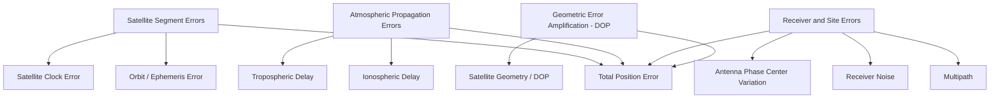

## Satellite Positioning Error Sources

### Overview

GNSS positioning accuracy is limited by a chain of error sources that corrupt the pseudorange and carrier-phase measurements used to solve for receiver position. These errors originate at the satellite, propagate through the atmosphere, and are further affected by the local receiver environment and the receiver hardware itself. Understanding each source — its magnitude, spatial/temporal correlation, and mitigation strategy — is essential for selecting the correct positioning technique (standalone, DGNSS, RTK, PPP) for a given accuracy requirement.

Error sources are conventionally grouped into four categories: **satellite-related**, **signal propagation (atmospheric)**, **receiver/site-related**, and **geometric**.

### 1. Satellite-Related Errors

**Satellite Clock Error**

Each satellite carries onboard atomic clocks (cesium/rubidium), but these are not perfectly synchronized with GNSS system time. Broadcast navigation messages include second-order polynomial clock correction coefficients, but residual error remains after correction.

- Typical residual after broadcast correction: ~1–2 m (range-equivalent)
- Corrected using: $\delta t^i = a_0 + a_1(t - t_{oc}) + a_2(t - t_{oc})^2$
- Precise clock products (IGS final/rapid) reduce this to centimeter level but are only available post-processed or with low latency for real-time PPP.

**Satellite Orbit (Ephemeris) Error**

The broadcast navigation message includes Keplerian orbital elements describing predicted satellite position. Actual orbits deviate slightly from predictions due to gravitational perturbations, solar radiation pressure, and modeling limitations.

- Typical broadcast ephemeris error: ~1–2 m
- Precise ephemeris (IGS, available with latency from hours to ~2 weeks depending on product) reduces this to cm level.
- [Unverified] Exact magnitudes vary by satellite block, solar activity, and time since last upload — figures above are representative averages, not fixed constants.

**Satellite Health and Geometry**

Unhealthy satellites (flagged in the navigation message) should be excluded from the solution. Poor spatial distribution of otherwise healthy satellites contributes to geometric error amplification (see DOP, below).

### 2. Atmospheric Propagation Errors

**Ionospheric Delay**

The ionosphere (roughly 50–1000 km altitude) contains free electrons that delay code signals and advance carrier phase, with delay magnitude proportional to the Total Electron Content (TEC) along the signal path and inversely proportional to the square of the signal frequency:

$$I = \frac{40.3 \cdot TEC}{f^2}$$

**Key Points**

- Single-frequency receivers rely on broadcast models (e.g., Klobuchar model for GPS) that typically remove only ~50–60% of the ionospheric delay.
- Dual/multi-frequency receivers form the ionosphere-free linear combination, canceling first-order ionospheric delay almost entirely:

$$\rho_{IF} = \frac{f_1^2 \rho_1 - f_2^2 \rho_2}{f_1^2 - f_2^2}$$

- Magnitude varies strongly with solar activity (11-year solar cycle), time of day (peak in afternoon), latitude (worst near geomagnetic equator and poles), and satellite elevation angle (larger at low elevation due to longer path length through the ionosphere).
- Ionospheric scintillation — rapid amplitude/phase fluctuations — can cause loss of lock, particularly in equatorial and high-latitude/auroral regions.

**Tropospheric Delay**

The neutral atmosphere (troposphere + stratosphere, non-dispersive at GNSS frequencies) delays signals due to refraction, split into two components:

- **Dry (hydrostatic) component**: ~90% of total delay, well-modeled from surface pressure (models: Saastamoinen, Hopfield).
- **Wet component**: ~10% of total delay but highly variable due to water vapor content; harder to model precisely.

$$T = T_{dry} + T_{wet}$$

Total zenith tropospheric delay is typically ~2.3 m at sea level, mapped to the actual satellite elevation angle using a mapping function (e.g., Niell, Global Mapping Function). Since delay increases at low elevation angles (longer atmospheric path), mapping functions are essential for accurate correction.

### 3. Receiver and Site-Related Errors

**Multipath**

Signal reflection off nearby surfaces (buildings, water, vehicles, ground) causes a reflected signal to arrive at the antenna alongside (or instead of) the direct signal, biasing the correlation peak.

- Code multipath: up to several meters in severe cases
- Carrier-phase multipath: typically millimeters to a few centimeters
- Not correlated between receivers, so it cannot be removed by differencing techniques (unlike orbit/clock/atmospheric errors)

**Mitigation**

- Choke ring or ground-plane antennas to suppress low-elevation reflected signals
- Careful site selection (avoid reflective surfaces, elevated mounting)
- Advanced correlator designs (narrow correlator spacing, strobe correlators)
- Longer observation times to average out multipath in static surveying

**Receiver Noise**

Thermal noise in the receiver's RF front end and signal processing chain introduces random measurement error.

- Code tracking noise: ~0.1–1 m (varies by chipping rate and correlator design)
- Carrier-phase tracking noise: ~1–2 mm
- Generally the smallest error contributor in modern receivers, though it scales with signal-to-noise ratio (degraded under canopy or signal attenuation).

**Antenna Phase Center Variation (PCV)**

The electrical phase center of a GNSS antenna (where the signal is effectively received) does not perfectly coincide with its geometric center, and this offset varies with satellite elevation and azimuth.

- Significant for high-precision applications (geodetic surveying); typically addressed using calibrated antenna PCV models (e.g., IGS absolute antenna calibrations).
- Using mismatched antenna types between base and rover without PCV correction can introduce centimeter-level systematic bias.

**Signal Obstruction / Blockage**

Physical obstructions (buildings, terrain, dense forest canopy) block or attenuate signals, reducing satellite count and often degrading geometry (raising DOP) simultaneously.

### 4. Geometric Error Amplification (DOP)

Even with a fixed level of ranging error, the satellite constellation's geometric configuration amplifies (or dampens) that error in the final position solution.

$$\sigma_{position} = DOP \times \sigma_{URE}$$

Where $\sigma_{URE}$ is the User Range Error (the combined effect of clock, orbit, atmospheric, and receiver errors projected onto the line of sight).

**Key Points**

- Satellites clustered in one part of the sky → poor (high) geometric dilution → error amplified.
- Satellites well-distributed across the sky, including near-zenith and multiple azimuths → good (low) DOP → error suppressed.
- This is why obstructed environments (urban canyons) degrade accuracy through two compounding mechanisms: fewer visible satellites (worse DOP) and more multipath.

### Error Budget Summary

| Category | Source | Typical Magnitude (Standalone, 1σ range-equivalent) | Correlated Between Nearby Receivers? |
| --- | --- | --- | --- |
| Satellite | Clock error (broadcast) | ~1–2 m | Yes |
| Satellite | Orbit/ephemeris error | ~1–2 m | Yes |
| Atmospheric | Ionospheric delay | ~1–10 m (single-freq, after model) | Yes (spatially correlated) |
| Atmospheric | Tropospheric delay | ~0.2–1 m (after model) | Yes (spatially correlated) |
| Receiver/Site | Multipath | ~0.5–5 m (code), mm–cm (carrier) | No |
| Receiver/Site | Receiver noise | ~0.1–1 m (code), ~1–2 mm (carrier) | No |
| Receiver/Site | Antenna PCV | mm–cm | Partially |

**Key Points**

- Errors that are spatially correlated (satellite clock, orbit, ionosphere, troposphere) largely cancel in **differential techniques** (DGNSS, RTK) because both base and rover experience nearly identical error at short baselines.
- Errors that are **not correlated** between receivers (multipath, receiver noise) cannot be removed by differencing and set the practical accuracy floor for RTK/DGNSS.
- This distinction explains why RTK baseline length matters: as the base-rover distance grows, atmospheric decorrelation increases, degrading the cancellation benefit (a key reason Network RTK exists).

### Why Differencing Techniques Work (Conceptual Illustration)

<svg xmlns="http://www.w3.org/2000/svg" viewBox="0 0 720 320">
<text x="360" y="24" text-anchor="middle" font-size="15" font-weight="bold" fill="#1a1a1a">Error Cancellation via Differencing (svg_diagram)</text>
<circle cx="360" cy="55" r="14" fill="#2b6cb0" />
<text x="360" y="60" text-anchor="middle" font-size="11" fill="white">SAT</text>
<line x1="360" y1="69" x2="150" y2="220" stroke="#2b6cb0" stroke-width="1.5" />
<line x1="360" y1="69" x2="570" y2="220" stroke="#2b6cb0" stroke-width="1.5" />
<rect x="110" y="220" width="80" height="45" rx="4" fill="#edf2f7" stroke="#2d3748" />
<text x="150" y="242" text-anchor="middle" font-size="11" fill="#1a1a1a">Base</text>
<text x="150" y="256" text-anchor="middle" font-size="9" fill="#4a5568">Known Position</text>
<rect x="530" y="220" width="80" height="45" rx="4" fill="#edf2f7" stroke="#2d3748" />
<text x="570" y="242" text-anchor="middle" font-size="11" fill="#1a1a1a">Rover</text>
<text x="570" y="256" text-anchor="middle" font-size="9" fill="#4a5568">Unknown Position</text>

<text x="150" y="285" text-anchor="middle" font-size="9" fill="`#2b6cb0`">Same ionosphere,</text>

<text x="150" y="297" text-anchor="middle" font-size="9" fill="`#2b6cb0`">troposphere, clock/orbit</text>

<text x="150" y="309" text-anchor="middle" font-size="9" fill="`#2b6cb0`">error (short baseline)</text>

<path d="M 220 240 L 500 240" stroke="#718096" stroke-width="1" stroke-dasharray="4,3" marker-end="url(#arrow)" />
<text x="360" y="230" text-anchor="middle" font-size="9" fill="#718096">Differencing removes common error</text>
</svg>

### Practical Implications by Positioning Method

| Method | Dominant Remaining Error Source(s) | Achievable Accuracy |
| --- | --- | --- |
| Standalone SPS | All sources uncorrected; ionosphere/orbit dominate | 3–5 m |
| SBAS-corrected | Residual ionosphere (regional model), multipath | 1–2 m |
| DGNSS | Multipath, receiver noise | 0.5–2 m |
| RTK (short baseline) | Multipath, receiver noise, unresolved ambiguities | 1–2 cm |
| Network RTK | Multipath, receiver noise (atmosphere modeled by network) | 1–2 cm over wider area |
| PPP | Convergence-dependent residual atmosphere/multipath | 2–10 cm (post-convergence) |

**Example**

A survey crew working under partial forest canopy will typically see: reduced satellite count → elevated PDOP; increased multipath from signal scattering off trunks/branches; and possible signal attenuation causing intermittent loss of carrier lock ("cycle slips"). The combined effect commonly degrades RTK fix reliability even though atmospheric and orbital errors remain well-controlled by the correction stream.

### Cycle Slips (Carrier-Phase Specific Error Event)

A **cycle slip** is a discontinuity in the tracked carrier-phase count caused by a temporary loss of lock (signal blockage, low SNR, high receiver dynamics), which corrupts the integer ambiguity term unless detected and repaired.

**Key Points**

- Detected via time-differenced phase residuals, dual-frequency geometry-free combinations, or Doppler-aided prediction.
- Left unrepaired, a cycle slip introduces a step error in the position solution equal to a multiple of the carrier wavelength (~19 cm for L1 per cycle).
- Most modern receiver firmware and post-processing software (RTKLIB, GNSS processing suites) include automatic cycle-slip detection and repair algorithms.

### Related Topics

- Differential GNSS and RTK error cancellation mechanics
- Ionospheric modeling (Klobuchar, NeQuick, dual-frequency ionosphere-free combination)
- Tropospheric mapping functions and zenith delay estimation
- Multipath mitigation antenna technology (choke ring, ground plane)
- Cycle slip detection and repair algorithms
- Precise Point Positioning (PPP) convergence behavior
- CORS network design and Network RTK error modeling
- Receiver autonomous integrity monitoring (RAIM)
- GNSS site selection best practices for geodetic monumentation