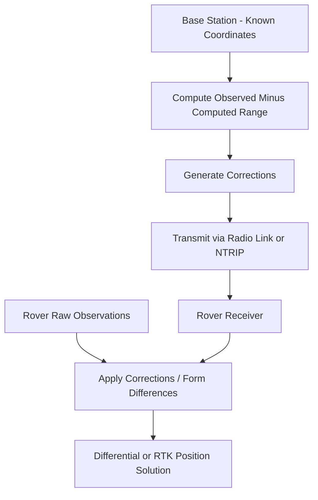
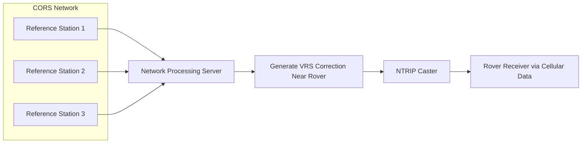

## Differential GPS and RTK Positioning

### Overview

Differential GPS (DGPS) and Real-Time Kinematic (RTK) positioning are techniques that improve GNSS accuracy from meter-level (standalone) to sub-meter or centimeter-level by using a reference station at a known location to characterize and remove errors that are spatially correlated between nearby receivers. DGPS operates on code (pseudorange) measurements, while RTK operates on carrier-phase measurements with integer ambiguity resolution, yielding much higher precision.

Both techniques exploit the same underlying principle: many GNSS error sources (satellite clock, orbit, ionospheric delay, tropospheric delay) affect a base station and a nearby rover almost identically. By differencing observations between the two receivers, these common errors largely cancel, leaving only the errors that do not correlate over distance (multipath, receiver noise).

### Core Principle: Differencing

**Single Difference**

Subtracting simultaneous observations of the same satellite from two receivers (base and rover) eliminates satellite clock error and (largely) atmospheric error, assuming a short baseline:

$$\Delta\rho_{BR}^i = \rho_R^i - \rho_B^i$$

**Double Difference**

Further differencing between two satellites also eliminates receiver clock error, leaving only geometric range differences, residual atmospheric error, multipath, and noise — the standard observable used in RTK ambiguity resolution:

$$\nabla\Delta\rho_{BR}^{ij} = (\rho_R^i - \rho_B^i) - (\rho_R^j - \rho_B^j)$$

### Differential GPS (DGPS) / Code-Based Corrections

**Key Points**

- The base station, at a precisely surveyed location, computes the difference between its known position and the position implied by each satellite's broadcast pseudorange.
- This difference (a pseudorange correction, PRC) is transmitted to the rover, which applies it to its own raw pseudoranges before computing position.
- Corrections are typically broadcast in **RTCM SC-104** format, over radio link, cellular data, or satellite (as with SBAS).
- Because it corrects code measurements only (not carrier phase), achievable accuracy is limited to sub-meter, typically 0.5–2 m.

**Common DGPS Correction Sources**

- Local base station with radio/cellular link (survey-grade DGPS)
- **SBAS** (WAAS, EGNOS, MSAS, GAGAN) — wide-area corrections via geostationary satellite, ~1 m accuracy, no local infrastructure needed
- Commercial beacon/satellite DGPS services (e.g., for marine/agricultural use)

### Real-Time Kinematic (RTK) Positioning

RTK uses carrier-phase double-difference observations and resolves the integer ambiguity ($N$) in real time, achieving centimeter-level accuracy.

**Key Points**

- Requires a low-latency communication link between base and rover (UHF radio, cellular/NTRIP) since ambiguity resolution and corrections must be applied continuously.
- The rover progresses through solution states:
  - **Autonomous** — no corrections applied, meter-level
  - **Float** — carrier-phase used but ambiguities not yet resolved to integers, decimeter-level
  - **Fixed** — integers correctly resolved, centimeter-level (the target state for RTK surveying)
- Fixing time depends on satellite geometry, baseline length, multipath conditions, and number of frequencies tracked; modern multi-frequency, multi-constellation receivers typically fix within seconds under good conditions.

**Integer Ambiguity Resolution**

Solving for $N^i$ (the unknown whole number of carrier cycles) is a search problem. The most widely used method is the **LAMBDA** (Least-squares AMBiguity Decorrelation Adjustment) technique, which:

1. Computes a float ambiguity solution and its covariance matrix via least squares.
2. Decorrelates and transforms the ambiguity search space to make integer search efficient.
3. Searches for the integer vector minimizing the weighted sum of squared residuals.
4. Validates the fixed solution using a ratio test (comparing the best and second-best integer candidates) before accepting it.

### RTK Architectures

**Single-Base RTK**

One physical base station broadcasts corrections to one or more rovers.

- Simple to deploy (survey-grade receiver + tripod + radio or NTRIP modem)
- Baseline length practically limited to ~10–20 km for reliable fixed solutions (atmospheric decorrelation grows with distance)
- Common in construction staking, topographic survey, boundary survey

**Network RTK (NRTK) / VRS**

A network of permanently operating **CORS** (Continuously Operating Reference Stations) computes spatially interpolated atmospheric and orbit error models across the network area.

- **VRS (Virtual Reference Station)**: the network server generates a synthetic set of corrections as if a base station existed at (or near) the rover's approximate location, sent to the rover via NTRIP.
- **FKP/MAC (Area Correction Parameters / Master-Auxiliary Concept)**: alternative network correction formats that transmit correction surface parameters rather than a synthetic single-base stream.
- Extends reliable cm-level accuracy over much larger areas than single-base RTK and removes the need for the user to deploy their own base station.
- Requires cellular data connectivity to reach the network's NTRIP caster.

### NTRIP Protocol

**Networked Transport of RTCM via Internet Protocol (NTRIP)** streams RTK/DGNSS corrections over standard internet connections (typically cellular data in the field).

**Key Points**

- Components: **NTRIP Source** (reference station generating corrections), **NTRIP Caster** (server distributing correction streams, identified by "mountpoints"), **NTRIP Client** (rover receiver/field software connecting to a mountpoint).
- The rover sends an approximate position (NMEA GGA sentence) to the caster so VRS/network solutions can generate location-appropriate corrections.
- Standard, protocol-based method used by most commercial CORS networks (state DOT networks, private networks) and field data collection software.

### Accuracy and Baseline Length Relationship

| Baseline Length | Typical Single-Base RTK Horizontal Accuracy |
| --- | --- |
| <5 km | ~1 cm + 1 ppm |
| 5–10 km | ~1–2 cm |
| 10–20 km | ~2–3 cm (degrading) |
| >20–30 km | Fix reliability decreases; Network RTK recommended |

**Key Points**

- Accuracy specifications are commonly expressed as a fixed component plus a distance-dependent term, e.g., "±(8 mm + 1 ppm × baseline length)" — a manufacturer specification format, illustrative here rather than a universal constant.
- [Unverified] Actual field performance depends heavily on multipath environment, satellite geometry, ionospheric activity, and receiver/antenna quality, so real-world results can deviate from manufacturer specifications.

### RTK vs. PPP vs. Static Post-Processing

| Attribute | RTK | Network RTK | PPP | Static Post-Processing |
| --- | --- | --- | --- | --- |
| Real-time capable | Yes | Yes | Yes (with streamed products) | No |
| Local base needed | Yes (or network) | No (network-based) | No | Optional (or use CORS) |
| Convergence time | Seconds | Seconds | Minutes (or longer) | N/A (post-processed) |
| Typical accuracy | 1–2 cm | 1–2 cm | 2–10 cm | mm–cm |
| Communication link | Radio/cellular | Cellular (NTRIP) | Optional (correction stream) | None during survey |
| Coverage range | Limited by baseline | Wide (network coverage area) | Global | Depends on reference station access |

### Practical Field Workflow

**Example**

1. **Base setup (single-base RTK)**: Set up base receiver over a known or arbitrarily-occupied point; configure broadcast format (RTCM version) and communication link (radio frequency or NTRIP caster credentials).
2. **Rover configuration**: Set rover to receive corrections matching the base's format/link; confirm correct coordinate system and antenna height entry.
3. **Initialization**: Allow the rover to achieve a "Fixed" solution; verify fix quality indicator in field software before collecting data.
4. **Quality control**: Monitor PDOP, number of satellites, and age of corrections (latency) throughout data collection; re-verify fix periodically, especially after moving through obstructed areas.
5. **Data collection**: For topographic points, a few seconds of fixed-solution averaging per point is typical; for control points, longer occupations (30 seconds to several minutes) with repeat visits improve reliability.
6. **Post-survey QC**: Compare redundant observations, check against known control, review any float-to-fixed transitions for potential cycle slip contamination.

### Common Error Sources Specific to RTK

**Key Points**

- **Baseline-dependent atmospheric decorrelation**: as distance from base grows, differencing no longer fully cancels ionospheric/tropospheric delay, increasing residual error and fix-time.
- **Multipath at either station**: since multipath is not spatially correlated, it cannot be removed by differencing and directly degrades the fixed solution.
- **Incorrect base coordinates**: an erroneous base position translates directly into a systematic offset in every rover position (a critical field QC check).
- **Radio link dropout / high correction latency**: causes the rover to fall back to float or autonomous mode; most receivers apply an "age of corrections" limit beyond which fixed solutions are not trusted.
- **Antenna height and phase center errors**: incorrect antenna height entry or mismatched antenna models between base and rover introduce systematic vertical/horizontal bias.

### Related Topics

- Integer ambiguity resolution methods (LAMBDA algorithm)
- CORS network design and NTRIP protocol details
- Precise Point Positioning (PPP) and PPP-RTK hybrid techniques
- RINEX data formats and post-processing software (RTKLIB, GAMIT/GLOBK)
- GNSS antenna calibration and phase center variation models
- Coordinate system and datum considerations for RTK surveys
- Total station integration and control network densification
- SBAS (WAAS/EGNOS) architecture and coverage