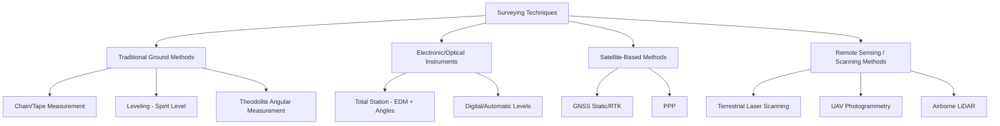
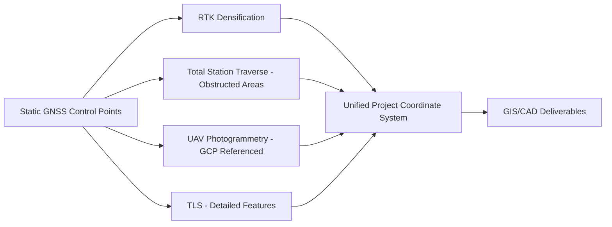

## Traditional and Modern Surveying Techniques

### Overview

Land and geospatial surveying encompasses the methods used to measure and map positions, distances, angles, and elevations on the Earth's surface. The field spans a continuum from centuries-old optical/mechanical techniques (still valuable for specific applications) to modern electronic, satellite-based, and remote-sensing methods. Understanding this continuum matters because technique selection is driven by required accuracy, site conditions, project scale, and cost — not simply "newest is always best."

### Traditional Surveying Techniques

**Chain and Tape Surveying**

The earliest systematic distance-measurement method, using calibrated chains (historically Gunter's chain) or steel/fiberglass tapes.

**Key Points**

- Distance measured directly along the ground or corrected for slope/temperature/tension to derive horizontal distance.
- Still used for small-scale, low-precision tasks (construction layout checks, boundary verification) due to low cost and no power/battery requirement.
- Accuracy typically limited to ~1:1000 to 1:5000 (error ratio to distance measured), far below modern EDM or GNSS capability.
- Systematic errors: tape sag (catenary), thermal expansion, incorrect tension, slope, and alignment errors — all requiring correction formulas in precise work.

**Leveling (Differential/Spirit Leveling)**

Determines elevation differences between points using a leveling instrument (spirit level, automatic level, or digital level) and a graduated leveling rod/staff.

$$\Delta h = BS - FS$$

Where $BS$ (backsight) and $FS$ (foresight) are rod readings taken from a level instrument setup, with the difference giving the elevation change between points.

**Key Points**

- Remains one of the most accurate methods for relative elevation determination (sub-mm to mm level with precise/digital levels), often exceeding GNSS-derived heights for short-range, high-precision applications (e.g., construction benchmarks, dam monitoring).
- Closed-loop leveling circuits allow error detection/distribution via a closure check: the sum of elevation changes around a closed loop should equal zero (within tolerance).
- Digital levels use bar-coded rods and image processing for automated, operator-error-free readings.

**Theodolite and Angular Measurement**

Theodolites measure horizontal and vertical angles with high precision using graduated circles and a telescope on a rotating mount.

**Key Points**

- Historically paired with chained distances (traversing) to compute point coordinates via trigonometric relationships.
- Modern total stations have largely superseded standalone theodolites by integrating electronic angle measurement with electronic distance measurement (EDM).
- Traverse computation (closing a loop of angle/distance measurements back to a known point) remains a foundational method for establishing control networks, whether measured optically or electronically.

**Triangulation and Trilateration (Classical Geodetic Control)**

Historical methods for establishing large-scale control networks before GNSS:

- **Triangulation**: measuring all angles of a network of connected triangles with known baseline length, computing all side lengths trigonometrically.
- **Trilateration**: measuring distances (rather than angles) between network points, using EDM.
- Formed the basis of national geodetic control networks (e.g., the historical U.S. NAD27 network) prior to GNSS-based densification.

### Modern Electronic/Optical Instruments

**Total Station**

Combines an electronic theodolite (angle measurement) with an EDM (distance measurement via modulated infrared or laser signal reflected off a prism or the surface directly) into a single integrated instrument.

**Key Points**

- Measures horizontal angle, vertical angle, and slope distance simultaneously; onboard computer resolves these into 3D coordinates relative to instrument position and a backsight orientation.
- **Reflectorless (RL) total stations** can measure distance to a surface directly (no prism needed), useful for hazardous or inaccessible points.
- **Robotic total stations** allow single-operator surveying: the instrument automatically tracks a moving prism (rover pole), commonly used in construction stakeout and machine control.
- Typical angular accuracy: 1"–5" (arc-seconds); typical distance accuracy: 1–3 mm + 1–2 ppm.
- Remains the standard for high-precision, GNSS-obstructed environments (dense urban areas, indoor, under canopy) and for applications requiring direct line-of-sight relative measurements (construction layout, deformation monitoring).

**Digital/Automatic Levels**

Electronic levels that auto-compensate for minor instrument tilt (via a compensator) and, in digital versions, read bar-coded rods automatically for mm-level precision without operator interpretation error.

### Satellite-Based Methods

(Covered in depth elsewhere in this chapter — summarized here for comparative context.)

**Key Points**

- **Static GNSS**: long-duration (30 min to several hours+) simultaneous observation at two or more points, post-processed for mm–cm accuracy; standard for geodetic control point establishment.
- **RTK/Network RTK**: real-time cm-level positioning, standard for topographic survey, construction stakeout, and boundary work where GNSS sky visibility is adequate.
- **PPP**: single-receiver precise positioning without local base infrastructure, useful for remote areas lacking CORS/base coverage.
- GNSS methods generally outperform traditional methods for large-area coverage and speed but require open sky visibility, which traditional/optical methods do not.

### Remote Sensing and Scanning Methods

**Terrestrial Laser Scanning (TLS)**

Ground-based LiDAR scanners that capture dense 3D point clouds (millions to billions of points) of a scene by measuring time-of-flight or phase-shift of a laser pulse across a rapid scanning pattern.

**Key Points**

- Produces highly detailed as-built documentation for structures, infrastructure, and complex sites.
- Typical range accuracy: mm-level at close range, depending on scanner class and target distance/reflectivity.
- Multiple scan positions are registered together (using overlapping targets, cloud-to-cloud registration algorithms, or GNSS/total station control) to form a unified point cloud.

**UAV (Drone) Photogrammetry**

Overlapping aerial imagery captured by drone, processed using Structure from Motion (SfM) algorithms to generate dense point clouds, orthomosaics, and digital surface models (DSM).

**Key Points**

- Requires ground control points (GCPs) surveyed by GNSS/total station, or RTK/PPK-equipped drones, to achieve absolute georeferencing accuracy.
- **PPK (Post-Processed Kinematic)** drones log raw GNSS observations onboard, post-processed against a base station after flight for improved accuracy versus real-time-only positioning.
- Typical achievable accuracy with good GCP density: 1–3 cm horizontal, 2–5 cm vertical (site- and workflow-dependent).
- Efficient for large-area topographic mapping, stockpile volume calculation, and corridor mapping compared to ground-based methods.

**Airborne LiDAR**

Aircraft- or drone-mounted laser scanning systems combined with GNSS/INS for direct georeferencing, producing dense elevation point clouds over large areas.

**Key Points**

- Standard method for large-area digital elevation model (DEM) production, floodplain mapping, forestry canopy/terrain modeling, and corridor infrastructure surveys.
- Can penetrate vegetation canopy gaps to capture bare-earth returns, enabling derivation of both a Digital Surface Model (DSM, including vegetation/structures) and a Digital Terrain Model (DTM, bare earth).

### Technique Comparison

| Method | Typical Accuracy | Best Use Case | Key Limitation |
| --- | --- | --- | --- |
| Chain/Tape | ~1:1000–1:5000 | Small-scale, low-precision checks | Slow, error-prone at scale |
| Differential Leveling | mm-level (relative) | Precise elevation control, monitoring | Line-of-sight, slow over long distances |
| Total Station | mm-level (relative) | Construction, control surveys, obstructed sites | Requires line-of-sight, single-point capture |
| Static GNSS | mm–cm | Geodetic control, long baselines | Requires open sky, long occupation time |
| RTK/Network RTK | cm-level | Topographic survey, stakeout | Requires open sky and comms link |
| TLS | mm-level (dense) | As-built documentation, complex geometry | Data volume, line-of-sight per scan |
| UAV Photogrammetry | cm-level | Large-area topographic mapping | Requires GCPs, weather-dependent |
| Airborne LiDAR | cm–dm (large area) | Regional DEM, canopy/terrain mapping | Cost, requires aircraft/large UAV |

### Integrated Modern Workflows

**Example**

A typical modern site survey combining methods:

1. Establish project control using static GNSS observations tied to national CORS network, post-processed for mm–cm accuracy.
2. Densify control with RTK for open areas and total station traverse for obstructed/wooded areas.
3. Deploy UAV photogrammetry (referenced to GCPs surveyed in step 1–2) for broad topographic coverage.
4. Use TLS for detailed as-built capture of structures or complex features requiring higher point density than photogrammetry can efficiently provide.
5. Integrate all datasets in a common coordinate reference frame and datum within a GIS/CAD environment for final deliverable production.

### Selecting the Appropriate Technique

**Key Points**

- **Accuracy requirement** is the primary driver: boundary/legal surveys typically demand the highest rigor (often static GNSS + total station traverse with redundancy), while reconnaissance mapping tolerates lower precision.
- **Site conditions**: dense canopy or urban canyons favor total station/TLS over GNSS; large open areas favor GNSS/UAV over ground-based traversing.
- **Project scale**: point-based work (single structure, small parcel) favors total station/TLS; area-based work (large sites, corridors) favors UAV/airborne methods.
- **Regulatory/legal context**: cadastral and legal boundary surveys are often governed by jurisdiction-specific minimum standards dictating acceptable methods and accuracy classes; [Unverified] specific requirements vary substantially by jurisdiction and should be confirmed against local surveying regulations rather than assumed from general practice.

### Related Topics

- Traverse computation and error adjustment (compass rule, transit rule)
- Differential leveling networks and benchmark systems
- Total station setup, backsight orientation, and resection methods
- Structure from Motion (SfM) photogrammetry pipeline
- LiDAR point cloud classification and DTM/DSM derivation
- Ground control point (GCP) design and placement strategy
- Coordinate system transformations between local and geodetic control
- Legal/cadastral survey standards and boundary determination methods
- Deformation monitoring survey techniques