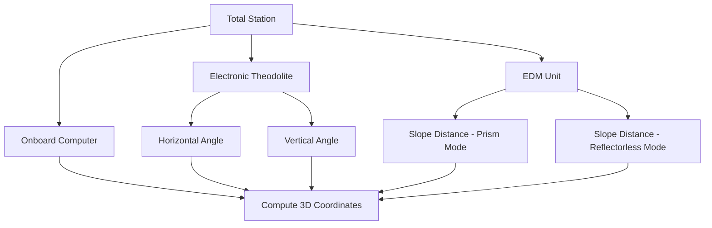

## Total Stations and Leveling Instruments

### Overview

Total stations and leveling instruments are the core optical/electronic tools of conventional ground surveying, used where direct line-of-sight measurement is required or preferred over satellite-based methods — particularly in obstructed environments, construction settings, and applications demanding very high local (relative) precision. A total station integrates angular and distance measurement into a single instrument; leveling instruments specialize in precise differential elevation determination. Both remain indispensable complements to GNSS in modern geospatial workflows.

### Total Stations

**Core Architecture**

A total station combines three measurement subsystems around a common optical axis:

1. **Electronic Theodolite** — measures horizontal and vertical angles using digital angle encoders (typically incremental or absolute optical encoders on the horizontal and vertical circles).
2. **Electronic Distance Measurement (EDM)** — measures slope distance to a target using a modulated infrared or laser signal, either reflected off a prism or directly off a surface (reflectorless mode).
3. **Onboard Computer/Data Collector** — resolves angle and distance measurements into 3D coordinates, stores data, and runs survey routines (traverse, resection, stakeout, COGO).

**EDM Principle**

Distance is derived from the phase shift or time-of-flight of a modulated signal traveling to the target and back:

$$D = \frac{c \cdot t}{2n}$$

Where $c$ is the speed of light, $t$ is the round-trip travel time, and $n$ is the refractive index of the atmosphere (correctable via temperature/pressure input, since atmospheric conditions affect signal propagation speed).

**Coordinate Computation**

From a known instrument (occupied) point and a backsight (known azimuth reference), the total station computes the coordinates of an observed point using the measured horizontal angle ($\theta$), vertical angle ($\alpha$), and slope distance ($D$):

$$\Delta N = D \cos(\alpha) \cos(\theta)$$

$$\Delta E = D \cos(\alpha) \sin(\theta)$$

$$\Delta Z = D \sin(\alpha)$$

Where $\Delta N$, $\Delta E$, $\Delta Z$ are the north, east, and elevation offsets from the instrument to the observed point (sign conventions and angle reference vary by manufacturer/software).

### Types of Total Stations

**Manual (Conventional) Total Stations**

Operator sights the target through the telescope, manually adjusting for angle and triggering distance measurement. Requires two people for efficient prism-based work (instrument operator + rod person).

**Robotic Total Stations**

Motorized instrument that automatically tracks a moving prism using servo motors and an active tracking sensor, allowing single-operator surveying.

**Key Points**

- The instrument continuously re-points to follow the prism as the rod person moves, re-measuring angle/distance on command (often via a remote controller held by the rod person).
- Standard for construction stakeout and machine control reference, where minimizing field crew size improves efficiency.
- Tracking can be lost behind obstructions, requiring re-acquisition (manual or automated search routines).

**Reflectorless (RL) Total Stations**

Use a visible laser EDM capable of measuring distance to a natural surface without a prism.

**Key Points**

- Enables measurement of hazardous, inaccessible, or moving points (structural facades, overhead features, unsafe terrain).
- Reflectorless range and accuracy are generally lower than prism mode and depend strongly on target surface reflectivity, angle of incidence, and color; [Unverified] exact usable range varies significantly by manufacturer model and target material, so it should be confirmed against the specific instrument's datasheet.

### Total Station Field Procedures

**Instrument Setup**

**Example**

1. Center and level the instrument over a known point using optical/laser plummet and circular/tubular level (or automatic dual-axis compensator on modern instruments).
2. Measure instrument height (from ground point to instrument's horizontal axis reference mark).
3. Input or confirm the occupied point's known coordinates.

**Backsight Orientation**

The instrument must be oriented to a known azimuth or coordinate before observations are meaningful.

- **Known azimuth method**: sight a point of known bearing/azimuth from the occupied point, set that value as the reference direction.
- **Known coordinates method**: sight a point of known coordinates; the instrument computes and sets the implied azimuth automatically.

**Resection**

Determines the instrument's own position (and orientation) by observing two or more points of known coordinates, without needing to physically occupy a known point.

**Key Points**

- Useful when no known point is conveniently located for direct setup, or to verify/strengthen control via redundant observations.
- Requires good geometric distribution of the observed known points relative to the instrument to minimize solution error (similar in concept to DOP in GNSS).

**Traversing**

A sequence of connected total station setups, each oriented from the previous, used to extend control or coordinate a series of points across a site.

**Key Points**

- **Closed traverse**: begins and ends on points of known position/azimuth, allowing computation of angular and linear misclosure for quality control.
- **Open traverse**: does not close back to known control, offering no independent error check — used only when unavoidable, since errors cannot be detected or distributed.
- Misclosure is distributed across traverse points using adjustment methods (e.g., compass/Bowditch rule) to produce final adjusted coordinates.

### Typical Total Station Specifications

| Specification | Typical Range |
| --- | --- |
| Angular accuracy | 1"–5" (arc-seconds) |
| Distance accuracy (prism) | ±(1–3 mm + 1–2 ppm) |
| Distance accuracy (reflectorless) | ±(2–5 mm + 2–3 ppm), surface-dependent |
| Prism range | Up to several kilometers |
| Reflectorless range | Tens to a few hundred meters, surface-dependent |
| Robotic tracking range | Hundreds of meters, condition-dependent |

**Key Points**

- [Unverified] Specific figures vary by manufacturer, model class (construction-grade vs. geodetic-grade), and environmental conditions — the ranges above represent typical published specifications rather than fixed values applicable to any instrument.

### Leveling Instruments

**Spirit (Optical) Levels**

Traditional levels using a bubble vial (tubular or circular) to establish a horizontal line of sight through the telescope.

**Automatic Levels**

Use an internal compensator (typically a pendulum-based optical-mechanical system) to automatically maintain a horizontal line of sight once the instrument is roughly leveled via a circular bubble, removing the need for precise manual leveling before each reading.

**Digital Levels**

Combine automatic compensation with electronic image processing of a bar-coded leveling rod, providing automated, operator-error-free readings and digital data logging.

**Key Points**

- Digital levels typically achieve standard deviation of ~0.3–1.0 mm per km of double-run leveling under good conditions, exceeding typical manual reading precision and eliminating transcription/interpolation error.
- Bar-coded rods are read via correlation against a stored reference pattern, simultaneously providing both elevation and horizontal distance (via stadia-based range estimation).

### Leveling Procedure (Differential Leveling)

**Key Points**

- **Height of Instrument (HI)** method: $HI = Elev_{known} + BS$; subsequent point elevation $= HI - FS$.
- **Rise and Fall** method: alternative computation tracking incremental rises/falls between consecutive readings, often preferred for manual error-checking.
- Balancing backsight and foresight distances (keeping them approximately equal at each setup) cancels most systematic errors, including Earth curvature and atmospheric refraction, and residual instrument collimation error.
- A **closed level loop** (returning to the starting benchmark or connecting to a second known benchmark) provides an independent check: total misclosure should fall within an allowable tolerance based on the required accuracy class and total distance leveled.

### Total Station vs. GNSS for Elevation

**Key Points**

- Total station-derived elevations are geometric (based on measured vertical angle and slope distance from an occupied point of known elevation) and are generally very precise over moderate distances but require line-of-sight and instrument setup at each location.
- GNSS-derived heights are ellipsoidal and require conversion to orthometric height via a geoid model, introducing geoid model uncertainty into the result.
- For projects demanding the highest local elevation precision (e.g., construction benchmarks, dam/structure monitoring), differential leveling with a precise/digital level typically remains the preferred method over GNSS.

### Common Sources of Error

| Instrument | Error Source | Mitigation |
| --- | --- | --- |
| Total Station | Instrument not level / miscentered | Careful setup, dual-axis compensator |
| Total Station | Atmospheric refraction (EDM) | Temperature/pressure correction input |
| Total Station | Prism constant mismatch | Enter correct prism offset for target type |
| Total Station | Collimation error (line of sight not perpendicular to trunnion axis) | Face-1/Face-2 (direct/reverse) observations, averaged |
| Level | Instrument collimation error | Balance BS/FS distances |
| Level | Earth curvature and refraction | Balanced sightlines cancel combined effect |
| Level | Rod not held vertical | Rod bubble/level, careful rod person technique |
| Level | Rod settling on soft ground | Turning points on stable plates/stakes |

### Practical Applications

**Example**

- **Construction stakeout**: robotic total station with one-person operation, guiding excavation/foundation placement to design coordinates in real time.
- **Machine control reference**: total station or GNSS base providing real-time position corrections to grading/paving equipment.
- **Deformation monitoring**: repeated precise total station observations (or precise leveling) to detect millimeter-scale movement in structures, dams, or slopes over time.
- **Benchmark establishment**: closed-loop differential leveling to establish or verify vertical control for a project, tied to a national vertical datum.

### Related Topics

- Traverse adjustment methods (compass/Bowditch rule, least squares)
- Resection and free-station setup techniques
- EDM atmospheric correction and calibration
- Precise/digital leveling networks and vertical datum realization
- Robotic total station integration with machine control systems
- Deformation monitoring survey design
- Combining GNSS and total station data in a unified project datum
- Prism constants and reflectorless surface reflectivity considerations