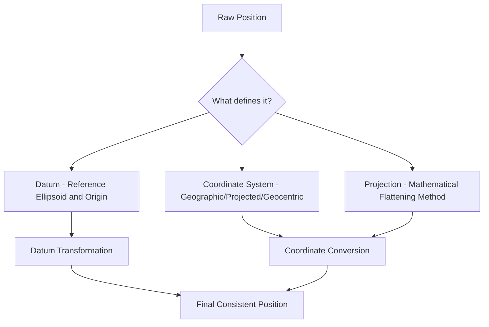
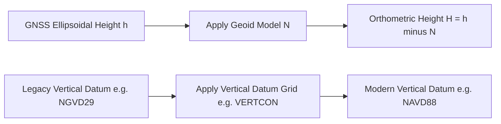

## Coordinate Transformation and Datum Conversion

### Overview

Coordinate transformation and datum conversion are the mathematical processes for converting positions between different coordinate reference systems (CRS) — whether changing map projections, converting between geodetic and Cartesian coordinate representations, or shifting between entirely different geodetic datums. These operations are fundamental to nearly every geospatial workflow, since data from GNSS, historical surveys, satellite imagery, and GIS layers rarely originate in a single consistent reference system. Errors in this domain — mixing datums without proper transformation, applying the wrong projection, or conflating a datum shift with a simple coordinate format conversion — are among the most common and consequential mistakes in geospatial work.

### Key Distinctions: Datum vs. Projection vs. Coordinate System

**Key Points**

- A **geodetic datum** defines the reference ellipsoid and its position/orientation relative to the Earth (e.g., WGS84, NAD83, ETRS89) — it establishes *what* the coordinates are measured against.
- A **map projection** is a mathematical method for representing the curved Earth's surface on a flat plane (e.g., UTM, State Plane, Lambert Conformal Conic) — it determines *how* geodetic coordinates are converted to planar $(x, y)$ coordinates.
- A **coordinate system** specifies the framework for expressing position — geographic (latitude/longitude), projected (easting/northing), or geocentric (ECEF X/Y/Z).
- Two datasets can share the same projection but differ in datum (causing a positional offset), or share the same datum but differ in projection (requiring a different but mathematically related transformation).

### Coordinate System Types

**Geodetic (Geographic) Coordinates**

Position expressed as latitude ($\phi$), longitude ($\lambda$), and ellipsoidal height ($h$), referenced to a specific ellipsoid/datum.

**Geocentric (ECEF) Coordinates**

Cartesian $(X, Y, Z)$ coordinates with origin at the Earth's center of mass, Z-axis toward the North Pole, X-axis through the prime meridian at the equator.

Conversion from geodetic to ECEF:

$$X = (N + h)\cos\phi\cos\lambda$$

$$Y = (N + h)\cos\phi\sin\lambda$$

$$Z = \left[N(1 - e^2) + h\right]\sin\phi$$

Where $N$ is the radius of curvature in the prime vertical, and $e^2$ is the ellipsoid's eccentricity squared:

$$N = \frac{a}{\sqrt{1 - e^2\sin^2\phi}}$$

with $a$ the ellipsoid semi-major axis.

**Projected Coordinates**

Planar $(E, N)$ (easting/northing) coordinates derived from geodetic coordinates via a projection formula, used for mapping, engineering, and GIS work where planar (Euclidean) distance/area calculations are needed.

### Common Map Projections

| Projection | Type | Common Use |
| --- | --- | --- |
| UTM (Universal Transverse Mercator) | Conformal, transverse cylindrical | Global topographic mapping, 6° zones |
| State Plane Coordinate System (SPCS) | Conformal (Lambert CC or Transverse Mercator by zone) | US state/local engineering, cadastral work |
| Lambert Conformal Conic | Conformal conic | Mid-latitude, east-west extent regions (e.g., aeronautical charts) |
| Web Mercator (EPSG:3857) | Conformal cylindrical | Web mapping tile services (distorts area at high latitude) |
| Albers Equal Area Conic | Equal-area conic | Thematic mapping requiring accurate area (e.g., US national maps) |

**Key Points**

- **Conformal** projections preserve local angles/shapes but distort area.
- **Equal-area** projections preserve area but distort shape/angles.
- **Equidistant** projections preserve distance along specific lines only.
- No projection can simultaneously preserve angle, area, and distance everywhere — projection choice is a deliberate trade-off based on the map's purpose.

### Geodetic Datums

A datum comprises a reference ellipsoid plus a defined origin and orientation relative to the physical Earth.

| Datum | Ellipsoid | Reference Frame Type | Notes |
| --- | --- | --- | --- |
| WGS84 | WGS84 ellipsoid | Global, geocentric | Used by GPS; periodically realigned to ITRF |
| NAD83 | GRS80 ellipsoid | Regional (North America), originally geocentric at adoption | Multiple realizations (NAD83(1986), NAD83(2011), etc.) |
| NAD27 | Clarke 1866 ellipsoid | Regional, non-geocentric (local best-fit) | Historical, largely superseded |
| ETRS89 | GRS80 ellipsoid | Regional (Europe), tied to stable European plate | Common European reference |
| ITRF (various realizations) | GRS80-based | Global, geocentric, epoch-specific | Highest precision global reference, used in geodesy/science |

**Key Points**

- WGS84 and NAD83 use nearly identical ellipsoid parameters but are **not identical** reference frames — differences of roughly 1–2 meters can exist depending on realization and location, which matters for high-precision work even though it is often negligible for general mapping.
- Reference frames tied to tectonic plates (like NAD83 on the North American plate, or ETRS89 on the Eurasian plate) remain stable relative to that plate but drift relative to a purely geocentric frame like ITRF over time due to plate motion.
- [Unverified] The exact magnitude of WGS84–NAD83 divergence at a given location depends on which specific realization of each datum is used and the current epoch, so precise applications should consult current transformation parameters rather than assume a fixed offset.

### Datum Transformation Methods

**Helmert (7-Parameter) Transformation**

A similarity transformation between two 3D Cartesian (ECEF) systems using three translations, three rotations, and one scale factor:

$$\begin{pmatrix} X_2 \\ Y_2 \\ Z_2 \end{pmatrix} = \begin{pmatrix} T_X \\ T_Y \\ T_Z \end{pmatrix} + (1+s) \cdot R(\omega_X, \omega_Y, \omega_Z) \cdot \begin{pmatrix} X_1 \\ Y_1 \\ Z_1 \end{pmatrix}$$

Where $T_X, T_Y, T_Z$ are translations, $s$ is a scale factor, and $R$ is a rotation matrix built from three small rotation angles.

**Key Points**

- Widely used for datum-to-datum transformations at regional/national scale.
- Transformation parameters are empirically derived by comparing coordinates of common points in both systems (least-squares fit), so accuracy depends on the quality and distribution of the control points used to derive them.
- A simplified version using only 3 translation parameters (Molodensky or 3-parameter transformation) is less accurate but sometimes used for lower-precision applications.

**Grid-Based (NADCON, NTv2) Transformations**

Use a pre-computed grid of shift values interpolated at each location, rather than a single global formula.

**Key Points**

- **NADCON** (US) and **NTv2** (used in Canada, Australia, and elsewhere) provide spatially varying corrections that account for local/regional distortions not captured by a simple Helmert transformation.
- Generally more accurate than a single 7-parameter Helmert transformation for national/regional-scale work, since real-world reference frame relationships are not perfectly uniform across large areas.
- Standard method used in GIS software (Esri, QGIS/PROJ) for high-accuracy NAD27-to-NAD83 or NAD83-realization-to-realization transformations.

**Time-Dependent Transformations**

Because tectonic plates move continuously, transformations between a plate-fixed datum (like NAD83) and a geocentric frame (like ITRF/WGS84 at a specific epoch) require accounting for velocity/epoch.

$$X(t) = X(t_0) + v_X \cdot (t - t_0)$$

Where $v_X$ is the point's velocity component due to plate motion, and $t_0$ is the reference epoch.

### Vertical Datum Conversion

Horizontal and vertical datums are conceptually separate and often require independent transformation.

**Key Points**

- **Ellipsoidal height** ($h$, from GNSS) differs from **orthometric height** ($H$, elevation above a geoid/mean sea level surface) by the geoid undulation ($N$): $h = H + N$.
- Geoid models (e.g., EGM2008 globally, GEOID18/GEOID12B in the US, national equivalents elsewhere) provide $N$ at any location, enabling conversion between the two height types.
- Converting between different vertical datums (e.g., NGVD29 to NAVD88 in the US) requires a separate published transformation/grid (e.g., VERTCON), distinct from horizontal datum transformation.

### Software and Practical Implementation

**Key Points**

- **PROJ** is the widely used open-source library underlying coordinate transformation in most GIS software (QGIS, GDAL, PostGIS); transformations are defined via EPSG codes or PROJ strings/WKT definitions.
- **EPSG codes** are standardized numeric identifiers for specific CRS definitions (e.g., EPSG:4326 for WGS84 geographic, EPSG:32617 for UTM Zone 17N/WGS84), essential for unambiguous CRS specification in software and metadata.
- Most modern GIS software performs transformations automatically ("on-the-fly reprojection") when a project's data layers have differing but well-defined CRS metadata — but this depends entirely on every dataset having correct, complete CRS metadata assigned; missing or incorrect metadata is a common source of silent positional error.

### Common Errors and Pitfalls

**Key Points**

- **Datum shift mistaken for no error**: assuming WGS84 and NAD83 coordinates are interchangeable without transformation, introducing meter-level (or larger, for older NAD27 data) systematic offset.
- **Missing/incorrect CRS metadata**: a shapefile or dataset lacking a defined coordinate system forces software to either guess or fail silently, producing misaligned data without an obvious error message.
- **Projected distance/area calculations on geographic coordinates**: computing distance or area directly from latitude/longitude values (degrees) without projecting first produces geometrically incorrect results, since a degree of longitude varies in ground distance with latitude.
- **Mixing vertical datums**: combining elevation data from different vertical datums (or ellipsoidal vs. orthometric height) without conversion introduces vertical offset errors, often overlooked since it doesn't visually appear as horizontal misalignment.

**Example**

A workflow importing historic NAD27-based cadastral data alongside modern RTK GNSS survey points (WGS84/NAD83) must apply a proper datum transformation (grid-based, e.g., NADCON) — not a naive coordinate copy — since the horizontal offset between NAD27 and NAD83/WGS84 can range from roughly 10 to over 100 meters depending on location, which would otherwise appear as a serious (and misleading) boundary discrepancy.

### Practical Transformation Workflow

**Example**

1. Identify the source CRS (datum + coordinate system + projection) and target CRS for every dataset involved.
2. Confirm CRS via metadata, coordinate value inspection (e.g., degrees vs. meters, expected coordinate range for the region), or `.prj`/EPSG code review.
3. Select the appropriate transformation method: Helmert for general regional work, grid-based (NADCON/NTv2) for higher-accuracy national transformations, or full geodetic pipeline (ellipsoidal ↔ ECEF ↔ target ellipsoidal) for global-scale work.
4. Apply vertical datum conversion separately if elevation data is involved, using the correct geoid model or vertical datum grid.
5. Validate the result against one or more independently known control points before accepting the transformed dataset for production use.

### Related Topics

- EPSG registry and CRS metadata standards (WKT, PROJ strings)
- UTM zone system and State Plane Coordinate System mechanics
- Geoid models and orthometric height determination
- ITRF realizations and epoch-based coordinate adjustment
- NADCON/NTv2 grid-based transformation implementation
- On-the-fly reprojection in GIS software (QGIS, ArcGIS, PostGIS)
- Map projection distortion analysis (Tissot's indicatrix)
- Legacy datum (NAD27) to modern datum conversion workflows