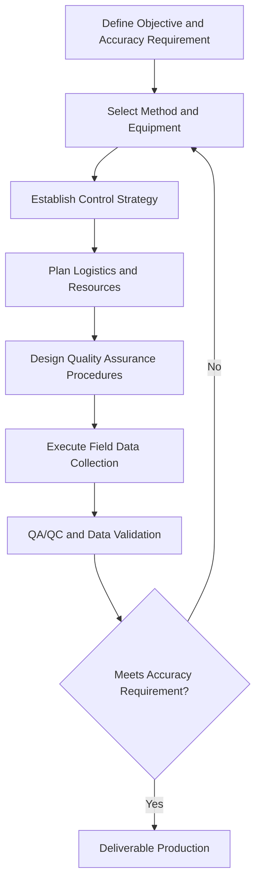

## Field Survey Design Principles

### Overview

Field survey design encompasses the planning decisions made before any instrument leaves the office — defining objectives, selecting methods, establishing control, estimating resource needs, and building in quality assurance — that determine whether a field data collection effort produces fit-for-purpose, defensible results. Poor survey design is one of the most common causes of costly rework: field crews consistently produce clean-looking data that turns out to be inadequate for its intended use because accuracy requirements, control strategy, or redundancy were not properly planned in advance.

### Defining Objectives and Accuracy Requirements

**Key Points**

- The survey's purpose dictates every downstream decision: a reconnaissance-level environmental assessment tolerates meter-level positional accuracy, while a legal boundary or engineering control survey may require sub-centimeter precision with documented traceability.
- Accuracy requirements should be defined explicitly and in advance, typically expressed as a horizontal and vertical accuracy at a stated confidence level (e.g., 95%), not as a vague aspiration ("as accurate as possible").
- Regulatory, contractual, or agency standards often dictate minimum accuracy classes for specific survey types (e.g., cadastral, floodplain, construction); [Unverified] specific standards vary by jurisdiction and survey type and should be confirmed against applicable local/agency requirements rather than assumed.
- Distinguish **absolute accuracy** (position relative to a national/global reference frame) from **relative accuracy** (position of features relative to each other) — many applications (e.g., stockpile volume, as-built dimensions) only require good relative accuracy, which can be achieved more economically than high absolute accuracy.

### Method and Equipment Selection

**Key Points**

- Method selection follows directly from the accuracy requirement, site conditions (sky visibility, terrain, vegetation), project scale, and budget/schedule — not from defaulting to whichever tool is most familiar or most recently acquired.
- Common decision factors:
  - **Open sky, large area, moderate accuracy** → RTK GNSS or UAV photogrammetry
  - **Obstructed sky (urban canyon, dense canopy, indoor)** → total station traverse or TLS
  - **Very high local precision, small area** → total station and/or precise leveling
  - **Remote area, no CORS/base coverage** → PPP or static GNSS with sufficient occupation time
  - **Large area, need for elevation model** → airborne LiDAR or UAV photogrammetry
- Equipment redundancy planning: identifying backup instruments or methods for critical path work reduces schedule risk if primary equipment fails in the field.

### Control Strategy

**Key Points**

- **Control points** (points of known, high-accuracy position) tie the survey to the required reference frame and datum, and provide the basis for detecting and correcting error through redundant measurement.
- Control should be established or verified *before* general data collection begins, using methods more rigorous than those used for the bulk of the survey (e.g., static GNSS occupation for control, RTK for subsequent mapping-grade points).
- **Redundancy** — observing control points and key features more than once, ideally via independent methods or from independent instrument setups — is the primary mechanism for detecting blunders and quantifying achieved accuracy; a survey with no redundancy has no internal means of verifying its own correctness.
- Control point density and distribution should be planned relative to the project area size and the accuracy degradation characteristics of the chosen method (e.g., RTK baseline length limits, photogrammetric GCP spacing for UAV surveys).

### Ground Control Point (GCP) Planning for Photogrammetry/Remote Sensing

**Key Points**

- GCP quantity and spacing directly affect achievable absolute accuracy in UAV photogrammetry and satellite imagery georeferencing; sparse or poorly distributed GCPs are a common cause of geometric distortion in derived products (orthomosaics, DSMs).
- GCPs should be distributed across the full extent of the mapped area, including the edges/corners (not clustered in the center), with additional GCPs at any significant elevation changes.
- A subset of surveyed points should be withheld as independent **check points** (not used in the georeferencing/model computation) to provide an unbiased assessment of achieved accuracy — a common and important distinction from points used to control/constrain the model itself.

### Logistics and Resource Planning

**Key Points**

- Field time estimation should account for setup/teardown time per point or station, travel time between points, expected environmental delays (weather, satellite geometry windows for GNSS), and equipment calibration checks.
- Site access, permissions, safety hazards (traffic, terrain, wildlife, utilities), and seasonal constraints (vegetation leaf-on/leaf-off, water levels, snow cover) should be assessed and planned for before fieldwork begins.
- Crew size and skill requirements depend on method: robotic total station and RTK GNSS commonly support single-operator work; conventional total station traversing typically requires a two-person crew.
- Data management plan: naming conventions, coordinate system/datum documentation, field note standards, and backup procedures should be established before data collection to avoid ambiguity or loss.

### Quality Assurance and Quality Control (QA/QC) Design

**Key Points**

- QA/QC procedures should be designed into the survey plan, not improvised afterward — including specific check methods, acceptance tolerances, and documentation requirements.
- Common QA/QC mechanisms:
  - **Closed traverses/level loops** with defined misclosure tolerances
  - **Redundant/repeat observations** at critical points, compared for consistency
  - **Independent check points** withheld from control computations
  - **Field verification** of automated/remote sensing outputs against ground-truth measurements
- Documentation of metadata (datum, epoch, coordinate system, equipment used, observation conditions, operator) is part of survey design, not an afterthought — it is essential for defensibility, reproducibility, and future integration with other datasets.

### Survey Design Considerations by Environment

| Condition | Design Implication |
| --- | --- |
| Dense forest canopy | Favor total station/TLS; expect degraded GNSS fix rates and increased multipath |
| Urban canyon | Favor total station or Network RTK with caution; plan for multipath and reduced satellite visibility |
| Large open rural area | GNSS/UAV methods generally efficient; verify CORS/base availability for RTK |
| Remote area, no cellular coverage | Plan for PPP, static GNSS post-processing, or radio-based RTK rather than NTRIP |
| High-precision engineering site | Plan for total station and precise leveling; establish dedicated project control network |
| Large-area elevation mapping | Plan for airborne LiDAR or UAV photogrammetry with adequate GCP density |

### Sampling Design for Feature/Attribute Collection

**Key Points**

- Beyond positional accuracy, survey design must specify what features are to be collected, at what level of detail/generalization, and with what attribute schema — ambiguity here leads to inconsistent field collection across crew members or collection sessions.
- Systematic vs. adaptive sampling: some surveys require fixed-interval sampling (e.g., cross-sections at regular stationing), while others require feature-driven adaptive collection (e.g., capturing all visible utility features regardless of spacing).
- Attribute schema and data dictionary should be finalized before fieldwork to ensure consistency, particularly for surveys feeding into GIS databases with defined feature classes and required attributes.

### Example Survey Design Checklist

**Example**

1. Define project objective and required horizontal/vertical accuracy (with confidence level).
2. Review applicable regulatory/agency accuracy standards and deliverable format requirements.
3. Assess site conditions (sky visibility, access, hazards, seasonal factors) via desktop review and/or site reconnaissance.
4. Select primary and backup survey method(s) based on accuracy requirement and site conditions.
5. Identify or establish control points; confirm reference datum, coordinate system, and vertical datum/geoid model.
6. Plan control point and GCP distribution/density appropriate to project extent and method.
7. Estimate field time, crew size, and equipment needs; schedule around environmental/access constraints.
8. Define QA/QC procedures: closure tolerances, redundancy plan, independent check points.
9. Finalize data collection schema (features, attributes, naming conventions) and metadata documentation requirements.
10. Conduct field data collection; execute planned QA/QC checks in real time where possible (e.g., reviewing traverse misclosure before leaving a site).
11. Perform post-field QA/QC review and validate against accuracy requirement before deliverable production.

### Related Topics

- Geodetic control network design and densification strategy
- GCP placement strategy for UAV/satellite photogrammetry
- Traverse and level loop misclosure tolerances
- Survey accuracy standards and reporting (positional accuracy statements)
- Field data schema design and data dictionaries for GIS integration
- Redundant observation strategies for blunder detection
- Mobile mapping and real-time QA/QC workflows
- Metadata standards for geospatial field data (FGDC, ISO 19115)