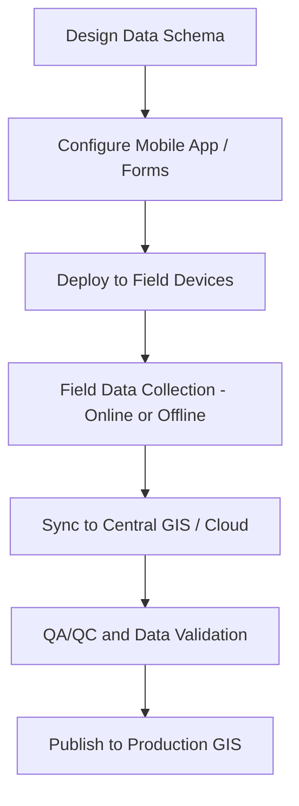
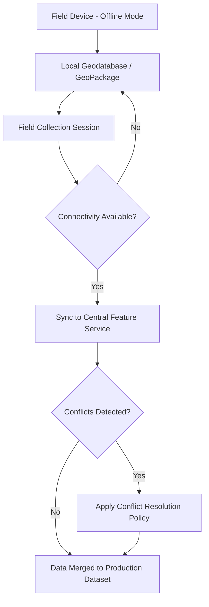

## Mobile GIS Data Collection Workflows

### Overview

Mobile GIS data collection refers to the end-to-end process of capturing geospatial features and attribute data in the field using handheld or vehicle-mounted devices, then integrating that data into a centralized GIS. Modern mobile GIS workflows have largely replaced paper-based field mapping, combining GNSS positioning, digital forms, offline capability, and cloud synchronization to streamline data capture, reduce transcription error, and accelerate the path from field observation to usable spatial data.

### Core Components of a Mobile GIS Workflow

**Key Points**

- **Positioning source**: internal device GNSS chipset (consumer-grade, meter-level), Bluetooth-connected external GNSS receiver (sub-meter to cm-level), or RTK-enabled mobile receiver.
- **Data collection application**: software running on the field device that presents digital forms, captures geometry (points, lines, polygons), and manages attribute entry (e.g., Esri Field Maps/Survey123, QField, Mergin Maps, Fulcrum, QGIS mobile clients).
- **Data schema**: predefined feature classes, attribute fields, domains (pick lists), and validation rules — typically authored in the desktop GIS and pushed to the field app.
- **Synchronization mechanism**: the process by which field-collected data is transferred to/from a central geodatabase or cloud feature service, either continuously (online) or in batch (offline sync).
- **Backend GIS platform**: the central data store and services layer (e.g., ArcGIS Online/Enterprise, PostGIS-backed server, cloud feature service) that hosts the authoritative dataset.

### Data Schema Design

**Key Points**

- Schema design happens before field deployment and defines what can be collected and how, directly shaping data consistency and usability.
- Key schema elements:
  - **Feature classes/layers**: points, lines, or polygons representing distinct real-world feature types (e.g., utility poles, trail segments, vegetation plots).
  - **Attribute fields**: structured data associated with each feature (text, numeric, date, domain-constrained pick lists).
  - **Domains/coded value lists**: constrain attribute entry to valid predefined values, reducing free-text inconsistency and typos.
  - **Required vs. optional fields**: enforce completeness for critical attributes while allowing flexibility for secondary information.
  - **Relationship classes**: link related tables (e.g., a single point feature with multiple repeated inspection records over time).
- Well-designed schemas anticipate field conditions: smart defaults, conditional field visibility (showing/hiding fields based on prior answers), and appropriately constrained input types reduce field error and speed data entry.

### Online vs. Offline Collection

**Online (Connected) Collection**

Data is written directly to the central feature service in real time as it is collected, provided the device has network connectivity.

**Key Points**

- Immediate availability of data to other users/systems; simplifies conflict management since there is no local/server divergence to reconcile.
- Not viable in areas without reliable cellular/network connectivity, which is common in remote or rural field conditions.

**Offline Collection**

Data is stored locally on the device (typically in a local geodatabase, GeoPackage, or similar format) and synchronized to the central system when connectivity becomes available.

**Key Points**

- Essential for remote fieldwork, but introduces the need for **offline map areas** (pre-downloaded basemap and reference data) and a defined **sync strategy**.
- **Sync conflict handling**: if multiple field devices or a device and the server both modify the same feature while offline, the system must apply a conflict resolution policy (e.g., last-write-wins, server-wins, or manual conflict review) — workflow design should specify which policy applies and how conflicts are surfaced to reviewers.
- Offline basemap/reference layer management (downloading appropriately sized map packages for the project area) is a practical logistics step that must be planned before field deployment, particularly for large project areas or limited device storage.

### Positioning Accuracy in Mobile GIS

| Positioning Source | Typical Accuracy | Notes |
| --- | --- | --- |
| Internal smartphone/tablet GNSS | 3–10 m | Varies with device, sky visibility, urban environment |
| Bluetooth sub-meter GNSS receiver | 0.3–1 m | Common for utility/asset mapping workflows |
| Bluetooth RTK-capable receiver | 1–5 cm | Requires NTRIP/correction source connectivity |
| Dedicated survey-grade GNSS integrated with mobile app | 1–2 cm | Highest accuracy, highest cost |

**Key Points**

- Mobile GIS apps typically allow configuring a minimum accuracy threshold before a point can be logged (e.g., rejecting positions with estimated horizontal accuracy worse than a specified value), providing a built-in quality gate at the point of collection.
- Averaging multiple GNSS fixes over a short duration at a point (where supported) can improve position quality compared to a single instantaneous fix, particularly for consumer-grade or sub-meter receivers.
- [Unverified] Achievable accuracy for any given device/receiver combination depends on firmware, antenna design, and environmental conditions, so manufacturer specifications should be treated as best-case figures rather than guaranteed field performance.

### Field Data Capture Methods

**Key Points**

- **Point capture**: single GNSS fix (or averaged fix) recorded at the feature location, typically the majority of asset/inventory mapping workflows.
- **Line/polygon capture (streaming/tracklog)**: continuous position logging while moving (walking, driving) to capture linear or area features (trails, roads, vegetation boundaries), often at a fixed time or distance interval.
- **Vertex-by-vertex capture**: manually placing individual vertices to define a line or polygon shape, offering more control than streaming but requiring more time per feature.
- **Photo/media attachment**: capturing georeferenced photos, sketches, or other media linked to a feature record, increasingly standard in mobile GIS for documentation and verification.
- **Digital forms with smart logic**: conditional field display, calculated fields, and validation rules embedded in the form reduce data entry error and enforce schema compliance at the point of collection rather than in post-processing.

### Integration with External GNSS Receivers

**Key Points**

- Most mobile GIS apps support pairing with external Bluetooth GNSS receivers to override the device's internal (lower-accuracy) GNSS chipset, typically via standard protocols (e.g., NMEA output over Bluetooth).
- For RTK-capable mobile workflows, the app must be configured with correction source details (NTRIP caster address, mountpoint, credentials) in addition to receiver pairing.
- Antenna height/offset entry (if using a range pole with an external receiver) is required for accurate feature positioning, analogous to antenna height entry in survey-grade RTK workflows.

### QA/QC in Mobile GIS Workflows

**Key Points**

- **Field-level validation**: required fields, domain constraints, and accuracy thresholds enforced by the app at the moment of capture prevent many errors from ever entering the dataset.
- **Supervisor review workflows**: some platforms support a review/approval step where submitted field data is checked by a supervisor before being merged into the production dataset.
- **Post-collection QA**: systematic review of collected data for completeness, attribute consistency, positional outliers, and duplicate features, typically performed in the desktop GIS after sync.
- **Version tracking/editor tracking**: recording who collected/edited each feature and when supports accountability and troubleshooting when data quality issues arise.

### Example Workflow: Utility Asset Inventory

**Example**

1. Design schema in desktop GIS: point feature class for utility poles with domain-constrained attributes (material, condition, install year), photo attachment field, required-field validation for asset ID.
2. Publish schema as a feature service/offline-capable map package; configure the mobile app (e.g., Field Maps or equivalent) with the form layout and default map extent.
3. Pair field devices with sub-meter Bluetooth GNSS receivers; download offline map areas covering the service territory.
4. Field crews collect pole locations, complete attribute forms, and attach photos; app enforces minimum accuracy threshold before allowing point submission.
5. Crews sync data at end of shift (or opportunistically when connectivity is available); supervisor reviews submitted records via a review layer/dashboard.
6. Approved records merge into the production utility geodatabase; rejected/flagged records are returned to field crews for correction.
7. Periodic QA pass checks for duplicate poles, missing required attributes, and positional outliers against known utility corridor alignments.

### Common Pitfalls

**Key Points**

- **Inadequate offline map preparation**: field crews arriving at a remote site without properly downloaded offline basemaps/reference layers, hampering navigation and context during collection.
- **Overly permissive schema**: too many optional/free-text fields leading to inconsistent, hard-to-analyze attribute data across different field collectors.
- **No accuracy threshold enforcement**: allowing low-quality GNSS fixes to be logged without warning, producing scattered or misplaced features that are costly to identify and correct later.
- **Unmanaged sync conflicts**: deploying multiple crews to overlapping areas without a clear conflict resolution policy, leading to duplicate or contradictory feature edits.
- **Missing device/battery logistics planning**: field days cut short by inadequate battery capacity or external GNSS receiver charge, particularly relevant for full-day offline data collection in remote areas.

### Related Topics

- GNSS receiver integration and Bluetooth/NTRIP configuration for mobile devices
- Offline geodatabase and GeoPackage synchronization architecture
- Domain and coded-value schema design for field data collection
- Supervisor review and approval workflows in cloud GIS platforms
- Field data QA/QC procedures and positional outlier detection
- Photo/media georeferencing and attachment management
- Mobile app selection criteria (Field Maps, Survey123, QField, Fulcrum, Mergin Maps)
- Feature service publishing and versioned editing in enterprise GIS