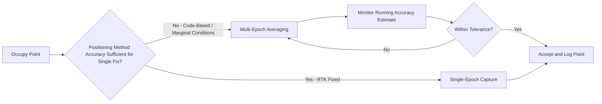

## GNSS Field Data Capture Techniques

### Overview

GNSS field data capture techniques are the operational methods used to collect accurate, reliable positional data with satellite receivers in real-world field conditions. While underlying GNSS principles and positioning methods (SPS, DGNSS, RTK, PPP) define *what* accuracy is achievable, field capture technique determines whether that theoretical accuracy is actually realized for a given point, line, or area feature. This includes point averaging strategies, feature-type-specific capture methods, environmental mitigation, and field-level quality checks.

### Point Feature Capture

**Single-Epoch (Instantaneous) Capture**

A single position fix is logged at the moment of capture.

**Key Points**

- Fastest method, suitable when the positioning method already delivers sufficient accuracy for the application (e.g., RTK fixed solution for a topographic point).
- More susceptible to transient noise, momentary multipath, or a brief dip in satellite geometry than averaged capture, since there is no redundancy within the single observation.

**Averaged (Multi-Epoch) Capture**

Multiple position fixes are logged over a defined duration or epoch count at a single physical location and statistically combined (typically mean position with reported standard deviation/accuracy estimate).

**Key Points**

- Reduces the influence of random noise and short-duration multipath by averaging out zero-mean error components.
- Duration/epoch count should scale with required accuracy and receiver class: a few seconds may suffice for RTK-fixed mapping-grade points, while sub-meter or code-based positioning benefits from tens of seconds to a few minutes of averaging.
- Most field data collection apps display a running accuracy estimate during averaging, allowing the operator to extend collection time if the estimate has not yet stabilized within the required tolerance.
- [Unverified] The specific relationship between averaging duration and accuracy improvement is receiver- and condition-dependent; general field guidance (e.g., "average longer under poor conditions") is standard practice, but universal numeric benchmarks should not be assumed applicable across all equipment.

### Line and Polygon Feature Capture

**Streaming (Continuous Tracklog) Capture**

The receiver logs positions automatically at a fixed time or distance interval while the operator moves along a linear feature or around a polygon boundary.

**Key Points**

- Efficient for long linear features (trails, roads, fence lines, streams) or irregular polygon boundaries where manual vertex placement would be impractical.
- Interval selection (time-based vs. distance-based) affects vertex density and resulting file size/detail: shorter intervals capture more geometric detail (useful for curving features) but produce larger datasets requiring more post-processing generalization.
- Streaming while stationary (e.g., paused at an obstruction) can introduce clustered or noisy vertices; operators should pause logging during stops where practical.

**Vertex-by-Vertex (Manual Point) Capture**

The operator manually triggers a position log at each desired vertex, typically at corners or direction changes of a linear/polygon feature.

**Key Points**

- Offers more deliberate control over geometry and reduces unnecessary vertex density compared to streaming, useful for features with well-defined straight segments (e.g., building footprints, parcel boundaries).
- Each vertex can be captured with single-epoch or averaged methods depending on required per-vertex accuracy.
- More time-intensive per unit length than streaming, making it less practical for very long linear features.

### Feature Offset and Offset Capture Techniques

**Key Points**

- When a feature cannot be directly occupied (underground utility, hazardous location, feature center inaccessible due to vegetation/structure), an **offset capture** technique records the position of an accessible nearby point along with a measured distance/bearing/direction offset to the true feature location, which the software or subsequent processing applies to compute the corrected position.
- Common offset methods: **distance-bearing offset** (distance and compass bearing from occupied point to feature), **right-angle offset** (perpendicular distance from a baseline), or laser rangefinder-assisted offset (using an integrated or paired laser device to measure distance/direction directly).
- Offset techniques introduce additional error sources beyond GNSS positioning itself (bearing/distance measurement error), which should be accounted for when assessing overall achieved accuracy.

### Environmental Mitigation Techniques

**Multipath and Signal Obstruction**

**Key Points**

- Positioning the antenna/device with maximum sky visibility (away from building walls, vehicles, dense canopy where avoidable) reduces multipath and signal blockage.
- Range poles with bipod/tripod support improve antenna stability and consistent height compared to handheld capture, particularly relevant for averaged or RTK-fixed observations.
- Where canopy or obstruction cannot be avoided, allowing additional time for signal reacquisition and extending averaging duration helps compensate for degraded satellite tracking.

**Satellite Geometry (DOP) Awareness**

**Key Points**

- Field software typically displays real-time DOP values (PDOP/HDOP); capturing critical points during periods of poor DOP (e.g., a temporary satellite gap) should be avoided when the schedule allows waiting for improved geometry.
- Mission planning tools (GNSS satellite visibility/DOP prediction software) can help schedule high-precision fieldwork during favorable satellite geometry windows, particularly relevant in partially obstructed sites where visible satellite count is already reduced.

**Correction Source Reliability**

**Key Points**

- For RTK/Network RTK workflows, field technique includes monitoring "age of corrections" (correction data latency) and fix status continuously, not just at the start of a session — a fix can silently degrade from Fixed to Float if a correction link is interrupted.
- Operators should re-verify fix status after any extended pause, movement through an obstruction, or loss of radio/cellular signal, rather than assuming a previously achieved fix remains valid.

### Quality Checks During Field Capture

**Key Points**

- **Real-time accuracy display**: virtually all professional field GNSS software displays estimated horizontal/vertical accuracy for the current fix; operators should be trained to check this before logging any point, not just after.
- **Minimum accuracy thresholds**: configuring the field app or workflow to reject/flag points that do not meet a minimum accuracy standard provides an automatic quality gate.
- **Redundant capture of critical points**: revisiting key control or reference points from a different satellite geometry window (different time of day) or via an independent method provides a check against systematic error undetectable from a single occupation.
- **Field notes and metadata logging**: recording observation conditions (canopy cover, weather, obstruction notes, fix type achieved) alongside each point supports later QA review and helps explain any anomalies found in office review.

### Antenna Height and Setup Technique

**Key Points**

- Consistent, correctly measured antenna height (or use of a fixed-height range pole) is essential; height measurement errors translate directly into vertical position errors and, for slant height measurement methods, also introduce horizontal error if not properly corrected.
- Bipod or tripod use during averaged/static observations improves stability compared to handheld poles, particularly important for longer occupation times where hand tremor or unintentional tilt would otherwise degrade the average.
- For network/RTK rovers, verifying the antenna reference point (ARP) and any manufacturer-specific offset configuration in the field software prevents systematic height bias across an entire dataset.

### Example: Field Capture Decision Workflow

**Example**

1. Confirm positioning method and expected accuracy for the current feature type (per survey design plan).
2. At each point, verify fix status (Fixed/Float/Autonomous) and displayed accuracy estimate before logging.
3. For control or high-precision points: use averaged capture with bipod/tripod support; extend duration if accuracy estimate has not stabilized.
4. For routine mapping-grade points under good conditions: single-epoch capture is generally sufficient if fix status and accuracy meet the defined threshold.
5. For linear features: select streaming vs. vertex capture based on feature geometry (curved vs. angular) and required vertex density.
6. For inaccessible features: apply an appropriate offset technique, recording offset measurements and method used.
7. Log field notes for any point captured under degraded conditions (canopy, multipath-prone location, marginal fix) to support office QA review.
8. Periodically revisit or cross-check critical points using an independent observation to validate consistency.

### Common Field Capture Errors

| Error | Cause | Mitigation |
| --- | --- | --- |
| Point logged during Float (not Fixed) solution | Operator not checking fix status before logging | Enforce fix-status check in workflow/training |
| Vertical offset across dataset | Incorrect or inconsistent antenna height entry | Standardize pole height, verify ARP offset settings |
| Scattered/noisy line geometry | Streaming interval too short, or logging while stationary | Adjust interval, pause logging during stops |
| Missed feature identification | Offset technique not applied for inaccessible feature | Train crews on offset capture methods |
| Undetected degraded accuracy | No minimum accuracy threshold configured | Configure app-level accuracy gate |
| Silent fix degradation mid-session | Correction link interruption not noticed | Continuous fix/latency monitoring during capture |

### Related Topics

- RTK and Network RTK positioning fundamentals
- Satellite Dilution of Precision (DOP) and mission planning
- Mobile GIS schema design and field app configuration
- Antenna phase center and reference point (ARP) considerations
- Multipath mitigation and antenna site selection
- Field QA/QC procedures and redundant observation strategy
- Offset survey techniques for inaccessible features
- Post-processing and correction of field-collected GNSS data