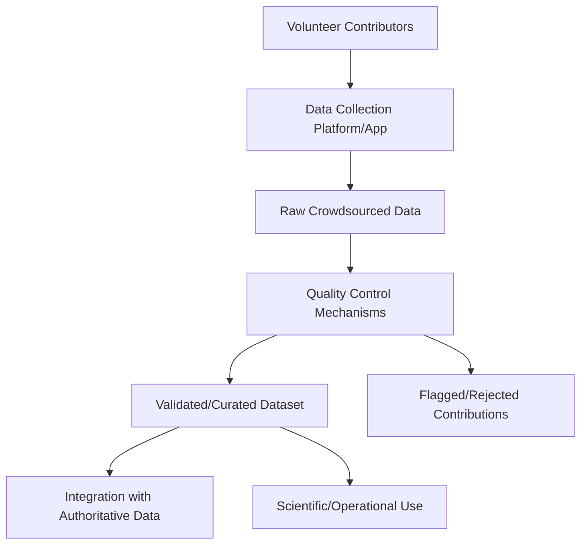
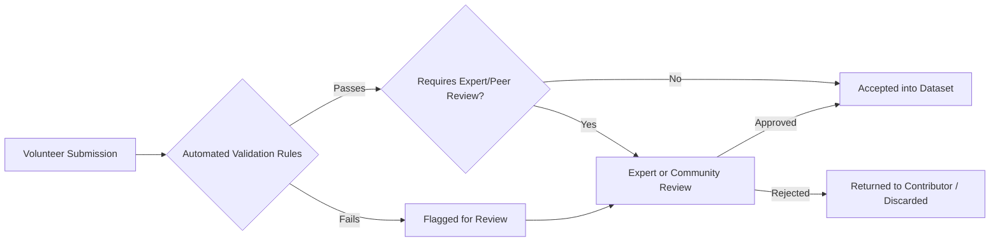

## Volunteered Geographic Information and Citizen Science

### Overview

Volunteered Geographic Information (VGI) refers to geospatial data created, collected, and shared voluntarily by members of the public, rather than by authoritative agencies or trained professionals. Citizen science extends this concept to structured scientific data collection efforts that engage non-professional volunteers in observation, measurement, and reporting. Together, these approaches have become significant sources of geospatial data — spanning crowdsourced mapping (OpenStreetMap), crisis response mapping, biodiversity observation, environmental monitoring, and disaster damage assessment — while raising distinct challenges around data quality, bias, and validation not present in traditional authoritative surveying.

### VGI Typology

**Key Points**

- **Asserted VGI (implicit)**: data generated incidentally as a byproduct of other activity, such as geotagged social media posts or fitness-tracker GPS tracks, not created with explicit mapping intent.
- **Volunteered VGI (explicit)**: data deliberately contributed by volunteers with the specific intent of mapping or documenting geographic information (e.g., OpenStreetMap edits, citizen science observations).
- **Contributed vs. Crowdsourced**: contributed VGI often involves sustained, engaged individual contributors (dedicated OSM mappers), while crowdsourced VGI aggregates many small, often one-time contributions (crisis mapping "microtasking").

### OpenStreetMap (OSM) as a VGI Case Study

**Key Points**

- OSM is a collaboratively edited global map database, built and maintained by a distributed volunteer community using a shared editing platform and open license (Open Database License).
- Core data model: **nodes** (points), **ways** (lines/polygons), and **relations** (groupings of nodes/ways with defined roles), each carrying **tags** (key-value attribute pairs) describing feature type and properties.
- Quality varies significantly by region, correlating with local mapper community density and engagement — well-mapped urban areas in active mapping communities can rival or exceed authoritative data quality, while remote or low-engagement areas may have sparse or outdated coverage.
- **Humanitarian OpenStreetMap Team (HOT)** coordinates volunteer mapping for disaster response and humanitarian purposes, often using microtasking platforms to break large mapping tasks (e.g., mapping buildings from satellite imagery after a disaster) into small, distributable units for volunteers worldwide.

### Citizen Science Data Collection Models

**Structured/Contributory Projects**

Scientists design the project, methodology, and data collection protocol; volunteers contribute data following defined procedures.

**Key Points**

- Common in biodiversity monitoring (e.g., bird counts, species observation platforms), water quality monitoring, and phenology tracking.
- Protocol standardization (consistent measurement methods, defined observation windows, calibrated equipment where applicable) is critical to producing scientifically usable data from distributed, non-professional observers.

**Collaborative Projects**

Volunteers contribute to data collection and may also participate in analysis, interpretation, or refining the research question, working alongside professional scientists.

**Co-Created Projects**

Volunteers and scientists jointly design the research question, methodology, and data collection approach from the outset — the least common but potentially most engaged model.

### Data Quality Challenges in VGI/Citizen Science

**Key Points**

- **Positional accuracy variability**: contributor GNSS equipment ranges from consumer smartphones (meter-level, variable) to professional-grade receivers, producing inconsistent positional quality across a single crowdsourced dataset.
- **Spatial and demographic bias**: contribution density typically correlates with population density, internet/smartphone access, and community engagement — meaning VGI coverage is systematically uneven, often underrepresenting rural, low-income, or lower-connectivity areas.
- **Attribute/classification inconsistency**: non-expert volunteers may apply inconsistent terminology, classification criteria, or measurement technique compared to trained professionals, particularly for tasks requiring specialized identification skills (e.g., species identification).
- **Temporal inconsistency**: volunteer effort is rarely uniform over time, producing data collection gaps or bursts tied to volunteer availability, publicity events, or seasonal engagement patterns rather than the phenomenon being studied.
- **Verifiability and provenance**: unlike professional survey data with documented methodology and equipment, individual VGI contributions may lack metadata needed to assess their reliability.

### Quality Assurance Mechanisms

**Key Points**

- **Peer/community review**: platforms like OSM rely on the broader mapping community to review, correct, and flag questionable edits (supported by changeset review tools and community norms).
- **Automated validation rules**: geometric and logical consistency checks (e.g., detecting self-intersecting polygons, tag-value inconsistencies, duplicate features) applied automatically to flag likely errors.
- **Expert verification/moderation**: structured citizen science platforms often incorporate expert review of a sample or all submissions, particularly for identification-dependent data (e.g., species records requiring photo verification).
- **Redundancy/consensus approaches**: requiring multiple independent volunteer observations of the same feature/phenomenon before acceptance, using agreement level as a confidence indicator.
- **Reputation/trust systems**: tracking contributor history and accuracy over time to weight or filter contributions (more established in some platforms than others).

### Applications in Geospatial and Environmental Science

**Key Points**

- **Disaster response mapping**: rapid volunteer mapping of affected areas (building damage assessment, road network status) via platforms like HOT OSM, providing timely data where authoritative mapping cannot keep pace.
- **Biodiversity and species monitoring**: large-scale citizen observation networks (e.g., bird count programs, general biodiversity observation platforms) generate datasets at spatial/temporal scales unachievable through professional fieldwork alone.
- **Environmental quality monitoring**: distributed volunteer measurement of air quality, water quality, noise levels, or invasive species presence, often using low-cost sensors paired with mobile data collection apps.
- **Land cover/land use verification**: volunteer-contributed ground-truth photos and classifications supporting validation of remote sensing-derived land cover products.
- **Flood and hazard mapping**: community-reported flood extent, damage, and hazard observations supplementing or ground-truthing remote sensing-based assessments, particularly valuable in data-sparse regions.

### Integrating VGI with Authoritative Data

**Key Points**

- VGI is rarely used as a wholesale replacement for authoritative/professional geospatial data but rather as a complement — filling coverage gaps, providing rapid updates between authoritative survey cycles, or offering ground-truth validation.
- Integration workflows typically involve conflation (matching and merging VGI features with corresponding authoritative features), consistency checking, and explicit documentation of which portions of a combined dataset derive from which source and confidence level.
- Metadata documenting VGI provenance (contributor method, equipment where known, collection date, any validation applied) is important for downstream users to assess fitness-for-use, analogous to standard geospatial metadata practice but often less consistently available for volunteer-contributed data.

### Ethical and Practical Considerations

**Key Points**

- **Privacy**: crowdsourced data collection involving personal location or property information raises privacy considerations that should be addressed in platform design and data sharing policy.
- **Volunteer burden and sustainability**: citizen science and VGI projects depend on sustained volunteer engagement; project design should consider volunteer motivation, recognition, and reasonable task complexity to maintain participation over time.
- **Equity of representation**: given the spatial/demographic biases noted above, analyses using VGI should account for and disclose potential coverage gaps rather than treating volunteer data coverage as representative by default.
- **Data licensing and attribution**: VGI platforms typically operate under specific open data licenses (e.g., OSM's ODbL) with attribution requirements that must be respected when incorporating the data into other products.

### Example: Post-Disaster Mapping Workflow

**Example**

1. Disaster event triggers activation request to a volunteer mapping community (e.g., HOT OSM activation).
2. Satellite/aerial imagery of the affected area is made available to volunteers via a microtasking platform.
3. Volunteers remotely digitize visible features (buildings, roads, damage indicators) from imagery, working on small assigned grid squares.
4. Community validators review completed squares for accuracy and completeness, flagging or correcting errors.
5. Aggregated, validated data is made available to humanitarian responders, supplementing or substituting for authoritative mapping unavailable in the affected area.
6. Post-event, the dataset may be further refined using field reports or higher-resolution imagery as it becomes available.

### Related Topics

- OpenStreetMap data model and editing workflows
- Humanitarian OpenStreetMap Team (HOT) and crisis mapping methodology
- Crowdsourced data quality assessment and validation frameworks
- Citizen science platform design (biodiversity, water quality, air quality)
- Conflation techniques for merging VGI with authoritative datasets
- Spatial bias analysis in crowdsourced datasets
- Mobile data collection app design for non-expert users
- Open data licensing (ODbL, Creative Commons) for geospatial data