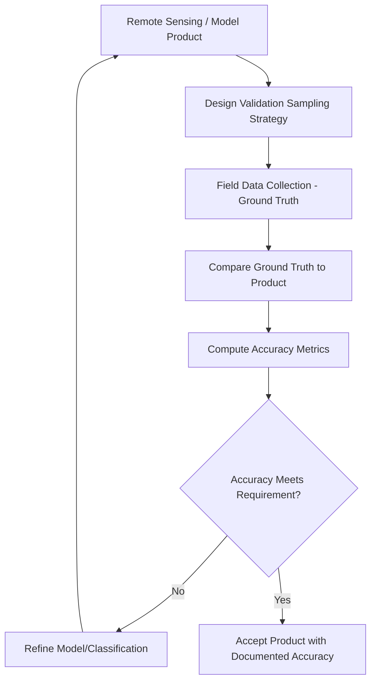
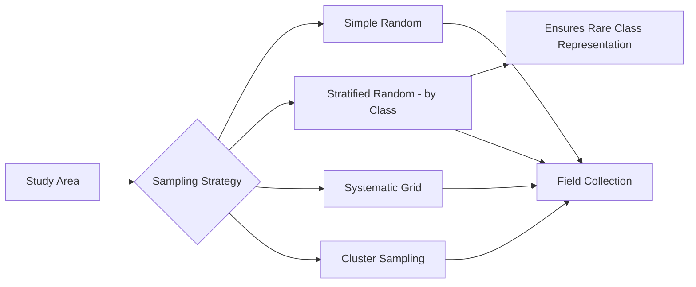

## Ground-Truthing and Field Validation Methods

### Overview

Ground-truthing (also called field validation or field verification) is the process of collecting reference data directly in the field to verify, calibrate, or assess the accuracy of remotely sensed data, classified imagery, models, or map products. It provides the empirical link between what a sensor, algorithm, or map depicts and what actually exists on the ground, and is a required step for producing defensible accuracy statements for any derived geospatial product — classified land cover maps, digital elevation models, species distribution models, or change detection outputs.

### Purposes of Ground-Truthing

**Key Points**

- **Training data collection**: reference samples used to train supervised classification algorithms (e.g., land cover classification from satellite imagery) before the model is applied to the full dataset.
- **Accuracy assessment**: independent reference samples (distinct from training data) used to statistically evaluate the accuracy of a completed classification, model, or map product.
- **Calibration**: field measurements used to calibrate sensor outputs or model parameters against physically measured quantities (e.g., calibrating a vegetation index against measured biomass or leaf area index).
- **Change detection verification**: field confirmation that detected changes (e.g., deforestation, land cover conversion) identified remotely actually occurred and are correctly characterized.

### Sampling Design for Ground-Truthing

**Key Points**

- Sample design must be statistically defensible: samples used for accuracy assessment should be selected using a probability-based sampling design, not convenience sampling (e.g., only sampling easily accessible roadside locations), to avoid biased accuracy estimates.
- Common sampling strategies:
  - **Simple random sampling**: samples drawn randomly across the entire study area; straightforward but may undersample rare classes/features.
  - **Stratified random sampling**: study area divided into strata (e.g., by mapped land cover class), with random samples drawn within each stratum — commonly preferred for classification accuracy assessment since it ensures adequate representation of rare classes.
  - **Systematic sampling**: samples placed at regular intervals (grid-based); simple to implement but can introduce bias if the sampling interval aligns with periodic spatial patterns in the landscape.
  - **Cluster sampling**: groups of nearby samples collected together to reduce field travel time, at some cost to statistical independence between samples within a cluster.
- Sample size must be sufficient to produce statistically meaningful accuracy estimates, particularly per-class accuracy in a multi-class classification; standard guidance (e.g., minimum samples per class) exists in remote sensing accuracy assessment literature, though [Unverified] specific minimum sample sizes vary by methodology and desired confidence level and should be determined via established statistical guidance for the specific assessment method used.
- Training and validation samples must be kept independent — using the same points for both training a classifier and assessing its accuracy produces optimistically biased (invalid) accuracy estimates.

### Field Data Collection for Ground-Truthing

**Key Points**

- Ground reference data should be collected using a method and timing appropriate to what is being validated: land cover classification requires field-verified cover type at each sample point, ideally close in time to the remote sensing acquisition date to avoid land cover change between image capture and field visit.
- Positional accuracy of ground-truth points should meet or exceed the spatial resolution of the product being validated — a ground-truth point with several meters of positional error is inadequate for validating a fine-resolution (e.g., sub-meter) classification.
- Data recorded at each ground-truth point typically includes: precise location (GNSS), observed class/attribute, photographs, and relevant contextual notes (e.g., homogeneity of the surrounding area, presence of mixed classes within a pixel/cell footprint).
- **Minimum mapping unit / plot size** considerations: the ground reference area sampled should correspond appropriately to the pixel size or minimum mapping unit of the product being validated, avoiding edge/boundary locations where mixed-class pixels would produce ambiguous validation results.

### Accuracy Assessment Metrics

**Confusion (Error) Matrix**

A cross-tabulation of classified (mapped) categories against reference (ground-truth) categories, forming the foundation for most classification accuracy metrics.

|  | Reference: Class A | Reference: Class B | Row Total |
| --- | --- | --- | --- |
| **Mapped: Class A** | Correct (A) | Error (Commission) | Total A mapped |
| **Mapped: Class B** | Error (Omission) | Correct (B) | Total B mapped |
| **Column Total** | Total A reference | Total B reference | Grand Total |

**Key Metrics**

- **Overall Accuracy**: proportion of all samples correctly classified.

$$OA = \frac{\sum_{i} n_{ii}}{N}$$

Where $n_{ii}$ is the number of correctly classified samples in class $i$, and $N$ is the total number of samples.

- **Producer's Accuracy** (relates to omission error): proportion of reference samples of a given class correctly classified — reflects how well the map represents that class on the ground.
- **User's Accuracy** (relates to commission error): proportion of mapped samples of a given class that are correct on the ground — reflects how reliable the map is when a user encounters that class.
- **Kappa Coefficient**: measures agreement between classification and reference data while accounting for agreement expected by chance.

$$\kappa = \frac{OA - P_e}{1 - P_e}$$

Where $P_e$ is the expected proportion of agreement by chance, computed from the row/column totals of the confusion matrix. [Unverified] The Kappa coefficient's interpretation and continued appropriateness as a standard metric is debated in current remote sensing literature, with some researchers advocating alternative metrics; it remains widely reported but should not be treated as a universally endorsed single best measure.

### Continuous/Quantitative Product Validation

For continuous outputs (e.g., digital elevation models, biomass estimates, vegetation indices) rather than discrete classifications, different validation metrics apply:

- **Root Mean Square Error (RMSE)**:

$$RMSE = \sqrt{\frac{1}{n}\sum_{i=1}^{n}(P_i - O_i)^2}$$

Where $P_i$ is the predicted/mapped value and $O_i$ is the observed (ground-truth) value at sample $i$.

- **Bias (Mean Error)**: average signed difference between predicted and observed values, indicating systematic over- or under-prediction.
- **Coefficient of determination ($R^2$)**: proportion of variance in observed values explained by the predicted values, commonly reported alongside RMSE for regression-type validation.

### Field Validation Techniques by Application

**Land Cover/Land Use Classification**

**Key Points**

- Field crews visit sample points and record observed land cover class using a classification scheme consistent with the mapped product's legend.
- Photo documentation at each point supports later review and can itself become part of a reference dataset for future classification efforts.

**Digital Elevation Model (DEM) Validation**

**Key Points**

- Independent, high-accuracy GNSS or total station elevation measurements at check points (not used in DEM generation) are compared against the DEM-derived elevation at the same horizontal location, typically summarized via RMSE.
- Check points should represent the range of terrain conditions and land cover types present in the study area (bare ground, vegetated, urban), since DEM accuracy — particularly for LiDAR/photogrammetry-derived products — often varies systematically by land cover type.

**Vegetation/Biomass Model Validation**

**Key Points**

- Destructive or non-destructive field biomass/structural measurements (e.g., diameter at breast height, tree height, plot-level biomass estimation) at sample plots are compared against remotely sensed model predictions for the same locations.
- Plot size and placement must be carefully matched to the spatial resolution and footprint of the remote sensing data being validated.

**Change Detection Validation**

**Key Points**

- Field verification confirms whether detected changes are real (not sensor artifacts, illumination differences, or misregistration) and correctly characterized (e.g., confirming forest loss is actually clear-cutting rather than a temporary disturbance).
- Historical imagery, prior field records, or local knowledge can supplement direct field visits when validating change that occurred before the current field season.

### Timing and Logistics Considerations

**Key Points**

- Field validation timing relative to the remote sensing acquisition date matters significantly for dynamic phenomena (vegetation phenology, water levels, agricultural crop stage); a validation visit weeks or months after image acquisition may no longer reflect ground conditions at capture time.
- Access constraints (private land permissions, remote/hazardous terrain, seasonal accessibility) should be assessed during sampling design, since inaccessible sample points may need to be excluded or substituted, with implications for the statistical validity of the resulting accuracy assessment if inaccessibility correlates with any particular class or condition.
- Some validation efforts substitute or supplement field visits with high-resolution reference imagery interpretation by trained analysts when direct field access is impractical, though this introduces its own interpretation uncertainty distinct from direct field observation.

### Example: Land Cover Classification Accuracy Assessment Workflow

**Example**

1. Complete land cover classification from satellite/aerial imagery using training samples collected separately from validation samples.
2. Design a stratified random sampling scheme for validation points, ensuring adequate representation of each mapped class (including rare classes).
3. Conduct field visits to each validation point (or interpret high-resolution reference imagery where field access is infeasible), recording observed class using the same legend as the classification.
4. Compile a confusion matrix comparing mapped class to reference (ground-truth) class for all validation points.
5. Compute overall accuracy, producer's/user's accuracy per class, and (if appropriate for the study) Kappa coefficient.
6. Document the accuracy assessment methodology, sample design, and results as part of the product's metadata, supporting appropriate downstream use of the classification.

### Related Topics

- Confusion matrix construction and classification accuracy metrics
- Stratified random sampling design for accuracy assessment
- Supervised classification training data collection
- DEM/DSM accuracy assessment and RMSE reporting standards
- Change detection methodology and field verification protocols
- Remote sensing image classification workflows
- Metadata standards for reporting positional and thematic accuracy
- Field sampling plot design for vegetation/biomass studies