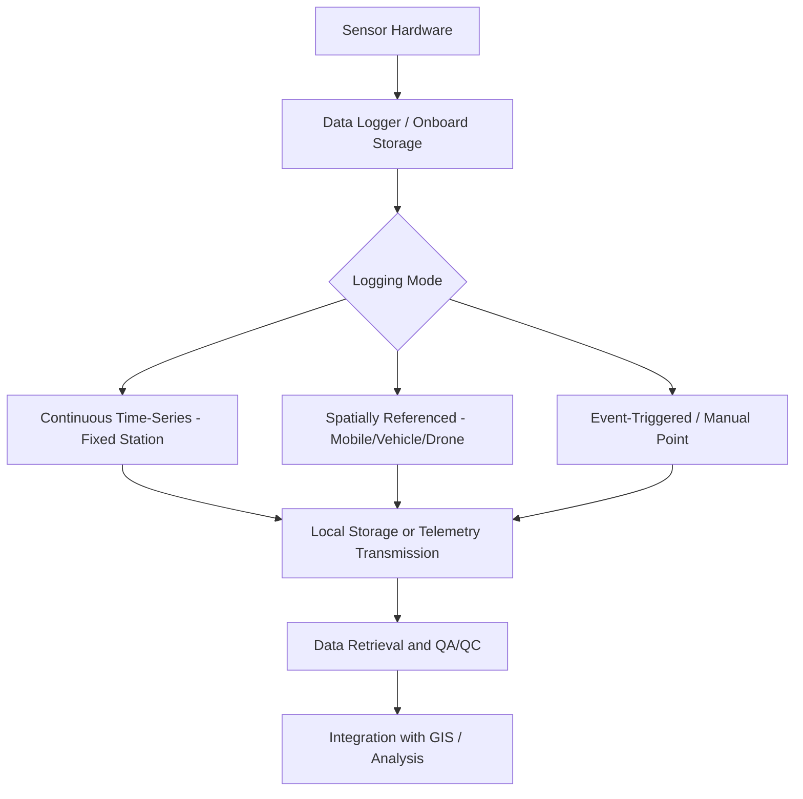
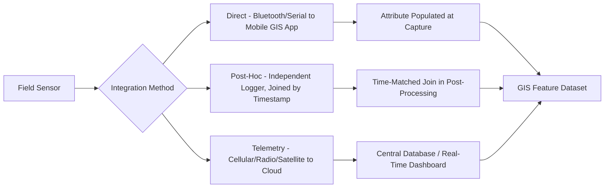

## Sensor-Based Field Data Logging

### Overview

Sensor-based field data logging refers to the collection of environmental, physical, or geospatial measurements using electronic sensors — either standalone dataloggers, sensor networks, or sensors integrated into mobile GIS/GNSS field devices — that automatically record readings over time or space, often with minimal manual intervention. This spans handheld environmental sensors paired with GNSS position, fixed/deployed sensor stations logging continuous time-series data, and vehicle- or drone-mounted sensor arrays capturing spatially continuous measurements. Sensor-based logging complements manual field observation by providing higher measurement precision, continuous/automated recording, and reduced human transcription error.

### Categories of Field Sensors

**Environmental Sensors**

**Key Points**

- Common parameters: temperature, relative humidity, barometric pressure, soil moisture, soil temperature, water level/depth, water quality parameters (pH, dissolved oxygen, conductivity, turbidity), air quality (particulate matter, gas concentrations).
- Deployed as standalone dataloggers at fixed monitoring stations, or as handheld/portable units paired with a mobile GIS device for spot measurements tied to a GNSS position.

**Physical/Structural Sensors**

**Key Points**

- Includes strain gauges, tiltmeters, extensometers, and accelerometers used in infrastructure and geotechnical monitoring (structural health monitoring, slope stability, dam/levee monitoring).
- Often deployed as part of fixed monitoring networks with continuous or high-frequency logging, feeding into deformation/hazard monitoring workflows.

**Imaging and Remote Sensing-Adjacent Sensors**

**Key Points**

- Handheld spectroradiometers, multispectral/hyperspectral field sensors, and portable LiDAR units used to collect ground-reference spectral or structural data supporting remote sensing calibration/validation.
- Thermal imaging sensors for field-based temperature mapping (e.g., urban heat island field verification, wildlife/vegetation studies).

**Positioning-Integrated Sensors**

**Key Points**

- Most modern field data loggers integrate an internal or paired external GNSS receiver, automatically geotagging every sensor reading with position (and often timestamp) without requiring separate manual coordination between position and measurement.

### Logging Modes

**Continuous/Time-Series Logging (Fixed Station)**

A sensor or sensor array remains deployed at a fixed location, recording measurements at a defined sampling interval over an extended period (hours to years).

**Key Points**

- Common for hydrological monitoring (stream gauges, groundwater wells), meteorological stations, and long-term environmental monitoring networks.
- Sampling interval selection involves a trade-off between temporal resolution, storage capacity, and battery/power consumption; interval should be chosen based on the expected rate of change of the measured phenomenon (e.g., water level during a flood event requires much finer interval than seasonal groundwater trends).
- Data retrieval via physical download (visiting the station and connecting to the logger), or telemetry (cellular, radio, or satellite transmission) for near-real-time access, the latter enabling remote monitoring and alert systems.

**Spatially Continuous Logging (Mobile Platforms)**

Sensors mounted on a moving platform (vehicle, backpack, drone) continuously log measurements while simultaneously recording position, producing a spatially continuous dataset along the platform's path.

**Key Points**

- Common in mobile air quality monitoring, mobile mapping LiDAR/imagery systems, and vehicle-based soil/crop sensing in precision agriculture.
- Requires tight time synchronization between sensor measurement timestamps and GNSS position timestamps to correctly geolocate each reading, particularly important at higher platform speeds where position changes rapidly relative to sensor sampling rate.
- Sensor response time/lag must be understood and, where necessary, corrected for, since some sensors (e.g., certain gas sensors) have a response delay that can spatially offset the recorded reading from its true location if the platform is moving.

**Event-Triggered or Manual Point Logging**

Measurements recorded either automatically upon a defined trigger condition (threshold exceedance, motion detection) or manually by a field operator at discrete points.

**Key Points**

- Event-triggered logging (e.g., a water level logger recording at higher frequency once a threshold is exceeded) balances data completeness for critical events against storage/power constraints during normal conditions.
- Manual point logging with a handheld sensor paired to a mobile GIS app typically follows the same point-capture workflow as GNSS field data capture, with the sensor reading recorded as an attribute of the logged feature.

### Sensor-to-GIS Integration Architecture

**Key Points**

- **Direct integration**: sensor output is read directly by the mobile GIS/data collection app (e.g., via Bluetooth, serial, or API connection), automatically populating an attribute field with the live sensor reading at the moment of position capture.
- **Post-hoc integration**: sensor data is logged independently (on the sensor's own datalogger) and later joined to positional/temporal data based on matching timestamps, requiring careful time synchronization between systems.
- **Telemetry-based integration**: fixed sensor stations transmit data (cellular, radio, satellite) to a central database or cloud platform, which may then be queried or visualized directly within a GIS environment via API or scheduled data pull.

### Time Synchronization and Timestamping

**Key Points**

- Accurate, consistent timestamping across sensors, GNSS position, and any paired systems is essential for correct geolocation and for aligning data collected by different devices/sensors in the same study.
- GNSS-derived time is highly accurate and commonly used as the reference clock for synchronizing other onboard sensors in integrated systems, avoiding drift issues associated with independent internal device clocks.
- Time zone and daylight saving handling should be standardized (commonly UTC) across a project to avoid ambiguity when combining data from multiple sensors, stations, or contributors.

### Power and Deployment Logistics

**Key Points**

- Fixed-station deployments must account for power source (battery life, solar recharging) relative to sampling frequency and transmission mode, since telemetry transmission typically consumes significantly more power than local-only logging.
- Sensor housing and deployment design must protect equipment from environmental exposure (moisture, temperature extremes, wildlife interference, vandalism) appropriate to the deployment duration and site conditions.
- Maintenance/calibration schedule planning (sensor drift correction, battery replacement, data retrieval visits) should be part of the deployment plan, particularly for long-duration unattended stations.

### Data Quality Considerations

**Key Points**

- **Sensor calibration**: regular calibration against known reference standards is necessary to maintain measurement accuracy over time, since many environmental sensors drift; calibration records should be documented as part of dataset metadata.
- **Sensor drift and fouling**: sensors deployed in harsh field conditions (e.g., water quality sensors subject to biofouling) may require more frequent cleaning/calibration than manufacturer defaults suggest for controlled conditions.
- **Missing data handling**: gaps due to power failure, sensor malfunction, or communication loss should be flagged (not silently interpolated) in the dataset, with a documented approach to any gap-filling applied during analysis.
- **Outlier detection**: automated range checks and statistical outlier flagging (e.g., values outside physically plausible ranges, or abrupt discontinuities inconsistent with the sensor's expected response characteristics) support identification of malfunction or interference distinct from genuine extreme readings.

### Example: Mobile Water Quality Monitoring Workflow

**Example**

1. Configure a handheld/boat-mounted water quality sensor (pH, dissolved oxygen, conductivity, turbidity) paired via Bluetooth to a mobile GIS app with integrated GNSS.
2. Define sampling protocol: fixed sampling stations (manual point capture) or continuous transect logging along a water body (streaming mode).
3. Verify sensor calibration against reference standards before the field session; record calibration values in field metadata.
4. Conduct field logging: at each station or continuously along the transect, the app automatically pairs each sensor reading with GNSS position and timestamp.
5. Monitor real-time sensor output during collection for anomalous readings suggesting sensor fouling or malfunction; re-calibrate or clean sensor as needed.
6. Sync collected data to central database upon return to connectivity; run automated range/outlier checks before accepting data into the production dataset.
7. Integrate validated readings into GIS for spatial analysis (e.g., interpolating water quality surfaces, identifying pollution source areas).

### Common Pitfalls

**Key Points**

- **Inadequate time synchronization**: independent sensor and GNSS clocks drifting apart over a long deployment, causing progressive spatial/temporal misalignment when data is later joined.
- **Unaccounted sensor response lag**: mobile logging at speeds too fast for a sensor's response time, causing readings to appear spatially offset from their true source location.
- **Missed calibration drift**: relying on factory calibration over an extended deployment without field verification, producing systematically biased readings that may not be visually obvious in the data.
- **Insufficient power/storage planning**: data gaps from battery depletion or storage capacity limits during unattended deployments, particularly costly when they occur during a critical monitoring event.
- **Undocumented missing data**: gaps silently filled or ignored rather than explicitly flagged, misleading downstream analysis about data completeness and reliability.

### Related Topics

- GNSS field data capture techniques and positioning integration
- Time-series data management and telemetry system design
- Sensor calibration protocols and drift correction methods
- Mobile GIS data collection workflow design
- Environmental monitoring network design (hydrological, meteorological, air quality)
- Structural health and geotechnical deformation monitoring
- Data QA/QC for automated/continuous sensor datasets
- Ground-truthing and field validation methods for remote sensing calibration