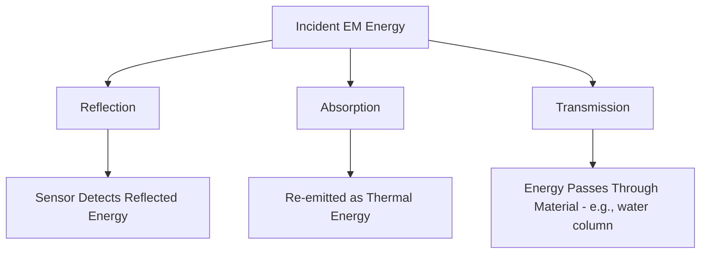
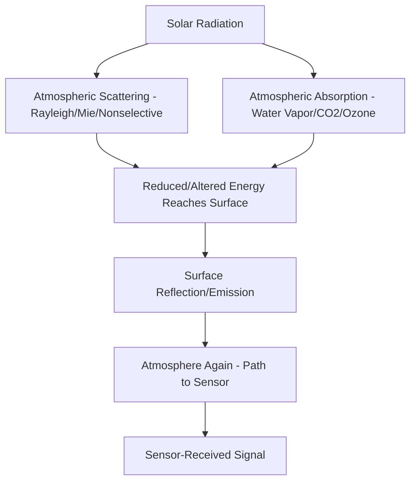

## Electromagnetic Spectrum and Energy Interactions

### Overview

Remote sensing fundamentally depends on the interaction of electromagnetic (EM) energy with the Earth's surface and atmosphere. Understanding the electromagnetic spectrum — its structure, the physical laws governing radiation, and how energy interacts with different materials — provides the foundation for interpreting any remotely sensed image, selecting appropriate sensors, and designing analysis techniques. Every remote sensing measurement, from a simple aerial photograph to hyperspectral satellite data, is fundamentally a record of how EM energy has interacted with matter.

### The Electromagnetic Spectrum

**Key Points**

- Electromagnetic radiation propagates as waves characterized by wavelength ($\lambda$) and frequency ($\nu$), related through the speed of light:

$$c = \lambda \nu$$

- Energy carried by EM radiation is directly proportional to frequency (and inversely proportional to wavelength), described by the Planck relation:

$$E = h\nu = \frac{hc}{\lambda}$$

Where $h$ is Planck's constant ($6.626 \times 10^{-34}$ J·s).

- The EM spectrum spans from very short-wavelength, high-energy gamma rays through X-rays, ultraviolet, visible light, infrared, microwave, to long-wavelength, low-energy radio waves.
- Remote sensing primarily uses the portions of the spectrum from ultraviolet through microwave, since these regions balance useful surface interaction with practical atmospheric transmission and available sensor technology.

### Key Spectral Regions for Remote Sensing

| Region | Approximate Wavelength Range | Primary Remote Sensing Use |
| --- | --- | --- |
| Ultraviolet (UV) | 0.01–0.4 μm | Limited surface use (atmospheric absorption); ozone monitoring |
| Visible | 0.4–0.7 μm | Standard imagery, land cover, true-color mapping |
| Near-Infrared (NIR) | 0.7–1.3 μm | Vegetation health/vigor, vegetation indices (e.g., NDVI) |
| Shortwave Infrared (SWIR) | 1.3–3 μm | Mineral mapping, moisture content, geology |
| Thermal Infrared (TIR) | 3–14 μm | Surface temperature, thermal anomaly detection |
| Microwave | 1 mm–1 m | Radar imaging (SAR), all-weather/day-night capability |

**Key Points**

- Visible light is subdivided into blue (~0.4–0.5 μm), green (~0.5–0.6 μm), and red (~0.6–0.7 μm) bands, corresponding to human color perception and widely used in standard true-color imagery.
- The distinction between reflective infrared (near and shortwave IR, dominated by reflected solar energy) and thermal infrared (dominated by emitted energy from the object itself) is fundamental to how these bands are interpreted and processed.

### Radiation Sources: Passive vs. Active Sensing

**Key Points**

- **Passive remote sensing** measures naturally occurring radiation — reflected solar energy (visible, near/shortwave infrared) or emitted thermal energy from the Earth's surface (thermal infrared) — without the sensor emitting its own energy.
- **Active remote sensing** systems emit their own energy pulse (radar, LiDAR) and measure the returned signal, enabling operation independent of solar illumination (day/night capability) and, for microwave systems, penetration through cloud cover.
- Passive optical sensors are fundamentally limited by available solar illumination and atmospheric conditions (cloud cover blocks visible/NIR/SWIR imaging), while active microwave (radar) systems largely avoid this limitation.

### Blackbody Radiation and Emitted Energy

All objects with temperature above absolute zero emit EM radiation. An idealized perfect emitter/absorber is termed a **blackbody**, described by fundamental radiation laws:

**Planck's Law** describes the spectral radiance emitted by a blackbody at a given temperature across wavelength.

**Wien's Displacement Law** identifies the wavelength of peak emission for a blackbody at a given temperature:

$$\lambda_{max} = \frac{b}{T}$$

Where $b$ is Wien's displacement constant ($\approx 2898$ μm·K) and $T$ is absolute temperature in Kelvin.

**Key Points**

- The Sun (~5778 K) peaks in emission within the visible spectrum, which is why passive optical remote sensing (relying on reflected solar energy) is effective in that range.
- The Earth (~288 K average surface temperature) peaks in emission within the thermal infrared region (~9.7 μm), which is why thermal remote sensing sensors are designed to operate in that spectral window.
- Real-world materials are not perfect blackbodies; their actual emission relative to a blackbody at the same temperature is described by **emissivity** ($\varepsilon$), a dimensionless value between 0 and 1 that varies by material and, to some degree, by wavelength.

**Stefan-Boltzmann Law** relates total emitted radiant energy to temperature:

$$M = \varepsilon \sigma T^4$$

Where $M$ is radiant exitance, $\sigma$ is the Stefan-Boltzmann constant, and $\varepsilon$ is emissivity.

### Energy Interactions at the Earth's Surface

When EM energy strikes a surface, it can be reflected, absorbed, or transmitted, with the proportions varying by wavelength and material:

$$E_I(\lambda) = E_R(\lambda) + E_A(\lambda) + E_T(\lambda)$$

Where $E_I$ is incident energy, and $E_R$, $E_A$, $E_T$ are reflected, absorbed, and transmitted energy respectively, all as functions of wavelength.

**Key Points**

- **Reflectance** is the primary basis for interpreting most optical (visible/NIR/SWIR) imagery, since sensors in this range predominantly detect reflected solar radiation.
- **Absorption** governs which wavelengths are available for surface interaction at all — the atmosphere itself absorbs strongly in certain bands (see atmospheric windows below), and surface materials absorb specific wavelengths related to their molecular/chemical composition, which underlies techniques like mineral and vegetation spectral identification.
- **Transmission** is significant for some surfaces (e.g., water bodies allow some visible light to penetrate, enabling limited bathymetric mapping in clear shallow water) but negligible for most solid opaque surfaces.

### Spectral Signatures

Different materials exhibit characteristic patterns of reflectance across wavelength, known as **spectral signatures** or **spectral response curves**, which form the basis for distinguishing materials in multispectral/hyperspectral imagery.

**Key Points**

- **Healthy vegetation**: low reflectance in visible (especially red and blue, due to chlorophyll absorption), high reflectance in near-infrared (due to internal leaf cell structure), moderate/variable reflectance in shortwave infrared (influenced by leaf water content) — this NIR/red contrast underlies vegetation indices like NDVI.
- **Water**: generally low reflectance across most of the spectrum, decreasing further into near-infrared (strong absorption), making water bodies appear dark in NIR imagery — a common basis for water body delineation.
- **Bare soil**: reflectance generally increases with wavelength through visible into near-infrared, with specific absorption features related to mineral/moisture content.
- **Urban/impervious surfaces**: variable but generally moderate-to-high reflectance across visible and NIR, often with less pronounced spectral features than vegetation or water, making spectral separation from certain soil types more challenging.

<svg xmlns="http://www.w3.org/2000/svg" viewBox="0 0 700 380">
<text x="350" y="24" text-anchor="middle" font-size="15" font-weight="bold" fill="#1a1a1a">Generalized Spectral Reflectance Curves (svg_diagram)</text>
<line x1="70" y1="320" x2="650" y2="320" stroke="#2d3748" stroke-width="1.5" />
<line x1="70" y1="320" x2="70" y2="50" stroke="#2d3748" stroke-width="1.5" />
<text x="360" y="350" text-anchor="middle" font-size="11" fill="#2d3748">Wavelength (Visible to SWIR)</text>
<text x="35" y="185" text-anchor="middle" font-size="11" fill="#2d3748" transform="rotate(-90 35 185)">Reflectance (%)</text>

<text x="130" y="335" font-size="9" fill="`#4a5568`">Blue</text>

<text x="230" y="335" font-size="9" fill="`#4a5568`">Green</text>

<text x="330" y="335" font-size="9" fill="`#4a5568`">Red</text>

<text x="450" y="335" font-size="9" fill="`#4a5568`">NIR</text>

<text x="580" y="335" font-size="9" fill="`#4a5568`">SWIR</text>

<path d="M 100 300 L 180 290 L 260 260 L 340 300 L 420 90 L 500 110 L 580 150 L 630 170" fill="none" stroke="#2f855a" stroke-width="2.5" />
<text x="440" y="80" font-size="10" fill="#2f855a" font-weight="bold">Vegetation</text>
<path d="M 100 260 L 180 270 L 260 280 L 340 290 L 420 305 L 500 315 L 580 318 L 630 319" fill="none" stroke="#2b6cb0" stroke-width="2.5" />
<text x="480" y="300" font-size="10" fill="#2b6cb0" font-weight="bold">Water</text>
<path d="M 100 280 L 180 260 L 260 240 L 340 220 L 420 200 L 500 180 L 580 165 L 630 155" fill="none" stroke="#b7791f" stroke-width="2.5" />
<text x="560" y="140" font-size="10" fill="#b7791f" font-weight="bold">Bare Soil</text>
</svg>

### Atmospheric Interaction and Atmospheric Windows

Before reaching a sensor (whether satellite or aircraft), EM energy must pass through the atmosphere, which selectively scatters and absorbs radiation.

**Atmospheric Scattering**

**Key Points**

- **Rayleigh scattering**: occurs when particles are much smaller than the wavelength (e.g., gas molecules); inversely proportional to wavelength to the fourth power, strongly affecting shorter (blue) wavelengths — the physical cause of the sky's blue color and a source of atmospheric haze in imagery.
- **Mie scattering**: occurs when particles (dust, smoke, pollen) are comparable in size to the wavelength; affects a broader range of wavelengths, contributing to haze under higher aerosol conditions.
- **Nonselective scattering**: occurs when particles (water droplets, larger aerosols) are much larger than the wavelength, scattering all visible wavelengths roughly equally — responsible for clouds and fog appearing white/gray.

**Atmospheric Absorption**

**Key Points**

- Water vapor, carbon dioxide, and ozone strongly absorb radiation in specific spectral bands, effectively blocking those wavelengths from reaching or leaving the surface through the atmosphere.
- **Atmospheric windows** are the spectral regions where atmospheric absorption is minimal, allowing efficient transmission — remote sensing systems are specifically designed to operate within these windows (e.g., most optical sensors avoid strong water vapor absorption bands around 1.4 and 1.9 μm).

### Radiometric Path from Source to Sensor

For passive optical sensors, the total signal received combines several components beyond simple surface reflectance:

**Key Points**

- **Path radiance**: scattered light reaching the sensor without ever interacting with the target surface, contributing an additive "haze" signal not representative of actual ground reflectance.
- **Direct surface-reflected radiance**: the primary signal of interest, representing energy that traveled from source to surface to sensor.
- **Adjacency effects**: scattered radiation from surrounding pixels contaminating the signal for a given target pixel, particularly relevant near sharp reflectance boundaries.
- Atmospheric correction procedures in remote sensing image processing are designed specifically to remove or minimize these non-surface-reflectance contributions, recovering a more accurate estimate of true surface reflectance.

### Practical Implications for Sensor and Band Design

**Example**

- Vegetation monitoring sensors prioritize red and near-infrared bands to exploit the strong reflectance contrast (chlorophyll absorption vs. leaf structure reflectance) that underlies vegetation indices like NDVI.
- Thermal sensors are designed around the 8–14 μm atmospheric window, matching both the Earth's peak thermal emission wavelength (per Wien's Law) and a region of relatively low atmospheric absorption.
- Synthetic Aperture Radar (SAR) systems operate in microwave wavelengths specifically because these largely pass through cloud cover and do not depend on solar illumination, enabling consistent day/night, all-weather imaging unavailable to optical sensors.
- Geological/mineral mapping applications often emphasize shortwave infrared bands, where specific mineral absorption features provide diagnostic spectral signatures not visible in the standard visible/NIR range.

### Related Topics

- Vegetation indices (NDVI, EVI) and spectral band ratio techniques
- Atmospheric correction methods for optical imagery
- Multispectral vs. hyperspectral sensor design
- Thermal remote sensing and land surface temperature retrieval
- Synthetic Aperture Radar (SAR) principles and microwave scattering mechanisms
- Spectral library development and material identification
- Sensor calibration and radiometric correction
- Passive vs. active remote sensing system design trade-offs