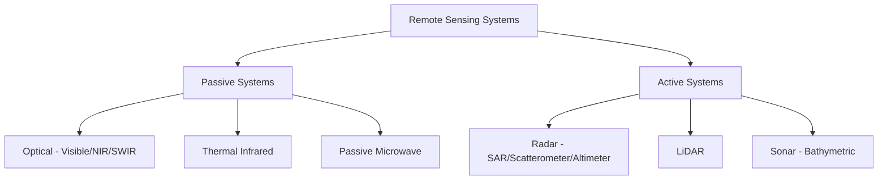
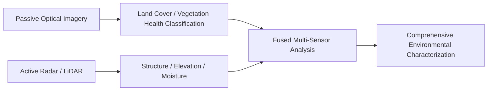

## Passive and Active Remote Sensing Systems

### Overview

Remote sensing systems are fundamentally divided into two categories based on their energy source: **passive systems**, which detect naturally occurring radiation (reflected sunlight or emitted thermal energy), and **active systems**, which emit their own energy pulse and measure the returned signal. This distinction shapes nearly every practical characteristic of a sensing system — its dependence on illumination and weather conditions, its ability to directly measure distance/structure, its data processing requirements, and its suitability for specific applications.

### Passive Remote Sensing Systems

**Core Principle**

Passive sensors detect naturally occurring EM radiation — either solar energy reflected off the Earth's surface (visible, near-infrared, shortwave infrared) or thermal energy emitted by the surface itself (thermal infrared), without the sensor providing its own illumination source.

**Key Points**

- Fundamentally dependent on an external energy source: solar illumination for reflective bands (meaning no usable data during nighttime for visible/NIR/SWIR sensors) or the target's own thermal emission for thermal infrared (which does allow nighttime operation, since objects continue emitting thermal energy after sunset).
- Cloud cover blocks or significantly degrades passive optical and thermal imaging, since clouds reflect/absorb the relevant wavelengths before they reach the surface or sensor.
- Passive microwave sensors detect naturally emitted microwave radiation from the surface, used for applications like soil moisture, sea ice, and snow water equivalent estimation; coarser spatial resolution than active microwave systems is typical due to the physics of microwave antenna design at longer wavelengths.

**Common Passive Sensor Types**

| Sensor Type | Spectral Region | Key Applications |
| --- | --- | --- |
| Panchromatic/multispectral optical | Visible, NIR | Land cover, general imagery, vegetation |
| Hyperspectral | Visible through SWIR (many narrow bands) | Mineral/material identification, precision agriculture |
| Thermal infrared radiometer | Thermal IR (~8–14 μm) | Land surface temperature, thermal anomaly detection |
| Passive microwave radiometer | Microwave | Soil moisture, sea ice, snow, atmospheric sounding |

**Advantages and Limitations**

**Key Points**

- Advantages: generally simpler sensor design and lower power requirements than active systems (no transmitter needed); imagery is often more intuitively interpretable (resembling natural human visual perception for optical bands); well-established, mature processing methods and long historical data archives (e.g., decades of Landsat imagery).
- Limitations: dependent on solar illumination (for reflective bands) and clear-sky conditions; cannot directly measure distance/structure (reflectance-based imagery provides no inherent depth or range information without stereo or other auxiliary techniques); temporal consistency can be affected by variable illumination angle and atmospheric conditions between acquisitions.

### Active Remote Sensing Systems

**Core Principle**

Active sensors emit their own controlled energy pulse toward the target and measure characteristics of the returned (backscattered) signal — typically travel time, intensity, phase, or polarization — to derive information about distance, surface properties, or structure.

**Key Points**

- Independent of solar illumination, enabling consistent day/night operation.
- Microwave-based active systems (radar) largely penetrate cloud cover, fog, and light precipitation, providing reliable "all-weather" imaging capability unavailable to passive optical systems.
- Because the system controls the emitted signal's properties (wavelength, polarization, timing), active sensors can derive direct physical measurements (e.g., precise range/distance) not directly available from passive reflectance data alone.
- Generally more complex and power-intensive than passive systems, since they must generate, transmit, and precisely time/measure their own signal.

**Radar Systems**

**Key Points**

- Emit microwave pulses and measure the time delay and intensity of the backscattered return to determine range and surface characteristics.
- **Synthetic Aperture Radar (SAR)**: uses the forward motion of the sensor platform (aircraft/satellite) combined with signal processing to synthesize a much larger effective antenna aperture than physically exists, achieving fine spatial resolution not otherwise possible with a physically compact antenna at microwave wavelengths.
- Radar backscatter intensity is influenced by surface roughness (relative to wavelength), dielectric properties (strongly affected by moisture content), and surface geometry/orientation relative to the radar look angle.
- **Interferometric SAR (InSAR)**: uses phase differences between multiple SAR acquisitions of the same area to measure very precise surface elevation or detect millimeter-scale surface deformation (e.g., land subsidence, volcanic inflation, earthquake displacement).
- Different radar wavelength bands (e.g., X-band, C-band, L-band, in order of increasing wavelength) offer different penetration depth and sensitivity to surface features: longer wavelengths (L-band) penetrate vegetation canopy and dry soil more effectively than shorter wavelengths (X-band), which are more sensitive to fine surface texture.

**LiDAR (Light Detection and Ranging)**

**Key Points**

- Emits laser pulses (typically near-infrared) and measures precise time-of-flight to determine distance to the target with high accuracy, generating dense 3D point clouds.
- **Airborne LiDAR**: aircraft/drone-mounted systems combined with GNSS/INS for direct georeferencing, widely used for terrain mapping, forestry canopy structure, and infrastructure corridor surveys.
- **Terrestrial LiDAR (TLS)**: ground-based systems for detailed as-built documentation and structural scanning.
- **Bathymetric LiDAR**: uses a green-wavelength laser capable of penetrating clear water to measure both water surface and underlying bottom topography in shallow coastal/riverine environments.
- Full-waveform LiDAR systems record the complete returned energy profile (rather than just discrete point returns), enabling more detailed characterization of complex vertical structure such as forest canopy layers.

**Sonar (Acoustic Active Sensing)**

**Key Points**

- Uses sound wave time-of-flight (rather than EM radiation) for underwater ranging, since EM radiation (including LiDAR wavelengths beyond the specific green-band bathymetric case) is strongly attenuated in water.
- Standard method for bathymetric mapping and underwater feature detection, particularly in deeper or more turbid water where bathymetric LiDAR is ineffective.

### Comparative Summary

| Characteristic | Passive Systems | Active Systems |
| --- | --- | --- |
| Energy source | Reflected sunlight / emitted thermal energy | Sensor-emitted pulse |
| Day/night operation | Reflective bands: day only; thermal: day and night | Full day/night capability |
| Cloud penetration | No (optical/thermal blocked by cloud) | Yes (microwave radar); LiDAR limited by cloud/precipitation |
| Direct distance measurement | No (requires stereo or auxiliary technique) | Yes (inherent to time-of-flight/ranging principle) |
| Typical power/complexity | Lower | Higher |
| Common applications | Land cover, vegetation health, general imagery | Elevation mapping, deformation monitoring, all-weather imaging |

### Combined/Complementary Use

**Key Points**

- Passive and active data are frequently fused to leverage complementary strengths — e.g., combining passive optical land cover classification with active radar-derived surface moisture or structural information for improved analysis.
- InSAR-based deformation monitoring is often combined with passive thermal or optical imagery for context (e.g., relating detected ground deformation to visible surface conditions or land use).
- LiDAR-derived terrain models are commonly used alongside passive multispectral/hyperspectral imagery in combined analyses (e.g., precision forestry combining canopy height from LiDAR with species/health information from hyperspectral imagery).

### Practical Selection Considerations

**Example**

- **Persistent cloud cover regions (e.g., tropical forests)**: active SAR systems are often preferred or necessary for reliable, consistent monitoring where passive optical acquisition is frequently obstructed by clouds.
- **Precise elevation/deformation monitoring**: active systems (LiDAR for detailed terrain, InSAR for deformation) provide direct measurement capability that passive systems cannot easily replicate.
- **Vegetation health and general land cover mapping**: passive multispectral/hyperspectral imagery remains the standard choice, leveraging well-established spectral index techniques (e.g., NDVI) not directly available from radar or LiDAR alone.
- **Nighttime or continuous monitoring requirements**: active systems (radar) or passive thermal infrared provide capability unavailable from passive reflective-band sensors, which are limited to daylight acquisition.

### Related Topics

- Synthetic Aperture Radar (SAR) principles and interferometry (InSAR)
- LiDAR system architecture and point cloud processing
- Electromagnetic spectrum and atmospheric windows
- Spectral signatures and vegetation index derivation
- Multi-sensor data fusion techniques
- Thermal remote sensing and land surface temperature retrieval
- Radar backscatter interpretation and polarimetry
- Bathymetric mapping methods (LiDAR vs. sonar)