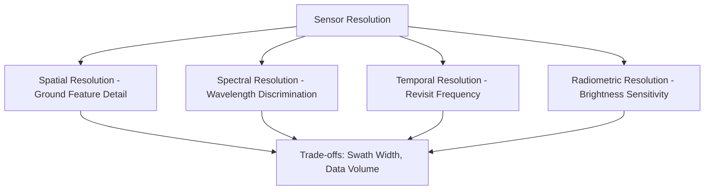
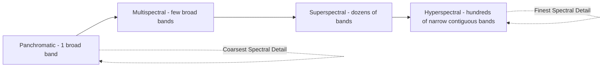
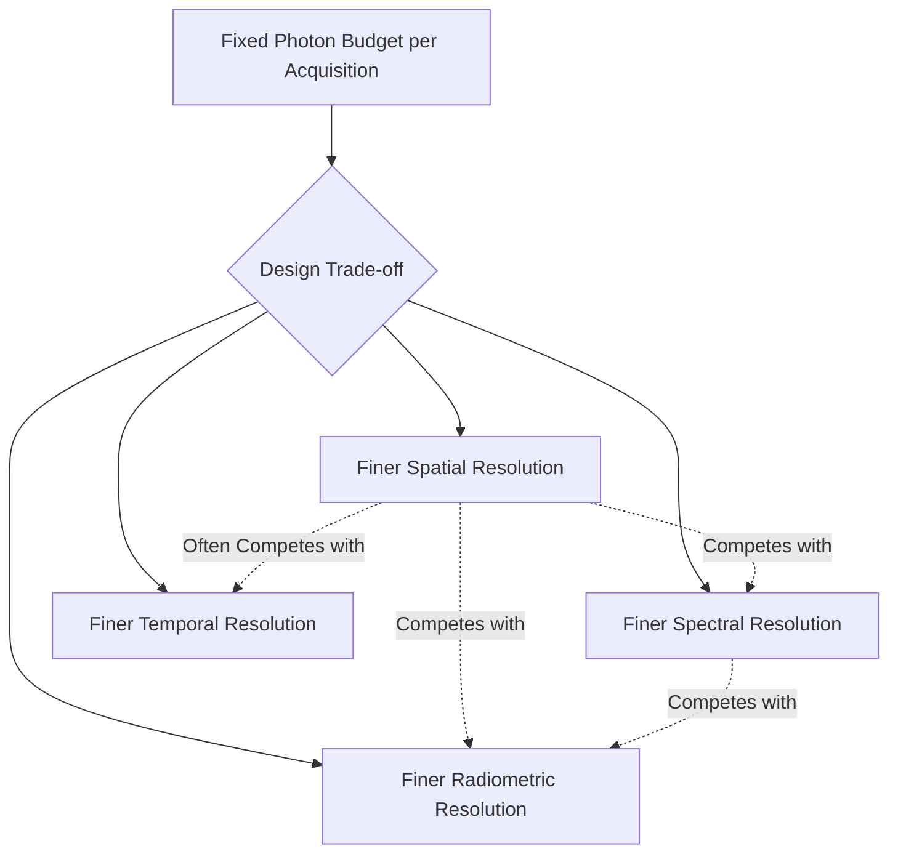

## Spectral, Spatial, Temporal, and Radiometric Resolution

### Overview

Sensor "resolution" in remote sensing is not a single property but four largely independent dimensions — spectral, spatial, temporal, and radiometric — each describing a different aspect of how finely a sensor discriminates the world. Understanding these four resolution types, and the trade-offs between them, is essential for selecting appropriate imagery for a given application, since no sensor maximizes all four simultaneously; sensor design always involves deliberate trade-offs among them.

### Spatial Resolution

**Definition and Measurement**

Spatial resolution describes the size of the smallest discernible ground feature, most commonly expressed as pixel size (ground sample distance, GSD) — the ground area represented by a single pixel in the image.

**Key Points**

- Finer (smaller-number) spatial resolution means more ground detail per pixel but covers less area per image and produces larger data volumes for a given area.
- Spatial resolution is fundamentally related to the sensor's **Instantaneous Field of View (IFOV)** — the ground area viewed by a single detector element at a given moment — combined with platform altitude.
- Common classifications (approximate, varies by source/context):
  - **Very high resolution**: sub-meter to ~1 m (e.g., commercial satellites, most UAV imagery)
  - **High resolution**: ~1–10 m (e.g., Sentinel-2, SPOT)
  - **Medium resolution**: ~10–100 m (e.g., Landsat)
  - **Coarse/low resolution**: >100 m to kilometers (e.g., MODIS, many meteorological satellites)

**Trade-offs**

**Key Points**

- Finer spatial resolution generally requires either a smaller swath width (area covered per pass) or increased data volume/processing burden, since capturing more detail per unit area at a fixed swath means proportionally more pixels.
- Very high spatial resolution sensors often have coarser temporal resolution (less frequent revisit) due to narrower swath width, a common practical trade-off in satellite system design.
- Spatial resolution appropriate to an application depends on the minimum feature size that must be reliably distinguished — mapping individual buildings requires much finer resolution than regional land cover classification.

### Spectral Resolution

**Definition and Measurement**

Spectral resolution describes a sensor's ability to distinguish different wavelength intervals, characterized by the number, width, and placement of spectral bands.

**Key Points**

- **Panchromatic** sensors capture a single broad band (often spanning most of the visible spectrum), producing grayscale imagery with typically the finest spatial resolution available on a given platform (since combining a wide spectral range into one band allows more photons per pixel, supporting smaller pixel size at adequate signal-to-noise ratio).
- **Multispectral** sensors capture several discrete, relatively broad bands (typically 3–15 bands) across specific spectral regions (e.g., blue, green, red, near-infrared, shortwave infrared).
- **Hyperspectral** sensors capture many (often 100+) narrow, contiguous spectral bands, producing a near-continuous spectral signature for each pixel, enabling more precise material identification than multispectral data allows.
- **Superspectral** is sometimes used as an intermediate category (dozens of bands), though terminology varies across the field and is not universally standardized.

**Trade-offs**

**Key Points**

- Finer spectral resolution (more, narrower bands) enables more precise material/feature discrimination (e.g., distinguishing specific mineral types or vegetation species) but at the cost of reduced signal-to-noise ratio per band (each narrow band captures fewer photons) and significantly increased data volume and processing complexity.
- Hyperspectral data processing requires specialized techniques (e.g., spectral unmixing, dimensionality reduction) due to high band correlation and data volume, distinct from standard multispectral workflows.

### Temporal Resolution

**Definition and Measurement**

Temporal resolution (revisit time or repeat cycle) describes how frequently a sensor acquires imagery of the same location.

**Key Points**

- Determined by orbital characteristics for satellite systems (orbital altitude, inclination, swath width) or by mission planning/flight frequency for aircraft/UAV systems.
- Ranges from sub-daily (geostationary meteorological satellites, continuously viewing the same hemisphere) to weeks (some high-resolution commercial satellites in native single-satellite configuration) — though constellations of multiple satellites can substantially improve effective revisit frequency compared to a single satellite's native repeat cycle.
- **Nadir revisit** (directly overhead) differs from **off-nadir/pointable revisit** (using sensor pointing capability to image an area from an angled orbit pass), with pointable systems achieving more frequent effective coverage at the cost of some geometric distortion and viewing angle variability between acquisitions.

**Trade-offs and Applications**

**Key Points**

- High temporal resolution is essential for monitoring dynamic/time-sensitive phenomena: weather systems, active fires, flooding, crop phenology, or short-term change detection.
- Coarser temporal resolution is generally acceptable for relatively stable phenomena monitored over longer timescales (e.g., annual land cover change, multi-year urban growth).
- High temporal resolution sensors (e.g., geostationary weather satellites) typically sacrifice spatial resolution significantly, since achieving very frequent full-disk coverage constrains sensor design toward coarser pixel size.
- Cloud cover further reduces the *effective* usable temporal resolution for passive optical sensors, since any given acquisition may be unusable if the target area is obscured — a practical consideration distinct from the sensor's nominal revisit specification.

### Radiometric Resolution

**Definition and Measurement**

Radiometric resolution describes a sensor's sensitivity to differences in signal intensity (brightness), expressed as the number of discrete brightness levels (or bits) a sensor can distinguish.

**Key Points**

- Expressed in bits: an 8-bit sensor distinguishes $2^8 = 256$ brightness levels; a 12-bit sensor distinguishes $2^{12} = 4096$ levels; higher bit-depth sensors (e.g., 14-bit, 16-bit) distinguish proportionally finer brightness gradations.
- Higher radiometric resolution enables detection of more subtle differences in surface reflectance/brightness, improving the ability to distinguish similar materials or detect fine gradations (e.g., subtle vegetation stress, water turbidity gradients) that would appear as the same value at lower bit-depth.
- Radiometric resolution directly affects data volume (higher bit-depth requires more storage per pixel) and is influenced by sensor design trade-offs involving signal-to-noise ratio and dynamic range.

$$\text{Number of gray levels} = 2^n$$

Where $n$ is the bit depth of the sensor.

### Interrelationships and Trade-offs

**Key Points**

- The four resolution types are not independent in sensor engineering: a fixed sensor design has a limited photon budget per acquisition, meaning improving one resolution dimension typically requires sacrificing another (finer spatial resolution reduces photons per pixel, which can be compensated by broader spectral bands — reducing spectral resolution — or coarser radiometric quantization).
- This is often summarized as a fundamental trade-off space rather than a set of independently optimizable parameters, and sensor designers make deliberate choices based on the mission's primary objective.
- No single sensor is optimal for all applications; sensor/imagery selection should be driven by which resolution dimension(s) matter most for the specific analytical objective.

### Representative Sensor Comparison

| Sensor/System | Spatial Resolution | Spectral Bands | Revisit Time | Radiometric Depth |
| --- | --- | --- | --- | --- |
| Landsat 8/9 OLI | 30 m (multispectral), 15 m (pan) | 11 bands | 16 days (8 days combined with paired satellite) | 12-bit |
| Sentinel-2 | 10/20/60 m (band-dependent) | 13 bands | ~5 days (twin-satellite constellation) | 12-bit |
| MODIS | 250 m–1 km (band-dependent) | 36 bands | ~1–2 days | 12-bit |
| Commercial VHR (e.g., WorldView-class) | Sub-meter to ~1 m | 4–8 bands (multispectral) | Days (single satellite); improved with constellations | 11-bit or higher |
| Geostationary weather satellite | ~0.5–2 km | Multiple bands (visible/IR) | Minutes (continuous hemispheric viewing) | Varies by instrument |

**Key Points**

- [Unverified] Exact specifications for any given sensor system are subject to mission updates, instrument revisions, and constellation changes over time; figures above represent commonly cited nominal values and should be verified against current mission documentation for precise application requirements.

### Application-Driven Selection Examples

**Example**

- **Precision agriculture (crop health monitoring)**: prioritizes moderate-to-fine spatial resolution (field-scale features), strong spectral resolution in red/NIR/red-edge bands (vegetation indices), and relatively fine temporal resolution (tracking crop development through a growing season) — often addressed well by Sentinel-2-class systems or UAV imagery.
- **Global land cover mapping**: often prioritizes consistent global coverage and manageable data volume over very fine spatial detail, favoring medium-resolution systems like Landsat with adequate (not necessarily hyperspectral) spectral resolution.
- **Disaster response (e.g., flood extent mapping)**: prioritizes temporal resolution/rapid tasking capability and adequate spatial resolution to identify affected structures/roads, often favoring high-revisit constellations or active SAR systems (also valuable for cloud-penetration during disaster events).
- **Mineral exploration**: prioritizes fine spectral resolution (hyperspectral) to exploit diagnostic mineral absorption features, often accepting coarser temporal resolution since geological features are static over relevant timescales.

### Related Topics

- Electromagnetic spectrum and atmospheric windows
- Multispectral vs. hyperspectral image processing techniques
- Satellite constellation design and revisit time optimization
- Sensor calibration and radiometric correction
- Pan-sharpening and spatial resolution enhancement techniques
- Vegetation indices and spectral band selection
- Change detection methodology and temporal resolution requirements
- Ground sample distance (GSD) and platform altitude relationships