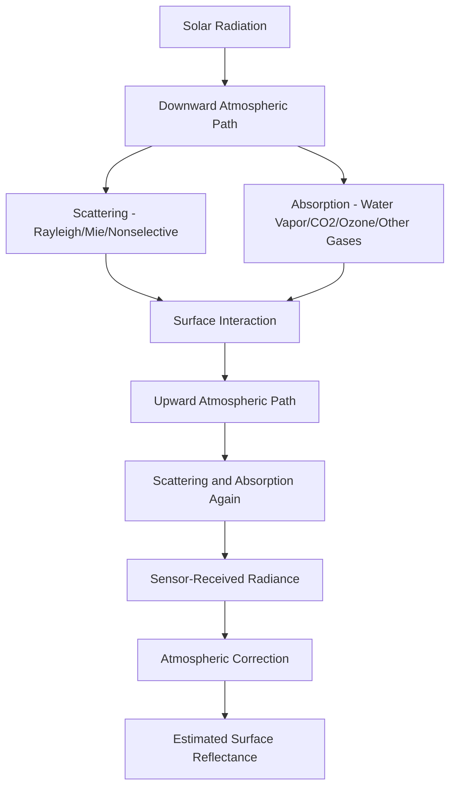
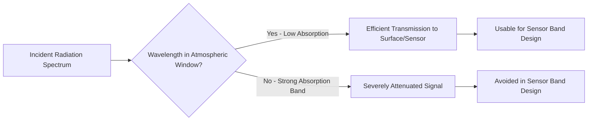

## Atmospheric Effects on Remote Sensing Data

### Overview

Electromagnetic radiation traveling from its source (the Sun, for passive optical sensing) to the Earth's surface, and from the surface back to the sensor, passes through the atmosphere twice for passive systems (once for active systems measuring only the return path from sensor-to-target-to-sensor). Along this path, the atmosphere scatters, absorbs, and refracts the radiation, systematically altering the signal that ultimately reaches the sensor. Understanding and correcting for these atmospheric effects is essential for extracting accurate, physically meaningful surface information from remotely sensed data, particularly for quantitative analyses (vegetation indices, change detection, multi-temporal comparison) rather than purely visual interpretation.

### Atmospheric Scattering

Scattering redirects radiation in different directions without absorption, and its character depends heavily on the relationship between particle size and wavelength.

**Rayleigh Scattering**

**Key Points**

- Occurs when atmospheric particles (primarily gas molecules like N₂ and O₂) are much smaller than the radiation's wavelength.
- Scattering intensity is inversely proportional to wavelength to the fourth power ($\propto 1/\lambda^4$), meaning shorter wavelengths (blue) scatter far more strongly than longer wavelengths (red).
- Responsible for the sky's blue appearance and contributes significantly to atmospheric haze, particularly affecting shorter-wavelength (blue) bands in imagery — a major reason blue bands often show reduced contrast and require careful atmospheric correction.

**Mie Scattering**

**Key Points**

- Occurs when particle size (aerosols, dust, smoke, pollen) is comparable to the radiation's wavelength.
- Affects a broader range of wavelengths than Rayleigh scattering, with wavelength dependence weaker than Rayleigh's fourth-power relationship.
- Increases significantly under higher aerosol loading conditions (pollution, smoke from fires, dust storms), producing visible haze across a wider spectral range.

**Nonselective Scattering**

**Key Points**

- Occurs when particles (water droplets, ice crystals, large aerosols) are much larger than the radiation's wavelength.
- Scatters all visible wavelengths roughly equally, which is why clouds and fog appear white or gray rather than exhibiting a particular color.
- Effectively blocks passive optical imaging of the surface beneath dense cloud cover, a fundamental limitation distinct from the partial haze effects of Rayleigh/Mie scattering.

### Atmospheric Absorption

**Key Points**

- Specific atmospheric gases absorb radiation strongly at particular wavelengths, determined by their molecular structure: water vapor, carbon dioxide, ozone, methane, and oxygen each have characteristic absorption bands.
- Absorption effectively removes energy at those specific wavelengths from the signal path, meaning sensors operating within a strong absorption band would receive severely attenuated signal even under otherwise clear conditions.
- **Atmospheric windows** — spectral regions with minimal absorption — define where remote sensing sensors can operate efficiently; sensor band placement is deliberately designed to align with these windows (e.g., avoiding the strong water vapor absorption features around 1.4 μm and 1.9 μm).

### Path Radiance and Signal Contamination

**Key Points**

- **Path radiance** is scattered light that reaches the sensor without ever interacting with the target surface — an additive contribution that inflates apparent brightness, particularly in shorter wavelengths (blue) due to Rayleigh scattering, and is often the dominant source of the hazy, low-contrast appearance in uncorrected imagery.
- **Adjacency effects**: radiation scattered from neighboring pixels/surfaces into the sensor's line of sight for a given target pixel, contaminating the apparent reflectance of that pixel — most significant near sharp reflectance contrasts (e.g., at the edge between a bright surface and a dark water body).
- These additive and mixing effects mean that raw sensor-recorded radiance is not directly equivalent to true surface reflectance, necessitating correction before quantitative analysis.

### Atmospheric Effects on Active (Radar) Systems

**Key Points**

- Microwave wavelengths used by most radar systems are largely unaffected by cloud cover, haze, and most weather conditions that severely impact optical sensing — a primary operational advantage of radar remote sensing.
- Very heavy precipitation (intense rainfall) can still attenuate microwave signals, particularly at shorter radar wavelengths (e.g., X-band more than L-band), though this effect is generally far less limiting than cloud cover is for optical systems.
- Ionospheric effects can influence longer-wavelength radar signals (particularly L-band and lower), introducing phase distortions relevant to precise applications like InSAR deformation measurement.

### Consequences for Image Interpretation and Analysis

**Key Points**

- **Reduced contrast and haze**: scattering-induced path radiance lowers overall image contrast and can obscure fine surface detail, particularly problematic in shorter wavelength bands.
- **Inconsistent multi-temporal comparison**: since atmospheric conditions vary between different acquisition dates, uncorrected imagery from different dates is not directly comparable in a quantitative sense — a critical concern for change detection and time-series analysis (e.g., vegetation index trends).
- **Band-to-band inconsistency**: because atmospheric scattering and absorption affect different wavelengths unequally, uncorrected multi-band ratios or indices (e.g., NDVI) can be biased if atmospheric effects are not properly accounted for.
- **Cross-sensor comparability**: combining imagery from different sensors (with different acquisition conditions, viewing geometries, and calibration) requires atmospheric correction to a common physical basis (surface reflectance) to be meaningfully comparable.

### Atmospheric Correction Approaches

**Absolute Atmospheric Correction**

Physically-based methods that model atmospheric scattering and absorption to convert sensor-recorded radiance into estimated true surface reflectance.

**Key Points**

- Radiative transfer models (e.g., MODTRAN and similar physics-based atmospheric models) simulate the atmosphere's optical properties using inputs such as atmospheric water vapor content, aerosol optical depth, and sensor/solar geometry.
- Requires knowledge (measured, modeled, or estimated) of atmospheric conditions at the time of acquisition, which can be a practical limitation when precise atmospheric measurements are unavailable.
- Produces physically meaningful surface reflectance values directly comparable across dates, sensors, and locations when properly applied.

**Relative/Image-Based Correction**

Simpler methods that use information within the image itself, without requiring external atmospheric measurement data.

**Key Points**

- **Dark Object Subtraction (DOS)**: assumes that certain dark surface features (e.g., deep clear water, shadow areas) should have near-zero reflectance in certain bands; any nonzero recorded value in those areas is attributed to path radiance and subtracted from the entire image band.
- **Empirical Line Calibration**: uses field-measured reflectance at known ground targets, compared against corresponding sensor-recorded values, to derive a linear correction relationship applied across the image.
- Generally simpler to implement than full radiative transfer modeling but less rigorous and potentially less accurate, particularly for complex atmospheric conditions or applications requiring high radiometric precision.

**Standard Data Products**

**Key Points**

- Many satellite data providers now distribute pre-corrected "surface reflectance" products (atmospherically corrected using standardized radiative transfer-based algorithms), reducing the need for users to perform correction manually for common applications.
- [Unverified] The specific correction algorithm, accuracy, and validation status vary by data provider and product version; users requiring high-precision quantitative analysis should consult the specific product's documentation rather than assume uniform correction quality across all available "surface reflectance" products.

### Atmospheric Effects on Thermal Remote Sensing

**Key Points**

- Atmospheric water vapor significantly absorbs and re-emits thermal infrared radiation, requiring atmospheric correction distinct from (though methodologically related to) reflective-band correction to accurately retrieve land surface temperature.
- Atmospheric correction for thermal data typically must account for both atmospheric transmissivity and the atmosphere's own thermal emission contribution (upwelling and downwelling atmospheric radiance), making thermal atmospheric correction generally more complex than reflective-band correction.

### Practical Considerations for Data Selection and Processing

**Example**

- For single-date visual interpretation or basic land cover mapping, atmospheric correction may be a lower priority, since relative spectral contrast within a single scene is often sufficient for classification purposes.
- For any multi-temporal analysis (change detection, time-series vegetation monitoring, deforestation tracking), atmospheric correction to a consistent surface reflectance basis is generally necessary to avoid confusing atmospheric variability with genuine surface change.
- Selecting imagery with minimal cloud cover and low aerosol loading (where a choice of acquisition dates is available) reduces the magnitude of atmospheric correction needed and the associated uncertainty, particularly valuable for applications sensitive to residual correction error.
- Cross-sensor or cross-platform studies (e.g., combining Landsat and Sentinel-2 data) require particular attention to consistent atmospheric correction methodology to ensure comparability between the different source products.

### Related Topics

- Radiative transfer modeling for atmospheric correction
- Dark Object Subtraction and empirical line calibration methods
- Surface reflectance data products and provider-specific algorithms
- Electromagnetic spectrum and atmospheric windows
- Land surface temperature retrieval from thermal imagery
- Multi-temporal change detection methodology
- Sensor calibration and radiometric correction
- Aerosol optical depth estimation and its role in correction accuracy