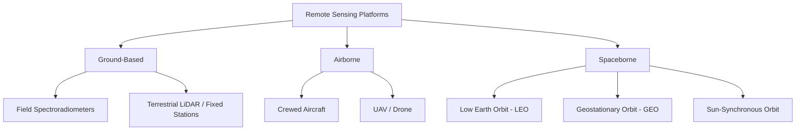
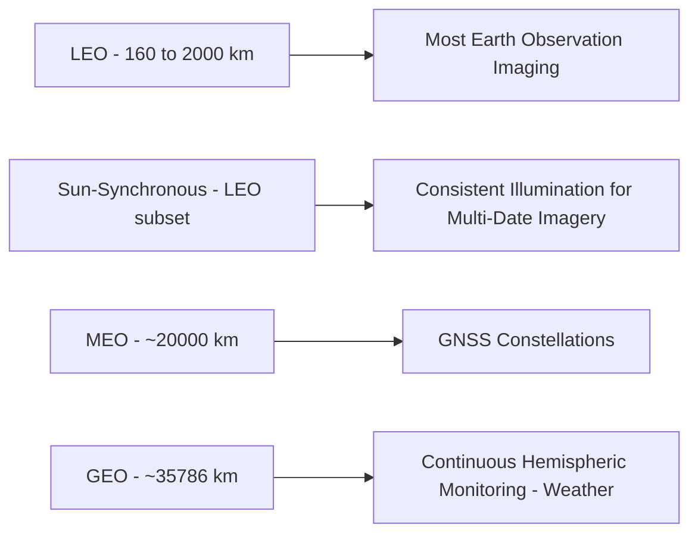
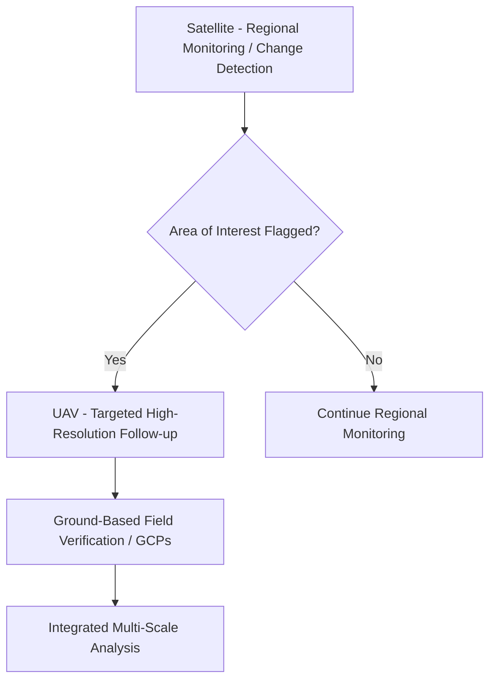

## Sensor and Platform Overview

### Overview

Remote sensing data is captured by sensors mounted on a range of platforms, from ground-based instruments to satellites in orbit hundreds or thousands of kilometers above the Earth. Platform choice determines altitude, coverage area, revisit frequency, achievable spatial resolution, and cost structure, while sensor type determines what physical properties can be measured. Together, platform and sensor selection define the practical envelope of any remote sensing application — no single combination is optimal for every use case, and understanding the trade-offs across platform types is fundamental to designing an appropriate data acquisition strategy.

### Ground-Based Platforms

**Key Points**

- Include field spectroradiometers, handheld/tripod-mounted sensors, and fixed monitoring stations, used primarily for ground-truth data collection, sensor calibration/validation, and localized continuous monitoring.
- Provide the highest achievable spatial and temporal control (operator determines exact position and timing) but cover only very limited spatial extent per measurement, making them unsuitable for broad-area mapping on their own.
- Serve a critical supporting role for airborne/spaceborne remote sensing: field spectral measurements calibrate and validate satellite-derived reflectance products, and fixed ground stations provide continuous reference time-series for cross-checking remotely sensed trends.

### Airborne Platforms

**Crewed Aircraft**

**Key Points**

- Historically the primary platform for aerial photography and, later, airborne multispectral/hyperspectral imaging, LiDAR, and radar systems.
- Offers flexible mission planning (specific date, time, and flight path chosen to meet project needs), high achievable spatial resolution, and the ability to carry larger, more capable (and heavier) sensor payloads than most UAVs.
- Higher operating cost per mission compared to UAVs for small-area work, but remains standard for large-area, high-precision airborne LiDAR and hyperspectral surveys where UAV endurance/payload limitations are prohibitive.

**Uncrewed Aerial Vehicles (UAV/Drone)**

**Key Points**

- Provide low-cost, flexible, on-demand very high-resolution imagery (often sub-centimeter to few-centimeter pixel size) for localized project areas.
- Common sensor payloads: RGB cameras (photogrammetry/orthomosaic production), multispectral sensors (precision agriculture, vegetation health), thermal cameras, and increasingly, compact LiDAR systems.
- Key limitations: limited flight endurance and payload capacity (particularly for smaller consumer/prosumer platforms), regulatory constraints (airspace authorization, operator certification, and increasingly nuanced rules that vary by jurisdiction), and weather sensitivity (wind, precipitation).
- Requires ground control points (GCPs) or onboard RTK/PPK positioning for accurate absolute georeferencing of derived products, since standard UAV GNSS alone typically provides only meter-level positioning accuracy.

### Spaceborne Platforms

**Orbit Types**

**Key Points**

- **Low Earth Orbit (LEO)**: altitude roughly 160–2000 km; most Earth observation imaging satellites (e.g., Landsat, Sentinel-2, commercial VHR systems) operate here, balancing achievable spatial resolution against orbital period and coverage characteristics.
- **Sun-Synchronous Orbit (SSO)**: a specific LEO configuration where the satellite crosses the equator at approximately the same local solar time on every pass, ensuring consistent illumination conditions for imagery acquired on different dates — standard for most optical Earth observation missions to support comparable multi-temporal imagery.
- **Geostationary Orbit (GEO)**: altitude ~35,786 km, where orbital period matches Earth's rotation, so the satellite remains fixed over the same location on Earth — standard for meteorological satellites requiring continuous, frequent monitoring of the same hemisphere, at the cost of much coarser spatial resolution than LEO systems.
- **Medium Earth Orbit (MEO)**: used primarily by GNSS constellations (GPS, Galileo, etc.) rather than imaging Earth observation missions, positioned between LEO and GEO altitudes.

**Satellite Mission Types**

**Key Points**

- **Government/agency Earth observation missions** (e.g., Landsat, Sentinel series): typically provide free or low-cost, consistently calibrated, long-term data archives with open data policies, foundational for scientific and operational environmental monitoring.
- **Commercial very-high-resolution (VHR) satellites**: offer sub-meter to ~1 m imagery, often with flexible/rapid tasking capability, typically at commercial licensing cost, serving applications requiring the finest spatial detail (urban mapping, detailed infrastructure monitoring, defense/intelligence applications).
- **Constellation systems**: multiple satellites operating together to substantially improve effective revisit frequency compared to a single satellite, an increasingly common design approach (e.g., paired/multi-satellite optical constellations, dense small-satellite constellations) to balance fine spatial resolution against temporal coverage.

### Sensor Types by Platform Suitability

| Sensor Type | Ground | UAV | Crewed Aircraft | Satellite (LEO) | Satellite (GEO) |
| --- | --- | --- | --- | --- | --- |
| RGB/multispectral optical | Common (handheld) | Common | Common | Common | Common (coarser) |
| Hyperspectral | Common (field spectroradiometer) | Increasingly common | Common | Available (specific missions) | Uncommon |
| Thermal infrared | Common | Common | Common | Available (specific bands/missions) | Common (weather) |
| LiDAR | Terrestrial (TLS) | Increasingly common | Common (standard for large-area) | Limited (specific missions, e.g., ICESat-2) | Not applicable |
| SAR (radar) | Not typical | Emerging | Available | Common (dedicated missions) | Not typical |

### Platform Selection Trade-offs

**Key Points**

- **Spatial extent vs. resolution**: satellite platforms generally cover far larger areas per acquisition than airborne platforms but at coarser typical resolution (with high-cost VHR satellite exceptions); UAVs achieve the finest resolution but over comparatively small areas per flight.
- **Cost structure**: satellite data (especially government/open-data missions) often has low or no per-acquisition cost but limited control over exact acquisition timing; UAV/aircraft missions involve higher per-mission operational cost but full control over timing and conditions.
- **Repeat/revisit control**: ground and UAV platforms offer complete operator control over when data is collected; satellite platforms are constrained by orbital mechanics and, for many missions, tasking priority/availability.
- **Regulatory and logistical constraints**: UAV operations face airspace regulation and operator certification requirements; crewed aircraft require more extensive flight planning and higher operational cost; satellite tasking (for commercial systems) may involve scheduling lead time and cost considerations.

### Multi-Platform Integration

**Key Points**

- Many geospatial workflows combine data from multiple platforms to leverage complementary strengths — e.g., using satellite imagery for broad regional context and change detection, supplemented by UAV imagery for detailed site-specific investigation of areas flagged as significant.
- Ground-based field spectral measurements and GCPs support calibration/validation across all airborne and spaceborne platforms, forming an essential link between remotely sensed data and physically verified surface conditions.
- Scale-appropriate platform selection within a single project is common practice: regional-scale monitoring via satellite, targeted high-resolution follow-up via UAV, and ground verification via field instruments and GNSS-located ground truth points.

### Practical Selection Examples

**Example**

- **Large-area agricultural monitoring across a region**: satellite platforms (e.g., Sentinel-2-class, moderate resolution, frequent revisit) provide efficient, cost-effective regional coverage for crop health trend monitoring.
- **Detailed as-built survey of a single construction site**: UAV photogrammetry or terrestrial laser scanning provides the necessary fine spatial detail and full operator control over acquisition timing, at a scale where satellite resolution would be inadequate.
- **Continuous weather/storm tracking**: geostationary satellite platforms provide the necessary high temporal frequency over a fixed hemisphere, despite coarser spatial resolution than LEO imaging systems.
- **Large-area forest canopy structure mapping**: airborne LiDAR from crewed aircraft remains standard for large-area, high-density point cloud acquisition where UAV endurance/payload limits would require impractically many flights.

### Related Topics

- Orbital mechanics and sun-synchronous orbit design
- UAV regulatory frameworks and flight planning
- Satellite constellation design for revisit optimization
- Ground control point (GCP) strategy for georeferencing
- Multi-sensor and multi-platform data fusion techniques
- Spatial, spectral, temporal, and radiometric resolution trade-offs
- Field spectroradiometry and calibration/validation workflows
- Commercial vs. open-data satellite imagery sourcing considerations