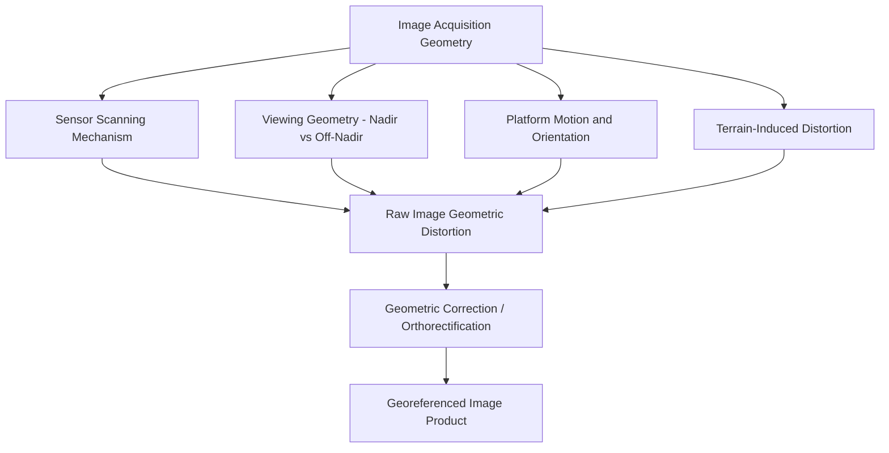
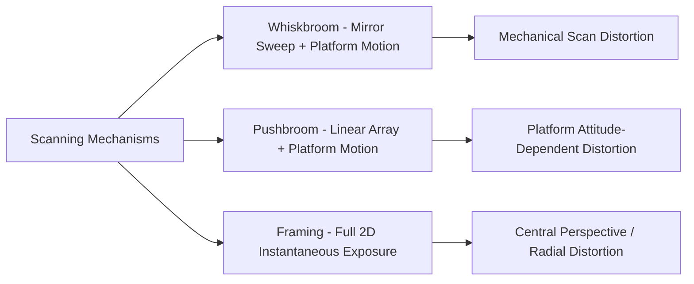
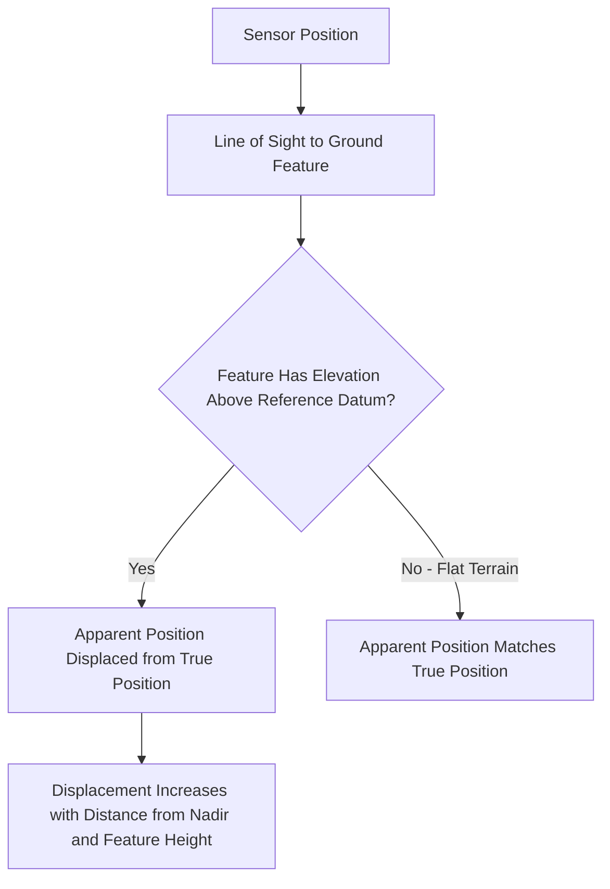

## Image Acquisition Geometry

### Overview

Image acquisition geometry describes the spatial relationships between a sensor, its platform, and the imaged ground surface at the moment of data capture — including viewing angle, sensor scanning mechanism, platform motion, and terrain relief effects. These geometric factors determine how accurately pixel positions in raw imagery correspond to true ground locations, and understanding them is essential for correctly interpreting raw imagery and for performing the geometric corrections required to produce spatially accurate, georeferenced products.

### Sensor Scanning Mechanisms

**Whiskbroom (Across-Track) Scanning**

**Key Points**

- A single or small set of detectors uses a rotating/oscillating mirror to sweep across the flight track, perpendicular to platform motion, while forward platform motion provides along-track coverage.
- Each ground point is imaged only briefly during the mirror's sweep, and the scanning geometry introduces characteristic distortions, including a slight time lag and varying viewing angle across the swath.
- Examples include older-generation sensors such as the original Landsat Multispectral Scanner (MSS) design.

**Pushbroom (Along-Track) Scanning**

**Key Points**

- Uses a linear array of detectors oriented perpendicular to the flight direction, capturing an entire across-track line simultaneously; forward platform motion builds up the image line by line.
- Generally offers improved radiometric performance (longer dwell time per pixel compared to whiskbroom mechanical scanning) and simpler mechanical design (no moving mirror), and is the dominant approach in most modern optical satellite sensors.
- Geometric accuracy depends heavily on precise knowledge of platform position and attitude (orientation) at each instant, since there is no mechanical scanning reference to help constrain geometry as there is with whiskbroom systems.

**Framing (Area Array) Sensors**

**Key Points**

- Captures an entire two-dimensional image in a single instantaneous exposure, similar to a conventional camera — standard for aerial photography, most UAV cameras, and some satellite sensors.
- Geometric distortion pattern differs from line-scanning systems: framing sensors are subject to classic central-perspective (frame camera) geometry, including radial displacement from the image center, rather than the line-by-line distortions characteristic of pushbroom/whiskbroom systems.

### Viewing Geometry: Nadir vs. Off-Nadir

**Key Points**

- **Nadir viewing**: sensor points directly downward (perpendicular to Earth's surface at the sensor's location), minimizing geometric distortion and providing the most straightforward relationship between image position and ground position.
- **Off-nadir viewing**: sensor is pointed at an angle away from vertical, either due to fixed sensor design (wide swath sensors inherently view off-nadir toward swath edges) or deliberate pointing capability (agile satellites tasked to image areas outside their direct ground track).
- Off-nadir viewing introduces increased geometric distortion, including foreshortening/relief displacement effects and, for wide-swath sensors, systematic distortion that increases toward the edges of the swath (a factor in **bowtie effect** seen in some wide-swath sensor designs).
- Off-nadir imaging enables more frequent effective revisit (imaging an area from an adjacent orbital pass rather than waiting for direct overhead pass) but at the cost of geometric complexity and, for very high resolution applications, some loss of positional accuracy compared to near-nadir acquisitions.

### Platform Motion and Attitude Effects

**Key Points**

- **Roll, pitch, and yaw** (platform attitude/orientation) at the moment of acquisition directly affect where each image line/pixel is actually pointed on the ground; precise attitude measurement (via onboard star trackers, inertial measurement units) is essential for accurate direct georeferencing, particularly for pushbroom sensors.
- **Platform velocity variations**: inconsistent forward motion (common in aircraft subject to wind, less so in stable satellite orbits) can cause along-track geometric distortion if not properly accounted for in processing.
- **Earth rotation during acquisition**: for satellite systems, especially those with longer along-track integration times or wide swaths, the Earth's rotation during the scan introduces a skew effect that must be corrected, since the ground beneath the sensor moves slightly during acquisition.
- Direct georeferencing (using precise onboard GNSS and inertial navigation system, INS, data) has become standard for many modern airborne and spaceborne sensors, reducing dependence on ground control points for basic geometric correction, though ground control still improves and validates achieved accuracy.

### Terrain-Induced Distortion (Relief Displacement)

**Key Points**

- Terrain elevation variation causes ground features to appear displaced from their true planimetric (map) position in raw imagery, with the displacement direction and magnitude depending on the feature's height, its distance from the image nadir point (or principal point for frame imagery), and the viewing geometry.
- Relief displacement increases with distance from nadir and with the height of the feature — tall features (buildings, towers) near the edge of an image or swath can appear significantly displaced from their true ground position.
- This effect is a primary motivation for **orthorectification**, which uses a digital elevation model (DEM) to correct for terrain-induced displacement and produce a geometrically accurate, uniform-scale image product.

### Swath Width and Field of View

**Key Points**

- **Field of View (FOV)**: the total angular extent a sensor can image, determining swath width at a given altitude.
- **Instantaneous Field of View (IFOV)**: the angular extent viewed by a single detector element at a given instant, directly related to spatial resolution (ground sample distance) at a given altitude.
- Wider FOV sensors capture larger swaths per pass (improving area coverage efficiency and, indirectly, temporal resolution) but introduce greater geometric distortion toward swath edges due to the increased off-nadir viewing angle at those positions.
- The relationship between altitude, IFOV, and ground resolution means that platform altitude changes (common in aircraft, more stable in satellites) directly affect achieved spatial resolution if not accounted for in sensor/mission design.

### Geometric Correction and Orthorectification

**Systematic (Model-Based) Correction**

Uses known sensor geometry, platform position/attitude data, and (for terrain correction) a DEM to mathematically model and remove predictable geometric distortions.

**Key Points**

- Relies on rigorous sensor models describing the physical relationship between image coordinates, platform position/orientation, and ground coordinates (e.g., rational polynomial coefficients, RPCs, commonly distributed with commercial satellite imagery as a standardized sensor model representation).
- Orthorectification specifically corrects for terrain-induced relief displacement using a DEM, producing an image with uniform map-accurate scale throughout, suitable for direct measurement and overlay with other georeferenced data.

**Ground Control Point (GCP)-Based Correction**

Uses known-position reference points identifiable in both the image and on the ground (or in existing accurate reference data) to refine or independently establish the geometric transformation.

**Key Points**

- Particularly important when precise onboard position/attitude data is unavailable or when validating/improving the accuracy of a systematic correction.
- GCP quantity, distribution, and accuracy directly affect the achievable geometric accuracy of the corrected product, following similar principles to GCP use in UAV photogrammetry.

### Practical Implications by Application

**Example**

- **Change detection and multi-temporal analysis**: requires precise, consistent geometric correction (orthorectification) across all compared dates, since even small geometric misalignment between dates can produce false apparent change along feature edges.
- **Measurement and area calculation** (distances, areas, feature extraction): requires orthorectified imagery, since raw (non-orthorectified) imagery contains relief displacement and other distortions that would introduce measurement error, particularly in areas of significant terrain relief.
- **Rapid visual assessment or reconnaissance**: may tolerate lower geometric correction rigor (e.g., simple georeferencing without full orthorectification) when the primary need is qualitative interpretation rather than precise measurement.
- **Stereo/3D extraction (photogrammetry)**: deliberately leverages the geometric relationships between overlapping images (rather than treating them as distortion to remove) to derive elevation information, using the differing viewing geometry of overlapping frames as the basis for parallax-derived height calculation.

### Related Topics

- Orthorectification workflow and DEM requirements
- Rational Polynomial Coefficients (RPCs) and rigorous sensor models
- Ground control point (GCP) strategy and ortho-accuracy assessment
- Digital photogrammetry and stereo image processing
- Platform position/attitude systems (GNSS/INS integration)
- Sensor platform types and orbital characteristics
- Spatial resolution and Instantaneous Field of View (IFOV)
- Coordinate transformation and map projection fundamentals