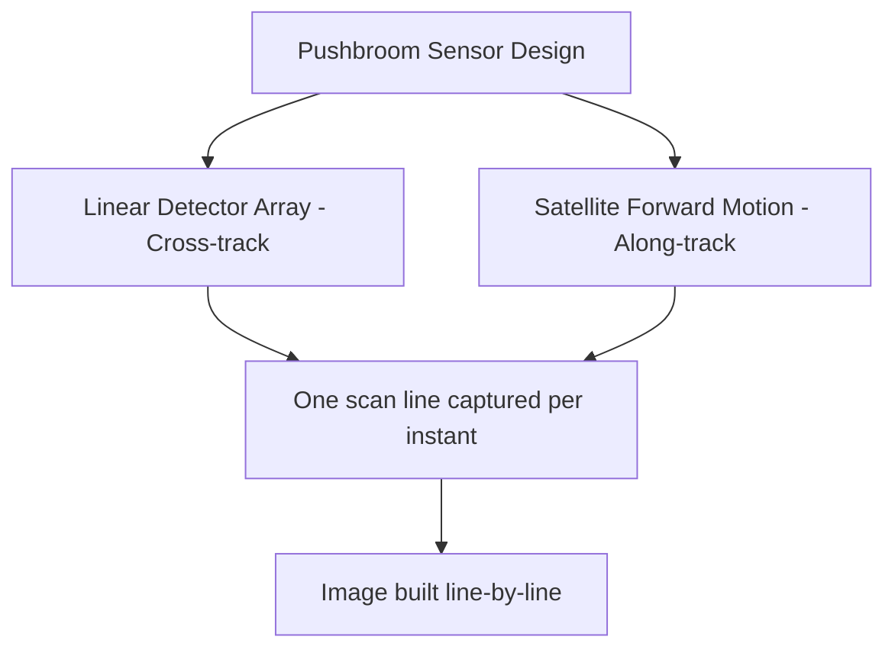

## Optical and Multispectral Satellite Systems


### Overview

Optical and multispectral satellite systems are remote sensing platforms that capture reflected solar radiation across discrete wavelength bands spanning the visible (VIS), near-infrared (NIR), and shortwave infrared (SWIR) portions of the electromagnetic spectrum. Unlike panchromatic sensors that record a single broad band, multispectral sensors use multiple narrowband detectors to discriminate materials, vegetation, water, and land cover based on their unique spectral signatures.

### Physical Principles

**Electromagnetic Spectrum Regions Used**

| Region | Wavelength Range | Typical Use |
| --- | --- | --- |
| Blue | 0.45–0.51 $\mu m$ | Water penetration, aerosol/haze discrimination |
| Green | 0.53–0.59 $\mu m$ | Vegetation vigor peak reflectance, water turbidity |
| Red | 0.64–0.67 $\mu m$ | Chlorophyll absorption, soil/vegetation contrast |
| NIR | 0.85–0.88 $\mu m$ | Vegetation structure, biomass, water/land boundary |
| SWIR-1 | 1.57–1.65 $\mu m$ | Moisture content, cloud/snow discrimination |
| SWIR-2 | 2.11–2.29 $\mu m$ | Geology, mineral mapping, burned area detection |

Reflectance $\rho$ at a given wavelength $\lambda$ is computed from at-sensor radiance $L_\lambda$ using:

$$\rho_\lambda = \frac{\pi \cdot L_\lambda \cdot d^2}{ESUN_\lambda \cdot \cos(\theta_s)}$$

where $d$ is the Earth-Sun distance in astronomical units, $ESUN_\lambda$ is the mean solar exoatmospheric irradiance for the band, and $\theta_s$ is the solar zenith angle.

**Spectral Signature Concept**

Every material reflects, absorbs, and transmits solar energy differently across wavelengths, producing a distinctive reflectance curve. Healthy vegetation, for example, shows low reflectance in red (chlorophyll absorption) and a sharp rise in NIR (the "red edge"), which is exploited by vegetation indices.


### Sensor Design and Resolution Types

**Four Resolution Dimensions**

- **Spatial resolution**: ground sampling distance (GSD) per pixel, e.g., 10 m (Sentinel-2), 30 m (Landsat), 0.3 m (WorldView-3)
- **Spectral resolution**: number and narrowness of spectral bands; multispectral (4–15 bands) vs. hyperspectral (100+ narrow bands)
- **Radiometric resolution**: bit-depth per pixel (e.g., 8-bit = 256 levels; 12-bit = 4096 levels), determining sensitivity to subtle reflectance differences
- **Temporal resolution**: revisit frequency, e.g., 16 days (Landsat 8/9), 5 days (Sentinel-2 constellation), daily (Planet)

**Detector Architecture**

Most modern optical satellites use pushbroom scanning with linear CCD or CMOS arrays oriented cross-track, where forward satellite motion builds the along-track dimension line by line. This differs from the older whiskbroom (cross-track mechanical scanning mirror) design used in early Landsat sensors.



### Major Satellite Systems

**Landsat Program (USGS/NASA)**

- Longest continuous Earth observation record (1972–present)
- Landsat 8/9 carry OLI (Operational Land Imager): 9 spectral bands, 30 m multispectral, 15 m panchromatic
- TIRS (Thermal Infrared Sensor) adds 2 thermal bands at 100 m
- 16-day repeat cycle, 8-day combined with both satellites

**Sentinel-2 (ESA Copernicus Program)**

- MultiSpectral Instrument (MSI): 13 bands from 443 nm to 2190 nm
- Variable resolution: 10 m (visible/NIR), 20 m (red edge/SWIR), 60 m (atmospheric bands)
- Twin-satellite constellation (2A/2B/2C) yields 5-day revisit at equator
- Free and open data policy via Copernicus Data Space Ecosystem

**Commercial Very High Resolution (VHR) Systems**

| System | Operator | Panchromatic GSD | Multispectral GSD | Bands |
| --- | --- | --- | --- | --- |
| WorldView-3 | Maxar | 0.31 m | 1.24 m | 8 VNIR + 8 SWIR |
| Pleiades Neo | Airbus | 0.3 m | 1.2 m | 6 (incl. red edge, deep blue) |
| PlanetScope | Planet Labs | — | 3 m | 4–8 bands |
| SkySat | Planet Labs | 0.5 m | 0.8 m | 4 |

[Inference] Commercial VHR revisit rates depend on constellation size and tasking priority, and marketed "daily revisit" figures may not hold uniformly at all latitudes or under all cloud conditions.

### Data Processing Pipeline

**Processing Levels**

- **Level 0**: Raw, unprocessed instrument data
- **Level 1B/1C**: Radiometrically calibrated, sometimes with Top-of-Atmosphere (TOA) reflectance conversion; not orthorectified
- **Level 1T/2A**: Geometrically corrected (orthorectified) and, at Level 2A, atmospherically corrected to surface reflectance
- **Level 3+**: Higher-order composites, mosaics, or derived indices

**Atmospheric Correction**

Necessary to remove scattering and absorption effects from aerosols, water vapor, and gases. Common algorithms include:

- **Dark Object Subtraction (DOS)**: simple, image-based
- **6S (Second Simulation of Satellite Signal in the Solar Spectrum)**: radiative transfer model
- **Sen2Cor**: ESA's standard processor for Sentinel-2 Level 2A
- **LaSRC**: USGS Landsat surface reflectance algorithm

**Example: Computing NDVI in Python**

```python
import rasterio
import numpy as np

with rasterio.open("red_band.tif") as red_src:
    red = red_src.read(1).astype(np.float32)

with rasterio.open("nir_band.tif") as nir_src:
    nir = nir_src.read(1).astype(np.float32)

# Avoid division by zero
denominator = (nir + red)
denominator[denominator == 0] = np.nan

ndvi = (nir - red) / denominator

profile = red_src.profile
profile.update(dtype=rasterio.float32, count=1)

with rasterio.open("ndvi_output.tif", "w", **profile) as dst:
    dst.write(ndvi, 1)
```

This computes the Normalized Difference Vegetation Index:

$$NDVI = \frac{NIR - Red}{NIR + Red}$$

Values range from $-1$ to $1$, with healthy dense vegetation typically producing values above 0.6.

### Common Spectral Indices

| Index | Formula | Application |
| --- | --- | --- |
| NDVI | $(NIR-Red)/(NIR+Red)$ | Vegetation health/density |
| NDWI | $(Green-NIR)/(Green+NIR)$ | Water body delineation |
| NDBI | $(SWIR-NIR)/(SWIR+NIR)$ | Built-up area detection |
| NBR | $(NIR-SWIR2)/(NIR+SWIR2)$ | Burn severity mapping |
| EVI | $2.5 \times \frac{NIR-Red}{NIR + 6Red - 7.5Blue + 1}$ | Vegetation index correcting for atmosphere/canopy background |

### Key Limitations

- **Cloud cover dependency**: optical sensors cannot see through clouds, unlike SAR systems, causing data gaps in persistently cloudy regions
- **Illumination dependency**: passive sensors require daylight and are affected by solar zenith angle and shadow effects
- **Atmospheric interference**: haze, aerosols, and water vapor degrade signal quality without correction
- **Spectral-spatial trade-off**: higher spatial resolution sensors generally carry fewer spectral bands due to signal-to-noise and data volume constraints

### Applications

- Agricultural monitoring (crop health, yield estimation, irrigation stress)
- Land cover/land use classification and change detection
- Forest monitoring, deforestation tracking, and burn severity assessment
- Urban expansion mapping and impervious surface analysis
- Water resource management and algal bloom detection
- Disaster response (flood extent mapping, damage assessment)
- Mineral exploration and geological mapping via SWIR bands

### Sensor Comparison Diagram

<svg xmlns="http://www.w3.org/2000/svg" viewBox="0 0 760 320" font-family="Arial, sans-serif">
<text x="380" y="24" text-anchor="middle" font-size="16" font-weight="bold">Spatial vs. Temporal Resolution Trade-off (svg_diagram)</text>
<line x1="80" y1="270" x2="700" y2="270" stroke="black" stroke-width="2" />
<line x1="80" y1="270" x2="80" y2="50" stroke="black" stroke-width="2" />
<text x="390" y="300" text-anchor="middle" font-size="13">Spatial Resolution (coarser →)</text>
<text x="30" y="160" text-anchor="middle" font-size="13" transform="rotate(-90 30 160)">Revisit Frequency (higher →)</text>
<circle cx="150" cy="80" r="10" fill="#2b8a3e" />
<text x="150" y="65" text-anchor="middle" font-size="11">PlanetScope (3m)</text>
<circle cx="220" cy="230" r="10" fill="#1864ab" />
<text x="220" y="250" text-anchor="middle" font-size="11">WorldView-3 (0.3m)</text>
<circle cx="380" cy="140" r="10" fill="#e8590c" />
<text x="380" y="125" text-anchor="middle" font-size="11">Sentinel-2 (10m)</text>
<circle cx="550" cy="190" r="10" fill="#862e9c" />
<text x="550" y="175" text-anchor="middle" font-size="11">Landsat 8/9 (30m)</text>
</svg>

### Next Steps

- **Related Topics**:
  - Synthetic Aperture Radar (SAR) Satellite Systems
  - Hyperspectral Imaging and Spectral Unmixing
  - Atmospheric Correction Algorithms (6S, Sen2Cor, FLAASH)
  - Radiometric and Geometric Calibration of Satellite Sensors
  - Vegetation Index Time-Series Analysis (Phenology)
  - Image Classification Methods (Supervised/Unsupervised, Deep Learning)
  - Cloud Masking and Gap-Filling Techniques
  - Google Earth Engine for Multispectral Data Processing
  - Sensor Fusion (Optical + SAR + LiDAR)