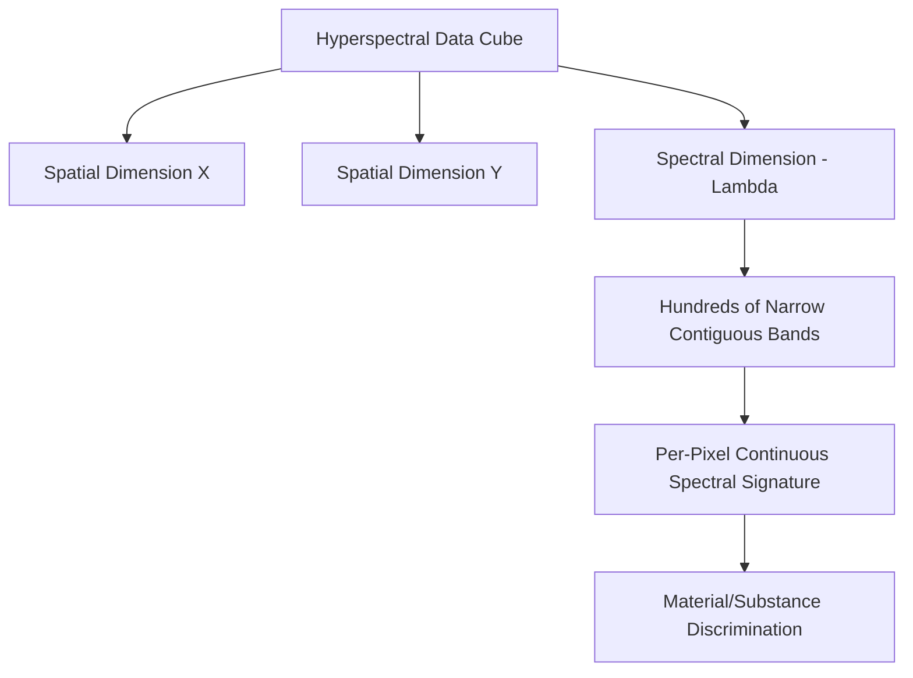
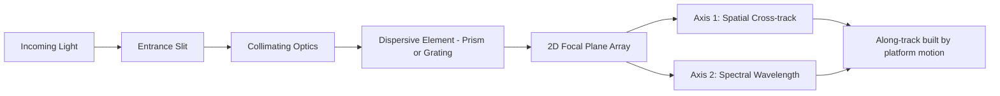

## Hyperspectral Imaging Systems


### Overview

Hyperspectral imaging systems capture spectral information across hundreds of narrow, contiguous bands (typically 5–10 nm bandwidth each), producing a near-continuous reflectance spectrum for every pixel. This contrasts with multispectral systems, which sample only a handful of broad, discontinuous bands. The result is a three-dimensional data structure—two spatial dimensions plus one spectral dimension—commonly called a "hyperspectral cube" or "data cube."

### Core Concept: The Spectral Cube

Each pixel in a hyperspectral image contains a full spectral signature rather than a few discrete reflectance values. This enables identification of materials based on subtle absorption features that broadband multispectral sensors cannot resolve.



**Key distinction from multispectral:**

| Property | Multispectral | Hyperspectral |
| --- | --- | --- |
| Band count | 4–15 | 100–500+ |
| Bandwidth | 50–150 nm | 5–10 nm |
| Spectral continuity | Discrete, gapped | Near-continuous |
| Data volume | Lower | Very high |
| Typical use | Land cover, vegetation indices | Mineral ID, chemical composition, subtle material discrimination |

### Physical and Mathematical Basis

The reflectance spectrum $\rho(\lambda)$ for a pixel is sampled at fine wavelength intervals $\Delta\lambda$, producing a vector:

$$\mathbf{r} = [\rho(\lambda_1), \rho(\lambda_2), \dots, \rho(\lambda_n)]$$

where $n$ often exceeds 200. Narrow diagnostic absorption features—such as clay mineral absorption near 2.2 $\mu m$ or specific plant biochemical absorption bands—are only resolvable when $\Delta\lambda$ is small enough to avoid averaging the feature away, a phenomenon that occurs in broadband multispectral sensing.

**Spectral Mixing Model**

Because pixel size often exceeds the scale of individual materials, most pixels are spectral mixtures. The linear mixing model expresses observed reflectance as:

$$\rho_\lambda = \sum_{i=1}^{k} f_i \cdot \rho_{i,\lambda} + \varepsilon_\lambda$$

where $f_i$ is the fractional abundance of endmember $i$, $\rho_{i,\lambda}$ is that endmember's reference spectrum, $k$ is the number of endmembers, and $\varepsilon_\lambda$ is residual error, subject to the constraints $\sum f_i = 1$ and $f_i \geq 0$.

### Sensor Architectures

**Pushbroom (Line-Scan) Hyperspectral**

Most airborne and spaceborne hyperspectral sensors use pushbroom architecture: a slit captures one spatial line, which is dispersed spectrally (via prism, grating, or prism-grating-prism assembly) onto a 2D detector array (one axis spatial, one axis spectral). Forward platform motion builds the second spatial dimension over time.

**Whiskbroom**

Older design using a scanning mirror to sweep across-track, with light directed through a spectrometer; largely superseded by pushbroom due to lower SNR and mechanical complexity.

**Snapshot/Staring Array**

Emerging designs (e.g., using integral field spectrometers or spectral filter arrays) capture the full spatial-spectral cube in a single exposure, useful for UAV platforms and dynamic scenes, at some cost to spatial or spectral resolution.



### Major Hyperspectral Missions and Sensors

| System | Platform | Bands | Spectral Range | Spatial Resolution |
| --- | --- | --- | --- | --- |
| AVIRIS | Airborne (NASA/JPL) | 224 | 0.4–2.5 $\mu m$ | 4–20 m |
| Hyperion | EO-1 satellite (decommissioned) | 220 | 0.4–2.5 $\mu m$ | 30 m |
| PRISMA | Italian Space Agency satellite | 239 | 0.4–2.5 $\mu m$ | 30 m |
| EnMAP | German satellite | 224 | 0.42–2.45 $\mu m$ | 30 m |
| EMIT | ISS-mounted (NASA) | 285 | 0.38–2.5 $\mu m$ | 60 m |

[Unverified] Exact band counts and spectral ranges can vary slightly between mission documentation revisions and calibration updates; consult the operating agency's current technical specification for mission-critical work.

### Processing Workflow

**Standard Pipeline**

1. **Radiometric calibration**: raw digital numbers converted to at-sensor radiance using calibration coefficients
2. **Atmospheric correction**: radiative transfer models (e.g., FLAASH, ATCOR, QUAC) convert radiance to surface reflectance, correcting for water vapor, aerosols, and gas absorption
3. **Geometric correction/orthorectification**: removes sensor and terrain-induced distortion
4. **Bad band removal**: bands near water vapor absorption windows (~1.4 $\mu m$, ~1.9 $\mu m$) often show low SNR and are typically masked or discarded
5. **Dimensionality reduction**: Principal Component Analysis (PCA) or Minimum Noise Fraction (MNF) transform reduces redundancy across highly correlated adjacent bands
6. **Endmember extraction**: algorithms such as Pixel Purity Index (PPI) or N-FINDR identify spectrally pure reference materials
7. **Spectral unmixing/classification**: Spectral Angle Mapper (SAM), Spectral Mixture Analysis (SMA), or machine learning classifiers assign or decompose pixel spectra

**Example: Spectral Angle Mapper (Conceptual Python)**

```python
import numpy as np

def spectral_angle(pixel_spectrum, reference_spectrum):
    """
    Computes the spectral angle (radians) between a pixel's
    spectrum and a reference (endmember) spectrum.
    Smaller angle indicates higher similarity.
    """
    numerator = np.dot(pixel_spectrum, reference_spectrum)
    denominator = (
        np.linalg.norm(pixel_spectrum) * np.linalg.norm(reference_spectrum)
    )
    cos_angle = np.clip(numerator / denominator, -1.0, 1.0)
    return np.arccos(cos_angle)

# pixel_spectrum and reference_spectrum are 1D arrays
# of reflectance values across all bands
angle = spectral_angle(pixel_spectrum, reference_spectrum)
```

The Spectral Angle Mapper metric is defined as:

$$\theta = \cos^{-1}\left(\frac{\mathbf{t} \cdot \mathbf{r}}{\|\mathbf{t}\| \|\mathbf{r}\|}\right)$$

where $\mathbf{t}$ is the test pixel spectrum and $\mathbf{r}$ is the reference spectrum. This metric is insensitive to illumination/albedo scaling since it measures angular difference rather than magnitude.

### Key Analytical Techniques

- **Continuum removal**: normalizes spectra by dividing by a convex hull "continuum" line, isolating absorption feature depth and shape for mineral/vegetation biochemistry analysis
- **Derivative spectroscopy**: first- or second-derivative transforms sharpen subtle absorption features and reduce baseline/illumination effects
- **Vegetation biochemical indices**: narrowband indices (e.g., Red Edge Position, Photochemical Reflectance Index) exploit fine spectral resolution unavailable to multispectral sensors
- **Anomaly detection**: algorithms like RX (Reed-Xiaoli) detector identify pixels spectrally distinct from their background, used in target/anomaly detection applications

### Challenges and Limitations

- **Data volume**: hundreds of bands per scene create storage, bandwidth, and processing burdens far exceeding multispectral data
- **Curse of dimensionality**: high band count relative to training sample size can degrade classifier performance (Hughes phenomenon), requiring dimensionality reduction or regularization
- **Low SNR per band**: narrow bandwidths collect less photon energy, increasing noise sensitivity, particularly in SWIR
- **Atmospheric correction complexity**: fine spectral sampling requires more precise correction, as narrowband atmospheric absorption features can otherwise be misattributed to surface materials
- **Band-to-band misregistration**: in some pushbroom designs, spectral "smile" and spatial "keystone" distortions require correction

### Applications

- Mineral exploration and lithological mapping via diagnostic absorption features
- Precision agriculture: crop stress, nutrient deficiency, and disease detection before visible symptoms appear
- Vegetation biochemistry: canopy nitrogen, chlorophyll, water content estimation
- Environmental contamination mapping (e.g., oil spills, mine tailings)
- Military and defense target/camouflage detection
- Coastal and inland water quality monitoring (chlorophyll-a, colored dissolved organic matter)
- Forensic and cultural heritage material analysis (increasingly via laboratory/handheld hyperspectral)

### Spectral Signature Comparison Diagram

<svg xmlns="http://www.w3.org/2000/svg" viewBox="0 0 760 340" font-family="Arial, sans-serif">
<text x="380" y="24" text-anchor="middle" font-size="16" font-weight="bold">Multispectral vs. Hyperspectral Sampling (svg_diagram)</text>
<line x1="80" y1="280" x2="700" y2="280" stroke="black" stroke-width="2" />
<line x1="80" y1="280" x2="80" y2="50" stroke="black" stroke-width="2" />
<text x="390" y="310" text-anchor="middle" font-size="13">Wavelength (nm)</text>
<text x="35" y="165" text-anchor="middle" font-size="13" transform="rotate(-90 35 165)">Reflectance</text>

<path d="M100,220 Q200,240 300,150 Q400,90 500,110 Q600,140 660,180" fill="none" stroke="`#2b8a3e`" stroke-width="2" />

<rect x="95" y="255" width="70" height="15" fill="#1864ab" opacity="0.5" />
<rect x="230" y="255" width="70" height="15" fill="#1864ab" opacity="0.5" />
<rect x="400" y="255" width="70" height="15" fill="#1864ab" opacity="0.5" />
<rect x="560" y="255" width="70" height="15" fill="#1864ab" opacity="0.5" />
<text x="380" y="250" text-anchor="middle" font-size="11" fill="#1864ab">Multispectral: 4 broad bands</text>
<g fill="#e8590c">
<rect x="100" y="230" width="6" height="8" />
<rect x="112" y="230" width="6" height="8" />
<rect x="124" y="230" width="6" height="8" />
<rect x="136" y="230" width="6" height="8" />
<rect x="148" y="230" width="6" height="8" />
<rect x="160" y="230" width="6" height="8" />
<rect x="172" y="230" width="6" height="8" />
<rect x="184" y="230" width="6" height="8" />
<rect x="196" y="230" width="6" height="8" />
<rect x="208" y="230" width="6" height="8" />
<rect x="220" y="230" width="6" height="8" />
<rect x="232" y="230" width="6" height="8" />
<rect x="244" y="230" width="6" height="8" />
<rect x="256" y="230" width="6" height="8" />
<rect x="268" y="230" width="6" height="8" />
<rect x="280" y="230" width="6" height="8" />
<rect x="292" y="230" width="6" height="8" />
<rect x="304" y="230" width="6" height="8" />
<rect x="316" y="230" width="6" height="8" />
<rect x="328" y="230" width="6" height="8" />
<rect x="340" y="230" width="6" height="8" />
<rect x="352" y="230" width="6" height="8" />
<rect x="364" y="230" width="6" height="8" />
<rect x="376" y="230" width="6" height="8" />
<rect x="388" y="230" width="6" height="8" />
<rect x="400" y="230" width="6" height="8" />
<rect x="412" y="230" width="6" height="8" />
<rect x="424" y="230" width="6" height="8" />
<rect x="436" y="230" width="6" height="8" />
<rect x="448" y="230" width="6" height="8" />
<rect x="460" y="230" width="6" height="8" />
<rect x="472" y="230" width="6" height="8" />
<rect x="484" y="230" width="6" height="8" />
<rect x="496" y="230" width="6" height="8" />
<rect x="508" y="230" width="6" height="8" />
<rect x="520" y="230" width="6" height="8" />
<rect x="532" y="230" width="6" height="8" />
<rect x="544" y="230" width="6" height="8" />
<rect x="556" y="230" width="6" height="8" />
<rect x="568" y="230" width="6" height="8" />
<rect x="580" y="230" width="6" height="8" />
<rect x="592" y="230" width="6" height="8" />
<rect x="604" y="230" width="6" height="8" />
<rect x="616" y="230" width="6" height="8" />
<rect x="628" y="230" width="6" height="8" />
<rect x="640" y="230" width="6" height="8" />
<rect x="652" y="230" width="6" height="8" />
</g>
<text x="380" y="222" text-anchor="middle" font-size="11" fill="#e8590c">Hyperspectral: hundreds of narrow bands</text>
</svg>

### Next Steps

- **Related Topics**:
  - Spectral Unmixing and Endmember Extraction Algorithms
  - Atmospheric Correction for Narrowband Sensors (FLAASH, ATCOR, QUAC)
  - Dimensionality Reduction (PCA, MNF Transform) for Remote Sensing
  - Imaging Spectroscopy for Precision Agriculture
  - Machine Learning Classification of Hyperspectral Cubes
  - UAV-Based Snapshot Hyperspectral Sensors
  - Optical and Multispectral Satellite Systems (comparative foundation)
  - Spectral Library Development and Reference Spectra Databases