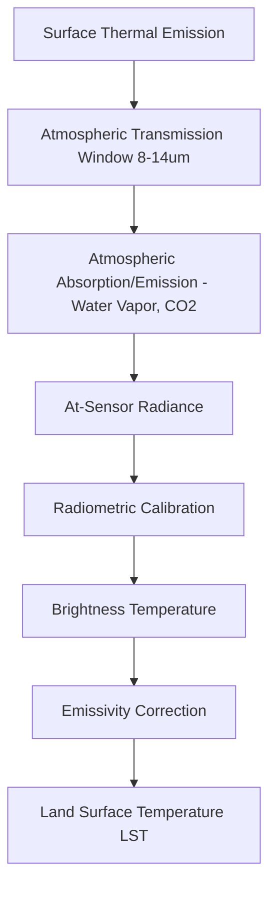
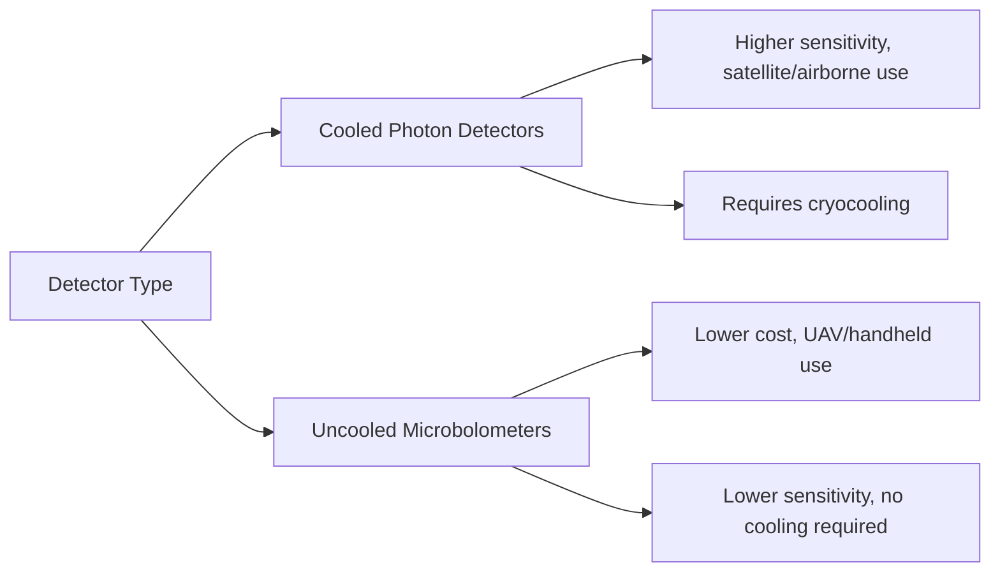

## Thermal Infrared Remote Sensing


### Overview

Thermal infrared (TIR) remote sensing measures emitted electromagnetic radiation from the Earth's surface in the $8$–$14\ \mu m$ atmospheric window, rather than reflected solar radiation used by optical/multispectral sensors. Because this radiation is a function of surface temperature and emissivity, TIR sensors enable retrieval of land surface temperature (LST), thermal inertia properties, and heat-flux-related phenomena independent of solar illumination, allowing both day and night acquisition.

### Physical Principles

**Blackbody Radiation and Planck's Law**

All objects above absolute zero emit thermal radiation. The spectral radiance of an ideal blackbody at temperature $T$ is given by Planck's Law:

$$L_\lambda(T) = \frac{2hc^2}{\lambda^5} \cdot \frac{1}{e^{hc/(\lambda k T)} - 1}$$

where $h$ is Planck's constant, $c$ is the speed of light, $k$ is Boltzmann's constant, and $\lambda$ is wavelength. At terrestrial temperatures (~280–320 K), peak emission occurs in the thermal infrared, consistent with Wien's Displacement Law:

$$\lambda_{max} = \frac{b}{T}$$

where $b \approx 2898\ \mu m \cdot K$.

**Emissivity**

Real materials are not perfect blackbodies; emissivity $\varepsilon$ (ranging 0–1) describes how efficiently a surface emits thermal radiation relative to a blackbody at the same temperature:

$$L_{surface} = \varepsilon \cdot L_{blackbody}(T) + (1-\varepsilon) \cdot L_{downwelling}$$

Materials like water ($\varepsilon \approx 0.98$) emit near-blackbody radiation, while metals and some dry soils/rocks have lower, more variable emissivity, complicating temperature retrieval since sensors measure radiance, not temperature directly.

**Atmospheric Windows**

TIR sensing relies on atmospheric transmission windows where water vapor and $CO_2$ absorption is minimized: primarily $3$–$5\ \mu m$ (mid-wave infrared, MWIR) and $8$–$14\ \mu m$ (long-wave infrared, LWIR/TIR). Most Earth-observing thermal sensors operate in the LWIR window due to stronger terrestrial emission there at ambient temperatures.



### Land Surface Temperature Retrieval

**Single-Channel Method**

Uses one thermal band with radiative transfer equation correction:

$$L_{sensor} = \varepsilon \cdot B(T_s) \cdot \tau + L_{atm\uparrow} + (1-\varepsilon) \cdot L_{atm\downarrow} \cdot \tau$$

where $\tau$ is atmospheric transmittance, $B(T_s)$ is blackbody radiance at surface temperature $T_s$, and $L_{atm\uparrow}$/$L_{atm\downarrow}$ are upwelling/downwelling atmospheric radiance terms.

**Split-Window Algorithm**

Uses two adjacent thermal bands (e.g., ~10.8 $\mu m$ and ~12 $\mu m$) to exploit differential atmospheric absorption, canceling much of the atmospheric water vapor effect without requiring detailed atmospheric profile data:

$$T_s = T_{i} + c_1(T_i - T_j) + c_2(T_i - T_j)^2 + c_0$$

where $T_i$, $T_j$ are brightness temperatures in the two bands and $c_0$, $c_1$, $c_2$ are empirically or physically derived coefficients specific to the sensor and emissivity conditions.

### Sensor Systems

| Sensor/Mission | Platform | Thermal Bands | Spatial Resolution | Notes |
| --- | --- | --- | --- | --- |
| Landsat 8/9 TIRS | Satellite | 2 (10.6–11.2, 11.5–12.5 $\mu m$) | 100 m (resampled to 30 m product) | Split-window capable |
| MODIS | Terra/Aqua satellites | 16 thermal bands | 1 km | Twice-daily global coverage |
| ASTER | Terra satellite | 5 TIR bands | 90 m | High spectral detail in TIR for geology |
| VIIRS | Suomi NPP/NOAA-20 | Multiple TIR bands | 375–750 m | Operational weather/LST products |
| ECOSTRESS | ISS-mounted (NASA) | 5 TIR bands | ~70 m | High revisit for diurnal ET/stress monitoring |

[Unverified] Exact band-center wavelengths and current resolution specifications should be confirmed against the operating agency's up-to-date technical documentation, as calibration and product versions are periodically revised.

### Sensor Architecture

Most spaceborne TIR instruments use cooled photon detectors (e.g., mercury cadmium telluride, quantum well infrared photodetectors) or uncooled microbolometers (common in UAV/handheld thermal cameras), since detector sensitivity and dark current are highly temperature-dependent. Cryogenic cooling (via cryocoolers or passive radiators) is common on cooled-detector satellite sensors to suppress thermal noise from the detector itself, since instrument self-emission at ambient temperature would otherwise overwhelm the terrestrial signal being measured.



### Processing Workflow

1. **Radiometric calibration**: convert raw digital numbers to at-sensor spectral radiance using sensor-specific calibration constants
2. **Conversion to brightness temperature**: apply the inverse Planck function
3. **Atmospheric correction**: apply radiative transfer modeling (e.g., MODTRAN) or split-window differencing to remove atmospheric contribution
4. **Emissivity correction**: apply land cover-based emissivity look-up tables, NDVI-based emissivity methods (e.g., threshold method), or temperature-emissivity separation (TES) algorithms
5. **LST product generation**: final surface temperature raster, often validated against in-situ or radiosonde-derived reference data

**Example: Converting Landsat 8 TIRS DN to Brightness Temperature**

```python
import numpy as np
import rasterio

# Landsat 8 TIRS Band 10 calibration constants (example values;
# actual mission metadata (MTL file) must be used for real data)
ML = 3.3420e-04   # Radiance multiplicative scaling factor
AL = 0.10000      # Radiance additive scaling factor
K1 = 774.8853     # Thermal conversion constant
K2 = 1321.0789    # Thermal conversion constant

with rasterio.open("band10_dn.tif") as src:
    dn = src.read(1).astype(np.float64)
    profile = src.profile

# Step 1: DN to TOA spectral radiance
radiance = ML * dn + AL

# Step 2: Radiance to brightness temperature (Kelvin)
brightness_temp_k = K2 / (np.log((K1 / radiance) + 1))

# Convert to Celsius
brightness_temp_c = brightness_temp_k - 273.15

profile.update(dtype=rasterio.float64, count=1)
with rasterio.open("brightness_temp_celsius.tif", "w", **profile) as dst:
    dst.write(brightness_temp_c, 1)
```

The brightness temperature formula used above is:

$$T_B = \frac{K_2}{\ln\left(\frac{K_1}{L_\lambda} + 1\right)}$$

This yields brightness temperature, not true surface temperature; emissivity correction is still required to obtain accurate LST.

### Key Derived Products and Indices

- **Land Surface Temperature (LST)**: emissivity-corrected surface temperature, foundational for urban heat island, drought, and evapotranspiration studies
- **Thermal Inertia**: derived from diurnal temperature amplitude, used to infer soil moisture and rock/soil composition
- **Evapotranspiration (ET) models**: e.g., SEBAL, METRIC, use LST alongside vegetation indices and meteorological data to estimate surface energy balance
- **Urban Heat Island (UHI) intensity**: difference in LST between urban and surrounding rural areas
- **Fire detection/hotspot algorithms**: exploit strong contrast between fire radiance and background temperature, often using MWIR/TIR band combinations (e.g., MODIS/VIIRS active fire products)

### Limitations

- **Coarser spatial resolution**: TIR detectors generally require larger ground sampling areas than VNIR sensors to collect sufficient thermal energy, resulting in typically coarser native resolution (though pan-sharpening or resampling techniques are sometimes applied)
- **Atmospheric sensitivity**: water vapor strongly attenuates and re-emits thermal radiation, requiring careful correction
- **Emissivity uncertainty**: unknown or heterogeneous surface emissivity is a major source of LST retrieval error, particularly over mixed or urban land cover
- **Diurnal/temporal variability**: surface temperature changes rapidly with solar heating/cooling cycles, so acquisition time strongly affects interpretation
- **Cloud contamination**: while TIR does not require solar illumination, cloud cover still obstructs surface-emitted radiation

### Applications

- Urban heat island mapping and urban climate studies
- Agricultural drought monitoring and crop water stress detection (canopy temperature elevation indicates stomatal closure)
- Wildfire detection, active fire monitoring, and burn severity assessment
- Volcanic and geothermal activity monitoring
- Evapotranspiration and water balance modeling for irrigation management
- Industrial and infrastructure thermal anomaly detection (e.g., pipeline leaks, powerline faults)
- Nighttime surface temperature studies independent of solar illumination

### Day/Night Acquisition Advantage Diagram

<svg xmlns="http://www.w3.org/2000/svg" viewBox="0 0 760 300" font-family="Arial, sans-serif">
<text x="380" y="24" text-anchor="middle" font-size="16" font-weight="bold">Optical vs. Thermal Sensing Across a Diurnal Cycle (svg_diagram)</text>
<line x1="80" y1="250" x2="700" y2="250" stroke="black" stroke-width="2" />
<text x="390" y="280" text-anchor="middle" font-size="13">Time of Day</text>
<rect x="80" y="60" width="620" height="30" fill="#ffd43b" opacity="0.6" />
<text x="390" y="80" text-anchor="middle" font-size="12">Optical/Multispectral: requires daylight only</text>
<line x1="80" y1="60" x2="700" y2="60" stroke="black" stroke-width="1" stroke-dasharray="4" />
<text x="90" y="55" font-size="11">Sunrise</text>
<text x="650" y="55" font-size="11">Sunset</text>
<rect x="80" y="150" width="620" height="30" fill="#e8590c" opacity="0.5" />
<text x="390" y="170" text-anchor="middle" font-size="12">Thermal Infrared: day + night acquisition capable</text>

<text x="150" y="220" font-size="11">00:00</text>

<text x="380" y="220" font-size="11">12:00</text>

<text x="620" y="220" font-size="11">24:00</text>

</svg>

### Next Steps

- **Related Topics**:
  - Land Surface Temperature Retrieval Algorithms (Split-Window, Single-Channel, TES)
  - Surface Energy Balance Models (SEBAL, METRIC) for Evapotranspiration
  - Active Fire Detection Algorithms (MODIS/VIIRS Fire Products)
  - Emissivity Mapping and Temperature-Emissivity Separation
  - Urban Heat Island Analysis Using Remote Sensing
  - Optical and Multispectral Satellite Systems (comparative foundation)
  - Hyperspectral Imaging Systems (comparative foundation)
  - Thermal UAV Sensors and Precision Agriculture Water Stress Detection