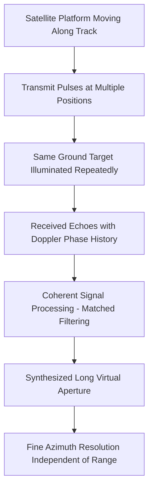
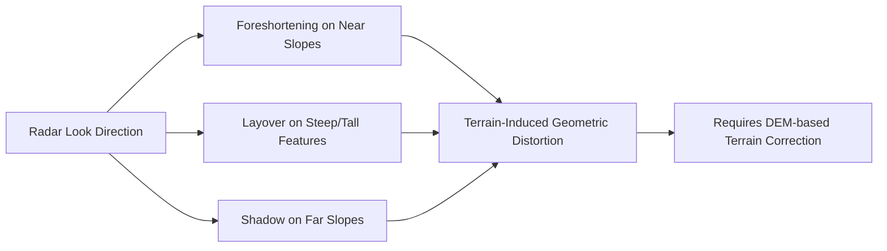
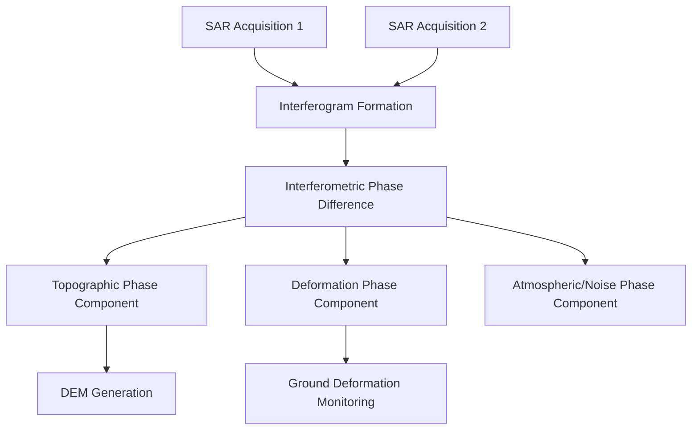

## Radar and Synthetic Aperture Radar


### Overview

Radar (Radio Detection and Ranging) is an active remote sensing technology that transmits microwave pulses toward a target and measures the backscattered energy to determine range, and in imaging applications, to reconstruct a spatial map of surface properties. Synthetic Aperture Radar (SAR) extends this principle by synthesizing a large "virtual" antenna aperture from the motion of a smaller physical antenna, achieving fine spatial resolution that a real-aperture radar of the same physical size could not achieve at typical satellite altitudes. Because radar is active and operates at microwave wavelengths, it penetrates cloud cover and operates independently of solar illumination, day or night.

### Physical Principles

**Microwave Bands Used in SAR**

| Band | Wavelength | Frequency | Typical Applications |
| --- | --- | --- | --- |
| X-band | 2.4–3.75 cm | 8–12 GHz | High-resolution urban/infrastructure monitoring |
| C-band | 3.75–7.5 cm | 4–8 GHz | Sea ice, agriculture, general-purpose (Sentinel-1) |
| S-band | 7.5–15 cm | 2–4 GHz | Vegetation, agriculture (NISAR) |
| L-band | 15–30 cm | 1–2 GHz | Forest biomass, subsurface/vegetation penetration |
| P-band | 30–100 cm | 0.3–1 GHz | Deep forest canopy/biomass, subsurface (research) |

Longer wavelengths (L-, P-band) penetrate vegetation canopies more deeply and are sensitive to larger scattering structures (trunks, branches), while shorter wavelengths (X-, C-band) interact more with canopy tops and small-scale surface roughness.

**Radar Range Equation**

The power received by the radar $P_r$ is governed by:

$$P_r = \frac{P_t \cdot G^2 \cdot \lambda^2 \cdot \sigma}{(4\pi)^3 \cdot R^4}$$

where $P_t$ is transmitted power, $G$ is antenna gain, $\lambda$ is wavelength, $\sigma$ is the radar cross-section of the target, and $R$ is the range to the target. The inverse fourth-power range dependence is a defining characteristic of radar systems.

**Backscatter and Surface Properties**

Radar backscatter intensity $\sigma^0$ (normalized radar cross-section) depends on:

- **Surface roughness** relative to wavelength (Rayleigh criterion)
- **Dielectric constant**, strongly influenced by moisture content (water has high dielectric permittivity)
- **Incidence angle**, with backscatter generally decreasing as incidence angle increases
- **Surface geometry/orientation** relative to the radar look direction

### Real Aperture vs. Synthetic Aperture

**The Resolution Problem**

For a real-aperture (side-looking) radar, along-track (azimuth) resolution is:

$$R_{az} = \frac{\lambda \cdot R}{L}$$

where $L$ is the physical antenna length and $R$ is slant range. At satellite altitudes (~700 km) with practical antenna lengths, this yields azimuth resolution of kilometers—far too coarse for most imaging applications.

**Synthetic Aperture Principle**

SAR overcomes this by exploiting platform motion: as the satellite moves, it transmits and receives repeated pulses toward the same ground target from many positions along its track. Coherent processing (phase-preserving combination) of this pulse sequence synthesizes an effective aperture length equal to the distance the platform travels while the target remains within the beam footprint. Counterintuitively, azimuth resolution for SAR becomes independent of range and improves with a *shorter* physical antenna:

$$R_{az,SAR} = \frac{L}{2}$$

This is achieved by treating each echo as if received from a virtual element of an enormous antenna array, using the Doppler frequency shift induced by relative motion between platform and target to reconstruct fine azimuth positioning.



### SAR Imaging Geometry

SAR is a side-looking imaging system; it cannot image directly beneath the platform (nadir) because it relies on measuring range differences, which vanish at nadir. Key geometric effects include:

- **Foreshortening**: slopes facing the radar appear compressed in the image
- **Layover**: steep slopes or tall features (mountains, buildings) appear to "fall toward" the sensor when their top reflects before their base
- **Shadow**: areas blocked from illumination on the far side of steep terrain relative to the radar appear as no-data zones
- **Range vs. azimuth resolution**: range resolution depends on transmitted pulse bandwidth, while azimuth resolution depends on the synthetic aperture, as described above



### SAR Polarization

SAR systems transmit and receive in specific polarization states (Horizontal, H, or Vertical, V), producing combinations:

- **Single-pol**: HH, VV, HV, or VH
- **Dual-pol**: two combinations, e.g., HH+HV
- **Quad-pol (fully polarimetric)**: all four combinations, enabling polarimetric decomposition

Cross-polarized returns (HV, VH) are particularly sensitive to volume scattering (e.g., vegetation canopy structure), while co-polarized returns (HH, VV) are more sensitive to surface and double-bounce scattering mechanisms.

### Major SAR Satellite Systems

| System | Operator | Band | Resolution (typical modes) | Notes |
| --- | --- | --- | --- | --- |
| Sentinel-1 | ESA Copernicus | C-band | 5–20 m | Free/open data, 6–12 day revisit (constellation-dependent) |
| RADARSAT Constellation Mission | Canadian Space Agency | C-band | 3–100 m | Multi-satellite constellation |
| TerraSAR-X / TanDEM-X | German Aerospace Center (DLR) | X-band | Up to ~1 m | TanDEM-X pair enables interferometric DEM generation |
| ICEYE | ICEYE (commercial) | X-band | Down to ~0.25–1 m | Small satellite constellation, rapid revisit |
| ALOS-2 (PALSAR-2) | JAXA | L-band | 3–100 m | Vegetation/forest applications |
| NISAR | NASA/ISRO (joint mission) | L-band + S-band | ~3–10 m | Dedicated to biomass, deformation, cryosphere; recent/emerging mission |

[Unverified] Resolution figures vary considerably by acquisition mode (e.g., Spotlight, Stripmap, ScanSAR/TOPS) and swath width trade-offs; consult current mission handbooks for mode-specific specifications, especially for recently launched or evolving missions such as NISAR.

### Interferometric SAR (InSAR)

InSAR exploits the phase difference between two SAR acquisitions of the same area (from slightly different positions or times) to measure:

- **Topography**: single-pass or repeat-pass phase difference relates to terrain elevation, used to generate digital elevation models (e.g., SRTM, TanDEM-X global DEM)
- **Surface deformation**: repeat-pass interferometry detects millimeter-to-centimeter scale ground displacement (subsidence, earthquake deformation, volcanic inflation, glacier motion)

The interferometric phase $\Delta\phi$ relates to range difference:

$$\Delta\phi = \frac{4\pi}{\lambda} \Delta R$$

**Differential InSAR (DInSAR)** removes the topographic phase component (using an external DEM) to isolate deformation signal alone. **Time-series InSAR techniques** (Persistent Scatterer InSAR, Small Baseline Subset/SBAS) stack many interferograms to track deformation trends over time while mitigating atmospheric and decorrelation noise.



### Processing Workflow

1. **Raw signal (Level 0) processing**: range and azimuth compression via matched filtering (SAR focusing)
2. **Radiometric calibration**: conversion to $\sigma^0$ backscatter values, typically in decibels: $\sigma^0_{dB} = 10\log_{10}(\sigma^0)$
3. **Speckle filtering**: SAR imagery exhibits speckle, a granular noise pattern from coherent interference of sub-resolution scatterers; filters such as Lee, Frost, or Refined Lee reduce speckle while attempting to preserve edges
4. **Geometric correction/terrain correction**: range-Doppler terrain correction using a DEM to remove foreshortening/layover geometric distortion
5. **Multi-looking**: averaging adjacent looks to reduce speckle at the cost of spatial resolution
6. **Polarimetric/interferometric processing**: as applicable, decomposition or phase-based analysis

**Example: Simple dB Conversion of SAR Backscatter (Python)**

```python
import numpy as np
import rasterio

with rasterio.open("sar_intensity.tif") as src:
    intensity = src.read(1).astype(np.float64)
    profile = src.profile

# Avoid log of zero/negative values
intensity[intensity <= 0] = np.nan

# Convert linear intensity to decibels
sigma0_db = 10 * np.log10(intensity)

profile.update(dtype=rasterio.float64, count=1)
with rasterio.open("sar_backscatter_db.tif", "w", **profile) as dst:
    dst.write(sigma0_db, 1)
```

### Key Advantages Over Optical Sensing

- **All-weather capability**: microwaves penetrate cloud cover, unlike optical/TIR sensors
- **Day/night operation**: active illumination removes dependency on solar lighting
- **Sensitivity to structure and moisture**: responds to surface roughness, dielectric properties, and canopy/subsurface structure rather than color/reflectance
- **Deformation measurement**: InSAR provides millimeter-scale surface motion detection unavailable to passive optical sensors

### Limitations

- **Speckle noise**: inherent to coherent imaging, requiring filtering that trades resolution for noise reduction
- **Complex geometric distortions**: layover and shadow can render steep terrain difficult to interpret without careful correction
- **Interpretation complexity**: radar backscatter does not correspond intuitively to visible surface color/appearance, requiring specialized training
- **Temporal decorrelation**: in InSAR, changes in surface scattering properties between acquisitions (vegetation growth, soil moisture change) can degrade phase coherence
- **Atmospheric phase delay**: tropospheric water vapor variability introduces phase artifacts in InSAR deformation measurements, requiring correction or time-series mitigation

### Applications

- Flood extent mapping (all-weather, day/night capability critical for disaster response)
- Ground deformation monitoring: subsidence, earthquake, volcanic, and infrastructure stability
- Forest biomass and structure estimation (particularly L-/P-band)
- Sea ice classification and monitoring for navigation
- Agricultural monitoring (soil moisture, crop structure)
- Digital elevation model generation (e.g., SRTM, TanDEM-X global DEM)
- Maritime surveillance and ship detection
- Glacier velocity and ice sheet dynamics monitoring

### Next Steps

- **Related Topics**:
  - Interferometric SAR (InSAR) Time-Series Analysis (SBAS, PSInSAR)
  - SAR Polarimetric Decomposition Techniques
  - Speckle Filtering Methods for SAR Imagery
  - Digital Elevation Model Generation from SAR
  - Optical and Multispectral Satellite Systems (comparative foundation)
  - Thermal Infrared Remote Sensing (comparative foundation)
  - SAR-Optical Data Fusion for Land Cover Classification
  - NISAR Mission Architecture and Data Products (emerging mission)