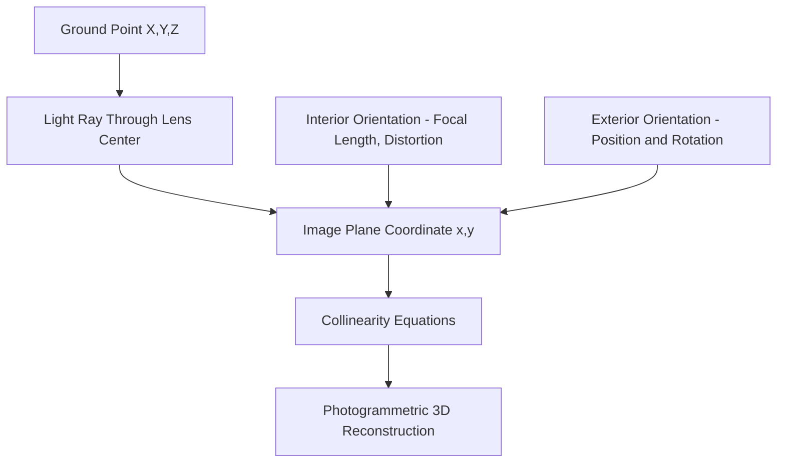
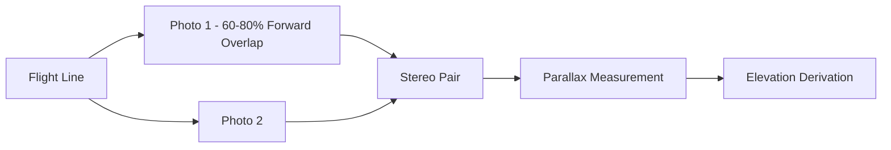
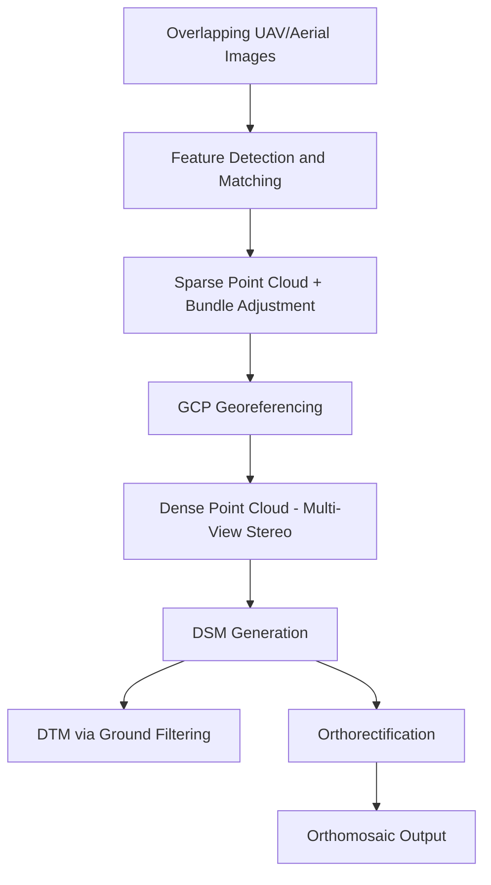

## Aerial Photography and Photogrammetry


### Overview

Aerial photography is the acquisition of imagery from aircraft-mounted (or, increasingly, UAV-mounted) cameras, typically at altitudes and viewing geometries distinct from satellite platforms. Photogrammetry is the science of deriving precise geometric measurements—coordinates, distances, elevations, and 3D models—from overlapping photographs. Together they form the foundation for topographic mapping, orthophoto production, and 3D reconstruction long predating satellite remote sensing, and remain central to high-resolution mapping applications today.

### Types of Aerial Photography

**By Camera Orientation**

- **Vertical (nadir) photography**: camera axis pointed straight down (within ~3° tolerance), used for mapping and orthophoto production
- **Oblique photography**: camera axis tilted from vertical; "low oblique" doesn't capture the horizon, "high oblique" does; used for visualization, 3D building facade capture, and reconnaissance

**By Film/Sensor Type**

- **Panchromatic**: single black-and-white band
- **Natural color (RGB)**: standard visible-spectrum imagery
- **Color infrared (CIR)**: false-color imagery substituting a near-infrared channel for one visible band, historically on film, now digital; widely used for vegetation analysis

### Camera Geometry and Photogrammetric Principles

**Central Projection**

Unlike satellite pushbroom sensors, frame cameras capture an entire image in a single instant through central (perspective) projection, where all light rays pass through a single lens center. This creates geometric relief displacement, differing fundamentally from the near-parallel projection of high-altitude satellite sensors.

**Interior and Exterior Orientation**

- **Interior orientation**: parameters describing the camera itself—focal length $f$, principal point location, and lens distortion coefficients—established through camera calibration
- **Exterior orientation**: parameters describing the camera's position and orientation at exposure—three positional coordinates $(X_0, Y_0, Z_0)$ and three rotation angles (omega, phi, kappa), often derived via GPS/IMU (direct georeferencing) or bundle adjustment (indirect, using ground control points)

**Collinearity Equations**

The fundamental photogrammetric relationship linking image coordinates to ground coordinates is expressed through the collinearity equations:

$$x = -f \cdot \frac{m_{11}(X-X_0) + m_{12}(Y-Y_0) + m_{13}(Z-Z_0)}{m_{31}(X-X_0) + m_{32}(Y-Y_0) + m_{33}(Z-Z_0)}$$


$$y = -f \cdot \frac{m_{21}(X-X_0) + m_{22}(Y-Y_0) + m_{23}(Z-Z_0)}{m_{31}(X-X_0) + m_{32}(Y-Y_0) + m_{33}(Z-Z_0)}$$

where $(x, y)$ are image plane coordinates, $(X, Y, Z)$ are ground coordinates, $(X_0, Y_0, Z_0)$ is the camera exposure position, $f$ is focal length, and $m_{ij}$ are elements of the rotation matrix derived from the three exterior orientation angles.



### Stereophotogrammetry and Overlap

**Flight Planning Parameters**

- **Forward overlap (endlap)**: overlap between consecutive images along a flight line, typically 60–80%, required to create stereo pairs
- **Side overlap (sidelap)**: overlap between adjacent flight lines, typically 20–40%, ensures no gaps between strips
- **Flying height and scale**: photo scale relates to flying height $H$ and focal length $f$ by:

$$Scale = \frac{f}{H}$$

**Stereoscopic Viewing and Parallax**

Two overlapping photographs taken from different positions create stereo parallax, enabling three-dimensional perception and measurement. The parallax difference $\Delta p$ between two points is related to their elevation difference $\Delta h$:

$$\Delta h = \frac{H \cdot \Delta p}{p_a + \Delta p}$$

where $H$ is flying height above the datum and $p_a$ is the average photo base (absolute parallax) of the reference point.



### Structure from Motion (SfM) Photogrammetry

Modern digital photogrammetry, especially with UAV imagery, commonly relies on Structure from Motion (SfM) rather than traditional stereo-pair analysis. SfM automatically identifies matching features across many overlapping images (often using algorithms like SIFT, Scale-Invariant Feature Transform) and simultaneously solves for camera positions/orientations and 3D point locations through bundle adjustment, without requiring pre-known camera positions.

**Typical SfM Processing Pipeline**

1. **Image acquisition**: overlapping photos with high forward/side overlap (often 75%+/60%+ for UAV surveys)
2. **Feature detection and matching**: identify and match keypoints across image pairs
3. **Sparse point cloud/bundle adjustment**: simultaneously solve camera poses and initial 3D point positions, minimizing reprojection error
4. **Ground control point (GCP) integration**: known coordinates used to georeference and scale the model, improving absolute accuracy
5. **Dense point cloud generation**: multi-view stereo (MVS) algorithms densify the sparse cloud
6. **Digital Surface Model (DSM) / Digital Terrain Model (DTM) generation**: DSM includes all surface features (vegetation, buildings); DTM represents bare earth after filtering
7. **Orthomosaic generation**: individual images are orthorectified (removing relief displacement using the DSM) and blended into a seamless orthophoto



### Bundle Adjustment

Bundle adjustment is the nonlinear least-squares optimization that simultaneously refines camera parameters (interior and exterior orientation) and 3D point coordinates by minimizing the sum of squared reprojection errors across all images and observed points:

$$\min \sum_{i} \sum_{j} \left\| \mathbf{x}_{ij} - \pi(\mathbf{P}_i, \mathbf{X}_j) \right\|^2$$

where $\mathbf{x}_{ij}$ is the observed image coordinate of point $j$ in image $i$, $\pi(\cdot)$ is the projection function, $\mathbf{P}_i$ represents camera $i$'s parameters, and $\mathbf{X}_j$ is the 3D coordinate of point $j$. This is typically solved iteratively using Levenberg-Marquardt or similar optimization algorithms.

### Ground Control Points (GCPs) and Accuracy

GCPs are surveyed points with precisely known coordinates (via GNSS/RTK survey) visible in the imagery, used to:

- Georeference the photogrammetric model to a real-world coordinate system
- Constrain scale and reduce systematic error/doming distortion
- Provide independent accuracy validation via check points

**Real-Time Kinematic (RTK) and Post-Processed Kinematic (PPK) GNSS**

Modern UAV systems increasingly integrate RTK/PPK-corrected GNSS receivers directly on the aircraft, recording precise camera position at each exposure and substantially reducing (though not always eliminating) the need for dense GCP networks. [Inference] The degree to which RTK/PPK alone can replace GCPs depends on required accuracy tolerances, base station baseline length, and project-specific validation, so many professional workflows still recommend a minimal set of independent check points.

### Example: Basic Photo Scale and GSD Calculation (Python)

```python
def calculate_photo_scale(focal_length_mm, flying_height_m):
    """
    Computes photo scale as a representative fraction (1:N).
    focal_length_mm: camera focal length in millimeters
    flying_height_m: flying height above ground datum in meters
    """
    focal_length_m = focal_length_mm / 1000.0
    scale_denominator = flying_height_m / focal_length_m
    return scale_denominator

def calculate_ground_sample_distance(sensor_pixel_size_um, focal_length_mm, flying_height_m):
    """
    Computes Ground Sample Distance (GSD) in centimeters per pixel.
    sensor_pixel_size_um: physical pixel size on sensor, in micrometers
    """
    pixel_size_mm = sensor_pixel_size_um / 1000.0
    focal_length_m = focal_length_mm / 1000.0
    gsd_m = (pixel_size_mm / 1000.0) * (flying_height_m / focal_length_m)
    return gsd_m * 100  # convert to cm

scale = calculate_photo_scale(focal_length_mm=35, flying_height_m=1500)
gsd_cm = calculate_ground_sample_distance(
    sensor_pixel_size_um=4.4, focal_length_mm=35, flying_height_m=1500
)

print(f"Photo scale: 1:{scale:.0f}")
print(f"Ground Sample Distance: {gsd_cm:.2f} cm/pixel")
```

### Platforms

| Platform Type | Typical Altitude | Typical GSD | Use Case |
| --- | --- | --- | --- |
| Fixed-wing manned aircraft | 300–9,000 m | 5–50 cm | Large-area topographic mapping, cadastral surveys |
| Helicopter | 100–1,500 m | 2–20 cm | Corridor mapping, utility inspection |
| Fixed-wing UAV | 80–400 m | 2–8 cm | Agricultural/large-site mapping |
| Multirotor UAV | 20–150 m | 0.5–3 cm | Construction sites, small-area high-detail mapping |

### Products Derived from Aerial Photogrammetry

- **Orthophoto/orthomosaic**: geometrically corrected, uniform-scale image mosaic usable for direct measurement
- **Digital Surface Model (DSM)**: elevation of all surface features including vegetation and structures
- **Digital Terrain Model (DTM)**: bare-earth elevation after removing vegetation/structures
- **Point clouds**: dense 3D point representations, comparable in some applications to LiDAR-derived point clouds though generated through photogrammetric triangulation rather than direct ranging
- **3D textured mesh models**: photorealistic 3D reconstructions for visualization, BIM integration, and volumetric analysis
- **Contour maps**: derived from DTM/DSM for traditional topographic representation

### Limitations

- **Vegetation/canopy penetration**: unlike LiDAR, photogrammetric methods derive elevation from visible surfaces and cannot see through dense canopy to the true ground beneath, limiting DTM accuracy in forested areas
- **Weather and lighting dependency**: requires clear conditions and consistent illumination; shadows and variable lighting across a mission can create radiometric inconsistency in mosaics
- **Feature-poor surface challenges**: SfM feature matching struggles over homogeneous surfaces (water, uniform sand, fresh snow) lacking distinct texture
- **Accuracy dependent on GCP density/RTK quality**: vertical accuracy in particular is sensitive to control point distribution and camera calibration quality
- **Processing intensity**: dense point cloud and orthomosaic generation for large areas can be computationally demanding

### Applications

- Topographic mapping and cadastral/property boundary surveys
- Construction site progress monitoring and earthwork volume calculations
- Precision agriculture (crop height models, canopy structure)
- Infrastructure inspection (bridges, powerlines, pipelines) via oblique/close-range photogrammetry
- Archaeological site documentation and 3D reconstruction
- Coastal erosion and geomorphological change monitoring
- Disaster damage assessment and emergency response mapping
- Forestry canopy height modeling (in combination with ground-truth or LiDAR-derived DTM)

### Next Steps

- **Related Topics**:
  - Structure from Motion (SfM) Software Workflows (e.g., Agisoft Metashape, Pix4D)
  - LiDAR Remote Sensing (comparative 3D point cloud generation method)
  - UAV/Drone Platforms and Sensor Payloads
  - Digital Elevation Models: DSM vs. DTM Derivation Methods
  - Ground Control Point Survey Design and RTK/PPK GNSS Integration
  - Orthorectification and Mosaic Blending Techniques
  - Camera Calibration and Lens Distortion Correction
  - Optical and Multispectral Satellite Systems (comparative foundation)