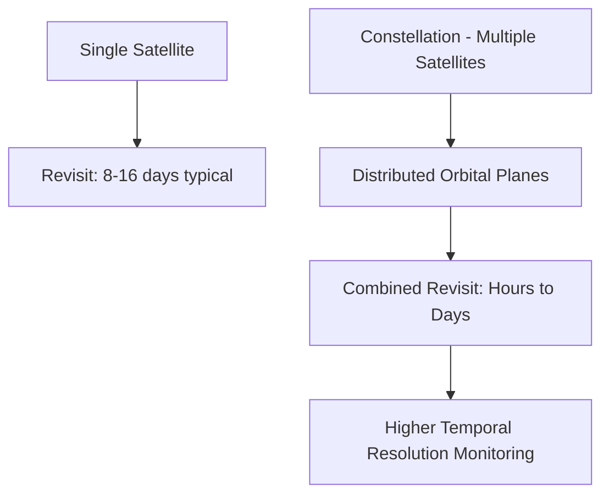
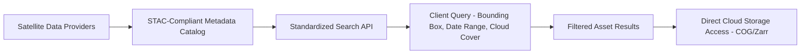

## Satellite Constellations and Open Data Archives


### Overview

Satellite constellations are coordinated groups of multiple satellites operating together to achieve revisit frequency, coverage, or capability that a single satellite cannot provide alone. Open data archives are public repositories that host, catalog, and distribute satellite-derived imagery and derived products, typically at no cost, under open licensing terms. Together, constellation architecture and open data policy have reshaped access to geospatial information, shifting the field from scarce, expensive imagery toward high-frequency, freely accessible global observation.

### Why Constellations

**Limitations of a Single Satellite**

A single sun-synchronous polar-orbiting satellite typically revisits a given point on Earth every 8–16 days, since its orbit and swath width constrain how frequently it passes over the same location. Many applications—crop monitoring, disaster response, change detection—require far more frequent observation. Constellations solve this by distributing multiple satellites across orbital planes so that combined revisit time drops substantially.

**Revisit Time Reduction**

For $n$ identically-spaced satellites in the same orbit, revisit time is approximately:

$$T_{revisit,constellation} \approx \frac{T_{revisit,single}}{n}$$

though actual combined revisit also depends on swath width, orbital plane spacing, and latitude (typically improving toward poles for polar orbits due to orbital track convergence).



### Constellation Architecture Types

- **Same-orbit, phased constellations**: multiple identical satellites in the same orbital plane, phased in time (e.g., Sentinel-2A/B/C in the same sun-synchronous orbit, offset to reduce revisit interval)
- **Multi-plane constellations**: satellites distributed across several orbital planes at different inclinations/altitudes to improve global coverage geometry (e.g., GPS/GNSS constellations, though those serve positioning rather than imaging)
- **Large smallsat/CubeSat swarms**: many small, often lower-cost satellites providing very high revisit at the expense of individual sensor capability (e.g., Planet Labs' Dove/PlanetScope constellation)
- **Heterogeneous constellations**: combinations of different satellite types/sensors operated jointly for complementary coverage (e.g., pairing optical and SAR assets)

| Constellation | Operator | Satellite Count (approx.) | Sensor Type | Notes |
| --- | --- | --- | --- | --- |
| PlanetScope (Dove) | Planet Labs | 130–200+ | Multispectral, 3 m | [Unverified] Active satellite count varies over time |
| Sentinel-2 | ESA Copernicus | 3 (2A/2B/2C) | Multispectral, 10-60 m | Free/open data |
| Sentinel-1 | ESA Copernicus | 2 operational (1A/1C, following 1B loss) | C-band SAR | [Unverified] Constellation composition has changed due to satellite anomalies; confirm current operational status |
| SkySat | Planet Labs | ~21 | VHR optical, sub-meter | Rapid tasking capability |
| ICEYE | ICEYE | 40+ | X-band SAR | [Unverified] Rapidly growing commercial constellation |
| Landsat | USGS/NASA | 2 operational (8, 9) | Multispectral + TIR | Long-term continuity record |

[Unverified] Exact operational satellite counts for actively growing commercial constellations change frequently; figures should be verified against current operator disclosures at time of use.

### Orbital Considerations Relevant to Constellations

- **Sun-synchronous orbit (SSO)**: near-polar orbit maintaining consistent local solar time at each pass, standard for most optical/multispectral Earth observation to ensure comparable illumination conditions across images
- **Walker constellation pattern**: a common mathematical framework for distributing satellites across multiple orbital planes for uniform global coverage, historically used for navigation constellations and adapted for some Earth observation designs
- **Orbital altitude trade-offs**: lower altitude (e.g., ~500–600 km smallsats) allows finer native resolution with smaller optics but shorter orbital lifetime and smaller instantaneous swath; higher altitude (e.g., ~700–800 km, typical Landsat/Sentinel-2) balances swath width and resolution

### Open Data Archives

**Major Public/Open Archives**

| Archive | Operator | Primary Content | Access Method |
| --- | --- | --- | --- |
| USGS EarthExplorer | USGS | Landsat archive (1972–present), some other datasets | Web portal, API |
| Copernicus Data Space Ecosystem | ESA/European Commission | Sentinel-1/2/3/5P and derived products | Web portal, API, openEO |
| NASA Earthdata | NASA | MODIS, VIIRS, ASTER, and many Earth science datasets | Web portal, API |
| Google Earth Engine | Google | Curated multi-petabyte catalog (Landsat, Sentinel, MODIS, and more) | Cloud-based JavaScript/Python API |
| Microsoft Planetary Computer | Microsoft | STAC-cataloged multi-source Earth observation archive | STAC API, Python |
| AWS Open Data Registry | Amazon Web Services | Various hosted datasets (Landsat, Sentinel-2 Cloud-Optimized GeoTIFFs, others) | Cloud object storage (S3) |

**Data Discovery Standard: SpatioTemporal Asset Catalog (STAC)**

STAC is a widely adopted open specification for structuring and cataloging geospatial asset metadata (spatial extent, temporal range, sensor properties) in a consistent, machine-readable JSON format, enabling standardized programmatic search across multiple archives regardless of the underlying provider. [Unverified] STAC adoption and specific implementation details continue to evolve as an actively maintained open community specification; current specification version and provider-specific catalog structures should be confirmed against the STAC specification repository and each archive's documentation.



**Example: Querying a STAC API with Python (pystac-client)**

```python
from pystac_client import Client

# Connect to a STAC-compliant catalog endpoint
catalog = Client.open("https://earth-search.aws.element84.com/v1")

search = catalog.search(
    collections=["sentinel-2-l2a"],
    bbox=[-122.5, 37.6, -122.3, 37.8],  # example bounding box
    datetime="2026-06-01/2026-06-30",
    query={"eo:cloud_cover": {"lt": 20}}
)

items = list(search.items())
print(f"Found {len(items)} matching scenes")

for item in items[:3]:
    print(item.id, item.datetime, item.properties.get("eo:cloud_cover"))
```

### Cloud-Native Geospatial Formats

Modern open archives increasingly favor cloud-optimized formats that allow partial, range-based reads without downloading entire files:

- **Cloud-Optimized GeoTIFF (COG)**: internally tiled and overview-pyramided GeoTIFF enabling efficient partial access over HTTP
- **Zarr**: chunked, compressed, N-dimensional array storage format well-suited to large multi-temporal/multi-band datacubes
- **SpatioTemporal Asset Catalog (STAC) + cloud object storage**: pairs standardized metadata discovery with direct, on-demand data access rather than bulk downloads

### Cloud-Based Analysis Platforms

**Google Earth Engine (GEE)**

A cloud computing platform providing planetary-scale analysis without local data download, combining a multi-petabyte public data catalog with server-side parallelized processing.

```python
import ee
ee.Initialize()

# Load a Sentinel-2 collection, filter by date and cloud cover
collection = (
    ee.ImageCollection("COPERNICUS/S2_SR_HARMONIZED")
    .filterDate("2026-06-01", "2026-06-30")
    .filterBounds(ee.Geometry.Point([-122.4, 37.7]))
    .filter(ee.Filter.lt("CLOUDY_PIXEL_PERCENTAGE", 20))
)

median_composite = collection.median()
ndvi = median_composite.normalizedDifference(["B8", "B4"]).rename("NDVI")
```

[Unverified] Specific Earth Engine collection identifiers (e.g., dataset naming conventions) and API parameters are periodically updated by the provider; current identifiers should be confirmed against the Earth Engine Data Catalog at time of use.

**Other Notable Platforms**

- **Microsoft Planetary Computer**: STAC-based catalog paired with a Python-centric analysis environment (Dask, Xarray) and hosted compute
- **openEO**: an open-standard API enabling portable analysis code across multiple backend cloud providers (interoperability layer rather than a single platform)

### Data Licensing Models

- **Full and open**: no cost, no restriction beyond attribution (e.g., Landsat, Sentinel data under Copernicus's open data policy)
- **Commercial/tasking-based**: pay-per-scene or subscription access to very high resolution or rapid-revisit commercial constellations (e.g., Maxar, Planet, ICEYE tiered offerings)
- **Research/government-restricted**: some datasets available only to qualifying research or government users under specific agreements

### Benefits of Constellations and Open Data Together

- **Democratized access**: researchers, NGOs, and developing-nation agencies gain access to Earth observation data historically available only to well-funded institutions
- **Time-series analysis at scale**: long, consistent, freely available archives (e.g., 50+ years of Landsat) enable robust long-term change detection and trend analysis
- **Rapid disaster response**: high-revisit constellations combined with open emergency mapping initiatives (e.g., Copernicus Emergency Management Service) accelerate humanitarian response
- **Reduced duplication of infrastructure**: cloud-native formats and standardized catalogs (STAC) reduce the need for every user to maintain local data infrastructure

### Limitations and Considerations

- **Data volume and bandwidth**: even with cloud-native access, large-scale time-series analysis can require substantial compute/storage resources
- **Cross-sensor harmonization**: combining data from different constellations/sensors (e.g., Landsat and Sentinel-2) for consistent time series requires radiometric and spectral band harmonization
- **Latency vs. archive depth trade-off**: newer commercial constellations offer high revisit but shorter historical archives; established missions (Landsat) offer long archives but coarser revisit
- **Metadata and licensing complexity**: navigating differing metadata schemas, licensing terms, and access mechanisms across multiple archives can be non-trivial despite standardization efforts like STAC
- [Inference] Commercial constellation business models and satellite counts change frequently as companies launch replacements, expand fleets, or experience satellite failures, so operational specifications should be treated as time-sensitive rather than fixed reference values

### Applications

- Global agricultural monitoring and food security assessment (e.g., GEOGLAM initiative)
- Near-real-time disaster response and damage assessment
- Deforestation and land cover change monitoring at national/global scale
- Climate change indicator tracking (glacier retreat, sea level proxies, vegetation trends)
- Urban growth monitoring across decades using consistent long-term archives
- Multi-sensor data fusion research combining optical, SAR, and thermal constellations

### Next Steps

- **Related Topics**:
  - SpatioTemporal Asset Catalog (STAC) Specification and Implementation
  - Google Earth Engine and Cloud-Based Geospatial Analysis Platforms
  - Cloud-Optimized GeoTIFF (COG) and Zarr Data Formats
  - Cross-Sensor Data Harmonization (Landsat-Sentinel-2 Time Series)
  - Optical and Multispectral Satellite Systems (foundational sensor detail)
  - Radar and Synthetic Aperture Radar (foundational sensor detail)
  - Small Satellite (CubeSat) Design and Constellation Economics
  - Copernicus Emergency Management Service and Disaster Response Mapping