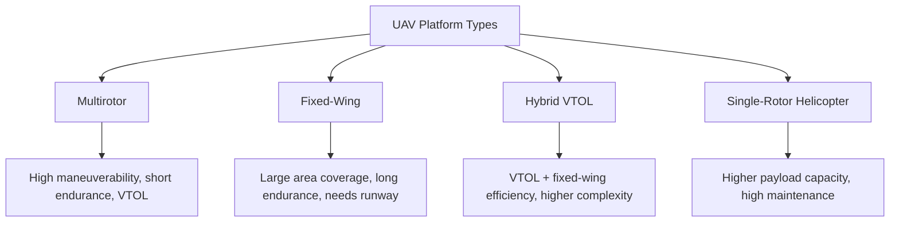
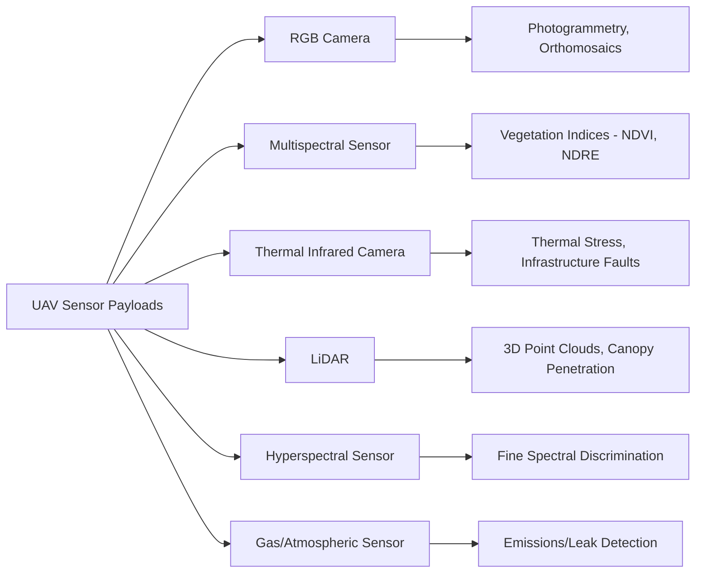

## UAV Platform Types and Sensor Payloads


### Overview

Unmanned Aerial Vehicles (UAVs), also called drones or Remotely Piloted Aircraft Systems (RPAS), provide a flexible, low-altitude remote sensing platform bridging the gap between ground-based survey and traditional aerial/satellite acquisition. UAV platforms are typically classified by their aerodynamic configuration, each offering distinct trade-offs in endurance, payload capacity, coverage rate, and operational flexibility, while carried sensor payloads determine the type of geospatial data that can be collected.

### UAV Platform Classifications

**Multirotor**

Multiple fixed-pitch rotors (commonly quadcopter, hexacopter, or octocopter configurations) provide lift and control through differential rotor speed.

- Capable of vertical takeoff and landing (VTOL) and precise hovering
- Typical flight endurance: 20–40 minutes per battery cycle
- Best suited for small-area, high-detail mapping and inspection requiring maneuverability
- Lower forward airspeed limits area coverage rate compared to fixed-wing platforms

**Fixed-Wing**

Rigid wing configuration generating lift through forward airspeed, similar in principle to conventional aircraft.

- Typical flight endurance: 45 minutes to several hours depending on platform size and propulsion
- Covers substantially larger areas per flight than multirotor platforms
- Requires runway, catapult launch, or hand launch, and belly-landing or net recovery (no hover/VTOL capability in pure fixed-wing designs)
- Preferred for large agricultural fields, corridor mapping, and extensive topographic surveys

**Hybrid VTOL Fixed-Wing**

Combines vertical takeoff/landing rotors with fixed-wing forward flight, transitioning between modes after takeoff.

- Eliminates runway requirement while retaining much of fixed-wing endurance and coverage efficiency
- Mechanically more complex, generally higher acquisition cost
- Increasingly adopted for large-area professional mapping where launch site space is constrained

**Single-Rotor Helicopter**

Traditional helicopter rotor configuration with a single main rotor and tail rotor for anti-torque control.

- Higher payload capacity relative to size compared to multirotor designs
- Greater mechanical complexity and maintenance requirements
- Less common in commercial mapping than multirotor/fixed-wing/hybrid designs but used for heavier specialized payloads (e.g., some LiDAR systems)



### Platform Comparison

| Platform Type | Typical Endurance | Typical Coverage Rate | VTOL | Payload Capacity | Typical Cost Tier |
| --- | --- | --- | --- | --- | --- |
| Multirotor | 20–40 min | Low (small sites) | Yes | Low–Moderate | Low–Moderate |
| Fixed-wing | 45 min–several hrs | High (large areas) | No | Low–Moderate | Moderate |
| Hybrid VTOL | 1–2+ hrs | Moderate–High | Yes | Moderate | High |
| Single-rotor helicopter | Varies widely | Moderate | Yes | High | High |

[Inference] Exact endurance and payload figures vary substantially by specific model, battery/fuel type, and payload weight, so these ranges represent general industry tendencies rather than fixed specifications for any particular platform.

### Regulatory Considerations

Most jurisdictions classify UAVs by weight and operating category (e.g., visual line-of-sight vs. beyond visual line-of-sight, altitude ceilings, and airspace restrictions near airports or populated areas), governed by national aviation authorities (e.g., FAA Part 107 in the United States, EASA regulations in the European Union). [Unverified] Specific regulatory thresholds, licensing requirements, and permitted operations change periodically and vary by country, so current rules should be verified against the relevant national aviation authority rather than assumed from general principles.

### Sensor Payload Categories

**RGB (Visible Spectrum) Cameras**

The most common UAV payload, capturing standard true-color imagery.

- Used for photogrammetric mapping, orthomosaic generation, and visual inspection
- Range from consumer-grade integrated cameras to interchangeable-lens systems with larger sensors for improved image quality and reduced distortion

**Multispectral Sensors**

Capture discrete spectral bands beyond visible light, typically including red edge and near-infrared bands in addition to RGB, often as separate synchronized single-band sensors or a single multi-band sensor array.

- Common band sets: Blue, Green, Red, Red Edge, NIR
- Enable vegetation index calculation (NDVI, NDRE, GNDVI) at very high spatial resolution
- Typically require radiometric calibration panels or downwelling light sensors to convert raw digital numbers to reflectance under varying illumination conditions during flight

**Thermal Infrared Cameras**

Uncooled microbolometer sensors are standard on UAV platforms due to size, weight, and cost constraints relative to cooled satellite/airborne sensors.

- Typical spectral range: 7.5–13.5 $\mu m$ (LWIR)
- Lower spatial resolution and radiometric precision than research-grade cooled sensors, but sufficient for many applications
- Used for crop water stress detection, building envelope/energy audits, powerline/solar panel fault detection, search and rescue

**LiDAR Sensors**

Miniaturized LiDAR units have become increasingly viable UAV payloads, providing direct 3D point cloud acquisition through active laser ranging rather than photogrammetric derivation.

- Capable of partial canopy penetration, returning multiple pulse returns per laser pulse for vegetation structure and ground detection beneath canopy
- Typically paired with an integrated GNSS/IMU system for direct georeferencing of point returns
- Higher cost and payload weight than camera-based systems, generally requiring larger multirotor or hybrid VTOL platforms

**Hyperspectral Sensors**

Compact pushbroom or snapshot hyperspectral imagers are increasingly available for UAV integration, though they remain a specialized, higher-cost payload category.

- Enable fine-grained spectral discrimination applications (precision agriculture biochemistry, mineral exploration) at UAV spatial scales
- Higher data volume and processing complexity than multispectral alternatives
- [Unverified] The compact UAV-hyperspectral sensor market is an actively evolving segment; specific model specifications and new market entrants should be verified against current manufacturer documentation

**Gas and Atmospheric Sensors**

Specialized payloads measuring gas concentrations (e.g., methane, $CO_2$) or particulate matter, used in environmental monitoring, emissions detection, and industrial leak surveys.



### Navigation and Positioning Systems

**GNSS Integration Tiers**

- **Standard GNSS**: consumer-grade positioning, typically meter-level accuracy, adequate for visual reference but insufficient for precise mapping without ground control
- **RTK (Real-Time Kinematic)**: real-time differential correction from a base station or network, achieving centimeter-level positioning during flight
- **PPK (Post-Processed Kinematic)**: raw GNSS observations logged onboard and corrected after flight using base station data, often achieving accuracy comparable to RTK without requiring a continuous real-time data link

**Inertial Measurement Units (IMUs)**

Provide orientation (pitch, roll, yaw) data essential for flight stabilization and, in direct georeferencing applications (particularly LiDAR), for accurately projecting sensor measurements into ground coordinates.

### Data Acquisition Considerations

- **Flight planning software**: defines flight lines, overlap percentages, altitude, and speed based on desired ground sample distance (GSD) and sensor field of view
- **Ground Sample Distance (GSD) control**: UAV low-altitude operation enables sub-centimeter GSD unattainable by satellite or most manned aircraft platforms
- **Battery/endurance management**: multirotor missions often require multiple battery swaps for larger sites, introducing potential registration/lighting inconsistencies between flight segments
- **Radiometric calibration**: multispectral/hyperspectral missions typically require pre/post-flight calibration panel imagery and/or an incident light sensor to normalize for changing solar illumination during the flight

### Example: Simple GSD-Based Flight Altitude Calculation (Python)

```python
def required_altitude_for_gsd(target_gsd_cm, sensor_pixel_size_um,
                                focal_length_mm, sensor_width_px):
    """
    Computes the flight altitude (meters) needed to achieve a target
    Ground Sample Distance (GSD) for a given UAV camera configuration.
    """
    pixel_size_mm = sensor_pixel_size_um / 1000.0
    target_gsd_m = target_gsd_cm / 100.0
    altitude_m = (target_gsd_m * focal_length_mm) / (pixel_size_mm / 1000.0)
    return altitude_m

altitude = required_altitude_for_gsd(
    target_gsd_cm=2.0,
    sensor_pixel_size_um=3.9,
    focal_length_mm=8.8,
    sensor_width_px=5472
)
print(f"Required flight altitude: {altitude:.1f} m")
```

### Advantages of UAV Platforms Over Satellite/Manned Aircraft

- **On-demand acquisition**: not constrained by satellite orbital revisit schedules
- **Very high spatial resolution**: sub-centimeter GSD achievable at low altitude
- **Cloud penetration through low-altitude operation**: UAVs typically fly beneath cloud layers that would obstruct satellite optical imaging
- **Lower cost per mission for small areas**: economical for site-scale monitoring compared to chartering manned aircraft
- **Rapid deployment**: useful for time-sensitive applications like disaster assessment or construction progress tracking

### Limitations

- **Limited coverage area per flight**: battery/fuel constraints restrict practical survey extent compared to satellite or manned aircraft, particularly for multirotor platforms
- **Regulatory airspace restrictions**: beyond-visual-line-of-sight operations, controlled airspace proximity, and altitude ceilings constrain some missions
- **Weather sensitivity**: wind, precipitation, and temperature extremes affect flight safety and data quality more acutely than larger manned/satellite platforms
- **Payload trade-offs**: heavier specialized sensors (LiDAR, hyperspectral) require larger, more expensive platforms with correspondingly reduced endurance
- **Data processing burden**: high-resolution, high-overlap imagery from large UAV surveys can generate substantial data volumes requiring significant processing time/compute

### Applications

- Precision agriculture (crop health monitoring, plant counting, yield estimation)
- Construction and mining site volumetric surveying and progress monitoring
- Infrastructure inspection (powerlines, pipelines, wind turbines, bridges, solar farms)
- Forestry inventory and canopy structure assessment
- Search and rescue operations using thermal payloads
- Environmental monitoring (wetland delineation, erosion tracking, emissions surveys)
- Real estate, construction, and topographic small-area mapping

### Next Steps

- **Related Topics**:
  - Aerial Photography and Photogrammetry (foundational SfM methodology)
  - UAV LiDAR Systems and Canopy Penetration Analysis
  - UAV Flight Planning and Mission Software
  - Radiometric Calibration of UAV Multispectral Sensors
  - RTK/PPK GNSS Integration for Direct Georeferencing
  - UAV Regulatory Frameworks (FAA Part 107, EASA)
  - Precision Agriculture Applications of UAV Remote Sensing
  - Thermal Infrared Remote Sensing (comparative sensor foundation)