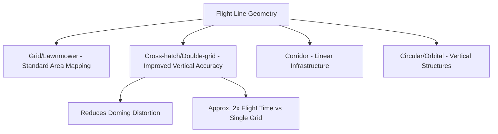
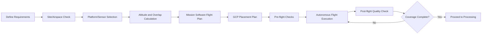

## Flight Planning and Mission Design


### Overview

Flight planning and mission design encompass the pre-flight decisions and software-driven configuration that determine how a UAV collects geospatial data: flight path geometry, altitude, speed, image overlap, and sensor triggering. Well-designed mission parameters directly govern data quality, processing feasibility, and whether the resulting products (orthomosaics, point clouds, elevation models) meet required accuracy specifications. Poor flight planning is one of the most common causes of failed or unusable photogrammetric/multispectral datasets.

### Core Mission Planning Parameters

**Flight Altitude (Above Ground Level, AGL)**

Altitude directly determines Ground Sample Distance (GSD) for a given sensor and focal length, following the relationship introduced in photogrammetric geometry:

$$GSD = \frac{H \cdot p}{f}$$

where $H$ is flight altitude AGL, $p$ is sensor pixel pitch, and $f$ is focal length. Lower altitude yields finer GSD but reduces per-flight coverage area and increases flight time/battery consumption for a given site.

**Image Overlap**

- **Forward overlap (endlap)**: overlap between consecutive images along a flight line; typically 75–85% for photogrammetric/SfM processing (higher than traditional stereo-pair mapping's 60–80% due to SfM's reliance on dense multi-image feature matching)
- **Side overlap (sidelap)**: overlap between adjacent parallel flight lines; typically 60–75% for SfM-based UAV mapping

[Inference] Recommended overlap percentages vary by processing software, terrain complexity, and vegetation density; software vendors often provide their own specific minimum recommendations, so project-specific settings should be validated against the intended processing pipeline's documentation, particularly for complex terrain or low-texture surfaces.

**Flight Speed**

Ground speed must be constrained relative to the camera's shutter speed and desired forward overlap to avoid motion blur and ensure sufficient image density along the flight line:

$$v_{max} = \frac{GSD}{t_{exposure}}$$

where $t_{exposure}$ is the camera's exposure/shutter time. Faster flight speeds risk motion blur at a given exposure time and reduce achievable forward overlap for a fixed image capture interval.

**Flight Line Geometry**

- **Grid/lawnmower pattern**: standard parallel flight lines with turns at each end, most common for area mapping (nadir photogrammetry, multispectral surveys)
- **Cross-hatch (double-grid) pattern**: two perpendicular grid passes, improving accuracy and reducing systematic error (particularly the "doming" or bowl-shaped distortion common in single-grid nadir-only SfM reconstructions), at the cost of roughly double flight time
- **Corridor mapping**: narrow, elongated flight paths following linear features (roads, pipelines, powerlines, rivers)
- **Circular/orbital patterns**: used for oblique/3D capture of discrete vertical structures (towers, buildings, bridges)



### Mission Planning Workflow

1. **Define project requirements**: required GSD, accuracy tolerance, deliverable type (orthomosaic, DSM/DTM, point cloud, vegetation index maps)
2. **Site reconnaissance and airspace check**: identify obstacles, terrain relief, no-fly zones, and regulatory airspace classification
3. **Select platform and sensor**: match endurance/coverage rate and sensor type to project scale and product requirements
4. **Calculate altitude and overlap parameters**: derive from target GSD and processing software recommendations
5. **Generate flight plan in mission planning software**: define boundary, altitude, overlap, flight pattern, and camera trigger interval
6. **Plan ground control point (GCP) placement**: distribute well-spaced, clearly identifiable targets across the site, including at the perimeter and any significant elevation changes
7. **Conduct pre-flight checks**: battery status, GNSS lock, calibration (compass, IMU), sensor calibration (radiometric panel imagery for multispectral missions)
8. **Execute flight(s)**: autonomous waypoint/grid execution is standard; manual piloting reserved for oblique/inspection-specific captures
9. **Post-flight quality check**: review image count, overlap consistency, and coverage gaps before leaving the site, to allow immediate re-flight of any gaps



### Terrain-Following Flight

For sites with significant elevation relief, maintaining constant altitude above a fixed reference datum causes GSD and image scale to vary across the survey area, and can risk collision on rising terrain. Terrain-following (also called "terrain-aware" or "AGL-following") flight modes use a pre-loaded Digital Elevation Model (DEM) to dynamically adjust UAV altitude, maintaining consistent height above ground and thus consistent GSD across variable topography.

$$H_{actual}(x,y) = H_{target} + Z_{terrain}(x,y) - Z_{home}$$

where $Z_{terrain}(x,y)$ is terrain elevation at a given position from the reference DEM and $Z_{home}$ is the elevation of the takeoff/reference point.

### Camera Trigger Modes

- **Distance-based triggering**: camera fires at fixed ground-distance intervals, ensuring consistent forward overlap regardless of minor speed variation—generally preferred for mapping missions
- **Time-based triggering**: camera fires at fixed time intervals; simpler but vulnerable to overlap inconsistency if ground speed varies (e.g., due to wind)
- **Manual/event-triggered**: pilot-initiated capture, typical for oblique inspection or targeted structural imaging rather than systematic area mapping

### Ground Control Point (GCP) Distribution Strategy

Effective GCP placement typically follows these principles:

- Distribute points across the full extent of the survey area, not clustered in one region
- Include points near the perimeter/corners of the site to constrain edge distortion
- Add points at significant elevation changes if terrain relief is substantial
- Ensure GCP targets are large enough and high-contrast enough to be clearly identifiable at the mission's planned GSD
- A commonly cited guideline suggests a minimum of 5 GCPs for small, simple sites, with additional points added as site size, complexity, or required accuracy increases

[Inference] Optimal GCP count and spacing depend on project accuracy requirements, site size, RTK/PPK availability, and processing software recommendations; the guideline above reflects general industry practice rather than a universal standard applicable to every project.

### Example: Basic Mission Parameter Calculator (Python)

```python
def calculate_mission_parameters(target_gsd_cm, sensor_pixel_size_um,
                                    focal_length_mm, sensor_width_px,
                                    sensor_height_px, forward_overlap_pct,
                                    side_overlap_pct):
    """
    Computes flight altitude and flight line spacing for a UAV
    mapping mission given target GSD and overlap requirements.
    """
    pixel_size_mm = sensor_pixel_size_um / 1000.0
    target_gsd_m = target_gsd_cm / 100.0

    # Required altitude for target GSD
    altitude_m = (target_gsd_m * focal_length_mm) / (pixel_size_mm / 1000.0)

    # Ground footprint per image
    footprint_width_m = target_gsd_m * sensor_width_px
    footprint_height_m = target_gsd_m * sensor_height_px

    # Flight line spacing based on side overlap
    line_spacing_m = footprint_width_m * (1 - side_overlap_pct / 100.0)

    # Distance between consecutive image captures based on forward overlap
    capture_interval_m = footprint_height_m * (1 - forward_overlap_pct / 100.0)

    return {
        "altitude_m": round(altitude_m, 1),
        "flight_line_spacing_m": round(line_spacing_m, 1),
        "capture_interval_m": round(capture_interval_m, 1)
    }

params = calculate_mission_parameters(
    target_gsd_cm=2.5,
    sensor_pixel_size_um=3.9,
    focal_length_mm=8.8,
    sensor_width_px=5472,
    sensor_height_px=3648,
    forward_overlap_pct=80,
    side_overlap_pct=65
)
print(params)
```

### Airspace and Regulatory Planning

- **No-fly zone/geofence checking**: verifying proximity to airports, controlled airspace, and temporary flight restrictions before mission execution
- **Visual line-of-sight (VLOS) vs. beyond visual line-of-sight (BVLOS)**: most standard regulatory frameworks require VLOS operation unless specific BVLOS waiver/certification is obtained
- **Altitude ceilings**: many jurisdictions impose a maximum AGL altitude (commonly cited around 120 m / 400 ft in several frameworks) for standard operations without additional authorization

[Unverified] Specific regulatory altitude limits, waiver processes, and BVLOS requirements vary by country and are subject to periodic revision; current rules should be verified against the relevant national aviation authority before mission execution.

### Common Mission Planning Software Categories

- **Manufacturer-native apps**: platform-specific planning software tied to a particular UAV manufacturer's autopilot ecosystem
- **Third-party cross-platform planners**: mission planning tools compatible with multiple UAV platforms and autopilot systems, often supporting advanced features like terrain-following and double-grid patterns
- **Open-source ground control station software**: community-maintained mission planning and telemetry tools built on open autopilot firmware ecosystems

[Unverified] Specific software product names, feature sets, and platform compatibility change frequently as the UAV software ecosystem evolves; current capabilities should be verified against each vendor's up-to-date documentation.

### Quality Control Considerations

- **Overlap validation**: confirming actual achieved overlap (which can vary from planned values due to wind drift or GNSS inaccuracy) before leaving the site
- **Lighting consistency**: minimizing missions that span rapidly changing light conditions (e.g., broken cloud cover), which can introduce radiometric inconsistency across the mosaic
- **Wind and vibration effects**: excessive wind can degrade image sharpness and positional accuracy even with successful flight completion
- **Battery/multi-flight consistency**: for large sites requiring multiple battery swaps or flights, ensuring consistent altitude, camera settings, and lighting across all sub-missions to avoid mosaic seams and radiometric discontinuities

### Limitations and Trade-offs

- **Coverage vs. resolution trade-off**: lower altitude for finer GSD directly reduces achievable area coverage per flight/battery cycle
- **Time vs. accuracy trade-off**: cross-hatch patterns and denser GCP networks improve accuracy but substantially increase flight and field time
- **Weather window constraints**: many missions are time-sensitive (crop growth stage, construction milestones) yet dependent on suitable wind/visibility conditions, creating scheduling pressure
- **Battery-driven flight fragmentation**: large-area multirotor missions requiring many battery swaps increase the risk of coverage gaps and inconsistent conditions between segments

### Applications

- Large-area agricultural field mapping with consistent multispectral acquisition parameters
- Corridor mapping for pipeline, road, and powerline infrastructure
- High-accuracy construction/earthworks surveys requiring dense GCP networks and cross-hatch flight patterns
- Repeat/change-detection missions requiring consistent flight parameters across multiple survey dates
- 3D structural capture using combined nadir and oblique/orbital flight patterns

### Next Steps

- **Related Topics**:
  - UAV Platform Types and Sensor Payloads (foundational platform/sensor context)
  - Structure from Motion (SfM) Photogrammetry Processing
  - Ground Control Point Survey Design and RTK/PPK GNSS Integration
  - UAV Regulatory Frameworks (VLOS/BVLOS, Airspace Authorization)
  - Radiometric Calibration of UAV Multispectral Sensors
  - Digital Elevation Model Integration for Terrain-Following Flight
  - Repeat-Pass UAV Missions for Change Detection