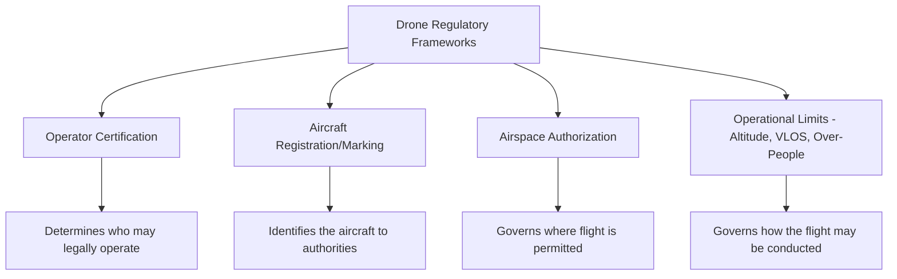
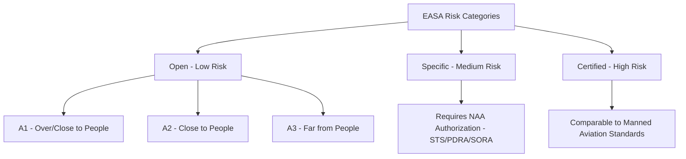

## Drone Regulations and Airspace Considerations

### Overview

Drone (UAV) operations for geospatial and environmental data collection are governed by aviation regulatory frameworks that classify flights by risk level, operator qualification, weight, and operational characteristics (visual line of sight, altitude, proximity to people/airports). Because these frameworks are actively evolving—particularly around beyond visual line of sight (BVLOS) operations—practitioners must treat specific thresholds and procedures as time-sensitive and verify them against the current issuing authority before mission execution.

### Why Regulation Matters for Geospatial Work

Unlike satellite or traditional manned aerial surveys, UAV operations place an aircraft in shared low-altitude airspace, often near populated areas, other aircraft, and critical infrastructure. Regulatory frameworks exist to manage collision risk, privacy, and third-party safety, and directly constrain what geospatial missions are legally permissible (e.g., corridor mapping over long distances often requires BVLOS authorization; urban infrastructure inspection may require over-people authorization).

### United States: FAA Part 107 Framework

**Core Structure**

14 CFR Part 107 is the primary rule governing most commercial and non-recreational small UAS operations (under 55 lbs) in the United States. Highlights of the rule include always avoiding manned aircraft, never operating in a careless or reckless manner, and keeping the drone within visual sight of the operator. [Federal Aviation Administration](https://www.faa.gov/newsroom/small-unmanned-aircraft-systems-uas-regulations-part-107)

**Standard Operational Limits**

Operational limits under Part 107 include a maximum altitude of 400 feet AGL, visual line of sight (VLOS) only operation (with BVLOS available only by waiver), and daylight or civil twilight operation with anti-collision lighting. Recurrent training is required online every 24 months to maintain certification. [FlyUSI](https://www.flyusi.org/guides/going-beyond-part-107)[FlyUSI](https://www.flyusi.org/guides/going-beyond-part-107)

**Night and Over-People Operations**

Drone pilots operating under Part 107 may fly at night, over people, and over moving vehicles without a waiver as long as they meet the requirements defined in the rule, though airspace authorizations are still required for night operations in controlled airspace under 400 feet. [Federal Aviation Administration](https://www.faa.gov/uas/commercial_operators)

**Waivers and Advanced Operations**

Several Part 107 rules can be waived if an operator demonstrates the operation can be flown safely, with waiver paths including beyond visual line of sight, multiple aircraft, altitude, weather minimums, moving-platform limits, and operations over people or moving vehicles that don't fit a standing category. Controlled-airspace access is handled through a separate LAANC (Low Altitude Authorization and Notification Capability) or direct FAA authorization process. [Drone Authority](https://droneauthority.org/laws/part-107)[Drone Authority](https://droneauthority.org/laws/part-107)

**Registration and Remote ID**

All drones weighing 250 grams (0.55 lbs) or more at takeoff must be registered with the FAA, and as of March 16, 2024, all registered drones must comply with Remote ID, a system that broadcasts the drone's identification, location, and control station location during flight. [UAVMODEL Insights](https://blog.uavmodel.com/faa-drone-regulations-2026-trust-remote-id-part-107-and-what-every-fpv-pilot-must-know/)

**Commercial vs. Recreational Determination**

Whether Part 107 applies depends on why the operator is flying, not what they are flying: flying for fun falls under the recreational exception, while flying for anything touching a business, a paycheck, or a deliverable falls under Part 107. This distinction is directly relevant to geospatial professionals, since nearly all commercial mapping, surveying, and inspection work falls under Part 107 regardless of payment structure. [DroneBundle](https://dronebundle.com/blog/faa-drone-rules)

**Emerging Framework: Part 108 and Part 146**

[Unverified] As of mid-2026, the FAA has proposed but not finalized new rules expanding BVLOS operations. The FAA's proposed Part 108 and Part 146 regulations are expected to be finalized in 2026, with Part 108 establishing operating rules for BVLOS operations of highly automated drone systems including aircraft over 55 pounds, and Part 146 creating a certification framework for organizations providing automated data services such as traffic management and deconfliction. Part 107 itself remains unchanged for standard VLOS operations under 400 feet, and the new regulations are intended to complement rather than replace Part 107. As of mid-2026, the FAA has published the proposed rule and worked through public comment, but no final rule has taken effect, meaning routine BVLOS operations still require a Part 107 waiver until Part 108 is finalized. [New FAA Rules Coming in 2026: What U.S. Drone Pilots Should Know – Drone Trust +2](https://dronetrust.com/blogs/articles/new-faa-drone-rules-2026)

**State and Local Layering**

FAA regulations and state drone laws apply simultaneously: the FAA controls airspace (altitude, registration, flight operations) while states control the ground (launch locations, what may be photographed, and which facilities are off-limits). Some states have preemption laws reserving drone regulation exclusively for the state and blocking local ordinances, while non-preemption states allow additional local rules to apply. [The Drone U](https://www.thedroneu.com/blog/usa-drone-laws-regulations-by-state/)[The Drone U](https://www.thedroneu.com/blog/usa-drone-laws-regulations-by-state/)

### European Union: EASA Framework

**Three-Category Risk Structure**

EASA sorts every drone operation into Open (low risk, no authorization needed), Specific (medium risk, requires operational authorization), or Certified (high risk) categories, applied uniformly across the EU rather than through a national patchwork. This single rulebook is applied directly by all 27 EU member states plus Iceland, Liechtenstein, and Norway, unlike the fragmented system that existed before 2021; the United Kingdom left this system after Brexit and runs its own CAA rules instead. [PickDrones](https://pickdrones.com/easa-drone-categories/)[PickDrones](https://pickdrones.com/easa-drone-categories/)

**Open Category Subcategories**

The Open Category covers low-risk operations requiring no prior authorization, where operations must stay within defined limits for height, distance from people, and drone weight—this is where most recreational and many commercial pilots operate. Within Open: [UAVMODEL Insights](https://blog.uavmodel.com/eu-easa-drone-regulations-2026-open-category-a1-a2-a3-c-class-labels-and-ce-marking-explained/)

- **A1 (fly over/close to people)**: lowest-risk subcategory for lighter, lower-class drones
- **A2 (fly close to people)**: for flights maintaining safe distance from uninvolved people; C2-class drones can fly as close as 30 meters horizontally from uninvolved people, or 5 meters in low-speed mode, requiring an additional A2 competency certificate [UAVMODEL Insights](https://blog.uavmodel.com/eu-easa-drone-regulations-2026-open-category-a1-a2-a3-c-class-labels-and-ce-marking-explained/)
- **A3 (fly far from people)**: for operations where no uninvolved people are present, requiring pilots to maintain at least 150 meters from residential, commercial, industrial, or recreational areas, applying to C2, C3, and C4 class drones [UAVMODEL Insights](https://blog.uavmodel.com/eu-easa-drone-regulations-2026-open-category-a1-a2-a3-c-class-labels-and-ce-marking-explained/)

**C-Class Marking System**

A drone's C-class, printed as a label on the aircraft under EU Regulation 2019/945, determines which Open subcategory it can legally fly in; the class reflects the manufacturer's safety certification rather than weight alone, so drones of similar weight can carry different class labels depending on their safety features. Drones without a class label, mostly models purchased before 2024, are considered "legacy" drones that can still fly but only under weight-based rules that grow more restrictive over time. [PickDrones](https://pickdrones.com/easa-drone-categories/)[PickDrones](https://pickdrones.com/easa-drone-categories/)

**Specific and Certified Categories**

The Specific category applies to operations exceeding Open category limits, requiring national aviation authority authorization based on a risk assessment, typically via a Standard Scenario (STS) or Pre-Defined Risk Assessment (PDRA). The Certified category, the highest-risk tier, is comparable to manned aviation and requires drone certification, licensed pilots, and approved operators. The specific category applies specifically to operations that do not fit the open category for risk reasons, such as BVLOS flights. [UAVMODEL Insights](https://blog.uavmodel.com/eu-easa-drone-regulations-2026-open-category-a1-a2-a3-c-class-labels-and-ce-marking-explained/)[Grupo One Air](https://www.grupooneair.com/new-easa-drone-regulations/)

**Registration and Competency Requirements**

All drone pilots in the Open category must register with their national aviation authority and complete the A1/A3 online competency test, covering basic aviation knowledge including airspace structure, weather, privacy regulations, and safety procedures. [UAVMODEL Insights](https://blog.uavmodel.com/easa-drone-regulations-2026-flying-fpv-in-the-open-and-specific-categories-across-europe/)

**Electronic ID and Geo-Awareness**

Electronic ID is mandatory in the Open category (for Class C1, C2, and C3 marked drones) and in the Specific category. [Unverified] Additional geo-awareness requirements for newly manufactured drones have reportedly been proposed for 2026 implementation, but specific effective dates and scope should be confirmed against current EASA publications, as this area has seen frequent updates. [Grupo One Air](https://www.grupooneair.com/new-easa-drone-regulations/)

### Comparative Structure: US vs. EU

| Aspect | United States (FAA) | European Union (EASA) |
| --- | --- | --- |
| Primary framework | Part 107 (VLOS commercial/non-recreational) | Open/Specific/Certified risk categories |
| Standard altitude ceiling | 400 ft AGL | Generally 120 m AGL (Open category) |
| BVLOS pathway | Waiver-based currently; Part 108 pending finalization | Specific category via SORA risk assessment |
| Registration threshold | 250 g takeoff weight, or any commercial operation | Applies broadly; class-marking system governs subcategory eligibility |
| Remote/Electronic ID | Mandatory since March 2024 | Mandatory for Open (C1-C3) and Specific categories |

[Unverified] Altitude ceiling and other numeric thresholds for the EASA Open category are commonly cited as 120 m AGL in industry sources, but should be verified against current EASA regulatory text (EU Regulation 2019/947) for authoritative confirmation.

### Airspace Classification and Authorization

**Controlled vs. Uncontrolled Airspace**

Airspace near airports and along major traffic corridors is typically classified into controlled categories requiring explicit authorization before UAV operation, while uncontrolled airspace generally permits operation under standard rule limits without additional clearance.

**Authorization Mechanisms**

- **US LAANC (Low Altitude Authorization and Notification Capability)**: a separate authorization process for controlled-airspace access, distinct from Part 107 operational waivers [Drone Authority](https://droneauthority.org/laws/part-107)
- **EU U-space and national NAA authorization**: risk-assessment-based authorization processes (SORA) for Specific category operations, including BVLOS

**No-Fly Zones and Temporary Flight Restrictions (TFRs)**

Permanent restricted zones (military installations, national security sites) and temporary restrictions (major public events, wildfire response, VIP movement) can override standard operational permissions and must be checked immediately prior to each mission, as they can be issued with little advance notice.

### Operator Responsibilities Beyond Aviation Authority Rules

Aviation authority rules govern airspace only; separate ground-level rules govern launch locations, what may be photographed, and which facilities are off-limits, meaning aviation compliance alone does not guarantee full legal compliance for a given site. Geospatial practitioners should additionally consider: [The Drone U](https://www.thedroneu.com/blog/usa-drone-laws-regulations-by-state/)

- **Privacy law**: applicable to imagery capturing identifiable individuals or private property
- **Landowner permission**: for takeoff/landing sites and overflight of private property, governed by property law rather than aviation regulation
- **Environmental/protected area restrictions**: national parks, wildlife refuges, and similar zones often impose independent UAV restrictions

### Enforcement and Penalties

Non-compliance penalties vary substantially by jurisdiction and violation type. In the United States, enforcement for Remote ID non-compliance has included fines starting at $1,100 per violation with potential civil penalties up to $27,500. In parts of Europe, cited enforcement examples include fines ranging from €500 to €5,000 for flying without a required visual observer, up to €25,000 with potential criminal charges for flying in restricted zones near airports or military installations, and €200 to €2,000 for operating without registration. [UAVMODEL Insights](https://blog.uavmodel.com/faa-drone-regulations-2026-trust-remote-id-part-107-and-what-every-fpv-pilot-must-know/)[UAVMODEL Insights](https://blog.uavmodel.com/easa-drone-regulations-2026-flying-fpv-in-europe-under-the-open-category/)

[Unverified] Specific penalty amounts vary by jurisdiction, are subject to periodic revision, and the figures above should be treated as illustrative examples from specific sources rather than universal or current values for any given location.

### Practical Pre-Mission Regulatory Checklist

1. Confirm operator certification status and currency (e.g., Part 107 recurrent training, EASA competency certificate validity)
2. Verify aircraft registration and Remote ID/Electronic ID compliance
3. Check airspace classification for the planned operating area (controlled vs. uncontrolled)
4. Confirm no active Temporary Flight Restrictions (TFRs) or NOTAMs affecting the site
5. Determine whether the planned operation (altitude, VLOS/BVLOS, proximity to people) fits standard rules or requires waiver/authorization
6. Verify state/national/local ground-level restrictions independent of aviation authority rules
7. Confirm landowner/site access permission
8. Document authorization/waiver approvals for the mission file, particularly for commercial/regulated-industry clients

### Limitations and Considerations for Practitioners

- **Rapid regulatory evolution**: BVLOS frameworks in multiple jurisdictions are actively transitioning (e.g., US Part 108/146, EASA Specific category refinements), so operational planning assumptions can become outdated within months
- **Jurisdictional fragmentation**: multinational or cross-border geospatial projects may require separately verifying and complying with distinct national frameworks, even within harmonized systems like the EU
- **Waiver/authorization lead time**: BVLOS and other advanced-operation approvals often require substantial lead time, which must be factored into project scheduling
- **Ground rules independent of airspace rules**: aviation authority compliance does not substitute for landowner permission, privacy compliance, or protected-area restrictions

### Applications and Relevance to Geospatial Practice

- Determining feasibility and lead time for corridor mapping (pipelines, transmission lines) that may exceed standard VLOS range
- Planning urban infrastructure inspection missions requiring over-people operational compliance
- Structuring multinational environmental monitoring programs across differing regulatory regimes
- Budgeting for waiver/authorization costs and timelines in commercial UAV mapping proposals
- Ensuring insurance and liability compliance tied to registration and certification status

### Next Steps

- **Related Topics**:
  - Flight Planning and Mission Design (foundational operational context)
  - UAV Platform Types and Sensor Payloads (foundational platform context)
  - Beyond Visual Line of Sight (BVLOS) Operations and Risk Assessment (SORA)
  - Remote ID and UAV Traffic Management (UTM) Systems
  - Privacy and Data Protection Considerations in Aerial Data Collection
  - Cross-Border UAV Operations for Multinational Environmental Monitoring
  - Emerging FAA Part 108/146 Framework (ongoing regulatory development)