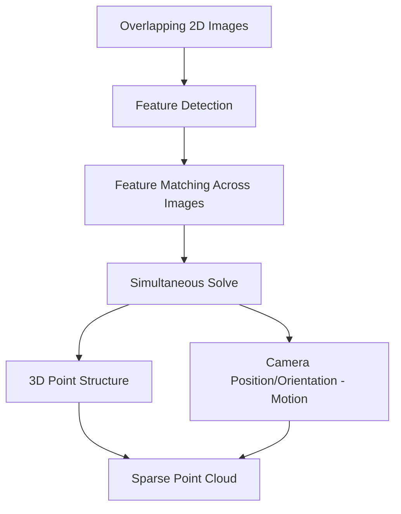
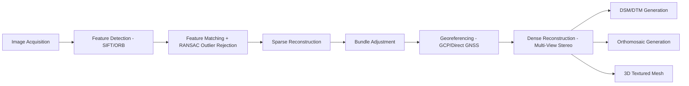

## Structure from Motion Photogrammetry


### Overview

Structure from Motion (SfM) is a computer vision-based photogrammetric technique that reconstructs three-dimensional scene geometry and camera positions simultaneously from a set of overlapping two-dimensional images, without requiring pre-known camera positions or orientations. SfM has become the dominant processing approach for UAV-based mapping, largely replacing traditional stereo-pair photogrammetry for most applications due to its ability to automatically handle large, irregularly overlapping image sets from consumer and survey-grade cameras alike.

### Core Concept

Unlike traditional photogrammetry, which typically relies on known camera geometry and controlled stereo pairs, SfM recovers both the 3D structure of the scene and the motion (position and orientation) of the camera through each exposure purely from correspondences between matched features across many images. The name reflects this dual, simultaneous solution: "structure" (3D geometry) emerges from "motion" (the camera's changing viewpoint).



### SfM Processing Pipeline

**1. Image Acquisition**

High forward and side overlap (commonly 75%+ forward, 60%+ side for UAV surveys) ensures sufficient redundant coverage of each ground feature across multiple images, which is essential for robust feature matching and triangulation.

**2. Feature Detection**

Distinctive, repeatable image features (corners, textured points, high-contrast patterns) are identified in each image. Common algorithms include:

- **SIFT (Scale-Invariant Feature Transform)**: detects features robust to scale, rotation, and moderate illumination changes
- **SURF (Speeded-Up Robust Features)**: a faster approximation of SIFT-like feature detection
- **ORB (Oriented FAST and Rotated BRIEF)**: computationally efficient, often used in real-time or resource-constrained applications

**3. Feature Matching**

Detected features are compared across image pairs to identify correspondences—the same physical point appearing in multiple images. Matching typically uses descriptor distance metrics (e.g., Euclidean distance between SIFT descriptors) combined with geometric consistency checks (e.g., RANSAC, Random Sample Consensus) to reject false matches (outliers) that don't fit a consistent geometric relationship.

**4. Sparse Reconstruction and Bundle Adjustment**

Using matched features across many images, the software incrementally or globally estimates:

- Initial camera positions and orientations for each image
- 3D coordinates of matched feature points (the sparse point cloud)

This initial estimate is then refined through bundle adjustment, a nonlinear least-squares optimization that simultaneously refines all camera parameters and 3D point positions by minimizing total reprojection error:

$$\min \sum_{i} \sum_{j} \left\| \mathbf{x}_{ij} - \pi(\mathbf{P}_i, \mathbf{X}_j) \right\|^2$$

where $\mathbf{x}_{ij}$ is the observed image coordinate of point $j$ in image $i$, $\pi(\cdot)$ is the camera projection function, $\mathbf{P}_i$ represents camera $i$'s parameters (interior and exterior orientation), and $\mathbf{X}_j$ is the 3D coordinate of point $j$. This optimization is typically solved iteratively using algorithms such as Levenberg-Marquardt.

**5. Georeferencing**

The sparse model, initially in an arbitrary relative coordinate system, is transformed into real-world coordinates using either:

- **Direct georeferencing**: onboard GNSS/IMU-recorded camera positions (particularly effective with RTK/PPK-corrected systems)
- **Indirect georeferencing**: Ground Control Points (GCPs) with known surveyed coordinates, identified manually or semi-automatically in the imagery

**6. Dense Reconstruction (Multi-View Stereo)**

Once camera positions are solved, Multi-View Stereo (MVS) algorithms densify the sparse point cloud by matching pixel-level correspondences across multiple overlapping images for every point in the scene (not just distinctive features), producing a dense point cloud approximating the full visible surface.

**7. Surface and Product Generation**

- **Digital Surface Model (DSM)**: a gridded elevation raster representing the top of all surface features (vegetation, buildings, ground)
- **Digital Terrain Model (DTM)**: bare-earth elevation derived by filtering non-ground points from the dense cloud/DSM
- **Orthomosaic**: individual images orthorectified using the DSM (removing relief displacement) and blended into a seamless, uniform-scale image mosaic
- **3D textured mesh**: a triangulated surface mesh with photographic texture draped over it, used for visualization and volumetric analysis



### Mathematical Foundations

**Epipolar Geometry**

For any two overlapping images of the same scene, corresponding points are constrained by epipolar geometry, formalized through the fundamental matrix $F$ (uncalibrated cameras) or essential matrix $E$ (calibrated cameras):

$$\mathbf{x}_2^T F \mathbf{x}_1 = 0$$

where $\mathbf{x}_1$ and $\mathbf{x}_2$ are corresponding homogeneous image coordinates in two images. This relationship constrains the search space for correct feature matches and underpins outlier rejection.

**Triangulation**

Once camera poses are known, a 3D point's position is estimated by finding the point that minimizes reprojection error across all images in which it appears—effectively finding the best-fit intersection of the back-projected rays from each camera through the matched image points (which rarely intersect exactly due to measurement noise).

**Collinearity Relationship**

The same collinearity equations underlying traditional photogrammetry also govern SfM's underlying projection model:

$$x = -f \cdot \frac{m_{11}(X-X_0) + m_{12}(Y-Y_0) + m_{13}(Z-Z_0)}{m_{31}(X-X_0) + m_{32}(Y-Y_0) + m_{33}(Z-Z_0)}$$

SfM's distinction from traditional photogrammetry lies not in the projection model itself, but in solving simultaneously for unknown camera parameters and scene structure through automated feature correspondence rather than requiring known control geometry in advance.

### Example: Conceptual SfM Feature Matching Workflow (Python, using OpenCV)

```python
import cv2
import numpy as np

def match_features_sift(image1_path, image2_path):
    """
    Demonstrates the feature detection and matching stage of an
    SfM pipeline using SIFT features and a ratio test for
    robust match filtering (a simplified illustration of one
    pipeline stage, not a complete SfM implementation).
    """
    img1 = cv2.imread(image1_path, cv2.IMREAD_GRAYSCALE)
    img2 = cv2.imread(image2_path, cv2.IMREAD_GRAYSCALE)

    sift = cv2.SIFT_create()
    keypoints1, descriptors1 = sift.detectAndCompute(img1, None)
    keypoints2, descriptors2 = sift.detectAndCompute(img2, None)

    bf = cv2.BFMatcher()
    raw_matches = bf.knnMatch(descriptors1, descriptors2, k=2)

    # Lowe's ratio test to filter ambiguous matches
    good_matches = []
    for m, n in raw_matches:
        if m.distance < 0.75 * n.distance:
            good_matches.append(m)

    print(f"Keypoints: {len(keypoints1)}, {len(keypoints2)}")
    print(f"Good matches after ratio test: {len(good_matches)}")

    return keypoints1, keypoints2, good_matches

# Note: full SfM requires RANSAC-based geometric verification,
# incremental/global bundle adjustment across the entire image set,
# and dense reconstruction—typically handled by dedicated software
# (e.g., Agisoft Metashape, Pix4D, COLMAP, OpenDroneMap) rather than
# a custom implementation for production mapping work.
```

### Common SfM Software Categories

- **Commercial desktop/cloud platforms**: full-pipeline software handling feature matching through orthomosaic/DSM export with graphical workflows (e.g., Agisoft Metashape, Pix4Dmapper)
- **Open-source pipelines**: community-maintained SfM/MVS software (e.g., COLMAP for research-grade reconstruction, OpenDroneMap for end-to-end UAV mapping workflows)
- **Cloud-based processing services**: upload-and-process platforms that handle computation remotely, reducing local hardware requirements for large datasets

[Unverified] Specific software feature sets, supported sensor types, and version capabilities change frequently as this software ecosystem evolves rapidly; current capabilities should be verified against each vendor/project's up-to-date documentation.

### Doming and Systematic Distortion

A well-documented systematic error in single-grid, nadir-only SfM reconstructions is "doming" or "bowl-shaped" distortion, where the reconstructed surface exhibits a subtle systematic curvature relative to true topography. This arises primarily from unresolved correlation between certain camera lens distortion parameters and the flight's imaging geometry when all images are captured from a single, consistent viewing angle and altitude. Common mitigation strategies include:

- **Cross-hatch (double-grid) flight patterns**: capturing a second set of parallel lines perpendicular to the first, breaking the correlated geometry
- **Oblique image inclusion**: adding a subset of tilted-camera images to the mission
- **Pre-calibrated camera models**: using a camera with known, stable lens calibration parameters (self-calibration during bundle adjustment is less prone to this issue when strong prior calibration constraints are available)
- **Well-distributed GCPs**: including elevation-varying control points helps constrain vertical distortion

### Accuracy Considerations

**Sources of Error**

- Camera calibration quality (self-calibrated vs. pre-calibrated interior orientation)
- GCP quantity, distribution, and survey accuracy
- Image overlap and flight pattern geometry (see doming discussion above)
- Ground surface texture (feature-poor surfaces like water, sand, or snow degrade matching quality)
- GNSS/IMU accuracy for direct georeferencing workflows

**Typical Accuracy Ranges**

[Inference] Horizontal accuracy for well-executed UAV SfM surveys with adequate GCPs commonly falls in the range of 1–3 times the GSD, while vertical accuracy is typically somewhat coarser than horizontal accuracy due to the inherently weaker geometric constraint on elevation in nadir-dominant photogrammetric networks; these figures represent general practitioner experience rather than a fixed guarantee, since actual accuracy depends heavily on the specific factors listed above and should be validated with independent check points for any project with defined accuracy requirements.

### Advantages Over Traditional Stereo Photogrammetry

- **Automated processing**: minimal manual operator intervention compared to traditional stereo-plotting workflows
- **Flexible image acquisition geometry**: does not require strictly parallel, regularly spaced stereo pairs; can incorporate irregular, oblique, and multi-angle imagery within a single reconstruction
- **Consumer camera compatibility**: effective with standard consumer-grade digital cameras rather than requiring metric survey cameras with pre-established calibration
- **Dense, textured 3D output**: naturally produces dense point clouds and photorealistic 3D meshes as a byproduct of the reconstruction process

### Limitations

- **Feature-dependent matching**: fails or performs poorly over homogeneous, low-texture surfaces (calm water, uniform snow, fresh asphalt) lacking distinctive features to match
- **Vegetation penetration**: like all passive photogrammetric methods, SfM derives elevation from the visible canopy/surface rather than penetrating to bare earth, limiting DTM accuracy under dense vegetation compared to LiDAR
- **Computational intensity**: dense reconstruction and bundle adjustment for large image sets can require substantial processing time and memory, particularly for high-resolution, large-area surveys
- **Scale ambiguity without control**: without GCPs or georeferenced camera positions, SfM reconstructs geometry only up to an arbitrary scale and coordinate system, requiring external reference for absolute measurement
- **Sensitivity to systematic geometric distortion**: as discussed, single-pattern nadir flights are prone to doming-type errors without appropriate mitigation

### Applications

- UAV-based topographic mapping and orthomosaic generation
- Construction and mining volumetric surveys
- Archaeological site documentation and 3D artifact/site reconstruction
- Cultural heritage digitization
- Forensic scene documentation and 3D reconstruction
- Infrastructure inspection (bridges, building facades) using oblique/close-range SfM
- Coastal and riverbank erosion monitoring through repeat SfM surveys
- Precision agriculture canopy height and structure modeling

### Next Steps

- **Related Topics**:
  - Aerial Photography and Photogrammetry (foundational geometric principles)
  - UAV Platform Types and Sensor Payloads
  - Flight Planning and Mission Design (overlap, doming mitigation via cross-hatch patterns)
  - Ground Control Point Survey Design and RTK/PPK GNSS Integration
  - Multi-View Stereo (MVS) Dense Reconstruction Algorithms
  - Digital Surface Model vs. Digital Terrain Model Derivation
  - LiDAR Remote Sensing (comparative point cloud generation method)
  - Camera Calibration and Lens Distortion Modeling