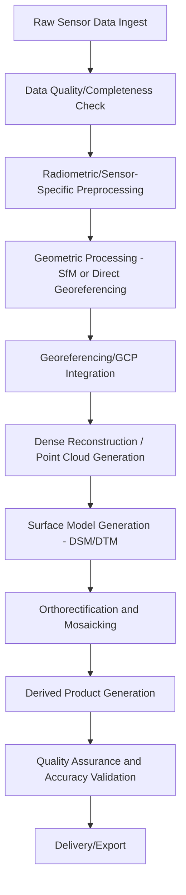
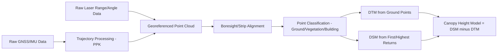

## UAV Data Processing Workflows


### Overview

UAV data processing workflows encompass the sequence of steps transforming raw sensor captures (imagery, LiDAR returns, thermal frames) collected during a drone mission into finished, analysis-ready geospatial products such as orthomosaics, elevation models, point clouds, and vegetation index maps. While the underlying photogrammetric and radiometric principles are consistent across sensor types, the specific workflow, calibration steps, and output products differ substantially between RGB, multispectral, thermal, and LiDAR data streams.

### General Processing Workflow Structure



### Stage 1: Data Ingest and Quality Control

Before processing begins, raw data should be reviewed for completeness and quality:

- **Image count verification**: confirming the number of captured images matches expected mission coverage
- **Overlap verification**: checking that achieved image overlap meets the planned forward/side overlap thresholds, since wind drift or GNSS inconsistency can reduce actual overlap below planned values
- **Metadata/EXIF integrity**: confirming GPS tags, timestamps, and camera settings are present and consistent across the dataset
- **Blur and exposure screening**: identifying and potentially excluding motion-blurred or improperly exposed frames that could degrade feature matching or radiometric consistency

### RGB/Photogrammetric Processing Workflow

**Sequence**

1. Import images and associated position data (onboard GNSS, RTK/PPK logs if available)
2. Feature detection and matching (SIFT or comparable algorithms)
3. Sparse point cloud generation and bundle adjustment
4. GCP identification and georeferencing (marking control points in the imagery and assigning known coordinates)
5. Dense point cloud generation via Multi-View Stereo
6. DSM generation from the dense cloud
7. Ground point classification/filtering to derive DTM
8. Orthorectification of individual images using the DSM
9. Mosaic blending into a seamless orthomosaic
10. Export to standard GIS formats (GeoTIFF, LAS/LAZ point clouds)

This sequence follows the Structure from Motion pipeline described in detail under SfM Photogrammetry, applied here specifically within the context of an operational UAV data delivery workflow.

### Multispectral Processing Workflow

Multispectral processing shares the core geometric SfM pipeline above but requires additional radiometric calibration steps specific to reflectance-based analysis:

1. **Band alignment/co-registration**: since many multispectral sensors capture separate bands through physically offset lenses or a filter array, individual band images must be precisely co-registered before or during mosaicking
2. **Radiometric calibration**: raw digital numbers are converted to reflectance using:
   - **Calibration panel imagery**: photographs of a known-reflectance reference panel captured immediately before/after flight, used to derive a conversion factor
   - **Incident light sensor (downwelling irradiance sensor)**: an onboard sensor recording ambient illumination during flight, correcting for changing light conditions across the mission
3. **Vignetting and lens distortion correction**: sensor-specific corrections for radial light falloff and geometric lens distortion
4. **Geometric processing**: standard SfM sparse/dense reconstruction, typically performed using one band (often the band with highest contrast/feature density) with resulting camera geometry applied across all bands
5. **Reflectance mosaic generation**: per-band orthomosaics in calibrated reflectance units
6. **Index calculation**: derived vegetation/environmental indices computed from the calibrated reflectance mosaics

**Example: NDVI Calculation from Calibrated UAV Multispectral Bands**

```python
import rasterio
import numpy as np

with rasterio.open("red_reflectance.tif") as red_src:
    red = red_src.read(1).astype(np.float32)
    profile = red_src.profile

with rasterio.open("nir_reflectance.tif") as nir_src:
    nir = nir_src.read(1).astype(np.float32)

denominator = nir + red
denominator[denominator == 0] = np.nan

ndvi = (nir - red) / denominator

profile.update(dtype=rasterio.float32, count=1)
with rasterio.open("ndvi_uav_output.tif", "w", **profile) as dst:
    dst.write(ndvi, 1)
```

$$NDVI = \frac{\rho_{NIR} - \rho_{Red}}{\rho_{NIR} + \rho_{Red}}$$

Because UAV multispectral data is captured at very fine spatial resolution (often centimeter-scale), resulting index maps can resolve within-field or within-canopy variability unattainable from satellite platforms, at the cost of covering far smaller areas per flight.

### Thermal Processing Workflow

1. **Radiometric vs. non-radiometric data check**: confirming whether the sensor recorded calibrated radiometric temperature data per pixel or only a visualized/normalized thermal image (only radiometric data supports quantitative temperature analysis)
2. **Environmental parameter correction**: applying emissivity, reflected apparent temperature, atmospheric temperature/humidity, and object distance parameters to convert raw sensor output to accurate surface temperature
3. **Geometric processing**: SfM-based mosaicking, often complicated by thermal imagery's typically lower spatial resolution and reduced feature contrast compared to RGB imagery
4. **Temperature mosaic generation**: seamless thermal orthomosaic in calibrated temperature units (°C or K)
5. **Analysis**: thermal anomaly detection, temperature differential mapping, or integration with RGB/multispectral data for combined analysis

[Inference] Thermal imagery's comparatively low contrast and resolution relative to RGB sensors can make pure-thermal SfM reconstruction less reliable; combining thermal capture with a simultaneous RGB payload for geometric reference, when the platform supports it, is a common practitioner approach to improve reconstruction robustness, though the necessity depends on the specific sensor, scene texture, and required accuracy.

### LiDAR Processing Workflow

UAV LiDAR processing differs fundamentally from photogrammetric SfM, since point cloud generation comes from direct laser ranging rather than image-based triangulation:

1. **Trajectory processing**: combining raw GNSS and IMU data (often via PPK post-processing) to reconstruct a precise time-tagged flight trajectory
2. **Point cloud generation**: combining the trajectory with raw laser range/angle measurements to compute georeferenced 3D point coordinates for every laser return
3. **Strip/flight-line alignment**: adjusting for small discrepancies between overlapping flight lines (boresight calibration correction)
4. **Point classification**: automated or semi-automated classification of points into categories such as ground, vegetation, and buildings, commonly using algorithms based on progressive morphological filtering or cloth simulation filtering
5. **DTM generation**: interpolating a bare-earth surface from classified ground points, exploiting LiDAR's ability to record multiple returns per pulse and thus partially penetrate vegetation canopy gaps
6. **DSM/canopy height model generation**: DSM from first/highest returns, with a Canopy Height Model (CHM) computed as:

$$CHM = DSM - DTM$$

7. **Export**: standard point cloud formats (LAS/LAZ) and derived raster products (DTM, DSM, CHM as GeoTIFF)



### Cross-Sensor Data Fusion Considerations

Many UAV projects combine multiple sensor outputs (e.g., RGB orthomosaic draped over a LiDAR-derived DTM, or thermal data overlaid on an RGB reference mosaic) requiring careful spatial and, where relevant, temporal alignment:

- **Coordinate reference system consistency**: ensuring all datasets share a common horizontal and vertical datum before overlay/analysis
- **Resolution reconciliation**: resampling or aggregating datasets of differing native resolution to a common analysis grid
- **Temporal alignment**: for multi-sensor missions flown as separate passes, accounting for potential lighting or environmental condition changes between passes

### Quality Assurance and Accuracy Validation

- **Check point comparison**: comparing final product coordinates at independent, surveyed check points (not used in the georeferencing solution) against known values to quantify horizontal and vertical accuracy
- **Root Mean Square Error (RMSE) reporting**: a standard metric for summarizing positional accuracy:

$$RMSE = \sqrt{\frac{1}{n}\sum_{i=1}^{n}(z_{observed,i} - z_{reference,i})^2}$$

- **Visual mosaic inspection**: checking for blending artifacts, ghosting (from moving objects like vehicles or people across overlapping frames), or radiometric seams
- **Point cloud density/completeness check**: confirming adequate point density and absence of significant data gaps, particularly relevant for LiDAR and dense photogrammetric clouds

### Common Processing Software Environments

- **Integrated desktop/cloud SfM platforms**: handle photogrammetric geometric processing, multispectral calibration, and product export within a unified interface
- **LiDAR-specific processing software**: handles trajectory processing, point classification, and LAS/LAZ product generation, often paired with the specific LiDAR sensor manufacturer's toolchain
- **GIS software**: used downstream for analysis, symbolization, and integration of processed UAV products with other geospatial datasets
- **Open-source and scripting-based pipelines**: Python/R-based custom workflows (using libraries such as rasterio, GDAL, PDAL for point clouds) for specialized index calculation, batch processing, or integration into larger automated pipelines

[Unverified] Specific software product capabilities, supported sensor integrations, and processing algorithms are updated frequently across this ecosystem; current capabilities should be verified against vendor documentation for any specific tool under consideration.

### Data Management Considerations

- **Raw data archiving**: retaining original raw imagery/LiDAR data (not just final products) to allow reprocessing if calibration parameters or algorithms improve, or if errors are discovered in the initial processing
- **Processing parameter documentation**: recording software version, calibration parameters, and processing settings used, supporting reproducibility and troubleshooting
- **File format standardization**: adopting consistent, interoperable formats (GeoTIFF for rasters, LAS/LAZ for point clouds) to support integration with downstream GIS and analysis tools
- **Storage volume planning**: high-resolution multispectral and LiDAR datasets, particularly dense point clouds, can require substantial storage; establishing retention/archival policies is a practical necessity for ongoing UAV programs

### Limitations and Practical Challenges

- **Processing time vs. dataset size**: dense reconstruction and large point cloud classification can require substantial computation time, particularly for large-area or high-resolution surveys, sometimes necessitating cloud-based or high-performance local computing resources
- **Sensor-specific calibration expertise**: multispectral and thermal workflows require correct application of calibration procedures; errors here (e.g., missing calibration panel imagery) can compromise the quantitative validity of derived products even when geometric processing succeeds
- **Vegetation-dependent DTM reliability**: photogrammetric DTMs remain limited under dense canopy regardless of processing sophistication, since the underlying data source (visible surface imagery) cannot see through continuous canopy the way LiDAR can
- **Workflow standardization across projects**: maintaining consistent processing parameters across repeat surveys (e.g., for change detection) requires deliberate procedural discipline, since default software settings may vary between processing sessions or software versions

### Applications

- Delivering orthomosaics and DSM/DTM products for construction and mining volumetric analysis
- Producing calibrated vegetation index maps for precision agriculture decision support
- Generating thermal temperature maps for infrastructure and building envelope assessment
- Creating high-density LiDAR point clouds and canopy height models for forestry inventory
- Supporting repeat-survey change detection through consistent, documented processing workflows
- Integrating multi-sensor UAV outputs into broader GIS-based environmental monitoring systems

### Next Steps

- **Related Topics**:
  - Structure from Motion Photogrammetry (core geometric processing method)
  - UAV Platform Types and Sensor Payloads (sensor-specific data characteristics)
  - Flight Planning and Mission Design (data quality preconditions)
  - LiDAR Point Cloud Classification and Filtering Algorithms
  - Radiometric Calibration of UAV Multispectral Sensors
  - Digital Surface Model vs. Digital Terrain Model Derivation
  - GIS Data Formats and Interoperability (GeoTIFF, LAS/LAZ)
  - Accuracy Assessment and RMSE Validation Methods