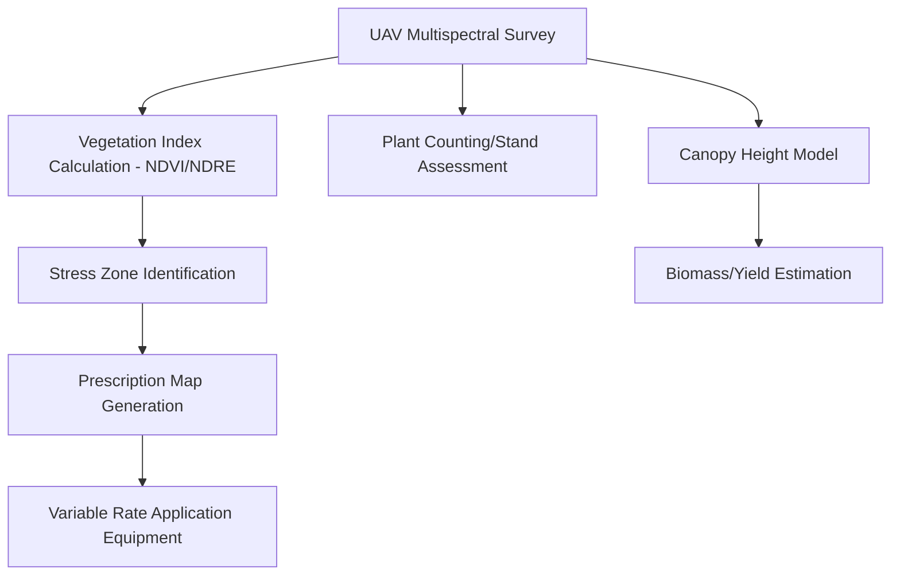
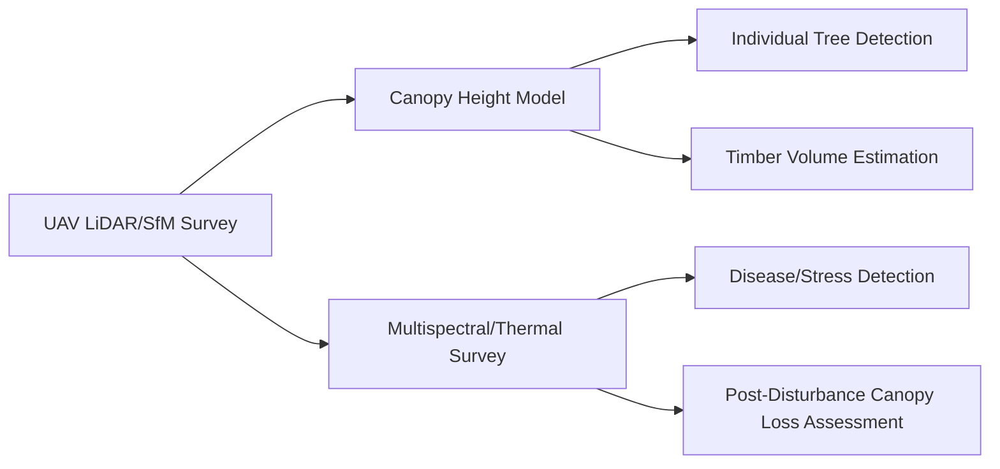

## Applications of Drone-Based Mapping

### Overview

Drone-based mapping applies UAV-acquired imagery, point clouds, and derived geospatial products to solve practical problems across agriculture, construction, environmental management, infrastructure, and emergency response. The distinguishing advantage across these domains is the ability to acquire very high spatial resolution, on-demand data at a site scale that satellite and manned aerial platforms cannot economically match, enabling decision-making at a level of spatial and temporal detail previously unavailable to most practitioners.

### Precision Agriculture

**Crop Health and Vigor Monitoring**

Multispectral UAV surveys generate high-resolution vegetation index maps (NDVI, NDRE, GNDVI) capable of resolving within-field variability at the individual plant or small-cluster scale, enabling early identification of stress zones related to nutrient deficiency, disease, pest pressure, or irrigation problems before symptoms are visible to the naked eye or detectable at coarser satellite resolution.

**Plant Counting and Stand Establishment**

High-resolution RGB or multispectral imagery combined with object detection algorithms can identify and count individual plants, supporting stand establishment assessment, replanting decisions, and yield forecasting models.

**Crop Height and Biomass Estimation**

SfM-derived or LiDAR-derived canopy height models, computed as the difference between a Digital Surface Model and a bare-earth Digital Terrain Model, provide biomass proxy measurements useful for growth stage tracking and yield estimation.

$$CHM = DSM - DTM$$

**Variable Rate Application Planning**

Prescription maps derived from UAV vegetation index data can guide variable-rate fertilizer, pesticide, or irrigation application equipment, targeting inputs to zones of demonstrated need rather than uniform field-wide application.

### Construction and Mining

**Volumetric Surveying**

Repeat SfM-derived surface models allow calculation of cut/fill volumes for earthworks, stockpile inventory, and excavation progress by comparing surface elevation between survey dates or against a design surface:

$$V = \iint (Z_{surface1}(x,y) - Z_{surface2}(x,y))\, dx\, dy$$

approximated in practice through grid-cell summation over the DSM/DTM raster.

**Progress Monitoring**

Regular UAV flights over construction sites produce time-series orthomosaics and 3D models documenting construction progress against schedule, supporting stakeholder communication and dispute resolution documentation.

**Site Planning and Design Validation**

High-resolution topographic surfaces support cut/fill design optimization, drainage planning, and as-built verification against engineering design surfaces.

### Infrastructure Inspection

**Powerline and Transmission Corridor Inspection**

UAV platforms equipped with high-resolution RGB and thermal payloads inspect transmission infrastructure for physical damage, vegetation encroachment, and thermal anomalies indicating electrical faults, often via corridor-mapping flight patterns.

**Wind Turbine and Solar Farm Inspection**

Close-range oblique and orbital flight patterns capture detailed imagery of turbine blades and solar panel arrays; thermal imagery is particularly effective for identifying underperforming solar cells (hot spots) or electrical connection faults.

**Bridge and Structural Inspection**

UAV imagery enables inspection of difficult-to-access structural elements (undersides of bridges, tall building facades) without scaffolding or rope access, reducing inspection cost and worker safety risk.

**Pipeline Monitoring**

Corridor-pattern UAV surveys detect right-of-way encroachment, erosion, vegetation, and, with appropriate sensors, potential leak indicators along pipeline routes.

### Forestry and Vegetation Management

**Canopy Structure and Height Modeling**

UAV LiDAR or SfM-derived canopy height models support timber volume estimation, forest inventory, and stand structure characterization at finer spatial detail than satellite-based approaches, though with more limited area coverage per survey.

**Individual Tree Detection**

High-resolution imagery combined with local maxima detection or object-based algorithms on canopy height models can identify and characterize individual tree crowns for density and health assessment.

**Forest Health and Disease Detection**

Multispectral and thermal UAV surveys can detect early-stage stress from disease, drought, or pest infestation (e.g., bark beetle damage) at a resolution enabling targeted intervention before widespread spread.

**Post-Disturbance Assessment**

Repeat UAV surveys following wildfire, storm damage, or logging operations quantify canopy loss extent and support recovery monitoring and salvage planning.

### Environmental Monitoring

**Wetland Delineation and Monitoring**

High-resolution imagery and elevation data support wetland boundary mapping, vegetation community classification, and hydrological connectivity assessment at a spatial detail supporting regulatory delineation requirements.

**Erosion and Geomorphological Change Monitoring**

Repeat SfM surveys of coastlines, riverbanks, and gully systems quantify erosion rates and sediment movement by comparing sequential digital elevation models.

**Water Quality Assessment**

Multispectral and hyperspectral UAV payloads can characterize surface water conditions (turbidity, algal bloom extent, chlorophyll proxies) at a spatial resolution useful for small water bodies poorly resolved by satellite platforms.

**Habitat Mapping and Wildlife Survey Support**

High-resolution imagery supports vegetation community mapping for habitat assessment, and thermal payloads have been applied to wildlife population surveys, particularly for nocturnal or cryptic species detection.

### Emergency Response and Disaster Assessment

**Rapid Damage Assessment**

Post-disaster UAV surveys (following floods, earthquakes, wildfires, severe storms) provide rapid, high-resolution situational imagery for damage extent mapping, often deployable faster than satellite tasking or manned aerial survey, particularly for localized events.

**Search and Rescue**

Thermal payloads support search and rescue operations by detecting the heat signature of missing persons, particularly effective in low-visibility conditions (dense vegetation, nighttime, smoke) where visual search is impractical.

**Flood Extent Mapping**

Rapid UAV imagery acquisition documents flood extent and depth indicators at fine spatial detail, supporting emergency response resource allocation and post-event damage claims documentation.

**Wildfire Monitoring**

Thermal UAV payloads can support fire perimeter mapping and hotspot detection, though operational use is subject to airspace restrictions during active wildfire incidents, which are typically closed to non-authorized aircraft for safety and firefighting aviation coordination.

### Real Estate and Urban Planning

**Property and Site Documentation**

High-resolution orthomosaics and 3D models support property marketing, site planning, and pre-development due diligence documentation.

**Urban Growth and Land Use Monitoring**

Repeat UAV surveys of specific development areas provide fine-scale documentation of urban change complementing broader satellite-based urban monitoring.

### Cultural Heritage and Archaeology

**Site Documentation and 3D Reconstruction**

SfM-based photogrammetry from UAV imagery produces detailed 3D models of archaeological sites and structures, supporting documentation, preservation planning, and research without physical contact with sensitive sites.

**Micro-Topographic Feature Detection**

High-resolution elevation models can reveal subtle earthworks or structural remains not readily visible at ground level or in coarser-resolution datasets.

### Cross-Cutting Considerations Across Applications

- **Resolution vs. coverage trade-off**: UAV mapping's core value proposition—very high spatial resolution—comes with correspondingly limited per-flight coverage area relative to satellite or manned aerial platforms, making UAVs best suited to site-scale rather than regional-scale applications
- **Repeat survey value**: many applications (construction progress, erosion, crop monitoring, disease detection) derive their primary value from consistent, repeated surveys over time rather than single-acquisition snapshots
- **Sensor-application matching**: selecting appropriate payload (RGB, multispectral, thermal, LiDAR) based on the specific information need, as discussed under UAV Platform Types and Sensor Payloads, is central to application success
- **Regulatory and operational constraints**: many applications, particularly emergency response and infrastructure corridor inspection, may require BVLOS authorization or operate under time pressure that interacts directly with the regulatory considerations discussed under Drone Regulations and Airspace Considerations

### Limitations Common Across Applications

- **Weather dependency**: most applications require acceptable flight conditions (wind, precipitation, visibility), which can delay time-sensitive monitoring or emergency response missions
- **Battery/endurance constraints on area coverage**: larger sites often require multiple flights or platform upgrades (fixed-wing/hybrid VTOL) to achieve practical survey efficiency
- **Data processing turnaround**: the time between flight and delivery of finished, actionable products depends on processing pipeline efficiency, which can be a limiting factor for time-critical applications like emergency response
- **Vegetation canopy penetration limits**: applications requiring bare-earth accuracy under dense canopy (forestry DTM, some wetland delineation) benefit substantially from LiDAR over photogrammetric approaches

### Next Steps

- **Related Topics**:
  - UAV Platform Types and Sensor Payloads (sensor selection for application needs)
  - UAV Data Processing Workflows (turning raw capture into application-ready products)
  - Flight Planning and Mission Design (application-specific mission parameters)
  - Drone Regulations and Airspace Considerations (BVLOS/emergency response constraints)
  - Precision Agriculture Remote Sensing Techniques
  - LiDAR Remote Sensing for Forestry Applications
  - Change Detection Methods Using Repeat Geospatial Surveys
  - Disaster Response Mapping and Emergency Management Integration