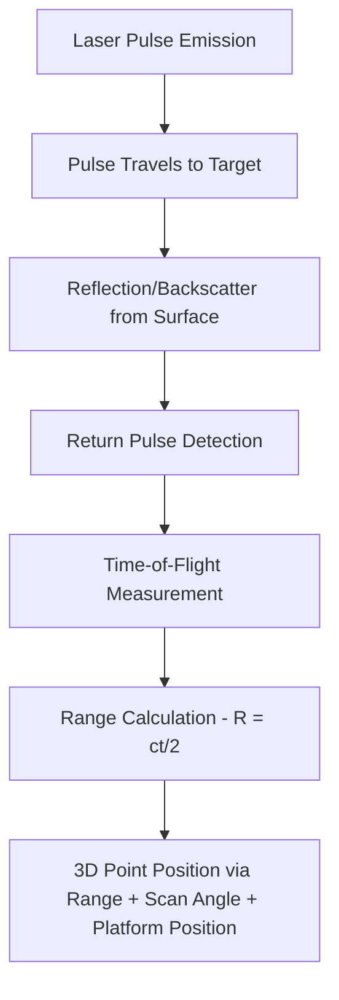
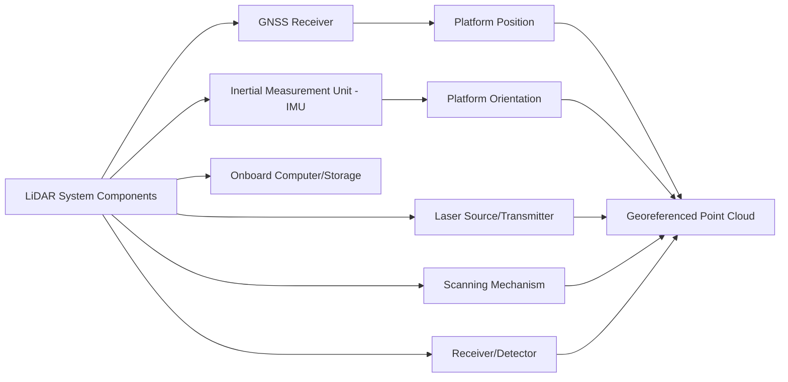
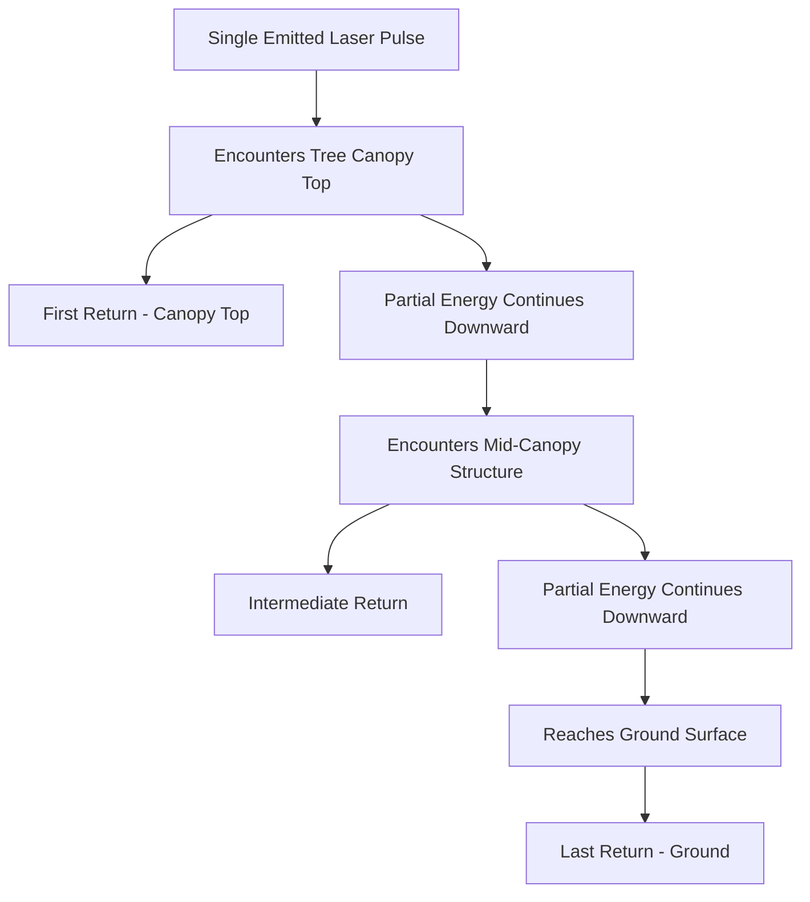

## LiDAR Principles and System Components


### Overview

LiDAR (Light Detection and Ranging) is an active remote sensing technology that measures distance to a target by emitting laser pulses and precisely timing the return of reflected energy. Unlike passive optical or thermal sensors that measure reflected or emitted radiation, and unlike radar's use of microwave wavelengths, LiDAR uses near-infrared or visible laser light to directly generate dense, three-dimensional point measurements of surface geometry, making it a fundamentally range-based rather than image-based measurement technique.

### Fundamental Ranging Principle

**Time-of-Flight Measurement**

The core LiDAR measurement principle computes distance from the round-trip travel time of a laser pulse:

$$R = \frac{c \cdot t}{2}$$

where $R$ is the range (distance) to the target, $c$ is the speed of light, and $t$ is the measured round-trip time between pulse emission and return detection. The division by 2 accounts for the pulse traveling to the target and back.

**Phase-Shift Ranging (Alternative Method)**

Some LiDAR systems, particularly certain terrestrial and short-range systems, use continuous-wave laser emission and measure the phase shift between transmitted and received signals rather than discrete pulse timing:

$$R = \frac{c}{4\pi f} \cdot \Delta\phi$$

where $f$ is the modulation frequency and $\Delta\phi$ is the measured phase difference. Phase-shift systems can achieve very high measurement rates but typically have more limited maximum range and ambiguity-resolution constraints compared to pulsed time-of-flight systems.



### System Components

**Laser Source (Transmitter)**

Generates the pulsed or continuous-wave laser beam. Common wavelengths include near-infrared (typically around 900–1550 nm) for topographic LiDAR, with 532 nm (green) used specifically for bathymetric LiDAR due to superior water penetration. Pulse repetition frequency (PRF), measured in pulses per second, directly affects point density achievable for a given platform speed and altitude.

**Scanning Mechanism**

Directs the laser beam across the swath perpendicular to platform motion, building the cross-track dimension of coverage. Common scanning mechanisms include:

- **Oscillating mirror**: sweeps side-to-side, producing a zigzag scan pattern
- **Rotating polygon mirror**: produces parallel scan lines
- **Fiber-based/push-broom arrays**: emerging designs using fixed fiber arrays rather than mechanical scanning, reducing moving parts

**Receiver/Detector**

Captures returned laser energy and precisely times its arrival. Detector technologies include avalanche photodiodes (APDs) and, in advanced systems, single-photon or Geiger-mode detectors capable of registering individual photon returns for extremely sensitive, long-range, or high-altitude detection.

**Global Navigation Satellite System (GNSS) Receiver**

Records precise platform position throughout data collection, essential since each laser return must be geolocated relative to the platform's absolute position. Survey-grade or RTK/PPK-corrected GNSS is standard for achieving the horizontal/vertical accuracy required for most mapping applications.

**Inertial Measurement Unit (IMU)**

Records platform orientation (pitch, roll, yaw) at high frequency, since the scanning laser's pointing direction relative to the ground depends on both the mechanical scan angle and the platform's instantaneous attitude. IMU data is combined with GNSS position through a process often called direct georeferencing.

**Onboard Computer/Data Storage**

Manages synchronized data logging from the laser ranging unit, GNSS receiver, and IMU, typically time-stamping all measurements to a common reference clock for later integration during post-processing.



### Georeferencing Equation (Direct Georeferencing)

The 3D ground coordinate of each laser return is computed by combining the measured range, scan angle, platform position, and platform orientation through a coordinate transformation:

$$\mathbf{X}_{ground} = \mathbf{X}_{GNSS} + \mathbf{R}_{IMU} \cdot \mathbf{R}_{boresight} \cdot \mathbf{r}_{scan}$$

where $\mathbf{X}_{GNSS}$ is the platform position from GNSS, $\mathbf{R}_{IMU}$ is the rotation matrix from IMU-measured orientation, $\mathbf{R}_{boresight}$ is a fixed calibration rotation accounting for misalignment between the IMU and laser scanner reference frames, and $\mathbf{r}_{scan}$ is the range vector defined by the measured range and scan angle. Boresight calibration—determining $\mathbf{R}_{boresight}$ precisely—is a critical, sensor-specific calibration step performed during system setup and periodically re-verified.

### Multiple Return Capability

A key LiDAR capability, particularly valuable in vegetated environments, is recording multiple returns from a single emitted laser pulse. As a pulse encounters a partially transmissive target (e.g., a tree canopy), part of the energy reflects back immediately while the remainder continues downward, potentially reflecting off lower canopy layers, understory vegetation, and finally bare ground.

- **First return**: typically the highest surface encountered (canopy top, building roof)
- **Intermediate returns**: reflections from mid-canopy structure
- **Last return**: often, though not always, the lowest surface reached by the pulse, frequently corresponding to ground level under vegetation gaps

**Full-Waveform LiDAR**

Rather than discretizing returns into a fixed number of discrete points, full-waveform systems digitize and record the entire returned energy profile over time for each pulse, providing more detailed information about vertical structure (e.g., canopy density profiles) than discrete-return systems, at the cost of substantially higher data volume and processing complexity.



### Platform Categories

| Platform Type | Typical Altitude/Range | Point Density | Coverage Rate | Typical Use |
| --- | --- | --- | --- | --- |
| Airborne LiDAR (fixed-wing) | 300–3,000 m AGL | Low–Moderate (1–20 pts/m²) | Very High (regional scale) | Regional topographic/forestry mapping |
| Airborne LiDAR (helicopter) | 100–1,000 m AGL | Moderate–High | High | Corridor mapping, utility inspection |
| UAV LiDAR | 20–150 m AGL | Very High (50–500+ pts/m²) | Low (site scale) | High-detail site mapping, forestry inventory |
| Terrestrial Laser Scanning (TLS) | Fixed ground position | Extremely High | Very Low (single setup footprint) | Building/infrastructure detailed scanning |
| Mobile Laser Scanning (MLS) | Vehicle-mounted, ground-based | Very High | Moderate (linear/corridor) | Road corridor and streetscape mapping |
| Spaceborne LiDAR | Satellite orbit | Very Low (sparse footprint sampling) | Global | Global forest structure/ice sheet sampling (e.g., GEDI, ICESat-2) |

[Unverified] Specific point density and altitude figures vary substantially by sensor model, flight parameters, and target reflectivity; the ranges above reflect general industry tendencies rather than fixed specifications for any particular system.

### Bathymetric LiDAR

A specialized LiDAR variant using green (typically ~532 nm) laser wavelength, which experiences substantially lower attenuation in water than near-infrared wavelengths used for topographic LiDAR, enabling measurement of both water surface and submerged bottom topography in relatively clear, shallow water conditions. Bathymetric systems often employ dual-wavelength configurations (a topographic infrared channel plus the bathymetric green channel) to simultaneously map land, shoreline, and shallow submerged terrain in a single survey.

### Key Sensor Specifications and Terminology

- **Pulse Repetition Frequency (PRF)**: number of laser pulses emitted per second; higher PRF generally enables higher point density for a given platform speed
- **Scan angle/Field of View (FOV)**: the angular range across which the scanning mechanism sweeps, determining swath width at a given altitude
- **Point density**: number of laser returns per unit ground area, typically expressed as points per square meter
- **Vertical and horizontal accuracy**: typically specified as RMSE values under defined conditions, dependent on ranging precision, GNSS/IMU accuracy, boresight calibration quality, and flying height
- **Swath width**: the ground coverage width per pass, determined by scan angle and flying height

### Example: Simple Time-of-Flight Range Calculation (Python)

```python
def calculate_lidar_range(time_of_flight_seconds):
    """
    Computes LiDAR range from measured round-trip
    time-of-flight, using the speed of light.
    """
    speed_of_light = 299_792_458  # meters per second
    range_m = (speed_of_light * time_of_flight_seconds) / 2
    return range_m

# Example: a return detected 667 nanoseconds after pulse emission
tof_seconds = 667e-9
range_result = calculate_lidar_range(tof_seconds)
print(f"Calculated range: {range_result:.2f} meters")
```

### Advantages Over Passive Optical/Photogrammetric Methods

- **Direct 3D measurement**: range-based measurement does not require image feature matching or stereo geometry to derive elevation, avoiding photogrammetric limitations over homogeneous or low-texture surfaces
- **Vegetation canopy penetration**: multiple-return capability allows some laser energy to reach the ground through canopy gaps, enabling bare-earth DTM derivation under forest cover that photogrammetric methods cannot achieve
- **Day/night operation**: as an active sensor with its own illumination source, LiDAR is not dependent on solar illumination (though eye-safety and atmospheric visibility considerations still apply)
- **High vertical accuracy**: direct ranging typically achieves superior vertical accuracy compared to photogrammetrically-derived elevation, particularly in complex or vegetated terrain

### Limitations

- **Cost**: LiDAR sensors and associated GNSS/IMU integration are typically more expensive than passive camera payloads, both in equipment cost and, for airborne systems, data acquisition cost
- **Data volume**: dense point clouds, particularly from full-waveform or very high point-density UAV systems, generate substantial data volumes requiring significant storage and processing infrastructure
- **No inherent spectral/color information**: raw LiDAR point clouds represent geometry only; many systems now fuse LiDAR with an integrated RGB camera to add color attributes to points, but this is a complementary sensor addition rather than an inherent LiDAR capability
- **Water surface limitations for topographic systems**: standard near-infrared topographic LiDAR is strongly absorbed by water and cannot measure submerged bathymetry, requiring the specialized green-wavelength bathymetric variant for that purpose
- **Atmospheric and surface reflectivity effects**: heavy precipitation, fog, or very low-reflectivity/specular surfaces can degrade return signal quality and range accuracy

### Applications

- High-accuracy topographic mapping and digital elevation model production
- Forest inventory, canopy structure, and biomass estimation through canopy penetration
- Floodplain mapping and hydrological modeling requiring precise bare-earth elevation
- Infrastructure and corridor mapping (transportation, utility rights-of-way)
- Building/structure 3D modeling for BIM (Building Information Modeling) integration
- Coastal and nearshore bathymetric mapping (bathymetric LiDAR variant)
- Archaeological feature detection beneath forest canopy
- Autonomous vehicle navigation and mapping (terrestrial/mobile LiDAR)

### Next Steps

- **Related Topics**:
  - LiDAR Point Cloud Processing and Classification
  - Digital Elevation Models from LiDAR (DSM, DTM, Canopy Height Models)
  - UAV Platform Types and Sensor Payloads (UAV LiDAR integration context)
  - Radar and Synthetic Aperture Radar (comparative active sensing method)
  - Bathymetric LiDAR and Coastal Mapping Applications
  - Terrestrial and Mobile Laser Scanning Systems
  - Spaceborne LiDAR Missions (GEDI, ICESat-2)
  - Full-Waveform LiDAR Analysis Techniques