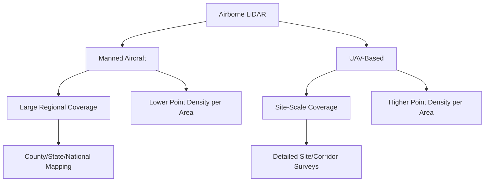
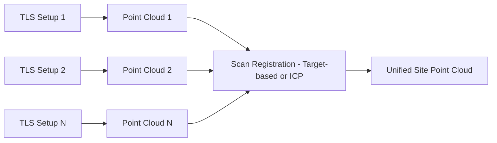
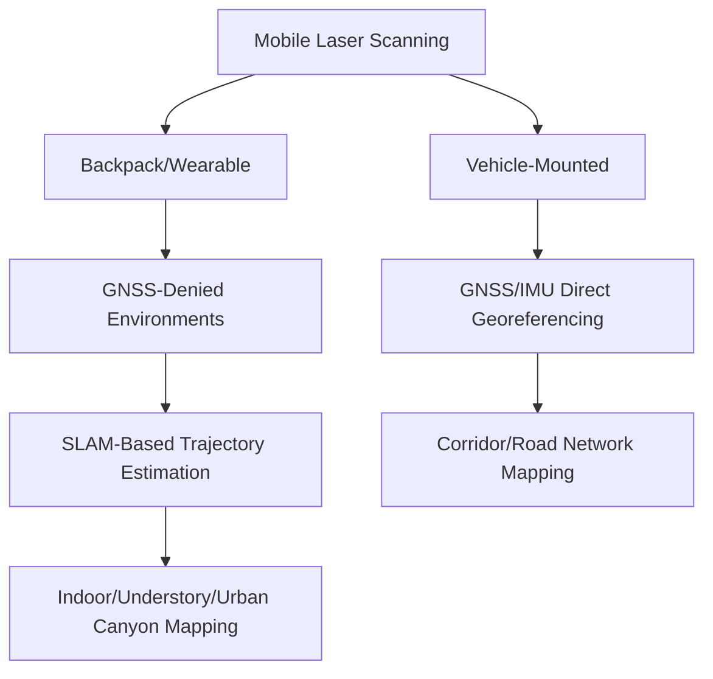
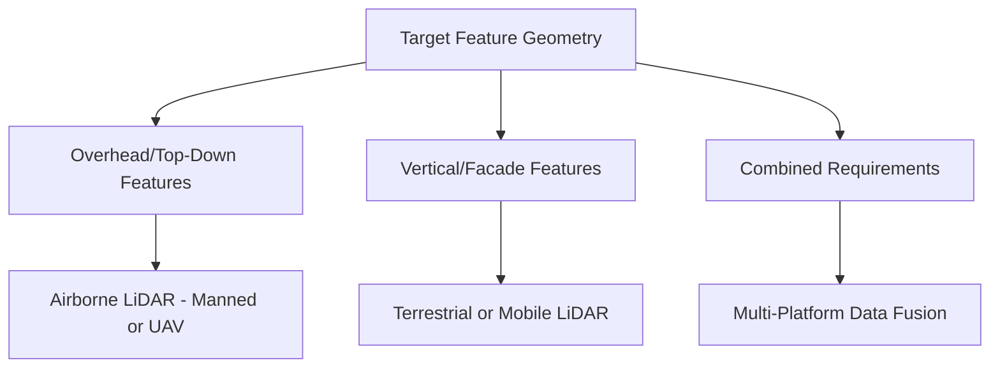

## Airborne, Terrestrial, and Mobile LiDAR


### Overview

LiDAR data acquisition platforms are typically classified into three primary categories based on how the sensor is deployed: airborne (mounted on aircraft or UAVs), terrestrial (fixed ground-based positioning), and mobile (moving ground-based platforms, typically vehicle-mounted). Each platform category offers a distinct combination of coverage area, point density, geometric perspective, and accuracy characteristics, making platform selection a critical decision driven by project scale, required detail, and target feature geometry.

### Airborne LiDAR

**System Configuration**

Airborne LiDAR mounts the laser scanning unit, GNSS receiver, and IMU on a fixed-wing aircraft, helicopter, or UAV platform, scanning the surface below as the platform moves forward, building a swath of coverage through combined scan-angle and platform-motion geometry, following the general system architecture and georeferencing principles described under LiDAR Principles and System Components.

**Manned Aircraft Airborne LiDAR**

- Operates at altitudes typically ranging from a few hundred meters to several thousand meters AGL
- Covers large regional areas efficiently, making it the standard choice for county, state, or national-scale topographic mapping programs
- Point densities are typically lower per unit area than UAV or terrestrial systems (though still dense relative to traditional contour mapping), reflecting the trade-off between altitude/coverage rate and point density
- Well suited for regional DEM production, floodplain mapping, and large-area forest inventory

**UAV-Based Airborne LiDAR**

- Operates at much lower altitudes (tens to a couple hundred meters AGL), achieving substantially higher point density per unit area than manned airborne systems
- Covers smaller areas per flight due to UAV endurance and regulatory altitude constraints
- Increasingly used for site-scale forestry inventory, corridor mapping, and precision topographic surveys requiring finer detail than manned airborne LiDAR typically provides
- Requires the integration challenges specific to UAV payloads: weight constraints on GNSS/IMU quality, battery-driven flight duration limits, and the direct georeferencing accuracy dependencies discussed under LiDAR Principles



### Terrestrial Laser Scanning (TLS)

**System Configuration**

Terrestrial Laser Scanning uses a stationary, tripod-mounted laser scanner positioned at fixed ground locations, scanning a full or partial spherical field of view around the instrument from each setup position. Unlike airborne systems that rely on continuous platform motion for georeferencing, TLS typically requires either known/surveyed instrument positions at each setup or, for relative surveys, a subsequent registration process aligning multiple scan positions into a common coordinate system.

**Scan Registration**

Because a single TLS setup captures data from only one vantage point (with inherent line-of-sight occlusion behind objects), most projects require multiple scan positions around a site, subsequently registered together using:

- **Target-based registration**: physical targets (spheres, checkerboards) placed in the scene and identified in overlapping scans, providing known correspondence points
- **Cloud-to-cloud registration**: algorithms (e.g., Iterative Closest Point, ICP) that align overlapping point cloud geometry directly without requiring physical targets

**Point Density and Accuracy**

TLS typically achieves the highest point density and positional accuracy of any LiDAR platform category, often measuring millimeter-level detail at close range, since the sensor is stationary and scan geometry is highly controlled. This precision comes at the cost of very limited spatial coverage per setup, requiring numerous setups and substantial field time for large or complex sites.



### Mobile Laser Scanning (MLS)

**System Configuration**

Mobile Laser Scanning mounts one or more laser scanners, typically alongside cameras, on a moving ground vehicle (car, backpack, cart, or rail-mounted platform), combined with GNSS and IMU for continuous direct georeferencing as the platform travels along a route—conceptually similar to airborne direct georeferencing but operating at ground level along linear corridors.

**Backpack and Handheld/Wearable Systems**

A growing category of portable MLS systems allows an operator to walk through a site (indoor or outdoor) while continuously scanning, useful for areas inaccessible to vehicles, such as building interiors, dense forest understory, or pedestrian-only corridors. [Unverified] The capabilities, accuracy specifications, and market availability of wearable/backpack LiDAR systems have expanded rapidly in recent years; specific current product capabilities should be verified against manufacturer documentation.

**GNSS-Denied Environment Challenges**

Mobile systems operating indoors, in dense urban canyons, or under heavy forest canopy face degraded or unavailable GNSS signal, requiring alternative or supplementary positioning approaches such as Simultaneous Localization and Mapping (SLAM), which uses the LiDAR data itself (combined with IMU) to estimate platform trajectory by matching successive scans, rather than relying solely on external GNSS positioning.



### Comparative Platform Summary

| Characteristic | Airborne (Manned) | Airborne (UAV) | Terrestrial (TLS) | Mobile (MLS) |
| --- | --- | --- | --- | --- |
| Coverage per session | Very large (regional) | Moderate (site-scale) | Very small (single setup footprint, multiplied by setup count) | Large (linear/corridor) |
| Point density | Low–Moderate | High | Very High | High |
| Positioning method | GNSS/IMU direct georeferencing | GNSS/IMU direct georeferencing | Target-based or ICP registration | GNSS/IMU direct georeferencing, or SLAM in GNSS-denied settings |
| Typical accuracy | Centimeter-level (vertical, with good GNSS) | Centimeter-level, dependent on payload quality | Millimeter-level at close range | Centimeter-level, degraded in GNSS-denied conditions without SLAM compensation |
| Best suited for | Regional topographic/forestry mapping | Site-scale precision mapping, forestry inventory | Detailed structural/building/infrastructure scanning | Corridor, road network, and streetscape mapping |

[Inference] Accuracy figures depend heavily on specific sensor specifications, GNSS/IMU quality, calibration procedures, and environmental conditions for any given survey; the general tendencies summarized above should not be read as guaranteed performance for a specific system or project.

### Feature Geometry and Platform Selection

Platform selection is strongly influenced by the geometric perspective needed for the target features:

- **Vertical/overhead perspective needed** (canopy structure, terrain elevation, roof geometry): airborne platforms provide the natural top-down vantage point
- **Vertical structural detail needed** (building facades, bridge undersides, cliff faces): terrestrial or mobile platforms provide the horizontal/oblique perspective airborne systems cannot easily capture
- **Combined perspective requirements**: many infrastructure and urban mapping projects integrate airborne and terrestrial/mobile data to capture both overhead and vertical surface geometry comprehensively



### Data Fusion Across Platforms

Combining airborne and terrestrial/mobile LiDAR datasets requires careful attention to:

- **Common coordinate reference system and datum**: ensuring all datasets share consistent horizontal and vertical reference frames
- **Relative accuracy reconciliation**: terrestrial/mobile data's typically higher local precision must be reconciled with airborne data's broader but potentially less locally precise coverage
- **Point cloud registration**: aligning datasets collected from fundamentally different vantage points and positioning methods, sometimes using overlapping ground or structural features as common tie points

### Example: Simple Point Density Calculation Across Platforms (Python)

```python
def estimate_point_density(pulse_rate_hz, flight_speed_ms,
                             swath_width_m, scan_efficiency=0.9):
    """
    Estimates approximate average point density (points per square meter)
    for a moving-platform LiDAR system (airborne or mobile), given
    pulse rate, platform speed, and swath width.
    Illustrative simplification; actual density varies across
    the swath and depends on scan pattern geometry.
    """
    points_per_second = pulse_rate_hz * scan_efficiency
    area_covered_per_second = flight_speed_ms * swath_width_m
    density = points_per_second / area_covered_per_second
    return density

# Example: UAV LiDAR at moderate speed with a compact scanner
density_uav = estimate_point_density(
    pulse_rate_hz=200_000, flight_speed_ms=5, swath_width_m=80
)
print(f"Estimated point density: {density_uav:.1f} points/m^2")
```

### Applications by Platform

**Airborne (Manned)**

- Statewide/national elevation mapping programs
- Regional floodplain and watershed hydrological modeling
- Large-scale forest inventory and biomass assessment

**Airborne (UAV)**

- Site-scale forestry inventory with high canopy penetration detail
- Precision topographic survey for engineering design
- Corridor mapping for smaller infrastructure projects

**Terrestrial (TLS)**

- As-built building and structural documentation
- Heritage site and monument preservation scanning
- Industrial facility/plant scanning for engineering retrofit design
- Deformation monitoring of structures over repeat scans

**Mobile (MLS)**

- Road corridor asset mapping and pavement condition assessment
- Streetscape and utility infrastructure inventory
- Indoor building scanning for BIM/facilities management (backpack/wearable systems)
- Rail corridor clearance and infrastructure mapping

### Limitations by Platform Category

- **Airborne**: limited ability to capture vertical/facade surfaces due to overhead-only vantage point; weather and airspace regulatory constraints apply
- **Terrestrial**: extensive field time for multi-setup surveys of large or complex sites; line-of-sight occlusion requires careful setup planning to avoid data gaps
- **Mobile**: accuracy degradation in GNSS-denied environments without robust SLAM compensation; vehicle-based systems limited to accessible route networks

### Next Steps

- **Related Topics**:
  - LiDAR Principles and System Components (foundational sensor/ranging theory)
  - LiDAR Point Cloud Processing and Classification
  - Simultaneous Localization and Mapping (SLAM) for GNSS-Denied Positioning
  - UAV Platform Types and Sensor Payloads (UAV LiDAR integration context)
  - Building Information Modeling (BIM) Integration with Point Cloud Data
  - Deformation Monitoring Using Repeat Terrestrial Laser Scanning
  - Digital Elevation Models from LiDAR (comparative platform-derived accuracy)