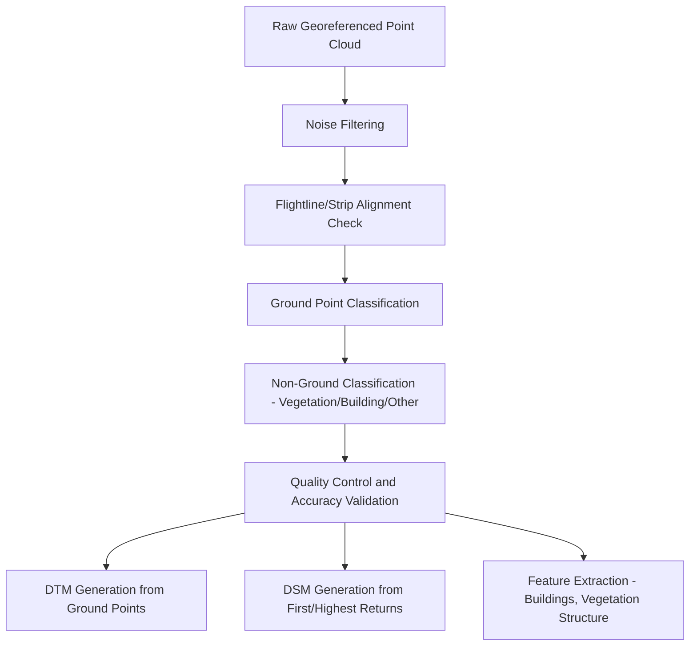
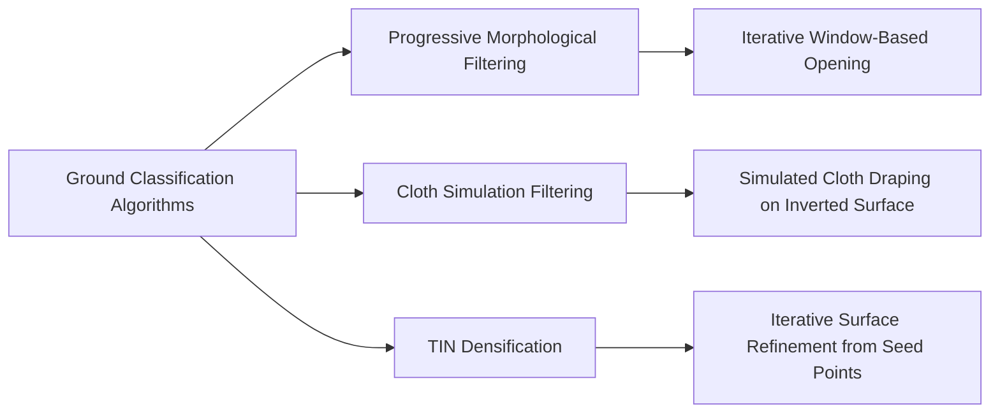
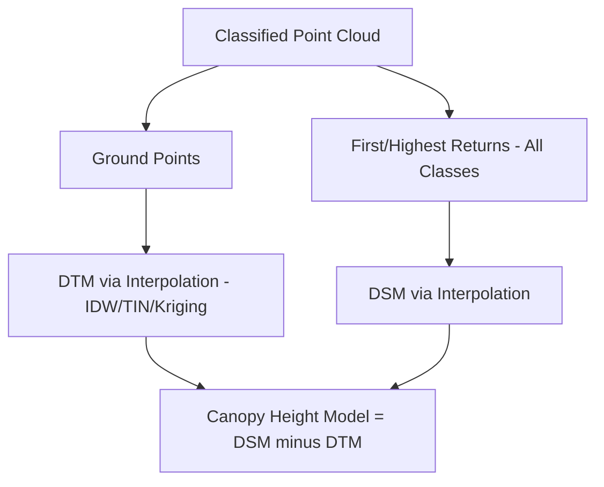

## Point Cloud Processing and Classification

### Overview

Point cloud processing and classification transform raw, georeferenced LiDAR (or photogrammetrically-derived) point measurements into organized, categorized, and analysis-ready datasets. Raw point clouds are undifferentiated collections of X, Y, Z coordinates (often with additional attributes like intensity and return number), and classification assigns each point to a meaningful category—ground, vegetation, building, water, noise—enabling downstream products like Digital Terrain Models and Canopy Height Models to be generated correctly.

### Point Cloud Data Structure and Attributes

**Core Attributes**

- **X, Y, Z coordinates**: three-dimensional position in a defined coordinate reference system
- **Intensity**: the strength of the returned laser signal, influenced by target reflectivity, incidence angle, and range; useful for distinguishing material types (e.g., pavement vs. vegetation) even without spectral color information
- **Return number and number of returns**: identifies which return (first, intermediate, last) a point represents from its originating pulse, and how many total returns that pulse produced
- **GPS time**: timestamp linking the point to its acquisition moment, useful for troubleshooting and multi-flightline reconciliation
- **Scan angle**: the angular position of the laser at the moment of that point's acquisition, relevant for accuracy assessment (points at extreme scan angles are typically less accurate)
- **RGB values** (when fused with imagery): color attributes appended from co-registered photography, common in modern integrated LiDAR/camera systems

**Standard File Format: LAS/LAZ**

The LAS format (and its compressed variant, LAZ) is the widely adopted industry-standard binary format for storing LiDAR point cloud data, structured to hold the attributes above in a standardized, interoperable schema supported across most point cloud processing software.

### Point Cloud Processing Pipeline



### Noise Filtering

Raw point clouds often contain spurious points caused by atmospheric interference (birds, dust, low clouds), multipath reflections, or sensor artifacts. Common noise filtering approaches include:

- **Statistical outlier removal**: flagging points whose local neighborhood density or distance statistics deviate substantially from surrounding points
- **Elevation-based thresholding**: removing points implausibly far above or below the expected surface range for the survey area
- **Isolated point removal**: removing points with very few neighbors within a defined search radius, since real surfaces produce spatially coherent point clusters

### Ground Point Classification Algorithms

Ground classification—identifying which points represent the bare-earth surface—is the foundational classification step, since accurate ground points are required to generate the Digital Terrain Model that most other analyses depend on.

**Progressive Morphological Filtering (PMF)**

Applies morphological opening operations (erosion followed by dilation) with progressively increasing window sizes, iteratively identifying likely ground points by their relatively lower local elevation while allowing gradually larger terrain features to be included as the window grows. Effective in areas with predictable terrain and vegetation height, but can struggle in areas with mixed dense vegetation and steep, complex terrain.

**Cloth Simulation Filtering (CSF)**

Conceptually inverts the point cloud and simulates a virtual cloth being draped over the inverted surface under simulated gravity; the cloth settles onto the (inverted) ground surface while being prevented from passing through dense clusters representing non-ground features. This produces an approximated ground surface that classifies points close to the settled cloth position as ground. CSF has become a widely used approach due to its relatively good performance across varied terrain and vegetation conditions with comparatively few tunable parameters.

**Triangulated Irregular Network (TIN) Densification / Iterative Densification**

Begins with an initial sparse set of likely ground points (e.g., local minima within a grid), constructs a TIN surface from them, then iteratively tests remaining points against angle and distance thresholds relative to the current TIN surface, adding qualifying points to the ground classification and refining the TIN progressively.



### Non-Ground Classification Categories

Once ground points are separated, remaining points are typically further classified into standard categories (following widely adopted schemas such as the ASPRS LAS classification standard):

| Class Category | Typical Criteria |
| --- | --- |
| Ground | Bare-earth surface, identified via ground filtering algorithm |
| Low/Medium/High Vegetation | Height above ground surface, often subdivided by height thresholds |
| Building | Planar surfaces at consistent elevation with characteristic building footprint geometry |
| Water | Very low point density/no returns (specular reflection off water surface) combined with known water body extent |
| Noise | Points identified as erroneous during noise filtering |
| Unclassified | Points not yet assigned to a specific category |

[Unverified] Specific classification code numbers and category definitions follow published standards (e.g., ASPRS LAS specification) that are periodically revised with additional categories; current authoritative class definitions should be confirmed against the relevant specification version in use for a given project.

### Building and Structure Extraction

Building extraction typically combines geometric and contextual analysis:

- **Planarity analysis**: identifying clusters of points forming flat or gently sloped planar surfaces consistent with roof structures
- **Height and area thresholds**: filtering candidate planar clusters by minimum height above ground and minimum footprint area to exclude small non-building features
- **Edge/boundary regularization**: refining extracted building footprints to align with expected rectilinear or regular geometric patterns typical of constructed structures
- **Fusion with imagery**: co-registered aerial or satellite imagery can help validate or refine LiDAR-derived building boundaries, particularly at edges where point density is lower

### Vegetation Structure Classification

Beyond simple height-based vegetation classes, more detailed vegetation analysis can extract:

- **Canopy height distribution**: statistical summary of vegetation return heights within an area, informing biomass and structure estimates
- **Vertical stratification**: distinguishing canopy, understory, and ground-layer vegetation using return height distribution and multiple-return patterns
- **Individual tree segmentation**: algorithms (e.g., local maxima detection combined with region-growing or watershed segmentation on the canopy height model) that isolate individual tree crowns from the point cloud or derived raster surface

### Example: Basic Point Cloud Classification Workflow (Python, using PDAL concepts)

```python
import json

# Example PDAL pipeline definition for ground classification
# and DTM generation from a raw LAS/LAZ point cloud.
# PDAL (Point Data Abstraction Library) is a widely used
# open-source library for point cloud processing pipelines.

pipeline_definition = {
    "pipeline": [
        "input_raw_pointcloud.laz",
        {
            "type": "filters.outlier",
            "method": "statistical",
            "mean_k": 8,
            "multiplier": 2.5
        },
        {
            "type": "filters.csf",
            "resolution": 0.5,
            "rigidness": 2
        },
        {
            "type": "filters.range",
            "limits": "Classification[2:2]"  # select ground-classified points
        },
        {
            "type": "writers.gdal",
            "filename": "dtm_output.tif",
            "resolution": 1.0,
            "output_type": "idw"
        }
    ]
}

with open("classification_pipeline.json", "w") as f:
    json.dump(pipeline_definition, f, indent=2)

print("Pipeline definition written. Execute via: pdal pipeline classification_pipeline.json")
```

This illustrates the conceptual structure of a point cloud processing pipeline: noise filtering, ground classification (using Cloth Simulation Filtering), filtering to retain only ground-classified points, and rasterizing to a DTM. [Inference] Exact PDAL filter parameter names, defaults, and available options may vary between library versions; current syntax should be verified against the PDAL documentation for the version in use.

### Rasterization: From Classified Points to Surface Models

**Digital Terrain Model (DTM) Generation**

Interpolating a continuous raster surface from classified ground points using methods such as:

- **Inverse Distance Weighting (IDW)**: weights nearby points' contribution inversely by distance
- **Triangulated Irregular Network (TIN) interpolation**: constructs triangular facets between ground points and interpolates within each triangle
- **Kriging**: geostatistical interpolation incorporating spatial autocorrelation structure, more computationally intensive but potentially more accurate for irregularly distributed data

**Digital Surface Model (DSM) Generation**

Typically generated from first or highest returns across all classifications, representing the uppermost surface encountered (canopy, rooftops, ground where no vegetation/structures exist).

**Canopy Height Model (CHM)**

Computed as the raster difference between DSM and DTM:

$$CHM(x,y) = DSM(x,y) - DTM(x,y)$$

providing a normalized height-above-ground surface widely used in forestry and vegetation structure analysis.



### Quality Control and Accuracy Assessment

- **Vertical accuracy assessment**: comparing DTM elevations at independent surveyed check points against known reference values, typically summarized as RMSE
- **Classification accuracy assessment**: comparing automated classification results against manually verified reference points or areas, often summarized through a confusion matrix reporting producer's and user's accuracy per class
- **Flightline/strip overlap consistency check**: verifying that overlapping flight lines from airborne acquisitions produce consistent elevation values in their overlap zones, since systematic discrepancies indicate boresight calibration or trajectory processing errors
- **Visual inspection**: profile views and hillshade renderings of classified surfaces to visually identify obvious classification errors (e.g., vegetation misclassified as ground, creating artificial terrain "bumps")

### Common Classification Challenges

- **Steep terrain with dense vegetation**: ground filtering algorithms can struggle to distinguish true ground points from low vegetation or terrain breaks on steep slopes, sometimes requiring manual editing or algorithm parameter tuning specific to the terrain type
- **Low vegetation vs. ground ambiguity**: short grass, crops, or low shrubs can be misclassified in either direction depending on algorithm sensitivity and height thresholds
- **Building edge effects**: point density reduction at building edges (roof overhangs, complex architectural features) can complicate precise footprint extraction
- **Bridges and elevated structures**: features that are elevated above but connected to the ground plane (bridges, elevated walkways) can be misclassified as ground or require specialized handling in DTM generation to avoid creating false terrain artifacts
- **Water surface noise**: specular reflection off water surfaces can produce noisy or sparse returns, requiring specialized handling distinct from standard ground/vegetation classification logic

### Processing Software and Libraries

- **PDAL (Point Data Abstraction Library)**: open-source library and command-line tool for point cloud processing pipelines, supporting a wide range of filters and format conversions
- **LAStools**: a widely used commercial/free toolset specifically for LAS/LAZ format processing, ground classification, and derived product generation
- **Commercial GIS/LiDAR-specific software**: integrated platforms offering graphical workflows for classification, editing, and product generation
- **Open-source point cloud libraries**: general-purpose libraries (e.g., Open3D, PCL/Point Cloud Library) providing algorithmic building blocks for custom point cloud processing applications

[Unverified] Specific software capabilities, supported algorithms, and version-specific features change over time; current documentation for the specific tool and version in use should be consulted for authoritative parameter and workflow guidance.

### Applications

- Bare-earth DTM production for hydrological modeling and floodplain mapping
- Forest inventory through canopy structure and individual tree segmentation
- Building footprint and 3D city model extraction for urban planning
- Infrastructure asset extraction (roads, utility structures) from mobile/airborne point clouds
- Archaeological feature detection through fine-scale bare-earth terrain analysis under forest canopy
- Change detection through classified point cloud comparison across survey dates

### Next Steps

- **Related Topics**:
  - LiDAR Principles and System Components (foundational sensor/data generation)
  - Airborne, Terrestrial, and Mobile LiDAR (platform-specific acquisition context)
  - Digital Elevation Models: DSM, DTM, and Canopy Height Model Derivation
  - Individual Tree Detection and Forest Structure Analysis
  - Building Extraction and 3D City Modeling from Point Clouds
  - Accuracy Assessment Methods for Classified Geospatial Data
  - PDAL and Open-Source Point Cloud Processing Tools