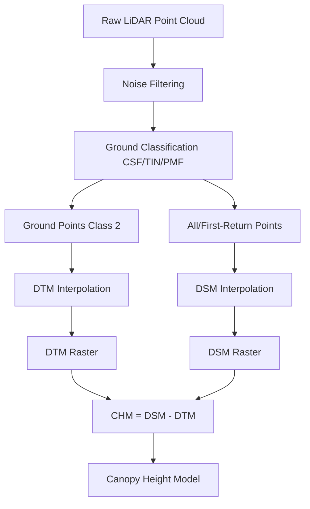

## Digital Surface and Terrain Model Generation

### Overview

Digital Surface Models (DSM) and Digital Terrain Models (DTM) are raster or TIN-based representations of the Earth's surface derived primarily from LiDAR point clouds (and secondarily from photogrammetric point clouds or radar interferometry). A DSM captures the first-return or highest-elevation surface, including vegetation canopy, buildings, and other above-ground features. A DTM represents the bare-earth elevation after removing non-ground objects. The difference between these two surfaces, computed cell-by-cell, produces a Canopy Height Model (CHM) or normalized Digital Elevation Model (nDEM), which is foundational for forestry biomass estimation, flood modeling, urban planning, and infrastructure design.

### Core Definitions

- **DSM (Digital Surface Model)**: Elevation of the highest reflective surface at each location — treetops, rooftops, power lines.
- **DTM (Digital Terrain Model)**: Elevation of the bare ground surface, with vegetation and structures removed/interpolated through.
- **DEM (Digital Elevation Model)**: A general term often used interchangeably with DTM in GIS contexts, though some organizations use DEM as the umbrella term covering both DSM and DTM.
- **CHM (Canopy Height Model)**: $CHM = DSM - DTM$, representing above-ground object height.

### Data Sources

**LiDAR (primary source)**: Airborne Laser Scanning (ALS) or terrestrial/mobile LiDAR emits pulses and records return times to compute a 3D point cloud with X, Y, Z coordinates and return intensity. Multiple returns per pulse (first, intermediate, last) allow partial penetration through vegetation canopy gaps, enabling ground detection beneath forest cover — something passive optical sensors cannot do.

**Photogrammetric point clouds**: Derived from overlapping stereo imagery via Structure from Motion (SfM) and dense matching algorithms. These produce dense surface points but cannot see through canopy, so they are generally only suitable for DSM generation, not reliable bare-earth DTM extraction in vegetated areas.

**InSAR (Interferometric SAR)**: Radar-based elevation derived from phase differences between two SAR acquisitions; useful for wide-area DSM generation (e.g., SRTM, TanDEM-X) but with coarser resolution and vegetation/penetration biases depending on wavelength (X-band vs. C-band vs. L-band).

### LiDAR Point Cloud Processing Pipeline

**1. Raw Point Cloud Acquisition and Preprocessing**

- Trajectory data (GPS/IMU) is combined with raw laser ranging data to geolocate each point.
- Points are typically delivered in LAS or LAZ (compressed LAS) format, following the ASPRS LAS specification.
- Coordinate reference system assignment and datum transformation (horizontal and vertical) are applied.

**2. Noise Filtering**

- Statistical outlier removal eliminates points caused by atmospheric interference, birds, or multipath reflections.
- Isolated point filters (e.g., removing points with few neighbors within a radius) clean sparse noise before classification.

**3. Ground Classification (Point Classification)**

This is the most critical step for DTM generation. Common algorithms include:

- **Progressive Morphological Filter (PMF)**: Applies morphological opening operations with progressively increasing window sizes and elevation-difference thresholds to distinguish ground from non-ground points.
- **Cloth Simulation Filter (CSF)**: Inverts the point cloud and simulates a virtual cloth draping over it under gravity; points where the cloth settles are classified as ground. Widely implemented (e.g., in CloudCompare, PDAL).
- **Triangulated Irregular Network (TIN) densification** (as in Axelsson's algorithm, used in TerraScan): Starts with a sparse TIN of likely ground seed points (typically local minima within a grid) and iteratively adds nearby points to the TIN if they fall within angle and distance thresholds from existing TIN facets.
- Points are typically assigned standard ASPRS classification codes: 2 = Ground, 1 = Unclassified, 3–5 = Low/Medium/High Vegetation, 6 = Building, 7 = Low Point (noise), 9 = Water.

**4. Surface Interpolation / Rasterization**

Once points are classified, the classified subsets are interpolated into continuous raster surfaces:

- **DSM**: Interpolated from the full point cloud or first-return points only, typically using the highest point per grid cell (max-Z binning) or TIN-based interpolation.
- **DTM**: Interpolated exclusively from ground-classified points (class 2), using methods such as:
  - **TIN linear interpolation**: Triangulate ground points, then sample elevation within each triangle.
  - **Inverse Distance Weighting (IDW)**: $z(x,y) = \frac{\sum_i w_i z_i}{\sum_i w_i}$, where $w_i = 1/d_i^p$.
  - **Kriging**: Geostatistical interpolation that models spatial autocorrelation via a variogram, providing both an interpolated surface and an uncertainty estimate.
  - **Natural Neighbor interpolation**: Uses Voronoi tessellation weighting; smooth and locally adaptive.

**5. Void Filling and Edge Effects**

- Areas without ground returns (dense canopy, water bodies, data gaps) require interpolation or auxiliary breakline data.
- Breaklines (hydrographic features, ridgelines) are often manually or semi-automatically incorporated to preserve hydrological correctness (hydro-flattening/hydro-enforcement), particularly critical for flood modeling DTMs.

### Standard Processing Workflow (Example: PDAL Pipeline)

A typical open-source pipeline using PDAL (Point Data Abstraction Library) for ground classification and DTM generation:

```plaintext
{
  "pipeline": [
    "input.laz",
    {
      "type": "filters.outlier",
      "method": "statistical",
      "mean_k": 8,
      "multiplier": 3.0
    },
    {
      "type": "filters.csf",
      "resolution": 0.5,
      "rigidness": 2,
      "threshold": 0.5
    },
    {
      "type": "filters.range",
      "limits": "Classification[2:2]"
    },
    {
      "type": "writers.gdal",
      "filename": "dtm_output.tif",
      "resolution": 1.0,
      "output_type": "idw"
    }
  ]
}
```

**Key Points**

- `filters.outlier` removes statistical noise before classification to prevent false ground/non-ground assignments.
- `filters.csf` performs Cloth Simulation Filter ground classification.
- `filters.range` isolates class 2 (ground) points for DTM-specific interpolation.
- `output_type: idw` performs inverse-distance-weighted rasterization; alternatives include `min`, `max`, `mean`, and `idw`.

For DSM generation, the range filter step is omitted (or set to retain first returns), and `output_type` is typically set to `max` to capture the highest surface per cell.

### Resolution and Grid Cell Size Considerations

Point density directly constrains achievable raster resolution. As a general rule, grid cell size should not be smaller than roughly the average point spacing, or the interpolation will over-smooth or produce artifacts from sparse cells.

$$\text{avg. point spacing} \approx \frac{1}{\sqrt{\text{point density (pts/m}^2\text{)}}}$$

For example, a survey with 8 points/m² yields an average spacing of approximately 0.35 m, supporting DTM/DSM products at 0.5–1 m resolution reliably. High-density urban LiDAR surveys (20+ pts/m²) can support 0.25–0.5 m products, while sparse regional/statewide LiDAR (2–4 pts/m²) is typically limited to 1–2 m products.

### Canopy Height Model Derivation



The CHM is computed as a raster algebra subtraction and is widely used for tree height estimation, forest structure metrics (e.g., canopy cover, gap fraction), and biomass allometry models.

### Software and Tools

- **PDAL**: Command-line and pipeline-based point cloud processing; strong for scripted, reproducible workflows.
- **LAStools (lasground, lasheight, blast2dem)**: Industry-standard commercial suite widely used in production LiDAR workflows; `lasground` performs ground classification, `blast2dem` rasterizes TINs efficiently.
- **CloudCompare**: Open-source point cloud viewer/editor with CSF plugin for ground classification and manual editing.
- **QGIS**: Supports LiDAR visualization, point cloud styling (since QGIS 3.18+), and integrates with GDAL/PDAL for raster generation.
- **ArcGIS Pro (LAS Dataset, 3D Analyst)**: `LAS Dataset to Raster`, `Classify LAS Ground`, and `LAS Point Statistics As Raster` tools provide a GUI-driven equivalent pipeline.
- **whitebox_tools**: Open-source geospatial analysis library with LiDAR-specific tools (`LidarGroundPointFilter`, `LidarTINGridding`) callable via Python.

### Practical Example: Python Workflow with PDAL and Rasterio

```python
import pdal
import json

pipeline_json = {
    "pipeline": [
        "site_survey.laz",
        {"type": "filters.csf", "resolution": 1.0, "threshold": 0.5},
        {"type": "filters.range", "limits": "Classification[2:2]"},
        {
            "type": "writers.gdal",
            "filename": "dtm.tif",
            "resolution": 1.0,
            "output_type": "idw",
            "gdaldriver": "GTiff"
        }
    ]
}

pipeline = pdal.Pipeline(json.dumps(pipeline_json))
pipeline.execute()
print(f"Points processed: {pipeline.metadata}")
```

```python
import rasterio
import numpy as np

with rasterio.open("dsm.tif") as dsm_src, rasterio.open("dtm.tif") as dtm_src:
    dsm = dsm_src.read(1)
    dtm = dtm_src.read(1)
    profile = dsm_src.profile

    chm = dsm - dtm
    chm[chm < 0] = 0  # clip negative artifacts from interpolation mismatch

    with rasterio.open("chm.tif", "w", **profile) as dst:
        dst.write(chm, 1)
```

**Key Points**

- CHM values below zero typically arise from interpolation grid misalignment or edge artifacts between independently interpolated DSM/DTM surfaces and are conventionally clipped to zero.
- DSM and DTM rasters must share identical CRS, resolution, and pixel alignment before subtraction; resampling/reprojection (e.g., via `rasterio.warp.reproject`) is required if they differ.

### Accuracy Assessment

DTM/DSM accuracy is typically reported using:

- **RMSE (Root Mean Square Error)** against independent ground control points (GCPs) surveyed via RTK-GPS or total station.
- **NSSDA (National Standard for Spatial Data Accuracy)**: US Federal Geographic Data Committee standard converting RMSE to a 95% confidence accuracy statement.
- **ASPRS Positional Accuracy Standards for Digital Geospatial Data**: Defines vertical accuracy classes (e.g., RMSEz of 5–20 cm for high-accuracy topographic LiDAR).

Typical vertical accuracies for well-controlled airborne LiDAR DTMs in open, non-vegetated terrain range from 5–15 cm RMSEz; accuracy degrades in dense vegetation, steep slopes, and urban canyon environments due to reduced ground point density.

### Common Error Sources

- **Vegetation over-classification as ground**: Dense understory or low shrubs misclassified as ground points, inflating DTM elevations locally.
- **Building/vegetation under-classification**: Low structures or dense canopy edges occasionally misclassified as ground, producing false depressions or artifacts.
- **Interpolation smoothing at breaklines**: TIN/IDW methods can round sharp terrain features (stream banks, road edges) without breakline enforcement.
- **Multipath and edge-of-swath noise**: Elevated point density variance and geometric distortion near flight-line edges can introduce systematic bias; this may vary by sensor and flight configuration [Inference].
- **Water surface returns**: LiDAR near-infrared pulses are often absorbed or specularly reflected by water, producing sparse/noisy returns that require hydro-flattening using ancillary hydrographic vector data.

### Applications

- **Hydrology**: Flood inundation modeling, watershed delineation, and stream network extraction rely on hydrologically-enforced DTMs.
- **Forestry**: CHM-derived tree height, canopy cover, and individual tree crown segmentation feed biomass and carbon stock models.
- **Urban Planning**: DSM supports line-of-sight, viewshed, and solar potential analysis incorporating buildings and vegetation.
- **Geomorphology**: High-resolution DTMs reveal fault scarps, landslide features, and erosion patterns obscured by vegetation in traditional imagery.
- **Infrastructure/Engineering**: Earthwork volume calculations, corridor design, and utility clearance analysis (vegetation encroachment on power lines) use DSM-DTM differencing.

### DSM vs. DTM Comparison Diagram

<svg xmlns="http://www.w3.org/2000/svg" viewBox="0 0 700 320">
<text x="350" y="24" text-anchor="middle" font-size="16" font-weight="bold" fill="#1a1a1a">DSM vs. DTM Cross-Section (svg_diagram)</text>
<line x1="40" y1="260" x2="660" y2="260" stroke="#555" stroke-width="2" />
<text x="20" y="264" font-size="11" fill="#555">Ground</text>

<path d="M40,260 L100,258 L140,255 L160,150 Q170,90 180,150 L200,255 L260,220 Q280,180 300,220 L330,255 L360,150 Q375,80 390,150 L420,255 L480,258 L520,200 L540,180 L560,200 L580,255 L660,258" fill="none" stroke="`#2e7d32`" stroke-width="3" />

<text x="200" y="140" font-size="12" fill="`#2e7d32`" font-weight="bold">DSM (canopy/rooftop)</text>

<path d="M40,260 L100,259 L160,257 L220,254 L280,250 L330,248 L390,245 L450,248 L520,252 L580,256 L660,259" fill="none" stroke="`#8d5524`" stroke-width="3" stroke-dasharray="6,3" />

<text x="440" y="240" font-size="12" fill="`#8d5524`" font-weight="bold">DTM (bare earth)</text>

<line x1="345" y1="245" x2="345" y2="80" stroke="#c62828" stroke-width="1.5" stroke-dasharray="3,3" />
<text x="350" y="70" font-size="11" fill="#c62828">CHM = DSM − DTM</text>
<rect x="500" y="190" width="40" height="60" fill="#9e9e9e" stroke="#333" />
<text x="490" y="185" font-size="11" fill="#333">Building</text>
<circle cx="170" cy="120" r="30" fill="#66bb6a" opacity="0.6" />
<rect x="167" y="150" width="6" height="105" fill="#5d4037" />
<text x="130" y="105" font-size="11" fill="#333">Tree canopy</text>
</svg>

**Next Steps**

- LiDAR point cloud classification algorithms (CSF, PMF, TIN-based) in depth
- Hydro-flattening and breakline enforcement techniques
- Canopy Height Model applications in forest inventory and biomass estimation
- Photogrammetric Structure from Motion (SfM) point cloud generation
- InSAR-based elevation modeling (SRTM, TanDEM-X, Copernicus GLO-30)
- Point cloud file formats: LAS/LAZ specification and metadata structure
- Raster interpolation methods: Kriging, IDW, and TIN comparison
- Vertical datum transformations and geoid models (e.g., NAVD88, EGM2008)