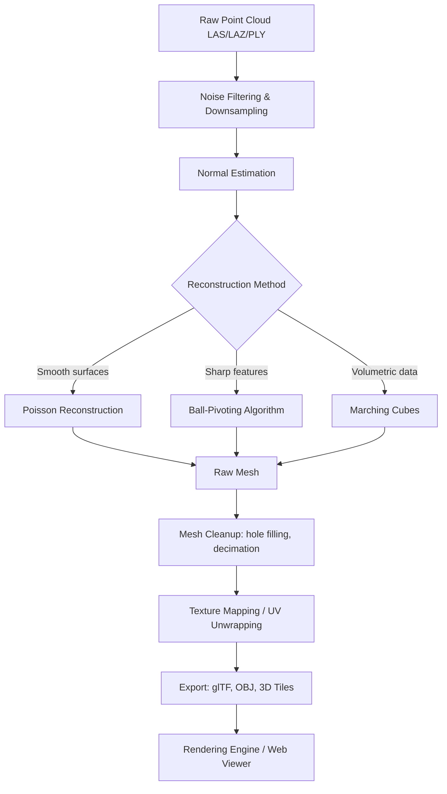

## 3D Visualization and Modeling


### Overview

3D visualization and modeling in geospatial science encompasses the rendering, analysis, and interpretation of three-dimensional spatial data — point clouds, meshes, voxel grids, and 3D city/terrain models — derived primarily from LiDAR, photogrammetry, and structured survey data. This spans real-time rendering engines for interactive exploration, mesh reconstruction algorithms that convert discrete points into continuous surfaces, semantic 3D city models (CityGML, 3D Tiles), and specialized visualization techniques for terrain, subsurface, and volumetric environmental data.

### Core Data Structures for 3D Geospatial Content

**Point Clouds**: Unstructured sets of X, Y, Z points, often with additional attributes (RGB color, intensity, classification, normal vectors). Native output of LiDAR and photogrammetric dense matching.

**Triangulated Irregular Networks (TIN)**: A vector-based surface model composed of non-overlapping triangles connecting irregularly spaced 3D points, preserving breaklines and varying point density more efficiently than uniform grids for terrain representation.

**Polygonal Meshes**: Structured surfaces of vertices, edges, and faces (typically triangles) representing continuous surfaces — used for building models, reconstructed terrain, and object-level 3D models. Common formats: OBJ, PLY, glTF/GLB, FBX.

**Voxel Grids**: Regular 3D grids of volumetric cells, each holding a value (occupancy, density, classification). Used in subsurface modeling, atmospheric/oceanographic visualization, and some point cloud processing algorithms (e.g., voxel downsampling).

**Digital Twin / Semantic City Models**: Structured, object-oriented 3D representations where buildings, roads, and vegetation are discrete, attributed entities rather than raw geometry — enabling queries like "all buildings with height > 20m."

### 3D Model Levels of Detail (LOD) — CityGML Standard

The OGC CityGML standard defines five levels of detail for 3D city models, each balancing geometric complexity against rendering/storage cost:

- **LOD0**: 2.5D footprint/terrain (essentially a DTM with building footprints).
- **LOD1**: Block models — buildings as simple extruded prisms (flat roofs, no architectural detail).
- **LOD2**: Generalized building shells with roof structures (gabled, hipped) and coarse facade textures.
- **LOD3**: Architectural detail including windows, doors, and detailed roof/wall structures.
- **LOD4**: Interior building structures — rooms, furniture, indoor navigable spaces.

**Key Points**

- LOD1/LOD2 models are commonly generated automatically from LiDAR building footprints and roof-plane segmentation.
- LOD3/LOD4 typically require manual modeling, BIM integration, or terrestrial/close-range photogrammetry.

### Mesh Reconstruction from Point Clouds

Converting unstructured point clouds into continuous meshes requires surface reconstruction algorithms:

- **Poisson Surface Reconstruction**: Solves a Poisson equation over an oriented point cloud (points with normal vectors) to produce a watertight, smooth mesh. Robust to noise but can over-smooth sharp features and requires accurate normal estimation.
- **Delaunay Triangulation / Ball-Pivoting Algorithm (BPA)**: Constructs a mesh by "rolling" a virtual ball of fixed radius over the point cloud, connecting points where the ball touches three points simultaneously. Preserves sharp features better than Poisson but is sensitive to point density variation and radius selection.
- **Alpha Shapes**: Generalization of the convex hull controlled by a parameter $\alpha$ that determines how tightly the shape wraps around the point set; useful for extracting building footprints or non-convex boundaries from point clouds.
- **Marching Cubes**: Extracts a triangle mesh from a 3D scalar field (voxel grid) by evaluating an isosurface threshold across each voxel cell; commonly used in volumetric/subsurface visualization and medical-imaging-derived workflows adapted to geospatial voxel data.

$$\hat{\chi}(p) = \arg\min_{\chi} \int_{\mathbb{R}^3} \|\nabla \chi - \vec{V}\|^2 \, dp$$

The equation above represents the core Poisson reconstruction objective: finding an indicator function $\chi$ whose gradient best matches the oriented point cloud's normal vector field $\vec{V}$.

### Standard Processing Workflow



### Practical Example: Open3D Mesh Reconstruction (Python)

```python
import open3d as o3d
import numpy as np

pcd = o3d.io.read_point_cloud("site_scan.ply")

pcd = pcd.voxel_down_sample(voxel_size=0.02)
pcd, _ = pcd.remove_statistical_outlier(nb_neighbors=20, std_ratio=2.0)

pcd.estimate_normals(
    search_param=o3d.geometry.KDTreeSearchParamHybrid(radius=0.1, max_nn=30)
)
pcd.orient_normals_consistent_tangent_plane(k=15)

mesh, densities = o3d.geometry.TriangleMesh.create_from_point_cloud_poisson(
    pcd, depth=9
)

densities = np.asarray(densities)
vertices_to_remove = densities < np.quantile(densities, 0.02)
mesh.remove_vertices_by_mask(vertices_to_remove)

mesh.compute_vertex_normals()
o3d.io.write_triangle_mesh("reconstructed_mesh.glb", mesh)
```

**Key Points**

- `voxel_down_sample` reduces point density uniformly, which speeds up reconstruction and reduces noise sensitivity.
- Normal orientation consistency (`orient_normals_consistent_tangent_plane`) is critical — Poisson reconstruction produces incorrect surfaces if normals face inconsistent directions.
- Low-density vertex removal trims spurious surface extrapolation in sparse point-cloud regions, a standard Poisson post-processing step.

### Rendering and Visualization Platforms

**Desktop/Offline Tools**

- **CloudCompare**: Open-source point cloud and mesh editing/visualization with cross-section, distance computation (M3C2, C2C), and classification tools.
- **QGIS 3D Map View**: Native 3D terrain and point cloud rendering integrated with standard 2D GIS layers; supports mesh layers and point cloud styling since QGIS 3.18+.
- **ArcGIS Pro / ArcGIS Scene Viewer**: Full-featured 3D scene authoring with integrated LOD management, multipatch feature support, and ArcGIS Online scene publishing.
- **Blender**: General-purpose 3D modeling software increasingly used in geospatial workflows for high-quality rendering, texturing, and mesh cleanup, often via GIS-oriented add-ons (e.g., BlenderGIS).

**Web-Based / Streaming Platforms**

- **Cesium (CesiumJS)**: Open-source WebGL globe/map engine built around the **3D Tiles** open specification (OGC standard) for streaming massive heterogeneous 3D geospatial datasets — point clouds, meshes, BIM/CAD, terrain — with automatic level-of-detail management.
- **Potree**: Open-source WebGL point cloud renderer specialized for rendering billions of points in-browser using octree-based LOD structures.
- **deck.gl**: WebGL/WebGPU-powered framework (Uber-originated) for large-scale geospatial data visualization, including 3D point/mesh/hexbin layers, commonly paired with Mapbox or MapLibre basemaps.
- **NASA WorldWind**: Open-source virtual globe SDK (Java/Web) for 3D terrain and imagery visualization, historically significant though development activity has slowed relative to Cesium [Unverified — check current project activity before selecting for new production work].

### 3D Tiles Specification (OGC Standard)

3D Tiles is an open standard for streaming and rendering massive 3D geospatial datasets efficiently in web environments. Key architectural components:

- **Tileset JSON**: Hierarchical bounding-volume structure defining a tree of tiles, each with geometric error thresholds controlling LOD refinement.
- **Content formats**: Batched 3D Model (b3dm) for textured meshes with per-feature metadata, Point Cloud (pnts) for LiDAR data, Instanced 3D Model (i3dm) for repeated objects (trees, utility poles), and Composite (cmpt) for mixed content. Version 1.1 consolidates content delivery around glTF as the underlying asset format.
- **Refinement strategies**: `ADD` (renders parent and child tiles together, common for scattered point data) versus `REPLACE` (child tiles replace parent content, common for terrain/building meshes).

```python
import requests
import json

response = requests.get("https://example-tileset.com/tileset.json")
tileset = response.json()

root = tileset["root"]
print(f"Root geometric error: {root['geometricError']}")
print(f"Bounding volume: {root['boundingVolume']}")
for child in root.get("children", []):
    print(f"Child tile content: {child.get('content', {}).get('uri')}")
```

### Terrain Visualization Techniques

- **Hillshading**: Simulates illumination from a defined sun azimuth/altitude to create a shaded relief raster, computed from slope and aspect derivatives of a DTM.
- **Hypsometric tinting**: Color-ramping elevation values to visually communicate terrain relief (commonly green-to-brown-to-white for low-to-high elevation).
- **Vertical exaggeration**: Scaling the Z-axis relative to X/Y to emphasize subtle terrain features, particularly useful for low-relief landscapes; must be clearly labeled to avoid misinterpretation of true slope.
- **Multi-directional hillshading**: Combines hillshades from multiple illumination angles to reduce directional bias artifacts (e.g., ridgelines disappearing when parallel to light source).

$$\text{Hillshade} = 255 \times \left(\cos(\text{zenith}) \cdot \cos(\text{slope}) + \sin(\text{zenith}) \cdot \sin(\text{slope}) \cdot \cos(\text{azimuth} - \text{aspect})\right)$$

### Volumetric and Subsurface Visualization

For environmental applications beyond surface terrain — groundwater plumes, atmospheric pollutant dispersion, soil stratigraphy, bathymetric volumes — voxel-based and isosurface techniques apply:

- **Isosurface extraction** (Marching Cubes/Tetrahedra) renders 3D boundaries of scalar fields (e.g., a contaminant concentration threshold).
- **Volume ray casting** renders semi-transparent volumetric data directly without explicit surface extraction, useful for visualizing continuous density gradients (e.g., aerosol concentration).
- **Cross-sectional slicing** combined with 3D context views is standard in geological/hydrogeological 3D modeling software (e.g., Leapfrog Geo, RockWorks).

### Practical Example: PyVista for Environmental Volume Visualization

```python
import pyvista as pv
import numpy as np

x, y, z = np.meshgrid(
    np.linspace(-10, 10, 50),
    np.linspace(-10, 10, 50),
    np.linspace(0, 20, 50)
)
concentration = np.exp(-((x**2 + y**2) / 20 + (z - 5)**2 / 10))

grid = pv.StructuredGrid(x, y, z)
grid["concentration"] = concentration.flatten(order="F")

plotter = pv.Plotter(off_screen=True)
plotter.add_volume(grid, scalars="concentration", cmap="plasma", opacity="sigmoid")
plotter.add_axes()
plotter.screenshot("contaminant_plume.png")
```

**Key Points**

- `opacity="sigmoid"` produces a transfer function emphasizing mid-to-high concentration values while keeping low values near-transparent, standard practice for plume/concentration visualization.
- Structured grids (regular voxel spacing) render volumetrically more efficiently than unstructured grids in most VTK-based pipelines, which PyVista wraps.

### Texturing and Photorealistic Modeling

- **Orthophoto draping**: Projecting georeferenced aerial/satellite imagery onto a DSM/mesh to produce photorealistic terrain visualization; standard in flight simulators and urban digital twins.
- **UV mapping**: Unwrapping 3D mesh surfaces into 2D texture space so photographic textures (from photogrammetry or oblique imagery) align correctly with mesh geometry.
- **Photogrammetric texture blending**: When textures are derived from multiple overlapping source images, blending algorithms (e.g., seam-line optimization, multi-band blending) minimize visible seams from differing lighting/exposure across source photos.

### Coordinate Reference System Handling in 3D

3D visualization pipelines must reconcile:

- **Horizontal CRS** (e.g., UTM, State Plane) for X/Y positioning.
- **Vertical datum** (e.g., NAVD88, EGM2008 geoid, ellipsoidal height) for Z — critical because LiDAR Z values are frequently delivered as ellipsoidal height and must be converted to orthometric height via geoid models for correct terrain representation relative to mean sea level.
- **Local/scene coordinate systems**: Many rendering engines (CesiumJS, Unity, Unreal Engine geospatial plugins) internally convert geographic coordinates to Earth-Centered Earth-Fixed (ECEF) or local East-North-Up (ENU) tangent-plane coordinates for numerical precision and rendering performance, particularly to avoid floating-point precision loss at large distances from an engine's origin.

### Performance Optimization for Large Datasets

- **Octree/spatial indexing**: Point cloud renderers (Potree, Cesium point cloud tiles) organize data hierarchically so only visible, appropriately-detailed nodes are loaded per frame.
- **Level-of-detail (LOD) streaming**: Progressive loading of coarse-to-fine geometry based on camera distance and screen-space error thresholds.
- **Mesh decimation/simplification**: Algorithms like Quadric Edge Collapse reduce polygon count while preserving visual fidelity, essential for web delivery of high-resolution photogrammetric meshes.
- **Frustum and occlusion culling**: Standard real-time rendering optimizations excluding off-screen or occluded geometry from the render pipeline.

### Common Error Sources and Limitations

- **Normal estimation errors**: Incorrect or inconsistent normal orientation in point clouds produces inverted or malformed mesh surfaces during Poisson reconstruction.
- **Texture-geometry misalignment**: Errors in camera calibration or georeferencing during photogrammetric texture projection cause visible texture "swimming" or seam misalignment.
- **Datum/vertical reference mismatches**: Mixing ellipsoidal and orthometric heights across data sources without transformation introduces systematic vertical offset errors, sometimes on the order of tens of meters depending on region.
- **LOD popping artifacts**: Abrupt visual transitions between detail levels during streaming if geometric error thresholds are poorly tuned; behavior varies significantly by rendering engine and dataset characteristics [Inference].
- **Over-smoothing in reconstruction**: Poisson reconstruction's implicit smoothness prior can erode sharp architectural edges (building corners, curbs) unless combined with sharp-feature-preserving post-processing.

**Related Topics**

- Point cloud classification and semantic segmentation (deep learning approaches: PointNet++, RandLA-Net)
- Photogrammetric Structure from Motion (SfM) and Multi-View Stereo (MVS) pipelines
- CityGML and 3D city model interoperability standards
- WebGL/WebGPU geospatial rendering architecture
- BIM-GIS integration (IFC to CityGML conversion)
- Digital twin platforms for urban and environmental monitoring
- Vertical datum transformation and geoid modeling
- Mesh simplification and level-of-detail algorithms