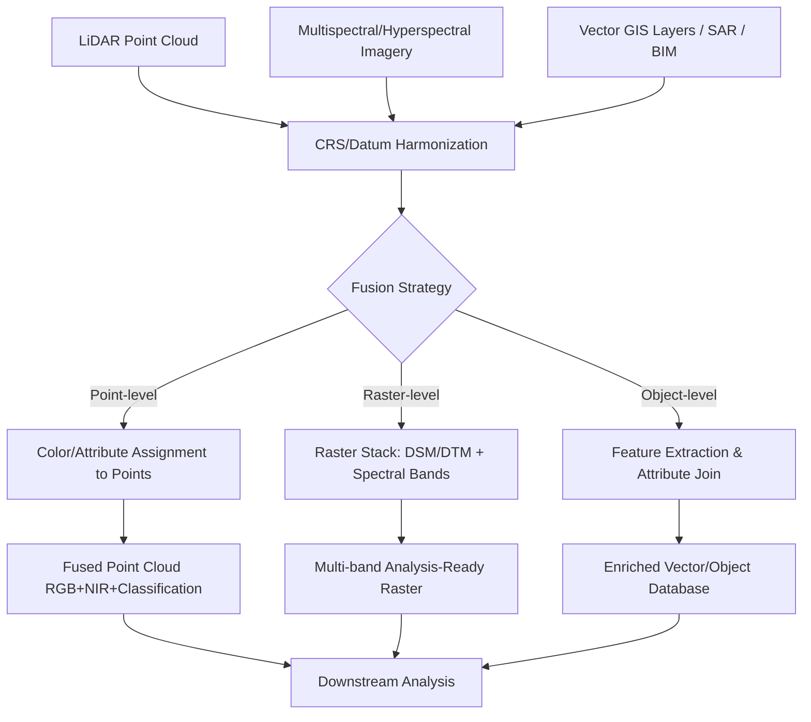

## Integrating LiDAR with Other Geospatial Data


### Overview

LiDAR data rarely operates in isolation. Its value is substantially amplified when fused with multispectral/hyperspectral imagery, SAR, GNSS/IMU trajectories, vector GIS layers, BIM/CAD models, and other elevation sources (photogrammetric DSMs, InSAR). Integration requires careful reconciliation of coordinate reference systems, temporal offsets, spatial resolution mismatches, and data models (point cloud vs. raster vs. vector) before combined analysis is valid. This item covers the technical mechanisms, standards, and workflows for fusing LiDAR with other geospatial data types.

### Why Integrate LiDAR with Other Data

- LiDAR provides precise geometry (X, Y, Z, intensity) but limited spectral information (typically single-wavelength near-infrared).
- Multispectral/hyperspectral imagery provides rich spectral discrimination (vegetation species, health, materials) but lacks LiDAR's direct 3D structural detail.
- Combining the two enables applications impossible with either alone: 3D vegetation species classification, structurally-informed flood risk with land-cover roughness, and photorealistic 3D city models with accurate geometry and imagery-derived texture.

### Coordinate Reference System (CRS) Reconciliation

The foundational integration step is ensuring all datasets share a common, well-defined spatial reference:

- **Horizontal CRS alignment**: Reprojecting vector/raster layers and LiDAR point clouds into a shared projected CRS (e.g., UTM zone, State Plane) using consistent datum realizations (e.g., NAD83(2011) vs. WGS84 — these differ by up to ~1–2 m in North America and must not be conflated silently).
- **Vertical datum alignment**: LiDAR Z-values are commonly delivered as either ellipsoidal heights (referenced to a geodetic ellipsoid like GRS80/WGS84) or orthometric heights (referenced to a geoid model such as NAVD88 via GEOID18, or EGM2008 globally). Combining LiDAR with elevation-dependent layers (e.g., hydrologic models, other DEM sources) without confirming matching vertical datums introduces systematic offset errors, sometimes tens of meters in magnitude.
- **Temporal alignment**: Metadata should record acquisition date; integrating multi-epoch data (e.g., 2015 LiDAR with 2023 imagery) requires awareness of land-cover change (new construction, vegetation growth, erosion) that may invalidate direct overlay assumptions.

$$h_{\text{orthometric}} = h_{\text{ellipsoidal}} - N_{\text{geoid}}$$

where $N_{\text{geoid}}$ is the geoid undulation at that location, obtained from a geoid model grid (e.g., GEOID18, EGM2008).

### Integration Workflow Overview



### LiDAR-Imagery Fusion: Point Colorization

Assigning RGB (and optionally NIR) values from co-registered imagery to individual LiDAR points, producing a photorealistic colorized point cloud:

1. Establish precise co-registration between the LiDAR point cloud's georeferencing and the image's exterior orientation (camera position/attitude) and interior orientation (focal length, principal point, lens distortion).
2. For each LiDAR point, project its 3D coordinate into image space using the collinearity equations, selecting the appropriate image (nadir or oblique) in cases of multiple overlapping images.
3. Sample the corresponding pixel value(s) and assign as point attributes.

$$x = -f \frac{r_{11}(X - X_0) + r_{12}(Y - Y_0) + r_{13}(Z - Z_0)}{r_{31}(X - X_0) + r_{32}(Y - Y_0) + r_{33}(Z - Z_0)}$$

This is the standard photogrammetric collinearity equation projecting a 3D ground point $(X, Y, Z)$ into image space coordinate $x$, given camera position $(X_0, Y_0, Z_0)$, focal length $f$, and rotation matrix elements $r_{ij}$ describing camera orientation. The analogous equation applies for the $y$ image coordinate.

**Key Points**

- Occlusion handling is required: points occluded from the camera's viewpoint (e.g., ground points beneath dense canopy visible to LiDAR but not to the camera) should not receive incorrect color from foreground objects; z-buffer or visibility testing addresses this.
- When both nadir and oblique imagery are available, oblique imagery often provides better coloring for vertical surfaces (building facades) that nadir imagery cannot see.

### Practical Example: Colorizing a Point Cloud with Orthophoto (Python/PDAL)

```plaintext
{
  "pipeline": [
    "raw_points.laz",
    {
      "type": "filters.colorization",
      "raster": "orthophoto.tif",
      "dimensions": "Red:1:1.0, Green:2:1.0, Blue:3:1.0"
    },
    {
      "type": "writers.las",
      "filename": "colorized_points.laz"
    }
  ]
}
```

**Key Points**

- `filters.colorization` in PDAL samples raster band values at each point's X/Y location and writes them into the point's Red/Green/Blue dimensions.
- This approach assumes the orthophoto and point cloud already share a common horizontal CRS; reprojection must precede this step if they do not.

### Raster Stack Integration: DSM/DTM with Multispectral Bands

For pixel-based classification and analysis workflows (e.g., vegetation health combined with canopy structure), LiDAR-derived rasters (DSM, DTM, CHM, intensity) are stacked with spectral bands into a unified multi-band raster:

```python
import rasterio
import numpy as np

bands_to_stack = {
    "red": "ortho_red.tif",
    "nir": "ortho_nir.tif",
    "dsm": "dsm.tif",
    "dtm": "dtm.tif",
    "chm": "chm.tif",
    "intensity": "lidar_intensity.tif"
}

arrays = []
profile = None
for name, path in bands_to_stack.items():
    with rasterio.open(path) as src:
        arrays.append(src.read(1))
        if profile is None:
            profile = src.profile

stacked = np.stack(arrays)
profile.update(count=len(arrays), dtype=stacked.dtype)

with rasterio.open("fused_stack.tif", "w", **profile) as dst:
    dst.write(stacked)
    dst.descriptions = tuple(bands_to_stack.keys())

ndvi = (arrays[1].astype(float) - arrays[0].astype(float)) / (arrays[1] + arrays[0] + 1e-10)
```

**Key Points**

- All source rasters must share identical pixel grid alignment (same resolution, extent, and CRS) before stacking; mismatched grids require resampling (e.g., `rasterio.warp.reproject`) to a common reference grid first.
- Combining structural (CHM, intensity) and spectral (NDVI-derived from red/NIR) bands into a single analysis-ready stack is a standard precursor to machine learning classification (e.g., random forest, gradient boosting) for land-cover or vegetation species mapping.

### Fusion with SAR (Synthetic Aperture Radar)

- **Complementary strengths**: SAR penetrates cloud cover and operates day/night, useful where optical/LiDAR acquisition is weather-limited; LiDAR provides higher vertical precision.
- **InSAR + LiDAR validation**: LiDAR DTMs are frequently used as ground-truth references to validate and calibrate InSAR-derived DEMs (e.g., SRTM, TanDEM-X, Copernicus GLO-30), given LiDAR's superior vertical accuracy in well-surveyed areas.
- **Change detection fusion**: Combining LiDAR-derived baseline structure with time-series SAR (e.g., Sentinel-1) supports deformation monitoring (subsidence, landslides) where LiDAR establishes precise initial geometry and InSAR phase coherence tracks subsequent millimeter-scale displacement.

### Fusion with Vector GIS Data

- **Building footprint refinement**: Cadastral or OpenStreetMap building footprints (2D polygons) are extruded to 3D using LiDAR-derived height statistics (e.g., 95th-percentile point elevation within each footprint minus local DTM elevation), producing LOD1 block models efficiently at scale.
- **Road centerline elevation draping**: Vector road networks (2D polylines) gain accurate Z-values by sampling the LiDAR-derived DTM along each vertex, supporting 3D routing and corridor analysis.
- **Hydrographic breaklines**: Vector stream/shoreline data is used during DTM interpolation (hydro-flattening/hydro-enforcement) to ensure water surfaces render flat and hydrologically consistent, correcting for LiDAR's noisy or sparse water returns.

### Practical Example: Building Height Extraction via Zonal Statistics

```python
import geopandas as gpd
import rasterio
from rasterio.mask import mask
import numpy as np

footprints = gpd.read_file("building_footprints.shp")

with rasterio.open("dsm.tif") as dsm_src, rasterio.open("dtm.tif") as dtm_src:
    heights = []
    for geom in footprints.geometry:
        dsm_clip, _ = mask(dsm_src, [geom], crop=True, nodata=np.nan)
        dtm_clip, _ = mask(dtm_src, [geom], crop=True, nodata=np.nan)

        dsm_p95 = np.nanpercentile(dsm_clip, 95)
        dtm_median = np.nanmedian(dtm_clip)
        heights.append(dsm_p95 - dtm_median)

footprints["height_m"] = heights
footprints.to_file("buildings_with_height.gpkg", driver="GPKG")
```

**Key Points**

- Using the 95th percentile of DSM values (rather than the maximum) within a footprint reduces sensitivity to isolated noise spikes (e.g., birds, antennas) while still capturing near-peak roof height.
- The median DTM value provides a stable ground-reference elevation robust to minor terrain slope variation across the footprint extent.

### Fusion with BIM/CAD Data

- **IFC to GIS integration**: Building Information Models (Industry Foundation Classes, IFC format) contain detailed architectural/structural geometry and semantic attributes (material, function, structural system) that complement LiDAR's as-built exterior geometry.
- **As-built verification**: LiDAR point clouds are compared against design-stage BIM models to detect construction deviations, a workflow known as **scan-to-BIM** verification, commonly using cloud-to-mesh distance computation (e.g., Cloud Compare's C2M tool).
- **CityGML-IFC interoperability**: The OGC has worked toward bridging IFC (building-scale, engineering-focused) and CityGML (city-scale, GIS-focused) data models, since they use different geometric and semantic paradigms; conversion tools and standards (e.g., IFC-to-CityGML mappings) address this gap, though full semantic fidelity in either direction remains an active area of standards development [Inference — verify current OGC/buildingSMART interoperability standard status for production workflows].

### Multi-Sensor Point Cloud Registration

When integrating LiDAR point clouds from different platforms (airborne, terrestrial, mobile) or epochs, precise geometric registration is required beyond simple CRS alignment:

- **Iterative Closest Point (ICP)**: Iteratively minimizes the distance between corresponding points in two point clouds by estimating an optimal rigid transformation (rotation + translation), used to fine-align overlapping scans with residual misalignment after initial GNSS/IMU georeferencing.
- **Feature-based registration**: Uses distinctive geometric features (planes, edges, corners) rather than raw point correspondence, often more robust for structured environments (buildings, urban infrastructure) than generic ICP.
- **Multi-temporal change detection (M3C2)**: The Multiscale Model to Model Cloud Comparison algorithm computes robust point-to-point distances between two co-registered point cloud epochs along locally estimated surface normals, widely used for erosion, landslide, and construction progress monitoring.

$$T^* = \arg\min_T \sum_{i} \| T(p_i) - q_i \|^2$$

where $T$ is the rigid transformation applied to source point $p_i$, minimizing squared distance to corresponding target point $q_i$ — the core ICP objective function, solved iteratively.

### Integration Standards and Interoperability

- **OGC 3D Tiles**: Enables heterogeneous 3D content (point clouds, meshes, BIM) to be streamed and rendered together within a single tileset hierarchy, a key mechanism for practical multi-source 3D data integration in web platforms (CesiumJS).
- **OGC CityGML / CityJSON**: Semantic city model standards supporting integration of building, vegetation, terrain, and infrastructure data with shared object-oriented schemas; CityJSON offers a more compact, developer-friendly JSON encoding of the same conceptual model.
- **LAS/LAZ Extended Attributes**: The ASPRS LAS specification supports "extra bytes" VLRs (Variable Length Records) allowing custom per-point attributes (e.g., classification confidence, source sensor ID) to persist through integration workflows without data loss.
- **STAC (SpatioTemporal Asset Catalog)**: An emerging community specification for cataloging and discovering geospatial assets (including LiDAR and imagery) with consistent metadata, increasingly used to manage multi-source data integration pipelines at scale.

### Common Error Sources in Integration Workflows

- **Silent datum mismatches**: Combining ellipsoidal-height LiDAR with orthometric-height reference data (or vice versa) without explicit transformation is one of the most common and consequential integration errors, producing systematic vertical bias that may not be immediately visually obvious.
- **Resolution mismatch artifacts**: Stacking a high-resolution LiDAR raster (e.g., 0.5 m) with coarser imagery (e.g., 10 m Sentinel-2) without deliberate resampling strategy (nearest-neighbor vs. bilinear vs. cubic) can introduce blocky artifacts or oversmoothing depending on method choice.
- **Temporal inconsistency**: Overlaying LiDAR-derived building footprints from an older acquisition onto current imagery showing new construction (or demolition) produces spatially misleading integrated products without careful multi-temporal metadata tracking.
- **Occlusion errors in point colorization**: Incorrect color assignment to occluded points (e.g., ground points under canopy incorrectly colored green from canopy pixels) if visibility/occlusion testing is skipped during fusion.
- **Coordinate order and axis convention confusion**: Differing conventions (e.g., lat/lon vs. lon/lat, or Z-up vs. Y-up in 3D engines like Unity/Unreal versus geospatial ENU/ECEF conventions) are a frequent source of silent integration bugs when moving data between GIS and game-engine-based visualization pipelines.

**Related Topics**

- Photogrammetric bundle adjustment and exterior orientation estimation
- Scan-to-BIM workflows and construction deviation analysis
- STAC catalog design for multi-sensor geospatial data management
- Multi-temporal LiDAR change detection (M3C2, DEM differencing)
- CityGML/CityJSON semantic 3D city modeling standards
- SAR/InSAR fundamentals and LiDAR-SAR calibration workflows
- Point cloud registration algorithms (ICP, feature-based methods)
- Vertical datum transformation and geoid model application