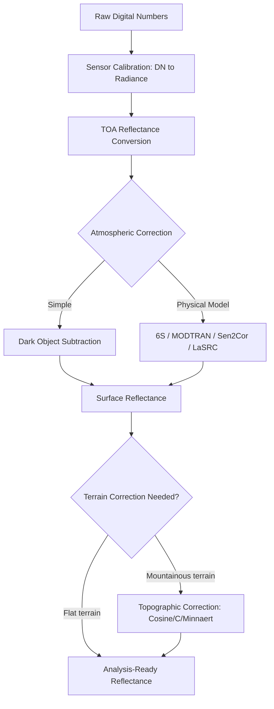

## Radiometric and Geometric Image Correction

### Overview

Radiometric and geometric correction are preprocessing steps that transform raw remotely sensed imagery into analysis-ready data. Radiometric correction addresses sensor-, atmosphere-, and illumination-induced distortions in pixel values (digital numbers) to derive physically meaningful quantities like radiance or surface reflectance. Geometric correction addresses spatial distortions caused by sensor geometry, platform motion, and terrain relief to ensure pixels are accurately georeferenced. Both are prerequisite steps before quantitative analysis, multi-temporal comparison, or multi-sensor fusion.

### Radiometric Correction

#### Sources of Radiometric Distortion

- **Sensor-related**: Detector miscalibration, striping (systematic detector-to-detector variance), and dropped/dead pixels.
- **Atmospheric**: Scattering (Rayleigh, Mie) and absorption by atmospheric gases (water vapor, ozone, CO2) alter the radiance reaching the sensor relative to true surface-leaving radiance.
- **Illumination/Topographic**: Solar zenith angle, slope, and aspect cause varying illumination across a scene, particularly significant in mountainous terrain.
- **Sensor-to-sensor differences**: Cross-calibration is required when combining imagery from different sensors (e.g., Landsat 8 OLI vs. Sentinel-2 MSI) due to differing spectral response functions and radiometric calibration coefficients.

#### Processing Chain: DN → Radiance → Reflectance

**Step 1: DN to At-Sensor (Top-of-Atmosphere) Radiance**

$$L_\lambda = \text{DN} \times \text{Gain} + \text{Offset}$$

or equivalently, using calibration coefficients typically provided in sensor metadata:

$$L_\lambda = \frac{L_{max} - L_{min}}{DN_{max} - DN_{min}} \times (\text{DN} - DN_{min}) + L_{min}$$

where $L_\lambda$ is spectral radiance, and gain/offset (or $L_{max}/L_{min}$) values are sensor- and band-specific calibration parameters supplied in product metadata.

**Step 2: Radiance to Top-of-Atmosphere (TOA) Reflectance**

$$\rho_{TOA} = \frac{\pi \cdot L_\lambda \cdot d^2}{ESUN_\lambda \cdot \cos(\theta_s)}$$

where $d$ is the Earth-Sun distance in astronomical units, $ESUN_\lambda$ is the mean exoatmospheric solar irradiance for the band, and $\theta_s$ is the solar zenith angle at acquisition time.

**Step 3: Atmospheric Correction (TOA Reflectance to Surface Reflectance)**

This is the most complex step, removing atmospheric scattering/absorption effects to recover true surface reflectance $\rho_{surface}$.

#### Atmospheric Correction Methods

- **Dark Object Subtraction (DOS)**: Assumes at least one pixel in the scene (e.g., deep water, shadow) should have near-zero reflectance; any positive DN value in that dark object is attributed to atmospheric path radiance and subtracted scene-wide. Simple and requires no ancillary atmospheric data, but is a coarse approximation that ignores spatial and spectral variability in atmospheric effects.
- **Radiative Transfer Model-based methods**: Physically model atmospheric scattering/absorption using radiative transfer equations, requiring atmospheric parameters (aerosol optical depth, water vapor content, ozone).
  - **6S (Second Simulation of a Satellite Signal in the Solar Spectrum)**: Widely used radiative transfer code for computing atmospheric correction coefficients.
  - **MODTRAN**: High-fidelity atmospheric radiative transfer model, computationally intensive, often used as the underlying engine for commercial correction tools.
  - **FLAASH (Fast Line-of-sight Atmospheric Analysis of Spectral Hypercubes)**: MODTRAN-based commercial tool (ENVI) commonly applied to hyperspectral and multispectral imagery.
  - **Sen2Cor**: ESA's official atmospheric correction processor for Sentinel-2, converting Level-1C (TOA reflectance) to Level-2A (bottom-of-atmosphere/surface reflectance) products, incorporating scene classification and cirrus/aerosol correction.
  - **LaSRC (Landsat Surface Reflectance Code)**: USGS's operational atmospheric correction algorithm for Landsat Collection 2 Surface Reflectance products.

**Key Points**

- Most operational satellite programs (Landsat, Sentinel-2) now distribute pre-corrected Surface Reflectance products, reducing the need for users to run atmospheric correction manually for standard applications — though DOS or custom radiative transfer correction remains relevant for older imagery, non-standard sensors, or specialized research requiring specific atmospheric assumptions.
- Atmospheric correction accuracy is affected by the availability and quality of ancillary atmospheric input data (aerosol optical depth, water vapor); results using default/climatological values versus scene-specific measured values can differ meaningfully [Inference — magnitude varies by region and atmospheric conditions].

#### Topographic (Terrain Illumination) Correction

In mountainous terrain, slope and aspect cause radiance variation unrelated to actual surface reflectance differences (sunlit vs. shadowed slopes of the same land cover appear different). Common correction models:

- **Cosine Correction**: Simple model normalizing radiance based on the cosine of the solar incidence angle relative to surface normal; tends to over-correct in low-illumination areas.
- **C-Correction**: An empirical refinement of the cosine correction adding a band-specific correction term derived from regression between radiance and illumination, moderating overcorrection.
- **Minnaert Correction**: Introduces the Minnaert constant $k$ (0–1) to account for non-Lambertian surface reflectance behavior, often providing better results than simple cosine correction for rough natural surfaces.

$$L_{H} = L_{T} \cdot \left(\frac{\cos\theta_z}{\cos\theta_i}\right)^k$$

where $L_H$ is the horizontally-normalized radiance, $L_T$ is the observed (topographically-affected) radiance, $\theta_z$ is the solar zenith angle, $\theta_i$ is the local solar incidence angle (accounting for slope/aspect), and $k$ is the Minnaert constant.

#### Radiometric Correction Pipeline



### Practical Example: DOS Atmospheric Correction (Python)

```python
import rasterio
import numpy as np

with rasterio.open("landsat_band4_toa_reflectance.tif") as src:
    toa_reflectance = src.read(1).astype(float)
    profile = src.profile

dark_object_value = np.percentile(toa_reflectance[toa_reflectance > 0], 1)

surface_reflectance = toa_reflectance - dark_object_value
surface_reflectance = np.clip(surface_reflectance, 0, 1)

profile.update(dtype=rasterio.float32)
with rasterio.open("band4_dos_corrected.tif", "w", **profile) as dst:
    dst.write(surface_reflectance.astype(rasterio.float32), 1)
```

**Key Points**

- Using the 1st percentile (rather than the absolute minimum) as the dark object estimate provides robustness against isolated noise pixels or sensor artifacts that could bias a true minimum.
- Clipping to [0, 1] enforces physically valid reflectance bounds after subtraction, since DOS can occasionally produce slightly negative values in already-dark pixels.

### Geometric Correction

#### Sources of Geometric Distortion

- **Platform motion**: Variations in satellite/aircraft altitude, velocity, attitude (roll, pitch, yaw) during image acquisition.
- **Sensor geometry**: Scan skew, panoramic distortion (off-nadir pixels cover more ground area than nadir pixels), and earth curvature effects.
- **Earth rotation**: For scanning sensors, Earth's rotation during image acquisition causes along-track skew (particularly relevant for older Landsat-type whiskbroom scanners).
- **Terrain relief displacement**: Elevation differences cause horizontal displacement of features from their true map position, proportional to terrain height and sensor off-nadir angle — most significant in high-relief terrain and high-resolution imagery.

#### Correction Approaches

**1. Systematic (Sensor-Model-Based) Correction**

Uses known sensor orbital parameters, platform ephemeris (position/attitude from GPS/IMU), and sensor geometry to correct predictable, systematic distortions. This is typically performed by data providers before distribution (e.g., Landsat Level-1 products) and requires no ground control from the end user.

**2. Ground Control Point (GCP)-Based Georeferencing**

For imagery lacking precise onboard positioning data (e.g., historical scanned aerial photos, some UAV imagery), georeferencing is achieved by identifying corresponding points visible in both the image and a reference (a georeferenced base map or known coordinates), then fitting a transformation model:

- **Polynomial (affine/rubber-sheeting) transformation**: Fits a low-order polynomial (1st order = affine, higher orders for more complex distortion) mapping image coordinates to map coordinates using GCP correspondences via least-squares.

$$X_{map} = a_0 + a_1 x + a_2 y$$


$$Y_{map} = b_0 + b_1 x + b_2 y$$

(1st-order/affine transformation; higher-order polynomials add quadratic/cubic terms for more flexible, locally-varying correction.)

- **RMSE assessment**: GCP-based georeferencing accuracy is validated using Root Mean Square Error between predicted and actual GCP positions after transformation; typical target RMSE thresholds are often set relative to the pixel resolution of the target application (e.g., sub-pixel accuracy for change detection workflows).

$$RMSE = \sqrt{\frac{1}{n}\sum_{i=1}^{n}\left[(X_i - X_i')^2 + (Y_i - Y_i')^2\right]}$$

**3. Orthorectification**

Corrects both sensor-geometry distortion and terrain relief displacement simultaneously by using a Digital Elevation Model (DEM) alongside the sensor's rigorous geometric model (rational polynomial coefficients [RPCs] or physical sensor model with orbital ephemeris), producing an image where every pixel is positioned as if viewed from directly overhead (orthogonal projection), free of relief displacement.

**Key Points**

- Orthorectification is essential for high-resolution imagery over variable terrain, since simple polynomial georeferencing cannot correct terrain-induced local displacement — only a true orthorectification workflow using a DEM addresses this.
- RPC-based orthorectification (common for commercial very-high-resolution satellites like WorldView, Pleiades) uses a rational polynomial function approximating the sensor's rigorous physical model, allowing orthorectification without requiring full orbital/attitude metadata to be publicly disclosed by the vendor.

#### Resampling Methods

After computing the geometric transformation, pixel values must be resampled onto the new corrected grid:

- **Nearest Neighbor**: Assigns each output pixel the value of the closest input pixel. Preserves original DN values exactly (no interpolation blending) — important for categorical/classified data — but produces blocky, less visually smooth output.
- **Bilinear Interpolation**: Computes a weighted average of the four nearest input pixels. Produces smoother results than nearest neighbor but alters original pixel values, making it generally unsuitable for classified/categorical rasters.
- **Cubic Convolution**: Uses a weighted average of the 16 nearest input pixels for smoother, sharper results than bilinear; computationally more expensive and, like bilinear, alters original values — best suited to continuous data intended primarily for visualization rather than quantitative pixel-value analysis.

**Key Points**

- Resampling method choice should match data type and downstream use: nearest neighbor for classified/categorical data or when preserving original spectral values is critical (e.g., radiometric analysis); bilinear or cubic convolution for continuous data intended for visual interpretation.

### Practical Example: Orthorectification Workflow (GDAL)

```bash
gdalwarp -rpc \
  -to RPC_DEM=srtm_dem.tif \
  -r cubic \
  -t_srs EPSG:32633 \
  -co COMPRESS=LZW \
  raw_satellite_image.tif \
  orthorectified_output.tif
```

**Key Points**

- `-rpc` invokes GDAL's RPC-based orthorectification using rational polynomial coefficients embedded in or accompanying the source image metadata.
- `-to RPC_DEM` specifies the DEM used to model terrain relief displacement during the orthorectification process; DEM accuracy and resolution directly affect the accuracy of the final orthorectified product.
- `-r cubic` sets cubic convolution resampling, appropriate here since the output is intended for continuous-value analysis/visualization rather than categorical classification.

### Co-registration for Multi-Temporal/Multi-Sensor Analysis

Beyond absolute georeferencing accuracy, multi-temporal change detection and multi-sensor fusion require precise **relative** alignment (co-registration) between image pairs, since even sub-pixel misregistration can produce false change signals:

- **Feature-based matching**: Algorithms like SIFT (Scale-Invariant Feature Transform) or SURF identify and match distinctive keypoints between image pairs to estimate a registration transformation, robust to some illumination/scale differences.
- **Area-based (correlation) matching**: Cross-correlation or phase-correlation techniques directly compare pixel intensity patterns within moving windows to estimate sub-pixel shifts, often used for fine-tuning after initial feature-based alignment.
- **AROSICS and similar tools**: Open-source Python libraries (e.g., AROSICS) specifically designed for automated sub-pixel co-registration of multi-sensor satellite imagery, correcting both global and local geometric shifts.

### Common Error Sources

- **Insufficient or poorly distributed GCPs**: Clustering GCPs in one part of a scene produces poor transformation accuracy in areas far from the GCPs; GCPs should be well-distributed spatially, including near image edges/corners.
- **Mismatched DEM resolution/accuracy in orthorectification**: Using a coarse or outdated DEM for orthorectifying high-resolution imagery over complex terrain limits achievable positional accuracy regardless of sensor model quality.
- **Neglecting BRDF effects**: Bidirectional Reflectance Distribution Function effects (reflectance varying with view/illumination geometry even for identical materials) are often ignored in standard atmospheric correction, which can introduce residual error in multi-angle or wide-swath imagery comparisons [Inference — significance varies by sensor swath width and application sensitivity].
- **Resampling-induced spectral alteration**: Applying bilinear/cubic resampling to imagery intended for quantitative spectral analysis (e.g., vegetation index time series) can introduce subtle value changes that compound across processing steps if not accounted for.
- **Temporal atmospheric variability assumptions**: Applying identical atmospheric correction parameters across a time series without accounting for actual day-to-day atmospheric condition changes can introduce spurious apparent "change" in surface reflectance products.

**Related Topics**

- Bidirectional Reflectance Distribution Function (BRDF) correction and normalization
- Cross-sensor radiometric calibration and harmonization (e.g., Landsat-Sentinel-2 harmonized products)
- Digital Surface and Terrain Model generation (DEM inputs for orthorectification)
- Multi-temporal image co-registration and change detection preprocessing
- Sensor calibration standards and metadata interpretation (gain/offset, RPCs)
- Hyperspectral-specific atmospheric correction techniques
- Vegetation indices and their sensitivity to radiometric correction quality
- UAV/drone imagery geometric correction and structure-from-motion georeferencing