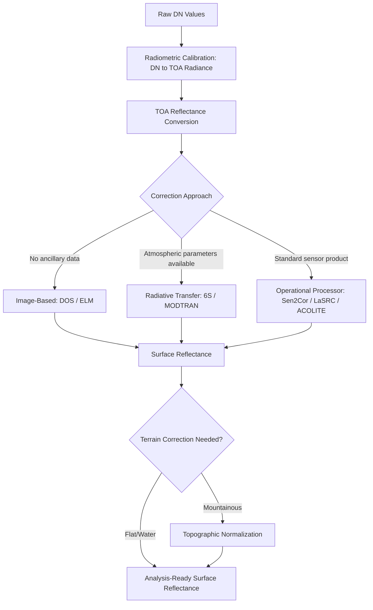

## Atmospheric Correction Techniques

### Overview

Atmospheric correction is the process of removing the atmosphere's contribution to at-sensor (top-of-atmosphere) radiance to recover true surface (bottom-of-atmosphere) reflectance. The atmosphere scatters and absorbs electromagnetic radiation both on its path from the sun to the surface and from the surface to the sensor, introducing path radiance and attenuation that obscure the actual spectral signature of ground targets. Accurate atmospheric correction is essential for quantitative remote sensing applications: multi-temporal change detection, cross-sensor comparison, biophysical parameter retrieval (e.g., chlorophyll content, water quality), and any analysis relying on absolute or consistently comparable reflectance values.

### Physical Basis of Atmospheric Effects

The at-sensor radiance $L_{sensor}$ observed by a satellite/airborne sensor can be modeled as:

$$L_{sensor} = L_{path} + \frac{\rho_{surface} \cdot (E_{dir} + E_{dif}) \cdot T_v}{\pi \cdot (1 - \rho_{surface} \cdot S)}$$

where:

- $L_{path}$ is atmospheric path radiance (light scattered into the sensor's view without ever reaching the ground),
- $E_{dir}$ and $E_{dif}$ are direct and diffuse solar irradiance reaching the surface,
- $T_v$ is atmospheric transmittance along the surface-to-sensor path,
- $S$ is atmospheric spherical albedo (accounting for multiple scattering between surface and atmosphere), and
- $\rho_{surface}$ is the true surface reflectance being solved for.

**Key Points**

- The two dominant atmospheric interference mechanisms are **scattering** (Rayleigh scattering by gas molecules, wavelength-dependent and strongest at shorter/blue wavelengths; Mie scattering by aerosols, less wavelength-dependent) and **absorption** (primarily by water vapor, ozone, oxygen, and carbon dioxide at specific spectral bands).
- Path radiance $L_{path}$ is the primary target of most atmospheric correction algorithms, since it represents signal unrelated to actual surface reflectance.

### Atmospheric Correction Method Categories

#### 1. Image-Based (Relative) Methods

These methods use only information within the image itself, without requiring external atmospheric measurements, making them simple and widely applicable but less physically rigorous.

**Dark Object Subtraction (DOS)**

Assumes the scene contains at least one pixel that should have near-zero true reflectance (e.g., deep clear water, dense shadow, or fresh asphalt). Any non-zero DN/radiance value observed at that darkest pixel is attributed entirely to atmospheric path radiance and subtracted from every pixel in that band, scene-wide.

$$\rho_{surface} = \rho_{TOA} - \rho_{dark\_object}$$

Variants include:

- **DOS1**: Simplest form, assumes a single uniform haze correction per band derived from the single darkest pixel value.
- **Improved DOS / COST model**: Incorporates a more physically-informed correction accounting for atmospheric transmittance, improving on the DOS1 assumption that transmittance equals 1.

**Key Points**

- DOS requires no ancillary atmospheric data (aerosol optical depth, water vapor) and can be computed directly from the image, making it fast and broadly applicable, including to historical imagery lacking atmospheric metadata.
- DOS assumes spatially uniform atmospheric conditions across the scene, which is a simplification that becomes less accurate over large scenes or scenes with genuine spatial atmospheric heterogeneity (e.g., localized haze or smoke).

**Empirical Line Method (ELM)**

Uses field-measured or laboratory spectral reflectance of known ground targets (e.g., calibration tarps, well-characterized natural surfaces) co-located with the image, then fits a linear regression between at-sensor radiance/TOA reflectance and known surface reflectance per band to derive scene-specific correction coefficients.

$$\rho_{surface} = m \cdot L_{sensor} + b$$

where $m$ and $b$ are the regression slope and intercept fit from at least two targets of known, contrasting reflectance (ideally one bright, one dark) per band.

**Key Points**

- ELM can be highly accurate when good field calibration targets are available and co-located with the image acquisition, but requires field campaigns or known invariant targets, limiting its scalability to routine operational processing.
- Commonly used in UAV/drone-based hyperspectral and multispectral workflows where calibrated reflectance panels are placed in the scene during flight.

#### 2. Physically-Based (Radiative Transfer Model) Methods

These methods explicitly model atmospheric scattering and absorption physics using radiative transfer equations, requiring atmospheric input parameters (aerosol optical depth, water vapor column, ozone content) either measured, estimated from the imagery itself, or drawn from climatological/reanalysis data.

**MODTRAN (MODerate resolution atmospheric TRANsmission)**

A high-fidelity atmospheric radiative transfer model developed originally for military/defense applications, now widely used as the computational engine underlying many commercial and research atmospheric correction tools. Computes transmittance and radiance across the electromagnetic spectrum given atmospheric profile inputs.

**6S (Second Simulation of a Satellite Signal in the Solar Spectrum)**

An open-source radiative transfer code developed for simulating and correcting satellite-observed radiance, widely used in research and as the basis for several operational correction algorithms (including elements of Landsat and MODIS atmospheric correction heritage). Available as a standalone code and via the Python wrapper `Py6S`.

**FLAASH (Fast Line-of-sight Atmospheric Analysis of Spectral Hypercubes)**

A MODTRAN-based commercial atmospheric correction module (part of the ENVI software suite) commonly applied to hyperspectral imagery, deriving atmospheric water vapor directly from the hyperspectral data itself when absorption bands are present in the sensor's spectral range.

**Key Points**

- Physically-based methods generally provide more accurate and spatially-varying atmospheric correction than image-based relative methods but require greater computational resources and, for best accuracy, reliable atmospheric parameter inputs (measured or well-estimated aerosol/water vapor).
- These methods can also compute at-sensor radiance simulation in the forward direction (useful for sensor calibration/simulation studies), not only the inverse correction direction.

#### 3. Operational Sensor-Specific Processors

Major satellite programs provide standardized, operationally-run atmospheric correction processors producing distributed Surface Reflectance products, reducing the need for most users to run correction manually:

**Sen2Cor (Sentinel-2)**

ESA's official processor converting Sentinel-2 Level-1C (TOA reflectance) products to Level-2A (bottom-of-atmosphere reflectance), incorporating scene classification (cloud, cloud shadow, snow, vegetation, water masks), aerosol optical thickness retrieval, water vapor retrieval, and cirrus correction.

**LaSRC (Landsat Surface Reflectance Code)**

USGS's operational algorithm for Landsat Collection 2 Surface Reflectance products (Landsat 8/9 OLI), using auxiliary data including CMG (Climate Modeling Grid) aerosol data and a look-up-table approach based on radiative transfer modeling.

**LEDAPS (Landsat Ecosystem Disturbance Adaptive Processing System)**

An earlier USGS/NASA algorithm used for Landsat 4-7 surface reflectance processing, largely superseded by LaSRC-based Collection 2 processing for more recent sensors but still relevant for understanding legacy Landsat surface reflectance product heritage.

**ACOLITE**

An atmospheric correction processor specifically designed for aquatic/coastal remote sensing applications (Sentinel-2, Sentinel-3, Landsat), addressing the particular challenge of very low water-leaving radiance where standard land-oriented atmospheric correction assumptions perform poorly.

**Key Points**

- For most standard land-cover and vegetation analysis using Landsat or Sentinel-2, using the operationally-distributed Surface Reflectance / Level-2A products is generally preferable to manual correction, since these processors are validated, consistently applied, and maintained by the respective space agencies.
- Water/aquatic applications often require specialized processors (e.g., ACOLITE, Polymer) because standard land-oriented atmospheric correction algorithms are tuned for higher-reflectance land surfaces and can perform poorly over dark water targets.

### Atmospheric Correction Workflow



### Practical Example: 6S-Based Correction with Py6S

```python
from Py6S import SixS, Geometry, AtmosProfile, AeroProfile, Wavelength, PredefinedWavelengths

s = SixS()

s.geometry = Geometry.User()
s.geometry.solar_z = 30.0
s.geometry.solar_a = 150.0
s.geometry.view_z = 0.0
s.geometry.view_a = 0.0
s.geometry.month = 6
s.geometry.day = 15

s.atmos_profile = AtmosProfile.PredefinedType(AtmosProfile.MidlatitudeSummer)
s.aero_profile = AeroProfile.PredefinedType(AeroProfile.Continental)
s.aot550 = 0.15

s.wavelength = Wavelength(PredefinedWavelengths.LANDSAT_OLI_B4)

s.run()

print(f"Atmospheric transmittance: {s.outputs.transmittance_total_scattering.upward}")
print(f"Path radiance: {s.outputs.atmospheric_intrinsic_radiance}")
print(f"Correction coefficients (xa, xb, xc): {s.outputs.coef_xa}, {s.outputs.coef_xb}, {s.outputs.coef_xc}")
```

```python
def toa_radiance_to_surface_reflectance(radiance, xa, xb, xc):
    y = xa * radiance - xb
    surface_reflectance = y / (1 + xc * y)
    return surface_reflectance
```

**Key Points**

- `aot550` (aerosol optical thickness at 550 nm) is one of the most sensitive input parameters affecting correction accuracy; when unavailable from direct measurement, it is often estimated from MODIS aerosol products, AERONET station data, or reanalysis datasets (e.g., MERRA-2, CAMS).
- The `xa`, `xb`, `xc` coefficients output by 6S define an inversion formula converting at-sensor radiance directly to surface reflectance for the specified band and atmospheric/geometric conditions, avoiding the need to re-run the full radiative transfer simulation for every pixel.

### Practical Example: Dark Object Subtraction (Python/NumPy)

```python
import numpy as np
import rasterio

def dos_correct(toa_reflectance_path, output_path, percentile=1):
    with rasterio.open(toa_reflectance_path) as src:
        data = src.read().astype(np.float32)
        profile = src.profile

    corrected = np.zeros_like(data)
    for band_idx in range(data.shape[0]):
        band = data[band_idx]
        valid = band[band > 0]
        dark_value = np.percentile(valid, percentile)
        corrected[band_idx] = np.clip(band - dark_value, 0, 1)

    profile.update(dtype=rasterio.float32)
    with rasterio.open(output_path, "w", **profile) as dst:
        dst.write(corrected)

    return corrected
```

**Key Points**

- Applying DOS per-band independently is standard, since atmospheric path radiance magnitude varies strongly with wavelength (Rayleigh scattering scales approximately as $\lambda^{-4}$, making shorter wavelengths/blue bands more heavily affected than near-infrared).

### Aerosol and Water Vapor Retrieval

Accurate physically-based correction requires estimating atmospheric parameters, which can come from:

- **Ancillary/external data**: MODIS MOD04 aerosol products, AERONET ground station measurements, reanalysis products (MERRA-2, ECMWF CAMS).
- **Image-derived retrieval**: Dense Dark Vegetation (DDV) algorithms estimate aerosol optical thickness from dark vegetation pixels within the scene itself (used in several Landsat/MODIS correction heritage algorithms). Water vapor can be retrieved directly from hyperspectral or select multispectral bands containing water absorption features (e.g., 940 nm, 1140 nm absorption bands).
- **Sensor-specific onboard/companion measurements**: Some multispectral sensors include dedicated bands or companion instruments specifically for atmospheric characterization.

### Validation and Accuracy Assessment

Atmospheric correction accuracy is typically validated by:

- **Comparison against field-measured surface reflectance** using spectroradiometers at known ground locations coincident with image acquisition.
- **Cross-sensor consistency checks**: Comparing corrected surface reflectance from different sensors observing the same target near-simultaneously (e.g., Landsat-Sentinel-2 harmonized product validation).
- **Radiometric consistency over pseudo-invariant calibration sites**: Stable targets (e.g., desert sand, certain calibration sites like Railroad Valley Playa) monitored over time to assess whether correction produces temporally consistent reflectance for a known-stable surface.

### Common Error Sources and Limitations

- **Inaccurate or unavailable aerosol input**: The single largest source of error in physically-based correction is typically imprecise aerosol optical thickness estimation, particularly in regions lacking dense AERONET coverage or during episodic events (smoke, dust storms) not well captured by climatological defaults.
- **Adjacency effects**: Radiation scattered from nearby bright/dark surfaces (e.g., a bright building next to a dark forest) can contaminate the apparent signal of a target pixel, an effect most standard per-pixel correction algorithms do not fully model, more pronounced in heterogeneous, high-spatial-resolution scenes.
- **Cloud/cirrus contamination**: Undetected thin cirrus or cloud edge effects can bias correction if not properly masked beforehand; most operational processors (Sen2Cor) include dedicated cloud/cirrus detection but performance can vary with cloud type and thickness [Inference].
- **BRDF (Bidirectional Reflectance Distribution Function) effects**: Standard atmospheric correction typically assumes Lambertian (isotropic) surface reflectance, which is a simplification — actual surface reflectance varies with view and illumination geometry, introducing residual error especially for wide-swath sensors or multi-angle comparisons.
- **DOS oversimplification over heterogeneous scenes**: The single-dark-pixel assumption underlying basic DOS can be substantially violated in scenes without a genuinely near-zero-reflectance target, or where atmospheric conditions vary spatially across a large scene extent.
- **Water vapor retrieval instability over dark/low-signal targets**: Image-derived water vapor estimation can become unreliable over targets with inherently low reflectance (deep water, shadow), sometimes requiring fallback to ancillary atmospheric data in those regions.

**Related Topics**

- Radiometric and geometric image correction fundamentals
- BRDF correction and normalization techniques
- Cross-sensor harmonization (Landsat-Sentinel-2 Harmonized Surface Reflectance)
- Aquatic remote sensing and water-leaving radiance retrieval
- Hyperspectral imagery-specific atmospheric correction workflows
- Cloud and cirrus detection/masking algorithms
- Aerosol optical thickness retrieval from satellite and ground-based sources
- Vegetation index sensitivity to atmospheric correction quality